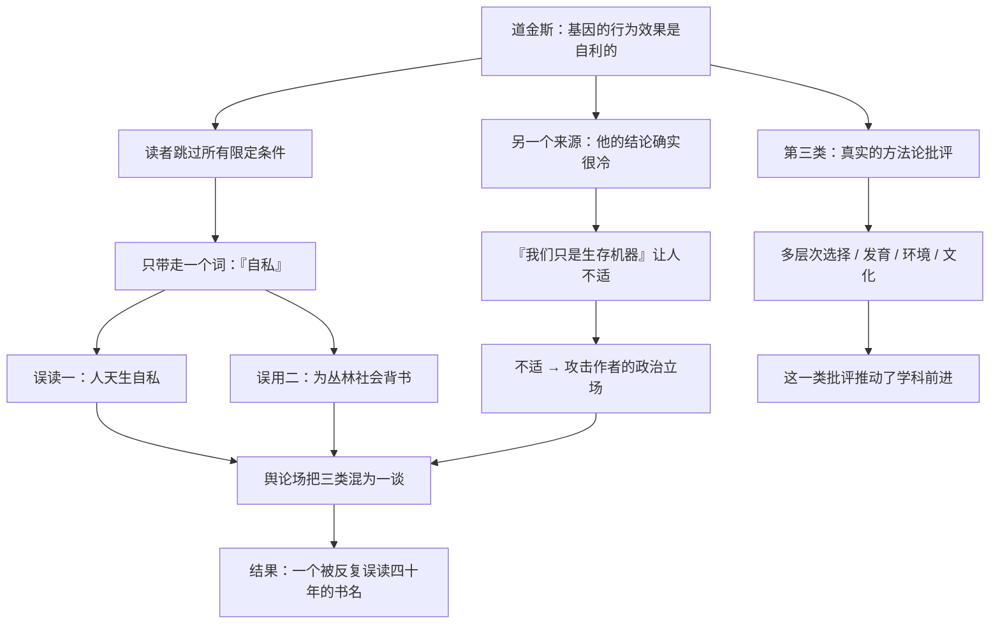

# 23｜「自私的基因」是科学，还是意识形态？——争议从哪里来

> 一本讲演化的科普书，为什么会被指控为「为自私辩护」？

---

## 一、先说结论

《自私的基因》出版后，争议一直没停过。质疑大致可以归为三类：

1. **词义误读**：把「基因的自私」当成「人的自私」；
2. **政治误用**：拿它来反对合作、互助、社会福利；
3. **方法论争议**：基因中心视角是否过度简化？是否忽略了发育、环境、群体过程？

道金斯的立场非常明确：

> **科学描述不构成道德辩护。从「是什么」推不出「应该怎样」。**

这句话背后的逻辑，是一个古老的哲学原则——**自然主义谬误（从事实推出价值）**。

**但讽刺的是，这个原则经常被人忽略。**

---

## 二、我们先理解一个问题

先看一个典型的误用。

某人在讨论社会政策时说：

> 「《自私的基因》告诉我们，人天生就是自私的。所以福利制度注定失败，因为人们只会搭便车。」

**这段话看起来引用了科学，实际上犯了至少三个错误：**

1. **它把「基因层面自利」等同于「人有意识地自私」**——这是第 01 篇讲过的误读；
2. **它忽略了人类「能够反抗基因预设」这个结论**——这是第 21 篇讲过的；
3. **它从「人有可能搭便车」直接推出了「制度注定失败」**——但**现实中的制度设计（比如第 16、17 篇的条件），恰恰决定了搭便车会不会发生。**

**所以问题来了：**

> **为什么一本明确反对「人多坏」的书，会被当作「人就是坏」的证据？**

---

## 三、作者到底提出了什么观点？

这一篇要呈现的不是道金斯的某个观点，而是**围绕这本书的三类争议，以及道金斯的回应逻辑**。

### 争议一：词义误读

**指控**：这本书在鼓吹「人天生自私」。

**实情**：
- 「自私」描述的是**基因的行为效果**；
- 道金斯明确写了人类**能反抗**这个逻辑；
- 他在书中专门强调，把「自私基因」理解为「见谁杀谁」是最幼稚的误读（第 07 篇）。

**道金斯后来在 30 周年版前言里承认，书名造成了不恰当的印象**——他甚至说，当初也许该听编辑的建议，改叫《永恒的基因》。

### 争议二：政治误用

**指控**：这本书为「弱肉强食」「反对互助」「反对福利」提供了科学背书。

**实情**：
- 道金斯在书里**明确赞扬**了「教导慷慨与利他」；
- 他反对的是「用群体利益解释演化」这种**错误的科学框架**，不是反对互助本身；
- 第 17 篇讲的「针锋相对」，恰恰说明了**合作在长期博弈中能胜出**。

**但误用确实是真实存在的。** 在 1970–80 年代，「社会生物学」这个词在西方引发过激烈的政治争论，**道金斯也被卷入了其中。**

### 争议三：方法论争议

**指控**：基因中心视角过度简化，忽略了发育、环境、群体过程、文化。

**实情**：
- 这是**最有价值的一类批评**；
- 批评者（包括戴维·斯隆·威尔逊等）主张「**多层次选择**」：选择和演化可以同时发生在基因、个体、群体等多个层面；
- 道金斯对「群体选择」的批评，在 1976 年是**必要的纠偏**，但在后续几十年里显得**过于绝对**。

**这里有一个重要的区分：**

> **「基因视角是精确的工具」和「基因是唯一的选择单位」，是两句话。**

**前者被广泛接受，后者仍有争议。**

---

## 四、把这个观点翻译成人话

我们用一个所有人都熟悉的现象来理解「科学描述被误用为道德辩护」。

**场景：医生说「吸烟会增加患肺癌的风险」。**

现在看几种不同的反应：

**合理的反应**：
> 「那我应该少抽或不抽。」

**误用的反应 A（从事实推出价值）**：
> 「既然吸烟有害，那政府就该禁止一切娱乐活动。」

**误用的反应 B（为行为开脱）**：
> 「反正基因和环境决定了一切，我抽不抽烟也无所谓。」

**误用的反应 C（攻击医生）**：
> 「你说吸烟有害，是不是收了戒烟的机构的好处？」

**道金斯面对的情况，同时包含 A、B、C 三种。**

- **A**：从「基因自利」推出「所以应该搞丛林社会」；
- **B**：从「基因决定」推出「所以我不必负责」；
- **C**：从「他讲的太冷酷」推出「他就是个社会达尔文主义者」。

**而医生（道金斯）真正在说的是：「这是机制，你自己决定怎么做。」**

**这不是价值观，这是信息。**

---

## 五、为什么会这样？

为什么一本科学书会被反复误读成意识形态？用一张图看这个机制。

关键在最后一步：**三类完全不同的问题，在舆论场里被混成一团。**

- 词义误读（可以澄清）；
- 政治误用（需要反驳）；
- 学术批评（需要认真对待）。

**把这三类混在一起，就变成了无休止的争吵。**

---

## 六、举一个现实生活中的例子

我们看一个特别当代的对照：**对 AI 的争论。**

假设有人问：「大模型会取代人类工作吗？」

**现在看几种典型的回应：**

**1. 词义误读型**
> 「AI 都说了它会取代人类。」
（其实 AI 只是在生成符合你期待的文本，**它的「说法」不构成预测。**）

**2. 政治误用型**
> 「既然 AI 会取代人，那我们干脆别发展了。」

**3. 学术争议型**
> 「替代的程度取决于任务类型、成本结构、监管、以及社会适应速度——需要分领域评估。」

**4. 冷静的信息型**
> 「这是我们在某些任务上的能力边界；至于该不该用、怎么用，是另一个问题。」

**你会发现，这四种回应几乎完美对应了《自私的基因》遭遇的四十年。**

**而最有价值的，永远是第 3 和第 4 类——**

**它们把「科学描述」和「价值判断」分开，然后分别处理。**

**这也是道金斯这本书最值得学的阅读姿态：**

> **不要把作者当成道德权威；不要用结论替代判断；也不要因为结论不舒服，就否定事实。**

---

## 七、回到书中重新理解

现在回到道金斯在书里的几处关键表述，会发现他其实一直在预防这类误读。

他明确写过（大意）：

> **认为同类屠杀在自然界普遍存在，是对自私基因理论的一种幼稚理解。**

他也明确写过：

> **我们能够反抗自私的复制因子。**

他还专门在多个版本的序言里反复澄清「基因决定论」的问题（第 24 篇会展开）。

**也就是说：道金斯知道这本书会被误读，而且他一直在回应。**

**但有一个残酷的现实：**

> **一本畅销书的传播力，远远大于它的澄清能力。**

**书名比内容传播得快，金句比限定条件传播得快。**

**这也是为什么这本书需要被「解读」，而不只是被「引用」。**

---

## 八、这个观点背后还有什么？

**隐含前提一：科学和价值观可以被清晰地分开。**

这在理论上成立，**但在实践中，科学结论总是被用于各种目的。**

**隐含前提二：误读可以通过澄清来解决。**

四十年的经验说明：**误读的传播力，往往强于澄清。**

**隐含前提三：学术批评和公众争议是两回事。**

重要的区分：**「多层次选择」是有价值的学术争论；「他就是为自私辩护」是公众情绪。** 把两者混同，会让真正的学术讨论被情绪淹没。

**与其他观点的联系：**
- 第 01 篇已经处理了「书名误读」；
- 第 11 篇处理了「利他」的误读；
- 第 24 篇会详细讲道金斯对「基因决定论」的两次澄清；
- 第 26 篇会总结「该拿走什么」。

---

## 九、这个观点有问题吗？

这一篇本身也需要被检查。

**第一，把批评都归为「误读」，可能是作者自卫的一种方式。**

不是所有批评都是误读。**有些批评来自严肃的学术立场，把它们和「情绪攻击」放在一起，会掩盖真正的问题。**

**第二，道金斯自己也有修辞上的责任。**

「自私」「生存机器」「暴政」——**这些词的选择，客观上放大了误读的概率。** 一个作者不能只怪读者不看限定条件。

**第三，「从事实推不出价值」这个原则，有时被用来逃避立场。**

科学家说「我只描述事实」——**但当研究涉及人的行为时，「怎么用」本身就是一个需要负责的问题。** 这也是「社会生物学争论」的核心。

**第四，这本书确实被用于过不当目的。**

在历史上，「社会生物学」的框架曾被用来为种族差异、性别不平等、社会阶层辩护。**这是一种真实的历史责任，不能只靠「那是误用」来撇清。**

**第五，也是最平衡的一点：**

> **这本书的伟大和它的危险，来自同一个地方——它提供了一个极其有力、极其简洁、也极其容易被滥用的解释框架。**

---

## 十、今天再看这个观点

「科学结论被误用」这件事，在今天有了一个更严重的形式：**AI 被用来为各种立场提供「权威背书」。**

- 有人用 AI 生成的「研究」支持自己的观点；
- 有人把「模型说」当成「事实」；
- 有人用「数据表明」来掩盖样本选择和解读偏好。

**《自私的基因》四十年的遭遇，其实是一堂公众科学素养课：**

> **一个强有力的解释框架，最危险的地方不是它错了，而是它太好用——好用到可以被套在任何立场上。**

**所以真正的能力不是「记住结论」，而是：**

- **区分描述与规范**（是什么 vs 应该怎样）；
- **注意限定条件**（在什么前提下成立）；
- **分辨学术争议与情绪攻击**；
- **警惕「科学」被当作权威来使用。**

**这四条，在今天比任何时候都重要。**

这是**基于道金斯思想的现代延伸**——也可以说，是从道金斯的遭遇里学到的一课。

---

## 十一、这一篇真正应该记住什么？

1. **围绕这本书的争议有三类：词义误读、政治误用、真实的方法论批评——不要混为一谈。**
2. **道金斯的立场：科学描述不构成道德辩护（自然主义谬误）。**
3. **「基因是精确工具」被广泛接受；「基因是唯一选择单位」仍有争议。**
4. **这本书的历史责任不能只用「那是误用」撇清。**
5. **一个解释框架的危险，往往不在它错，而在它太好用。**

---

## 十二、留一个问题

> 你最近引用过哪个「科学结论」来支持自己的观点？**你有没有检查过它的限定条件？**
>
> 下一篇，我们来看道金斯本人对最激烈批评的正面回应——**「基因决定论」到底是不是误读？他后来又补充澄清了什么？**
