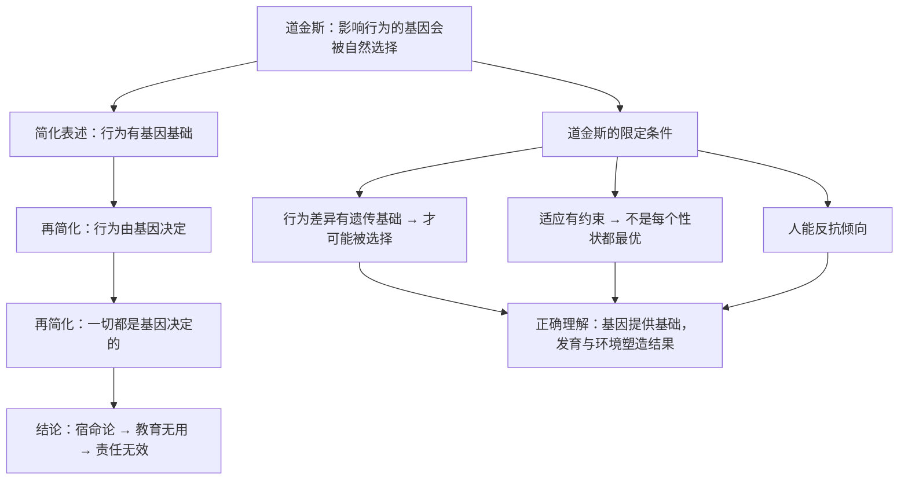

# 24｜「基因决定论」是误读吗？——道金斯的两次澄清

> 道金斯真的认为一切行为都由基因决定吗？

---

## 一、先说结论

不是。而且他为这件事专门做了大量澄清。

最集中的一次，是在 40 周年增订版里——中文版新增了约六万字的内容，主要处理两个流行的误解：

**误解一：「伟大的基因决定论」**

> 误读：一切行为都由基因决定，环境、发育、文化都不重要。

**澄清**：要区分**「基因被选择」**和**「基因决定一切」**。前者是演化生物学的核心主张；后者是一个被强加给道金斯的稻草人。**基因在演化中被筛选，不等于它决定了每一个细节。**

**误解二：「伟大的适应论误解」**

> 误读：生物的每一个性状和每一个行为，都是最优适应，都有演化意义。

**澄清**：适应是有**约束**的。历史包袱、发育限制、物理约束、随机漂变、以及「够用就好」——都会让生物远非「完美优化」。

道金斯的立场可以概括成一句：

> **基因是自然选择的核心单位——但这不等于基因决定命运。**

---

## 二、我们先理解一个问题

先看一个典型的对话。

**质疑者**：
> 「《自私的基因》说人的行为由基因决定，那还要教育干什么？还要法律干什么？」

**道金斯的回应（如果他在场）大概会是**：
> 「我从没说过行为由基因决定。我说的是——**那些影响了行为的基因，会被自然选择筛选。** 这两句话完全不同。」

**这两句话到底差在哪里？**

这就是这一篇要拆开的核心。

---

## 三、作者到底提出了什么观点？

道金斯的澄清，可以拆成五点。

**第一，「被选择」和「被决定」是两个概念。**

| 说法 | 含义 | 是否成立 |
|---|---|---|
| **基因被选择** | 影响行为的基因会在演化中被筛选 | ✅ 演化生物学的核心主张 |
| **基因决定行为** | 行为的每一个细节都由基因指定 | ❌ 不是他的主张 |

**「被选择」说的是「哪些基因会留下来」；「被决定」说的是「行为怎么产生」。** 前者是演化问题，后者是发育问题。

**第二，一个基因要「被选择」，必须先有一个可遗传的行为差异。**

注意这个逻辑顺序：**不是「基因决定了行为」，而是「行为有可遗传的差异，所以基因才会被选择」。**

**如果某个行为完全没有遗传基础，那自然选择就无从筛选它。**

**第三，适应不等于完美。**

道金斯承认，生物身上有很多「不完美」：

- **历史包袱**：演化只能修补已有结构，不能推倒重来（比如脊椎动物的眼睛有一个「盲点」，因为神经布线的方式是历史遗留的）；
- **发育约束**：不是所有形态都能发育出来；
- **权衡**：一个性状的优化，往往以另一个性状的退化为代价；
- **随机性**：漂变和意外也能造成差异。

**所以「这个性状一定有适应意义」是一个懒惰的推论。**

**第四，道金斯本人早就反复强调过这一点。**

在 30 周年版前言里，他就说过：他并不主张「基因决定一切」。**他甚至提出，人之所以特别，恰恰是因为我们能够察觉并反抗基因的倾向**（第 21 篇）。

**第五，所以真正的立场是一个「居中」的位置。**

- 不是「基因决定一切」（极端决定论）；
- 也不是「基因完全无关」（极端环境论）；
- 而是：**基因提供了可被选择的基础，发育与环境共同塑造了结果。**

---

## 四、把这个观点翻译成人话

我们用一个所有人都熟悉的类比：**一个人擅长运动。**

**极端决定论的说法**：
> 「他跑得快，全是因为他有短跑基因。」

**极端环境论的说法**：
> 「他能成功，全是因为教练好、家里有钱、训练刻苦，跟基因没关系。」

**道金斯的说法（居中）**：

- 他的身高、肌肉类型、心肺能力有**可遗传的差异**；
- **正因为这些差异是可遗传的**，自然选择（在人类历史上）才可能对它们起作用；
- 但**他最终能不能成为运动员**，取决于训练、营养、机会、伤病、心理状态、以及时代环境。

**注意这个框架的两个关键点：**

**第一，「有遗传差异」是「基因被选择」的前提，不是「基因决定了结果」。**

如果所有人身高都一样、肌肉类型都一样，那么无论怎么选择，都不会产生差异。

**第二，「适应」不等于「最优」。**

他的身高，在历史上可能是「适合耐力狩猎」的适应，但**在今天变成打篮球的天赋**——**这就是环境变了，原来的适应意义变了。**

**所以「基因」和「行为」之间，隔着发育、环境、学习和选择。**

**把这一层抹掉，就从「有遗传基础」跳到了「由基因决定」——这是那个稻草人的起点。**

---

## 五、为什么会这样？

为什么「基因被选择」会被误读成「基因决定一切」？用一张图看这个误读的生成。

这里有一个非常典型的传播学规律：

**每经过一次转述，限定条件就掉一层。**

- 原文：影响行为的基因会被筛选；
- 转述 1：行为有基因基础；
- 转述 2：行为由基因决定；
- 转述 3：一切都是命。

**到最后，一本书变成了它的反面。**

**而道金斯面对的困境是：**

> **他的核心论点是精确的、有条件的、需要仔细阅读的；但它最容易被传播的那个版本，恰恰是被剥掉所有条件的版本。**

**这也解释了为什么他要在 40 周年版里专门花六万字来澄清——因为他意识到，澄清的速度跟不上误读的速度。**

---

## 六、举一个现实生活中的例子

我们看一个特别有当代感的场景：**「学习成绩是不是由基因决定的」。**

**误解的版本**：
> 「研究表明成绩有 60% 到 80% 的遗传度，所以学习好不好基本是天生注定的。」

**这句推论错在哪里？**

**第一，遗传度是「群体统计量」，不是「个人命运」。**

「遗传度 60%」说的是：**在一个特定群体、特定环境范围内，成绩的差异有多大比例和基因差异有关。** 它不是「你的成绩有 60% 由基因决定」。

**第二，遗传度依赖环境范围。**

这是最关键、也最容易被忽略的一点：

> **当环境差异很大时（比如有人上不了学、有人有最好的老师），环境的贡献会变大；**
>
> **当环境差异很小时（所有人都能接受相似的教育），基因差异的贡献就会显得更大。**

**所以「遗传度高」往往不是「基因重要」，而是「环境已经被拉平了」。**

**第三，遗传度高完全不妨碍干预有效。**

一个经典例子：**过去几百年，人的身高遗传度很高（约 80%）。但整个社会的身高都显著增长了——因为营养和医疗改善了。**

**对个人来说，身高主要由基因决定；对群体来说，环境改变可以让所有人一起长高。**

**这就是「基因被选择」和「基因决定命运」之间最清晰的区别。**

**所以正确的理解是：**

| 说法 | 是否正确 |
|---|---|
| 成绩差异有一部分与遗传有关 | ✅ |
| 成绩主要由基因决定 | ❌ 混淆了群体统计与个体命运 |
| 因此教育投入没用 | ❌ 完全错误的推论 |

---

## 七、回到书中重新理解

现在回到道金斯各个版本的前言与增补内容，他的澄清逻辑非常一致。

**他反复区分两组东西：**

| 他真正的主张 | 被误读成 |
|---|---|
| 自然选择筛选的是基因 | 基因决定一切 |
| 身体是基因的载体 | 人是没有能动性的机器 |
| 行为有可遗传的基础 | 行为不可改变 |
| 适应是「够用就好」的 | 每个性状都是最优设计 |

他还专门回应了「拟人化」的批评——他承认自己用了两层拟人化（对基因、对生物体），**并解释说这是一种表达工具，不是理论主张。**

**这一点很值得注意：一个作者承认自己的修辞有代价，但坚持理论的精确性。**

**这也是这一篇最重要的启示：**

> **读书的时候，要把「作者的修辞」和「作者的主张」分开。**

**很多时候，争论的根本不是理论，而是措辞。**

---

## 八、这个观点背后还有什么？

**隐含前提一：遗传度可以被测量。**

行为遗传学提供了大量数据，**但遗传度高度依赖群体和环境，不能跨情境套用。**

**隐含前提二：发育过程可以被分解为「基因部分」和「环境部分」。**

这是最根本的困难。**实际上基因和环境是交互的**：环境会影响基因的表达（表观遗传），基因也会让人选择不同的环境。**「拆开算」本身就是一个简化的做法。**

**隐含前提三：读者愿意读限定条件。**

这是道金斯面对的最大现实困难。**限定条件是理解的必需品，却是传播的负担。**

**与其他观点的联系：**
- 第 06 篇的「基因机器」是这一篇要澄清的对象；
- 第 21 篇的「反抗」是道金斯自己给出的反决定论立场；
- 第 23 篇的三类争议中，「方法论争议」在这一篇得到了正面回应。

---

## 九、这个观点有问题吗？

这一篇本身的立场也需要被检查。

**第一，「不是基因决定论」这个澄清，可能被道金斯用来回避责任。**

他确实写了很多容易被误读的句子。**在承认「书名误导」之后，是否也该承认部分措辞本身有问题？** 这一点他做过一些（比如后悔书名），但不算彻底。

**第二，过度强调「人能反抗」，可能又滑向另一个极端。**

如果基因的作用被不断淡化，那么道金斯的理论力量也就被削弱了。**他需要在「有力」和「不过度」之间保持平衡，而这很难。**

**第三，40 周年版的澄清，读者未必会读。**

绝大多数读者读的是正文，不是前言和增补章节。**所以澄清的效果，可能非常有限。**

**第四，误读的责任不全在读者。**

一个理论如果**必须依赖大量脚注和限定条件才能被正确理解**，那么它的表达方式本身就有问题。**这是科普写作的永恒难题。**

---

## 十、今天再看这个观点

「基因决定论 vs 环境决定论」这个老争论，今天换了个名字出现了：**「AI 决定论」。**

现在的版本是：

- **版本 A**：「AI 会取代大部分工作，所以你的努力没有意义。」
- **版本 B**：「AI 只是工具，一切取决于人怎么用。」

**这两个版本，和四十年前的「基因决定论 vs 环境决定论」结构完全一样。**

**而道金斯的经验是宝贵的：**

> **不要在两极之间选一个，而要问「在什么条件下、什么范围内、对哪一类问题成立」。**

- 哪些任务会被替代？（**范围问题**）
- 替代的速度有多快？（**时间问题**）
- 在什么制度条件下，替代的后果是失业还是效率提升？（**环境问题**）

**「有影响」和「决定一切」，永远是两句话。**

**这个区分，是道金斯用四十年时间、六万字澄清换来的一个教训。**

这是**基于道金斯思想的现代延伸**。

---

## 十一、这一篇真正应该记住什么？

1. **「基因被选择」≠「基因决定一切」——前者是演化主张，后者是稻草人。**
2. **行为有遗传基础，是「可能被选择」的前提，不是「行为由基因决定」。**
3. **适应不等于完美：历史包袱、发育约束、权衡、随机性都会造成「非最优」。**
4. **遗传度是群体统计量，不是个人命运；且高度依赖环境范围。**
5. **读书时要把「作者的修辞」和「作者的主张」分开。**

---

## 十二、留一个问题

> 你听到「某项研究证明……」的时候，第一反应是记住结论，还是找限定条件？
>
> 这个习惯的差别，可能决定了你是被信息武装，还是被信息操纵。
>
> 下一篇，我们把这套思想放到今天——**如果复制因子变成了算法，谁在复制谁？**
