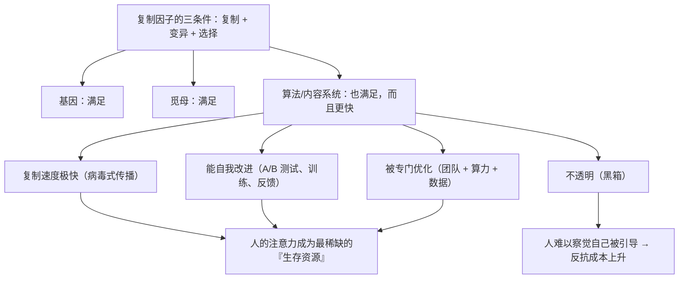

# 25｜当复制因子变成算法——AI 时代，谁在复制谁？

> 在模型、数据与内容为王的今天，「复制因子」的思想还成立吗？

---

## 一、先说结论

先要说明一件事：**道金斯没有讨论过 AI。** 这一篇是**基于他的思想做的现代延伸**，不是书中的观点。

但如果接受他的核心定义——

> **复制因子 = 任何能够被复制、变异、并被选择的信息单元**

——那么今天我们可以把很多东西看成新的复制因子：

- 代码与脚本；
- 提示词与工作流；
- 模型权重与微调版本；
- 内容模板与「爆款结构」；
- 网络迷因与流行语。

**而它们的行为，和基因、觅母遵循的是同一套规则：能复制、会变异、被筛选。**

由此引出一个尖锐的问题：

> **当内容的传播速度第一次超过基因，人类是模因的宿主，还是正在成为算法的「生存机器」？**

---

## 二、我们先理解一个问题

先看一个非常具体的事实。

一首歌、一个观点、一个梗，从一个人传到全球，**可能只需要几个小时。**

而一个基因，从一代传到下一代，**需要二三十年。**

**这意味着：**

> **在人类身上，文化复制的速度，已经比生物复制快了几十万倍。**

**现在再想一层：**

- 基因的载体是身体；
- 觅母的载体是大脑；
- **那算法的载体是什么？**

**答案是：数据、算力、以及——我们的注意力。**

**于是问题变成了：**

> **如果有一个系统，能通过你的行为不断自我改进、复制自己、扩张影响力——它算不算一个「复制因子」？**

---

## 三、作者到底提出了什么观点？

（再次强调：以下是**基于道金斯思想的延伸**，不是他的原文。）

**第一，复制因子的定义，天然包含非生物的东西。**

道金斯在提出觅母时就说过：**复制机制的关键是三件事——复制、变异、选择。** 它不依赖碳基化学。

**所以「算法也可以是复制因子」这个推论，在逻辑上是通的。**

**第二，算法比觅母多了两个可怕的能力。**

| | 基因 | 觅母 | 算法 |
|---|---|---|---|
| 复制速度 | 极慢 | 快 | **极快** |
| 能否自我改进 | 否 | 否 | **能** |
| 是否持续运行 | 否 | 否 | **24 小时** |
| 是否被专门优化 | 否 | 否 | **是，由专业团队** |
| 是否透明 | 需要知识 | 半可见 | **黑箱** |

**第三，于是出现了一个新的「生存机器」。**

道金斯说身体是基因的生存机器。**如果沿着这个逻辑推——**

> **当一个人的注意力、行为、选择被系统性地引导去服务某个指标时，这个人是不是正在成为「算法的生存机器」？**

**第四，这带来一个新的「两难」。**

- 算法确实提供了真实的便利（信息、效率、连接）；
- 但它同时在做另一件事：**让你的注意力服务于它的指标。**

**这不是恶意，而是结构。**

**第五，所以道金斯那句「反抗」在今天有了新的对象。**

过去是反抗基因和觅母；**现在还要加上算法。**

**而这三者的共同点是：它们都在你身上起作用，而你往往不知道。**

---

## 四、把这个观点翻译成人话

我们用一个今天最具体的场景：**短视频推荐。**

**第一层：它在做什么？**

它的目标很明确：**最大化你的停留时长。** 这不需要恶意，只需要一个优化目标。

**第二层：它是怎么做到的？**

- 它观察你的行为（看了多久、跳过什么、重看什么）；
- 它给你更多「你停下来的内容」；
- 它不断试验、不断调整。

**用道金斯的语言说：它在「复制」那些最能让你停留的内容——而且它在自我改进。**

**第三层：你的位置是什么？**

- 你的注意力 = 它的「资源」；
- 你的行为 = 它的「反馈信号」；
- 你的停留 = 它的「繁殖成功」。

**在这个系统里，你不是在「使用工具」——你是它的**执行环境**。**

**第四层：这三者有什么区别？**

| | 它想要的 |
|---|---|
| 你的基因 | 你活下去、生育 |
| 你的觅母 | 你相信它、传播它 |
| 算法 | **你继续停留** |

**三个「想要」，方向完全不同。而它们的战场，就是你的时间和注意力。**

**这就是「谁在复制谁」这个问题最现实的形态。**

---

## 五、为什么会这样？

为什么算法会被纳入「复制因子」的框架？用一张图看这个逻辑。

这里有三个非常关键的推论：

**第一，注意力成了新的「有限资源」。**

基因竞争的是「生存与繁殖的机会」；觅母竞争的是「大脑份额」；**而算法竞争的是「注意力的总量」。**

**注意力的总量是固定的——每天只有 24 小时。所以这是一场零和竞争。**

**第二，「能被优化」是一个巨大的不对称。**

基因不能「为了变得更好而改变自己」；**但算法可以——有专门的团队每天在做这件事。**

**在这场比赛里，个体的意志力面对的是整个系统的优化能力。**

**第三，不透明让「反抗」变得困难。**

第 21 篇讲过：**反抗的前提是「知道是什么在推你」。**

**但当推力来自一个你无法阅读的黑箱时，这个前提就被削弱了。**

---

## 六、举一个现实生活中的例子

我们看一个特别真实的对比：**内容创作者。**

**在道金斯的框架里，一个创作者同时在服务三种复制因子：**

| 复制因子 | 它在要什么 | 创作者感受到的压力 |
|---|---|---|
| 基因 | 生育、照顾亲属 | 时间被创作占据，生育被推迟 |
| 觅母 | 传播某个观念 | 「我要把这个想法说出去」 |
| 算法 | 停留、互动、转发 | 「标题要更抓人、开头要更炸、节奏要更快」 |

**现在看一个典型的现象：**

**为什么很多创作者会「越做越像」？**

- 因为平台的推荐机制在奖励某一种结构；
- 反馈数据会实时告诉创作者「什么有效」；
- 于是创作者会不断向「有效」靠拢；
- **久而久之，创作变成了「拟合算法」。**

**这是「觅母被算法驯化」的过程。**

**而更微妙的是：创作者本人会以为这是自己的选择。**

> 「我是为了流量才这么做的。」——**但「要流量」本身，是被环境塑造出来的偏好。**

**这就是道金斯框架最有价值的地方：**

> **它让你看到：你以为的「选择」，可能是某个系统的「筛选结果」。**

**而看到这一点，就是第 21 篇说的「反抗」的起点。**

---

## 七、回到书中重新理解

现在把这一篇和道金斯的原文对照，会发现他的框架意外地有延展性。

**他在 1976 年做了三件事：**

1. 提出「复制因子」这个概念（第 03 篇）；
2. 提出「载体 / 生存机器」（第 05 篇）；
3. 提出「觅母」这个新复制因子（第 19 篇）。

**而这三件事，今天可以完整地套用在算法系统上：**

| 道金斯的概念 | AI 时代的对应 |
|---|---|
| 复制因子 | 内容、模板、提示词、模型 |
| 复制 + 变异 + 选择 | 传播、二创、平台筛选 |
| 生存机器 / 载体 | 用户、创作者、乃至整个社会 |
| 觅母与基因的冲突 | 算法与基因、算法与觅母的冲突 |
| 反抗自私复制因子 | 看清机制、重建选择空间 |

**但必须诚实地说明：**

> **道金斯写作时的对称性（基因自利 = 觅母自利）在今天被打破了——因为出现了一个「能主动优化自己、且不透明」的复制因子。**

**这是他没有预见到的，也是这个框架在今天最需要被扩展的地方。**

**所以这一篇的性质是「延伸」，不是「解读」。**

**把它和书中的观点混为一谈，本身就是一种对道金斯的误读。**

---

## 八、这个观点背后还有什么？

**隐含前提一：算法真的是「复制因子」，而不是「工具」。**

这是一个有争议的判断。**工具论者会说：算法只是被执行，真正的行动者是人。**

**但反过来看：当系统的行为超出任何一个人的理解与意图时，「它自己在做什么」这个说法就开始有意义了。**

**隐含前提二：人的注意力是可被争夺的有限资源。**

这一点已经非常清楚。**问题只在于这种争夺的长期后果。**

**隐含前提三：人能识别并反抗。**

这是道金斯立场的延续。**但如果反抗的成本持续上升，这个前提就会变得脆弱。**

**与其他观点的联系：**
- 第 03 篇的「复制因子」是这一篇的概念基础；
- 第 19、20 篇的觅母与冲突是直接的类比来源；
- 第 21 篇的「反抗」是这一篇的落点；
- 第 26 篇会总结「该拿走什么」。

---

## 九、这个观点有问题吗？

有，而且这一篇的风险在于**它离道金斯的原文很远**。

**第一，把算法等同于「复制因子」，可能是一种过度类比。**

算法没有「自己的目标」——它的目标是人设定的。**说它「想要停留时长」，本质上是它背后的人和组织想要。**

**所以更准确的说法是：算法是一个被设计出来的、能自我优化的筛选机制——而不是一个自发的复制因子。**

**第二，这套框架容易走向「技术宿命论」。**

如果一切都归因于「算法在复制自己」，人就被再次工具化了。**而这正是第 24 篇批评的那种「决定论」。**

**第三，「反抗成本上升」这个说法可能被用来免责。**

「我被算法控制了，所以我没办法」——**这类说法会把责任从具体的设计者、平台、制度转移到一个抽象概念上。**

**第四，最重要的：这一篇的内容不是道金斯说的。**

如果读者把这一篇当成「《自私的基因》的结论」，那就犯了第 23 篇批评的那种错误——**把延伸当成原文。**

**所以请务必记住这个边界：**

> **书中说的**：基因是复制因子，觅母是新的复制因子，我们能反抗。
> **这一篇补充的**：算法系统在功能上像第三个复制因子，而且更难反抗。

---

## 十、今天再看这个观点

这一篇本身就是「今天再看」。

如果要给一个总结，它大概是这样的：

**道金斯给了我们一副透视镜：看穿「谁在复制谁」。**
**而 AI 时代，让这副透视镜变得前所未有地有用——也前所未有地难用。**

| 要问的问题 | 在基因时代 | 在 AI 时代 |
|---|---|---|
| 谁在复制？ | 基因 | 内容、模板、模型、算法 |
| 载体是什么？ | 身体 | 注意力、创作者、社会 |
| 我怎么被影响？ | 通过本能与情绪 | 通过推荐、反馈、默认值 |
| 我能反抗吗？ | 能（理解机制即可） | **能，但需要工具、制度、集体行动** |

**最后一行是关键的差别。**

**对基因的反抗，可以是个人的觉醒；**
**对算法的反抗，几乎必须是集体的、制度性的——因为对手是一个持续优化、24 小时运行、且资源雄厚的系统。**

**所以道金斯那句话在今天可能需要一个修订版：**

> **「我们是唯一能够反抗的生物」——但前提是，我们愿意一起反抗。**

这是**基于道金斯思想的现代延伸**，也是这个系列最想留下的一句现代批注。

---

## 十一、这一篇真正应该记住什么？

1. **按定义，复制因子不必是碳基的——算法系统在功能上很像第三个复制因子。**
2. **三者要的东西不同：基因要生育，觅母要相信，算法要停留。**
3. **注意力是新的有限资源，而它的竞争是零和的。**
4. **算法比觅母多了「自我优化」和「不透明」两个特性，这让反抗更难。**
5. **反抗基因可以是个人觉醒；反抗算法必须是集体的、制度性的。**

---

## 十二、留一个问题

> 过去一周，你有多少时间是在「你选择做的事」上，多少是在「系统想让你做的事」上？
>
> 如果不确定——**那你可能已经不需要答案了，因为你已经习惯了不去问。**
>
> 下一篇，也是最后一篇——**读懂《自私的基因》，我们到底该拿走什么？**
