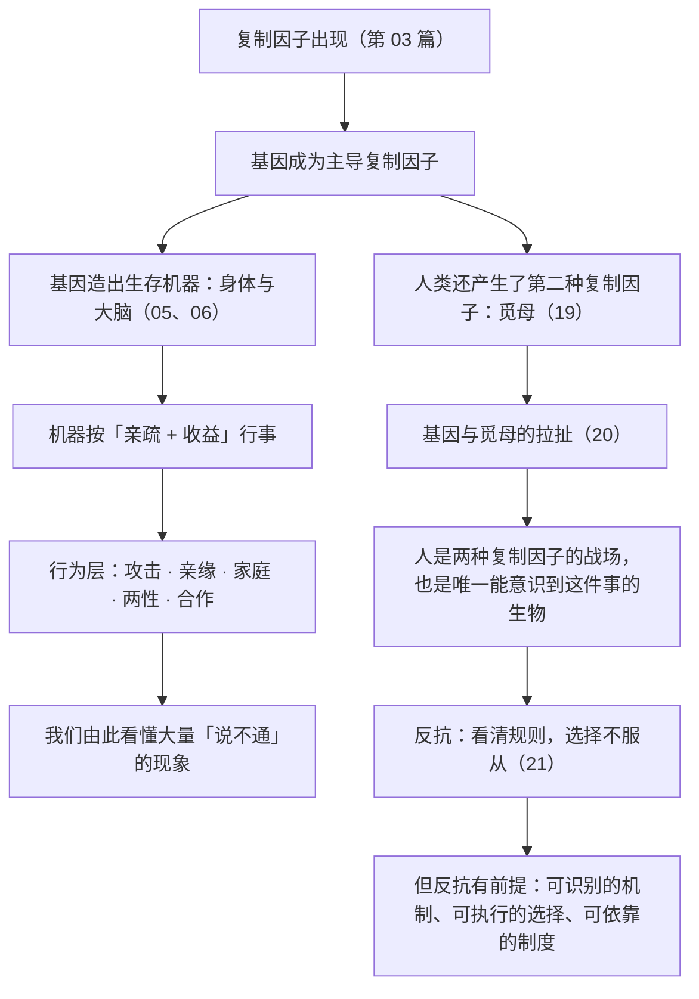

# 26｜最后：读懂《自私的基因》，我们该拿走什么？

> 如果不照单全收，这本书最值得留下的到底是什么？

---

## 一、先说结论

《自私的基因》最常被拿走两样东西：

- **一个误读**：「人天生自私，所以别谈理想。」
- **一个挫败感**：「我只是基因的机器，那我算什么？」

**这两样都不该拿走。**

这本书真正值得留下的，是**一副透视镜**：

> **它让你看到行为背后的深层逻辑，也让你意识到——你不必服从这套逻辑，因为你恰好是那种能够理解并质疑它的生物。**

道金斯（道金斯）在书末写下的那句话，才是全书的终点：

> **我们是地球上唯一能够反抗自私复制因子暴政的生物。**

**所以这本书的礼物不是「人天生自私」这个结论，而是——**

> **「看清规则，才有可能不被规则支配。」**

---

## 二、我们先理解一个问题

先回到最开始的那个误读。

一个人在读完这本书之后，可能会想：

> 「原来母爱只是基因的自私，原来友情只是互惠的算计，原来一切都是复制因子在操作。那还有什么是真的？」

**注意这句话里有一个隐藏的跳跃：**

> **「一切都可以被解释」不等于「一切都不真实」。**

**这两句话之间，隔着一个巨大的错误。**

而这个错误，正是这一整个系列（26 篇）从头到尾都在拆解的东西。

---

## 三、作者到底提出了什么观点？

把 26 篇浓缩成一句话，道金斯的贡献可以这样概括：

**第一，他提出了一种视角。**

把自然选择的单位从个体下移到基因。**这个视角能解释大量用别的框架解释不了的现象。**

**第二，他用这个视角解决了一系列难题。**

- 为什么动物不往死里打？（成本收益 + ESS）
- 为什么工蜂不育？（亲缘系数 75%）
- 为什么父母和子女冲突？（相关度只有 50%）
- 为什么雌性挑剔、雄性炫耀？（亲代投资不对称）
- 为什么骗子消灭不了？（频率依赖平衡）

**第三，他提出了第二种复制因子。**

**觅母**——文化层面的复制因子。**这让「进化」不再只是生物学的事。**

**第四，他划出了人类的位置。**

**我们是唯一能理解并反抗这两套复制因子的生物。**

**第五，他留下的不是答案，而是一个问题。**

> **明白了这套逻辑之后，你打算怎么办？**

---

## 四、把这个观点翻译成人话

我们用一个最直观的方式，总结这本书到底教会了我们什么。

**它给了你五种「看穿」的能力：**

| 你能看穿什么 | 对应哪一篇 |
|---|---|
| **看穿「亲情不是无条件的」** | 09、12 —— 亲缘系数有刻度 |
| **看穿「冲突里没有道德问题，只有结构问题」** | 14、19 —— 投资不对称、机器隐喻 |
| **看穿「一个观点能火，不等于它是对的」** | 19 —— 觅母只认传播力 |
| **看穿「善意的策略需要牙齿」** | 17 —— 针锋相对必须有报复 |
| **看穿「你被设定的倾向，不等于你的命运」** | 06、21 —— 基因机器与反抗 |

**而这五种能力，本质上都是同一个能力的不同版本：**

> **看到「表面现象」背后的「结构」。**

**这不是让人变得冷漠，而是让人不再被表面迷惑。**

**一个能看穿结构的人，反而更有可能做出真正的选择——因为他知道自己面对的是什么。**

---

## 五、为什么会这样？

为什么「看清机制」会有这么大的力量？用一张图总结整本书的逻辑。



**注意最后那一句。**

**道金斯把「反抗」说得很浪漫，但现实是：**

**反抗是有条件的。**

- 你需要能识别是什么在影响你；
- 你需要有做出不同选择的余地；
- 你需要有环境和制度的支持。

**所以「看清」只是第一步。真正的自由，需要行动与条件。**

---

## 六、举一个现实生活中的例子

我们用一个具体的、可以立刻开始做的事来收尾：**写下你的「三条反本能原则」。**

**第一步：找出你最常被基因倾向牵着走的三个场景。**

比如：

- 熬夜刷手机（短期快感 vs 长期精力）；
- 在冲突中为了「面子」而升级（情绪回路）；
- 因为害怕错过而接受一切机会（损失厌恶）。

**第二步：为每个场景写一条「反向规则」。**

它必须是**具体、可执行、不依赖意志力**的：

| 场景 | 反本能规则 |
|---|---|
| 熬夜刷手机 | **睡前把手机放到客厅充电**（改环境，而非靠决心） |
| 冲突中为了面子升级 | **感到上头时，先说「我需要想一下，明天再说」（延迟 24 小时）** |
| 什么机会都接 | **任何新机会，先问「它要挤掉我现在的哪一项？」** |

**第三步：观察一周，然后修改。**

- 哪一条有效？保留；
- 哪一条失效？改掉；
- 哪一条触发了新的问题？继续拆解。

**这就是「反抗」在现实中的样子——它不宏大，它是三条具体规则加一次复盘。**

**而这也回答了「读懂这本书该怎么用」这个问题：**

> **它不给你人生答案，它给你一套「识别本能、并为之设计对策」的工具。**

**你不需要反抗基因的一切——你只需要在几个最关键的地方，拿回选择权。**

---

## 七、回到书中重新理解

现在回到道金斯在全书最后的那段话，以及他在各个版本前言里的反复澄清。

他做过的几件事，值得记住：

**第一，他承认书名造成了误导。**

他说他后悔没有用《永恒的基因》这个名字。**一个作者能公开承认自己的表达失误，这本身就是一种诚实。**

**第二，他反复强调「反抗」的可能。**

- 在第三章结尾，他说人类能对抗自己的基因；
- 在最后一章，他说人类能对抗自私的觅母；
- 在 30 周年版前言，他澄清自己并非「基因决定论者」。

**第三，他划清了「描述」与「规范」的界限。**

他反复区分「事实是什么」和「应该怎样」。**这是科学写作的基本纪律。**

**所以，这本书的最终形态是这样的：**

> **它描述了一种冷酷的底层逻辑；它承认人的特殊性；它把结论交给读者。**

**而它留给读者的，是一个需要自己回答的问题：**

> **知道了这一切之后，你要怎么活？**

---

## 八、这个观点背后还有什么？

**隐含前提一：理解能带来自由。**

这是道金斯的信念（第 21 篇已经讨论过它的局限）。**理解是必要条件，但不是充分条件。**

**隐含前提二：人有意愿去理解。**

很多人读到这本书后，只带走「人性本私」这一句，然后用它来解释一切。**这不是理解，这是找借口。**

**隐含前提三：个体还有选择空间。**

如果一个人处在极度贫困、压迫、疾病中，「看清机制」可能是一件奢侈的事。**这是道金斯框架的一个真实边界。**

**与其他观点的联系：**
- 第 01 篇的「书名误读」在这里得到收束；
- 第 11 篇的「真正的利他」是「反抗」的具体形态；
- 第 21 篇的「反抗」是这一篇的落点；
- 第 25 篇的「算法」是反抗的新对象。

---

## 九、这个观点有问题吗？

有，而且这一篇也需要被检查。

**第一，「拿走什么」这个说法本身是有立场的。**

我选择强调「反抗」和「工具」，而不是「自私」和「宿命」。**这是我的解读，不是唯一正确的解读。** 读者完全可以从中拿走别的东西。

**第二，「看清机制就能自由」这个结论，可能高估了理性。**

现实中，很多人「看得很清楚」依然做不到。**所以这一篇不应该变成对「做不到的人」的责备。**

**第三，把这本书当成「工具书」，可能漏掉它最大的价值。**

它最大的价值，其实是一种**智识上的震撼**：**它让你用完全不同的眼光看自己，而且这个眼光一旦拥有，就再也回不去了。**

**这种震撼本身，比任何实用规则都珍贵。**

**第四，也是最诚实的一点：**

> **本书的所有解释，都只是「一个解释」。**
>
> **它有力量，但不是全部真相。它精确，但有边界。它值得被认真读，但不值得被当作信条。**

**这大概是读完一本经典之后，最好的姿态。**

---

## 十、今天再看这个观点

如果把这本书放回 1976 年，它是一个有力的纠偏；放到今天，它变成了一个更复杂的问题的一部分。

**今天的处境是：**

- 基因还在设定我们的倾向；
- 觅母还在争夺我们的大脑；
- **而算法正在争夺我们的一切可被优化的注意力。**

**道金斯在四十多年前说：**
> **我们是唯一能反抗的生物。**

**而今天的现实是：**
> **能反抗，不等于反抗容易；知道要反抗，不等于知道怎么反抗。**

**所以这本书在今天最值得被带走的一句话，可能应该是：**

> **理解是你唯一无法被夺走的领地。**
>
> **而保住「理解」，是保住其他一切自由的前提。**

**这不是道金斯写的，但它是从他的框架里长出来的。**

---

## 十一、这一篇真正应该记住什么？

1. **不要从这本书里拿走「人天生自私」，那是误读；要拿走「看清规则，才能不被规则支配」。**
2. **它给了你五种「看穿结构」的能力——这才是最实用的部分。**
3. **反抗是有条件的：可识别的机制、可执行的选择、可依靠的制度。**
4. **实用层面：写下三条「反本能原则」，然后一周后修改它。**
5. **它是「一个有力的解释」，不是「全部真相」——认真读它，但不要把它当信条。**

---

## 十二、留一个问题

> 读完这 26 篇，如果只能带走一句能立刻用上的话，你会带走哪一句？
>
> 以及更重要的一个问题：
>
> **在你身上起作用的那三种力量——基因、觅母、算法——你今天愿意对哪一个，做出一个小小的、具体的反抗？**

---

## 系列收束

到这里，「《自私的基因》深度解读系列」的 26 篇全部结束。

整条路径其实是一个「从冷到暖」的过程：

```text
复制因子与基因中心视角（01-06）
  ↓
行为的基因逻辑：攻击、亲缘、家庭（07-13）
  ↓
两性与合作：投资、炫耀、互惠、博弈（14-18）
  ↓
第二种复制因子：觅母，及其与基因的冲突（19-21）
  ↓
延伸、争议与今天（22-25）
  ↓
看清规则之后，如何选择（26）
```

道金斯（道金斯）在书里最想传递的，从来不是「人天生自私」这个结论。

他想说的是：

> **我们是被造出来的，但我们是唯一知道自己被造出来的生物。**
>
> **而这一点，就够了。**
