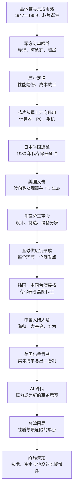

# 《芯片战争》深度解读系列

## 系列简介

《芯片战争：世界最关键技术的争夺战》是美国历史学者克里斯·米勒（Chris Miller）2022 年出版的著作（中译本由蔡树军翻译，浙江人民出版社 2023 年出版）。全书用 54 个短章，讲透了半导体产业从 1947 年晶体管诞生，到今天中美芯片博弈的完整历史。

米勒要回答的核心问题是：为什么一块指甲盖大小的硅片，能决定国家的兴衰？他的答案是：芯片已经取代钢铁和石油，成为大国竞争最关键的资源——算力就是国力。而这条供应链的独特之处在于，它被切分成了前所未有的全球分工：设计在美国、制造在中国台湾、设备在荷兰、材料在日本，每个环节都是一个可以被卡住的“咽喉点”。

这本书的价值不在于预测谁会赢，而在于给出一套看世界的新坐标：为什么日本曾在十年内掀翻美国、为什么苏联抄了近路却失败、为什么韩国敢用国运下注、为什么台湾的工厂会让全世界睡不着觉。读懂这条产业链，才能读懂今天的大国博弈。

本系列按“基础认知 → 产业解剖 → 历史争霸 → 中国挑战 → 未来战场”六个部分拆解全书，共 24 篇。每篇只回答一个核心问题，并明确区分米勒的观点、历史事实与学界争议。

---

## 全书核心问题

| 层次 | 核心问题 | 本书的回答方向 |
|---|---|---|
| 技术层（是什么） | 芯片为什么这么难造？ | 它是人类工业能力的极限：在纳米尺度上操控物质，依赖全球最精密的设备、材料与工艺，且每两年就要翻一倍性能 |
| 产业层（怎么运转） | 芯片产业为什么会变成一条全球分工的链条？ | 分工是被成本和风险逼出来的，也带来了依赖：每个国家只做最擅长的一段，结果是所有人都握着一部分别人的命门 |
| 历史层（谁做主） | 芯片霸权为什么会不断易主？ | 技术代际更替 + 政策豪赌 + 商业模式颠覆；领先者被成功绑住，追赶者孤注一掷，于是王座反复换人 |
| 军事层（怎么打仗） | 芯片为什么能决定战争胜负？ | 精确制导、雷达、通信、AI：现代武器的核心不是钢铁而是算力，“抵消战略”用技术优势抵消数量优势 |
| 地缘层（谁能卡谁） | 美国为什么能“卡脖子”？ | 供应链上最关键的咽喉点——EDA、核心 IP、设备、光刻机、先进制造——大多握在美国及其盟友手里，管制靠的是技术含量而非领土 |
| 未来层（走向哪里） | 芯片战争会怎么结束？ | 没有容易的终局：管制能拖延速度却拖不出结果，会倒逼自主；台湾是最关键的节点，也是最危险的节点 |

---

## 全书知识地图

---

## 全系列目录

### 第一部分：为什么芯片是这个时代的“石油”

#### 01｜为什么一块小小的芯片，能决定大国命运？

核心问题：芯片凭什么取代钢铁和石油，成为大国竞争最关键的资源？

核心观点：米勒认为，芯片是“新时代的石油”：它既是所有产业的基础技术，也是军事能力的基础。谁掌握最先进的芯片与它的供应链，谁就掌握了定义下一个时代的权力——所以芯片问题从来不只是生意。

理解难度：★★☆☆☆

关键词：新石油、算力与国力、供应链权力、技术地缘政治

---

#### 02｜晶体管：20 世纪最重要的发明，为什么诞生在战争的阴影里？

核心问题：为什么半导体的第一推动力不是商业，而是战争？

核心观点：晶体管的诞生与早期成长，是被军方需求喂养出来的：二战中的雷达与近炸引信暴露了真空管的极限，冷战的导弹竞赛又提供了不计成本的订单。没有战争，就没有芯片产业的第一桶金。

理解难度：★★☆☆☆

关键词：真空管、贝尔实验室、军方订单、近炸引信、冷战

---

#### 03｜硅谷是怎么长出来的？——八个“叛徒”与一场人才叛逃

核心问题：为什么硅谷不是诞生在实验室里，而是诞生在一次次“叛逃”里？

核心观点：肖克利带来了晶体管，也带来了让人难以忍受的管理方式；八位年轻人集体出走创办仙童，开启了“人才流动—创业—再分裂”的循环。硅谷真正的竞争力不是某项技术，而是这种允许甚至鼓励“背叛”的生态。

理解难度：★★☆☆☆

关键词：肖克利、八叛逆、仙童半导体、人才流动、创业文化

---

#### 04｜集成电路与摩尔定律：为什么芯片业有一个“永不停歇的时钟”？

核心问题：为什么芯片业能在六十年里保持近乎疯狂的迭代速度？

核心观点：集成电路把“一堆零件”变成“一块材料”，摩尔定律则把技术目标变成了全行业的时钟：晶体管数量定期翻倍。它既是预测，也是自我实现的军令状——整个产业被它推着跑，慢一步就可能出局。

理解难度：★★★☆☆

关键词：集成电路、基尔比、诺伊斯、摩尔定律、学习曲线

---

### 第二部分：解剖一条史上最复杂的供应链

#### 05｜芯片为什么从“一家公司全包”变成“全球分工”？

核心问题：芯片产业为什么会从垂直一体化，走向设计、制造、设备各管一段的全球分工？

核心观点：分工不是被规划出来的，而是被成本和技术逼出来的：一座先进工厂贵到没人能独自承担，于是“只设计不建厂”和“只代工不设计”同时出现。分工带来了效率，也把所有人绑上了同一根链条。

理解难度：★★★☆☆

关键词：垂直一体化、IDM、无厂设计、晶圆代工、产业分工

---

#### 06｜一条芯片供应链上，藏着多少个“卡脖子”的节点？

核心问题：为什么一条看似普通的供应链，会变成大国博弈的武器库？

核心观点：芯片供应链是史上最复杂的分工，但复杂度并不均匀：EDA 软件、核心 IP、光刻机、特种材料、先进制造集中在少数玩家手里。谁握住这些“咽喉点”，谁就握住了别人的命门——这就是“卡脖子”的物理基础。

理解难度：★★★☆☆

关键词：供应链、咽喉点、EDA、光刻机、特种材料、相互依赖

---

#### 07｜光刻机：为什么一台机器能卡住一个大国？

核心问题：为什么全世界只有一家公司能造出最先进的光刻机？这件事为什么如此要命？

核心观点：光刻是芯片制造的心脏，而 EUV 光刻机是人类造过最复杂的机器：十万个零件、数千家供应商、几十年的技术积累。它的垄断不是偶然，而是“只有疯子才敢投”的产业规律的结果——也因此成了最有威力的单点。

理解难度：★★★☆☆

关键词：光刻、ASML、EUV、尼康、技术垄断

---

#### 08｜为什么存储器生意总在“暴赚”和“血亏”之间摇摆？

核心问题：为什么同样是芯片，存储器市场会周期性地变成“绞肉机”？

核心观点：存储器是标准品，像大豆和原油一样被公开买卖：谁的成本低谁赢，价格随供需剧烈波动。这种“大宗商品”属性让存储器成了芯片业最血腥的战场，也给了敢于逆周期下注的后来者翻盘的机会。

理解难度：★★★☆☆

关键词：DRAM、大宗商品、价格战、行业周期、成本曲线

---

#### 09｜为什么领先者总是掉队？——芯片业的“创新者困境”

核心问题：为什么芯片业的霸主总是守不住自己的王座？

核心观点：芯片业的技术每隔几年就换代一次，每一次换代都是一次重新洗牌：领先者被自己最赚钱的业务绑住，追赶者则在下一代技术上孤注一掷。米勒反复展示的，是“成功如何变成包袱”。

理解难度：★★★★☆

关键词：创新者困境、技术代际、路径依赖、自我颠覆

---

### 第三部分：争霸（上）——美国、日本与苏联

#### 10｜日本是怎么在十年里把美国逼到墙角的？

核心问题：一个战后从零开始的国家，为什么能在十年里拿下全球存储器市场？

核心观点：日本的崛起不是市场奇迹，而是“举国体制”的产物：通产省组织五家企业联合攻关、银行提供廉价资本、企业以质量换市场。它证明了芯片业的领导权可以在十年内易主。

理解难度：★★★☆☆

关键词：通产省、VLSI 计划、索尼、存储器、产业政策

---

#### 11｜美国为什么输掉了存储器之战？

核心问题：曾经发明了芯片的美国，为什么会在自己开创的产业里节节败退？

核心观点：输掉存储器不是一次战役的失败，而是商业模式与产业生态的失败：日本用低价高质的产品把价格打穿，美国企业则被资本市场的短期主义捆住。英特尔的退出（格鲁夫与摩尔的那场对话）标志着美国从“什么都做”转向“只做最赚钱的”。

理解难度：★★★★☆

关键词：价格战、死亡螺旋、格鲁夫、退出存储器、日美贸易战

---

#### 12｜美国是怎么反击的？——从“日本第一”到硅谷复兴

核心问题：美国用什么办法夺回了芯片业的主导权？

核心观点：反击是三件事的组合：政府与企业联合攻关、把战场换到自己有优势的地方（微处理器与 PC 生态）、以及逼日本签下市场准入协议。美国学到的经验是：不必在每个环节都赢，只要握住最有价值的环节。

理解难度：★★★★☆

关键词：SEMATECH、微处理器、Wintel、贸易协议、生态优势

---

#### 13｜苏联的芯片计划为什么失败了？——抄近路的代价

核心问题：为什么苏联倾举国之力“复制”美国芯片，却始终落后一代？

核心观点：苏联把芯片当成了“可以抄的作业”：从晶体管到 IBM 360，一代代克隆，永远差一代。芯片业迭代极快、工艺知识藏在细节里，靠逆向工程永远追不上；计划经济又抑制了试错与迭代。抄近路的代价，是永远在追一条移动的终点线。

理解难度：★★★★☆

关键词：泽列诺格勒、复制策略、IBM 360、逆向工程、体制与技术

---

### 第四部分：争霸（下）——韩国、中国台湾与“硅盾”

#### 14｜韩国是怎么用一场“逆周期豪赌”上位的？

核心问题：一个比日本更晚起步的国家，是怎么在存储器的血海里杀出重围的？

核心观点：韩国的武器是“逆周期投资”：在价格暴跌、人人亏损的时候继续借钱建厂，用规模和技术代差把对手熬死。三星的每一次豪赌都是拿公司命运下注，而背后是国家信用在兜底。

理解难度：★★★☆☆

关键词：三星、逆周期投资、财阀、政府信用、存储器

---

#### 15｜张忠谋与台积电：代工模式为什么是天才的设计？

核心问题：一个“只代工、不设计”的商业模式，为什么能重塑整个产业？

核心观点：台积电的颠覆性不在于技术，而在于信任结构：它承诺永远不与客户竞争，于是所有设计公司都敢把最核心的图纸交给它。这一模式把“制造”变成了公共基础设施，催生了整个无厂设计产业。

理解难度：★★★☆☆

关键词：张忠谋、台积电、晶圆代工、无厂革命、客户信任

---

#### 16｜“硅盾”：为什么台湾的芯片产能让全世界睡不着觉？

核心问题：一个岛屿的芯片工厂，为什么会被叫作“硅盾”？

核心观点：台湾生产了全球九成以上的先进芯片，这让它同时拥有两样东西：对全世界的“人质价值”和自身的“战略价值”。支持者认为这让大陆不敢轻动，怀疑者认为这把台湾变成了最危险的引爆点——米勒倾向于认为，硅盾既是护身符，也是风险源。

理解难度：★★★★☆

关键词：硅盾、台海、先进制程、全球经济、地缘风险

---

### 第五部分：中国与芯片战争

#### 17｜中国大陆的芯片产业是怎么起步的？

核心问题：中国在芯片上追赶了半个多世纪，为什么每一步都这么难？

核心观点：中国的芯片之路是“从买设备，到买公司，再到自己造”：从 863 计划、908/909 工程，到张汝京带着一批海归创办中芯国际，再到千亿级的大基金。每一轮都撞上同一个问题：技术可以引进，但迭代能力只能自己长出来。

理解难度：★★★☆☆

关键词：863 计划、中芯国际、海归、大基金、产业政策

---

#### 18｜为什么中兴和华为先后成为靶子？

核心问题：为什么美国“芯片战争”的第一枪，打向的是两家通信设备公司？

核心观点：因为中兴和华为站在了“芯片—通信—国家安全”的交汇点上：5G 是未来信息基础设施的入口，而华为的芯片自研能力让它无法被轻易控制。中兴事件证明了“一纸禁令”的威力，华为事件则证明了这种威力的极限。

理解难度：★★★★☆

关键词：中兴事件、实体清单、华为、海思、5G、孟晚舟

---

#### 19｜美国的“卡脖子”工具箱里到底有什么？

核心问题：美国凭什么能管到一家荷兰公司卖机器给中国？

核心观点：美国的管制力量不是来自领土，而是来自“技术含量”：外国直接产品规则把管辖权延伸到了任何使用了美国技术或软件的产品。再叠加实体清单与盟友协调，美国把供应链的咽喉点变成了一套可执行的管制体系。

理解难度：★★★★☆

关键词：出口管制、实体清单、外国直接产品规则、长臂管辖、盟友协调

---

#### 20｜“卡脖子”真的有效吗？

核心问题：出口管制到底是在延缓中国的追赶，还是在逼中国加速自立？

核心观点：这是全书最尖锐的争议：支持者说管制争取了宝贵的时间窗口，反对者说管制给了中国最强的动员理由。米勒本人的判断更接近“拖延有效、封锁无效”：能拖慢速度，但拖不出终局。

理解难度：★★★★★

关键词：管制效果、自主研发、时间窗口、倒逼效应、反噬

---

#### 21｜中国的芯片自主，走到了哪一步？

核心问题：在被“卡脖子”之后，中国的芯片产业补上了哪些短板，还差哪些？

核心观点：中国的进展是真实的，但分布极不均匀：成熟制程、封装、部分设备与存储已经站住脚，EDA、先进光刻、高端制造仍然受制于人。自主不是“有没有”的问题，而是“能不能持续迭代”的问题。

理解难度：★★★★☆

关键词：国产替代、成熟制程、长江存储、国产设备、EUV 短板

---

### 第六部分：战争与未来

#### 22｜为什么说现代战争打的就是芯片？

核心问题：从海湾战争到乌克兰，芯片是怎么变成武器核心的？

核心观点：现代战争比的不再是谁的炮弹多，而是谁的炮弹准：精确制导、雷达、电子战、无人机，全部依赖芯片。米勒称之为“抵消战略”的胜利——用技术优势抵消数量优势；而芯片供应链本身，也成了战争的一部分。

理解难度：★★★★☆

关键词：精确制导、抵消战略、海湾战争、乌克兰、芯片禁运

---

#### 23｜AI 时代的芯片战争：为什么英伟达成了焦点？

核心问题：为什么训练人工智能的芯片，会成为大国争夺的新焦点？

核心观点：AI 把算力变成了比石油更稀缺的资源：谁有最多的 GPU，谁就能训练最强的模型，而最强的模型意味着经济与军事优势。英伟达站在了这个新战场的中心，也因此成了出口管制的头号目标。

理解难度：★★★☆☆

关键词：GPU、英伟达、大模型、算力军备、AI 管制

---

#### 24｜终局：芯片战争会怎么结束？

核心问题：这场围绕芯片的竞争，最终会走向何方？

核心观点：米勒没有给出乐观的答案：技术封锁能拖延但无法终结追赶，供应链的相互依赖既是和平的压舱石，也是最危险的引信。真正的终局不是某一方“赢”，而是世界要在“更分裂”与“更克制”之间做出选择。

理解难度：★★★★☆

关键词：终局、相互依赖、技术主权、硅盾、长期博弈

---

## 推荐阅读顺序

主线就是 `01 → 24`，按认知难度分六段推进：

1. **地基（01 → 04）**：先建立“芯片 = 权力基础”的总认知，再看晶体管、硅谷、摩尔定律如何把这件事变成现实。这一段不需要任何技术背景。
2. **解剖（05 → 09）**：供应链为什么会分工、咽喉点在哪里、光刻机为什么致命、存储器为什么血腥、领先者为什么会掉队。这一段是全书解释力的来源。
3. **争霸（上）（10 → 13）**：美日三十年战争与苏联的教训——芯片领导权第一次易主的完整剧本。
4. **争霸（下）（14 → 16）**：韩国与台积电如何接棒，以及“硅盾”这个最烫手的地缘概念。
5. **中国（17 → 21）**：从 863 计划到华为、从管制工具箱到“卡脖子”效果之争。
6. **未来（22 → 24）**：战争形态、AI 算力军备与终局推演。

给不同需求读者的入口：

- **想先抓骨架**：`01 → 06 → 09 → 11 → 15 → 16 → 19 → 20 → 24`，九篇读完能拿到全书的论证链条。
- **只关心中美博弈**：从 `18` 开始，读完 `18 → 21`，再回头补 `06`、`16`。
- **想练习批判性阅读**：`01`、`09`、`13`、`16`、`20`、`24` 六篇里米勒的判断最值得质疑，适合边读边反驳。

---

## 例子与素材分配表（写正文前必读）

每篇的专属案例，**禁止跨篇重复展开**（其他篇可以一句话带过，但不得作为主要案例再次展开）：

| 篇 | 专属案例（主） | 备用/对照 |
|---|---|---|
| 01 | 拆开一部手机：芯片来自美、韩、日、中国台湾的全球拼图 | 芯片产业 5000 亿美元规模支撑数十万亿经济活动 |
| 02 | 二战近炸引信与雷达：真空管的极限 | ENIAC 的 18000 只电子管 |
| 03 | 仙童“族谱”：从一家公司分裂出半个硅谷 | 肖克利拿诺奖却众叛亲离 |
| 04 | 阿波罗导航计算机吃掉美国六成集成电路 | 1971 年 4004 的 2300 个晶体管 vs 今天的几百亿个 |
| 05 | 苹果与台积电的分工：一家只画图，一家只制造 | “真正的男人要有晶圆厂”与 IDM 的黄昏 |
| 06 | 2020—2021 汽车缺芯：一颗几美元的芯片卡住整车 | EDA 软件为什么是“隐形咽喉” |
| 07 | EUV 光刻机：十万个零件、180 吨、三架 747 | 尼康从霸主到出局 |
| 08 | 内存条价格的暴涨与暴跌 | “死亡螺旋”式的价格战 |
| 09 | 英特尔错过 iPhone 与 10 纳米难产 | 手机时代 ARM 对 x86 的侧翼包抄 |
| 10 | 索尼晶体管收音机与日本 DRAM 份额登顶 | 通产省与 VLSI 联合攻关 |
| 11 | 格鲁夫与摩尔“被踢出董事会”的对话 | 1986 年协议与 1987 年惩罚性关税 |
| 12 | Wintel 联盟与 PC 时代 | SEMATECH 的官民联合 |
| 13 | 苏联克隆 IBM 360：连编号都照抄 | 克格勃 T 局的科技窃密 |
| 14 | 三星 1983 年进军半导体与 1997 年逆势扩产 | 李健熙“除了老婆孩子，一切都要变” |
| 15 | 张忠谋 55 岁创业：政府出资 48% 的国家级赌注 | “永远不与客户竞争”的承诺 |
| 16 | F-35 战斗机依赖台湾制造的芯片 | 2024 年花莲地震全球紧盯台积电（现代延伸） |
| 17 | 张汝京与中芯国际：从世大到中芯的三次创业 | 大基金一期 1387 亿元 |
| 18 | 2018 年中兴“休克”与华为“备胎转正” | 孟晚舟事件 |
| 19 | 一台荷兰光刻机为什么受美国管辖 | 2022 年 10 月全面管制 |
| 20 | 华为 Mate 60 Pro 的“突袭”（现代延伸） | 美国商务部的反应与规则更新 |
| 21 | 长江存储的存储突破与国产设备进产线（现代延伸） | 成熟制程的“农村包围城市” |
| 22 | 乌克兰战场：标枪导弹与俄军的芯片困境 | “拆洗衣机芯片”的传闻与真相 |
| 23 | 英伟达 H100 与 ChatGPT 背后的算力军备（现代延伸） | 美国对 AI 芯片的管制升级 |
| 24 | 全书回扣：硅盾、咽喉点、时间窗口 | 不引入新案例 |

---

## 全系列状态

- 共 **24 篇**，分 **6 个部分**，正文已全部完成，网页版已生成（见 index.html）。
- 建议从第 01 篇开始按顺序阅读；想先抓骨架可走 `01 → 06 → 09 → 11 → 15 → 16 → 19 → 20 → 24`。
