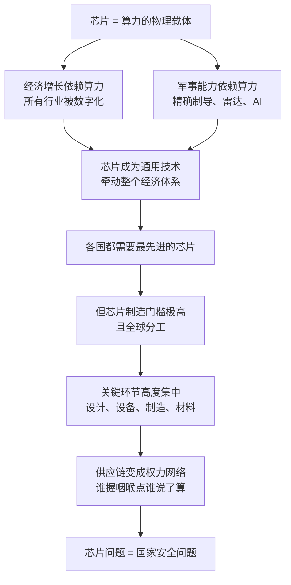

# 01｜为什么一块小小的芯片，能决定大国命运？

> 一块指甲盖大小的硅片，凭什么能左右国家的兴衰与战争的胜负？

---

## 一、先说结论

米勒在《芯片战争》里给出的判断，可以用一句话概括：**芯片是新时代的石油。**

它不只是又一个高科技产业，而是所有产业的基础技术，也是现代军事能力的基础。经济增长要靠算力，国家安全要靠算力，谁能稳定地拿到最先进的芯片，谁就掌握了定义下一个时代的权力。

所以在米勒看来，芯片问题从来不只是生意。它决定国家的命运。

---

## 二、我们先理解一个问题

过去两百年，总有一种东西能定义时代：19 世纪是钢铁，20 世纪是石油。谁掌握了钢铁，谁就能造出铁路、军舰和大炮；谁掌握了石油，谁就能驱动工厂、飞机和坦克。资源在哪里、产能有多少，基本就决定了国家的分量。

那 21 世纪呢？

石油还在，钢铁也还在，但真正决定胜负的东西变了。今天最先进的战斗机，飞不飞得起来取决于芯片；最赚钱的公司，赚不赚钱取决于芯片；一场战争的走向，甚至可能取决于武器里那几百颗芯片。问题就来了：**为什么偏偏是一块小小的芯片，取代了钢铁和石油的位置？**

---

## 三、作者到底提出了什么观点？

米勒的核心观点是：**芯片之所以关键，是因为它同时是经济增长的引擎和军事能力的底座——这两个身份叠在一起，让它从商品变成了权力。**

先说经济。现代经济里几乎所有行业都在被芯片重新定义：手机、汽车、电网、银行、医院、工厂。芯片本身的市场规模并不算大（大约五千多亿美元），但它支撑着几十万亿美元的经济活动。没有芯片，现代社会的地基就会塌掉。

再说军事。这是米勒着墨更多的部分。精确制导、雷达、通信、电子战、无人机——现代战争的每一项核心能力，最终都要折算成算力。一枚导弹能不能打准，一架无人机能不能自己找到目标，靠的都是弹上和机上那些芯片的实时计算。谁的芯片更先进，谁就能用更少的武器打出更大的效果。

而比“芯片重要”更深刻的是米勒的第二个判断：**芯片的权力不在于“拥有”整个产业，而在于“掌握”供应链上的关键节点。** 因为芯片产业被切分成了前所未有的全球分工，每个环节都可能变成卡住别人的咽喉。

---

## 四、把这个观点翻译成人话

打个比方。如果 20 世纪的战争比的是“谁家的钢铁多、石油多”——比的是肌肉和血液；那么 21 世纪的竞争比的是“谁家的眼睛更亮、拳头更准、脑子更快”——比的是神经和大脑。而芯片，就是那个把一切都变成神经和大脑的东西。

再换个说法：芯片产业像一条特别长、特别精密的流水线，长到没有任何一个国家能独自走完。美国擅长设计，中国台湾擅长制造，荷兰造出最关键的机器，日本供应最挑剔的材料。每个国家都只做其中一小段——看起来是分工合作，实际上每个人手里都攥着别人的一小段命脉。

**这就是“小芯片、大权力”的全部秘密：东西越小，越容易被少数人垄断；链条越长，越容易被单点卡住。**

---

## 五、为什么会这样？

把米勒的推理拆成链条，大致是这样的：

这条链条里最关键的一步，是 **F → G**。

芯片制造为什么门槛极高？因为它要求在一个指甲盖大小的地方，刻出上百亿个晶体管，每个结构的尺寸以纳米计。这需要人类最精密的机器、最纯净的材料、最复杂的软件，以及几十年积累的工艺经验。这些东西不可能被任何一个国家在短期内补齐。

门槛高，就必然带来集中：全世界最先进的光刻机只有一家公司能造，最先进的制造只有少数几家工厂能做，最核心的设计软件只有几家公司能提供。**当一门生意的关键环节少到用一只手数得过来时，它就不再是生意，而是权力。**

---

## 六、举一个现实生活中的例子

拿起你的手机，把它想象成一趟环球旅行的终点站。

它大脑里的处理器，设计图是在美国画的；制造它的是中国台湾的工厂；工厂里那台最关键的光刻机，来自荷兰；刻电路用的特种化学品和硅片，很多来自日本；存储数据的存储器，很可能来自韩国。而整台手机最后是在中国组装的，卖到了你手上。

也就是说，**一部手机的正常运转，依赖着至少五六个国家和地区之间的默契。** 如果其中任何一环出问题，这部手机就可能造不出来——它不是某个天才的发明，而是一整张全球网络的产物。

米勒想让我们看到的正是这一点：这条链条平时看不见，但它决定了你的手机能不能买到、工厂能不能开工、汽车能不能下线。**当一条链条能决定这么多事情的时候，握着链条关键环节的人，就握住了别人的命门。**

---

## 七、回到书中重新理解

现在再回看《芯片战争》这个书名，就顺了。

米勒写的是历史：从 1947 年贝尔实验室发明晶体管，到冷战时期的导弹竞赛，再到日本崛起、韩国追赶、台积电诞生、中国入场。但这些历史拼在一起，讲的其实是同一件事——**谁掌握了芯片，谁就掌握了时代的杠杆；而杠杆是会换手的。**

他花了很多篇幅讲那些“换手时刻”：日本在 1980 年代靠存储器把美国逼到墙角；美国随后靠微处理器和 PC 生态反击；韩国用逆周期豪赌接过存储器王座；中国台湾靠代工模式成为全世界的制造中心。每一次换手，都伴随着国家命运的起落。

所以书名里的“战争”，不是修辞。米勒认为，围绕芯片的竞争就是大国竞争的主战场——它决定了未来几十年，谁能制定规则，谁只能适应规则。

---

## 八、这个观点背后还有什么？

**第一，它有一个隐含前提：算力会持续定义能力。** 米勒的整套论证建立在“算力越多，能力越强”这个假设上——经济是这样，军事也是这样。如果哪一天算力的边际价值突然下降，这个框架就会松动。

**第二，“小芯片”与“大权力”之间靠的是“不可替代性”。** 芯片之所以能撬动大国关系，不是因为值钱，而是因为短期找不到替代。石油可以从别的国家买，但最先进的光刻机全世界只有一家能造——这种“不可替代”才是权力的真正来源。

**第三，它把相互依赖变成了双刃剑。** 全球化分工让效率最大化，但也让所有人互相握有筹码：美国能卡中国的芯片，中国台湾能卡全世界的产能，日本能卡材料。依赖越深，和平时期越稳定，冲突时期越危险。

**第四，它解释了一个反直觉现象：** 为什么一个几千亿美元规模的产业，能牵动几十万亿美元的经济和整个国际秩序？因为芯片不在产业链的某一个位置，它在所有产业链的底部。

---

## 九、这个观点有问题吗？

米勒的框架有很强的解释力，但也需要放在争议里检验。

**有说服力的地方：** “算力即国力”这条线在过去几十年被反复验证——从海湾战争到乌克兰战场，从日本崛起到韩国超车，芯片确实是那些转折点背后的共同变量。把芯片放回历史叙事里，很多看似孤立的事件就串起来了。

**存在争议的地方：** 一些学者认为，米勒可能高估了技术的决定作用，低估了制度、市场与人的因素。同样拿到了技术和设备，不同国家的结局差异极大——说明“有芯片”不等于“会用芯片”。也有经济史研究者提醒，把芯片类比为“石油”可能过度简化：石油是消耗品，芯片是不断迭代的技术体系，两者的权力逻辑并不相同。

**还有一层争议关于因果：** 是芯片优势带来了国家优势，还是国家优势带来了芯片优势？美国当年的领先，离不开它庞大的市场和军费；今天各国的追赶，也不只靠产业政策。把芯片单独拎出来当成“终极变量”，有可能把复杂的历史简化成一条因果链。

**所以更准确的表述也许是：** 芯片不是决定国家命运的唯一因素，但它是这个时代最灵敏的“晴雨表”和最重要的“杠杆”之一——看懂它，就多了一把理解大国博弈的钥匙。

---

## 十、今天再看这个观点

**以下是基于米勒思想的现代延伸，不是作者原话：**

《芯片战争》出版于 2022 年，此后的世界几乎按着它的剧本继续演进：美国在 2022 年 10 月出台了史上最严的芯片出口管制，又对 AI 芯片层层加码；各国政府争相补贴本土制造；“算力”成了和土地、能源并列的国家战略资源。

如果米勒的框架成立，那么接下来值得关注的就不只是“谁的芯片更快”，而是三个更根本的问题：谁掌握着不可替代的环节？这些环节有没有可能被替代？以及，当所有人都开始为“被卡脖子”做准备时，全球分工的信任基础还剩多少？

米勒在书里没有给出乐观的答案。他反复提醒的是：这条供应链让世界彼此相连，也让世界彼此握有武器。

---

## 十一、这一篇真正应该记住什么？

1. **芯片是新时代的石油。** 它不只是商品，而是经济增长与军事能力的共同底座，所以芯片问题从来不只是生意。

2. **权力的来源是“咽喉点”，不是“产业链”。** 不必拥有整条链，只要垄断其中不可替代的环节，就能卡住所有人。

3. **门槛高必然带来集中。** 纳米级的制造难度，把关键环节压缩到少数玩家手里，而集中就意味着权力。

4. **相互依赖是双刃剑。** 分工让和平时期更繁荣，也让冲突时期更危险——每一段依赖都是潜在的筹码。

5. **芯片是理解大国博弈的钥匙，但不是唯一的变量。** 技术与制度、市场、人的选择共同决定结局，不宜把芯片当成唯一答案。

---

## 十二、留一个问题

> 如果芯片的权力来自“不可替代”，那么对追赶者来说，真正的目标应该是“造出一样的芯片”，还是“让别人的芯片变得不再不可替代”？
> 这两条路，会通向完全不同的未来。

---

**下一篇**：要理解这场战争，得先回到起点——晶体管是怎么被发明出来的？为什么这个 20 世纪最重要的发明，诞生在战争的阴影里？下一篇，我们从二战中一只过热的真空管说起。
