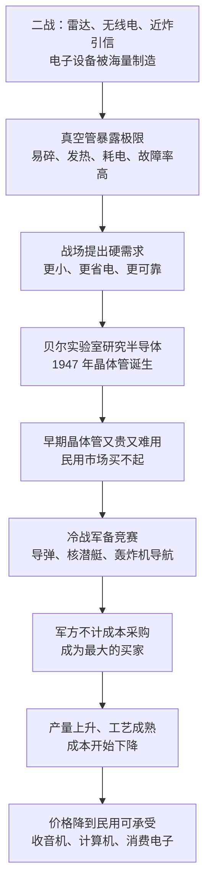

# 02｜晶体管：20 世纪最重要的发明，为什么诞生在战争的阴影里？

> 一个被称为 20 世纪最重要发明的器件，为什么它的第一推动力不是商业，而是战争？

---

## 一、先说结论

米勒在《芯片战争》里给出的答案很直接：**晶体管的诞生与早期成长，是被军方需求喂养出来的。**

二战中的雷达与近炸引信，把真空管的毛病推到了无法忍受的地步——易碎、发热、耗电、动不动就烧坏；战后的冷战导弹竞赛，又提供了一个几乎不计成本的买家。**先有战争提出的硬需求，才有 1947 年那个小小的器件；先有军方的订单，才有这条产业链的第一桶金。**

所以在米勒的叙述里，晶体管不是一个被市场发现的天才发明，而是一个被战场催出来的解决方案。

---

## 二、我们先理解一个问题

要理解这件事，得先知道在晶体管出现之前，电子设备靠什么工作。

答案是真空管。它是一个玻璃管，内部抽成真空，靠灯丝加热来发射电子，从而放大信号、开关电流。收音机、无线电、雷达，全都靠它。问题是它非常娇气：玻璃外壳一碰就碎，灯丝必须一直烧着，发热大、耗电多，用不了多久就会坏。

在和平年代，这些只是“不方便”；在战争年代，这些就是“要命”。

二战把电子设备的需求量推到了前所未有的高度：雷达要装到军舰、飞机和海岸线上，无线电要配到每一支部队，炮弹里还要塞进一个小小的引信。这些设备不是几十台，而是几万台、几十万台地造出来。

于是问题就来了：**当一个国家的胜负，被系在一种动不动就烧坏的玻璃管上时，会发生什么？**

---

## 三、作者到底提出了什么观点？

米勒的观点可以拆成三层。

第一层，**战争暴露了真空管的物理极限。** 雷达需要长时间连续工作，真空管一坏，屏幕就是一片空白；近炸引信要在炮弹发射的瞬间承受巨大的冲击力，还要小到能塞进弹体——真空管几乎被逼到了物理上不可能的位置。米勒认为，正是这种“必须换掉它”的紧迫感，把寻找固态器件从一项学术兴趣变成了国家级任务。

第二层，**晶体管的诞生带着明确的军方背景。** 1947 年 12 月，贝尔实验室的巴丁和布拉顿演示了第一个点接触晶体管，肖克利随后发明了结型晶体管，三人后来共享 1956 年诺贝尔物理学奖。这不是象牙塔里的一次灵光一现：贝尔实验室在战时就深度参与过雷达、反潜等军事研究，对半导体材料的兴趣与战时的技术积累直接相关，战后的军方合同又为它提供了稳定的研究资金。

第三层，也是最关键的一层：**真正让晶体管从“实验室里的珍品”变成“能买到的商品”的，是冷战初期的军方采购。** 刚诞生的晶体管又贵又难用，可靠性甚至不如成熟的真空管，普通消费者根本不会买。但军方愿意买——民兵导弹、核潜艇、轰炸机的导航系统，全都需要更小、更省电、更可靠的电子设备。米勒的判断是：**在商业市场还不存在的年代，是军方替整个产业支付了学费。**

---

## 四、把这个观点翻译成人话

用一句话说：**晶体管不是被消费者买出来的，是被军队订出来的。**

正常的商业逻辑是“先有便宜好用的产品，再有人买”。但颠覆性技术的早期恰恰相反：它一定又贵又差，只有愿意为性能付天价的客户才会掏钱。在那个年代，这样的客户只有一个——军队。

军队买东西的逻辑和消费者完全不同。消费者问“多少钱”，军队问“能不能用”：能不能在导弹的震动里活下来，能不能在潜艇里少耗一点电，能不能连续工作几千小时不坏。**这种客户会主动抬高技术门槛，而不是压低价**。

所以早期晶体管走的是一条“军规路线”：性能优先、可靠优先、价格靠后。这看起来很反市场，但它恰恰是产业的第一级台阶——先有一批不计成本的订单，把产量拉起来、把工艺磨出来，成本才会慢慢降下去，最后才轮到民用市场接手。

---

## 五、为什么会这样？

把米勒的推理串成一条链：

这条链条里最关键的一步是 **E → F**。

如果没有 F，晶体管很可能会在实验室里躺上很多年：它的性能优势没人否认，但没人愿意为一个又贵又不可靠的东西付钱。冷战把这个问题解决了——它提供了一种特殊的市场：需求明确、规模庞大、对价格不敏感。**这个市场不存在于任何商业计划书里，它只存在于国防预算里。**

---

## 六、举一个现实生活中的例子

最能说明“真空管极限”的，是二战中的近炸引信。

传统炮弹要命中目标时才会爆炸，而近炸引信让炮弹在靠近目标时自己引爆，威力成倍提升。它靠什么判断距离？靠一套微型电子电路——也就是说，**要在一枚被大炮打出去的炮弹里，装进一只电子管。** 它必须承受发射瞬间的巨大冲击，必须小到能塞进弹体，还必须在飞出炮口后立刻可靠地工作。

这是真空管最极端、也最荒谬的处境：一只靠玻璃和灯丝工作的器件，被要求在一枚炮弹里完成精密的电子计算。

雷达的处境类似，只是规模更大。一部雷达里要用到数以百计的真空管，而且需要连续工作几个小时甚至更久。只要其中一只烧掉，整部雷达就瞎了。在战场上，这意味着失去预警、失去瞄准。

另一个常被拿来做对照的例子是 1946 年诞生的 ENIAC：这台计算机用了大约 18000 只电子管，重约 30 吨，占满一个大房间，而且几乎每隔一段时间就要坏掉几只管子，需要人不停地更换。它的算力放到今天是微不足道的。**这不是某一台机器的极限，而是一个器件的极限——当你的系统必须由一万八千个易碎品组成时，它就永远不可能可靠。**

---

## 七、回到书中重新理解

米勒讲这段历史，重点不在“谁先发明了什么”，而在于：**一个国家的需求，如何塑造了一个产业的性格。**

军方不是一个普通的客户。它定义规格，承担风险，用长期合同给企业确定性。企业因此敢建产线、敢招人、敢在看不到市场的时候投入研发。**换句话说，军方不只是买了产品，它还买了时间。**

这也是理解整本书的一把钥匙。在这之后，国家的手一次又一次出现在芯片产业的关键转折处：日本用产业政策组织企业联合攻关，韩国用国家信用为企业下注，中国台湾用政府资金扶起最初的制造厂，中国大陆用产业基金补短板。它们的手段不同，但逻辑和 1947 年的那份军方订单是同一个：**在市场还没准备好之前，先由国家的钱把产业推上去。**

---

## 八、这个观点背后还有什么？

**第一，它揭示了一个反直觉的规律：颠覆性技术往往先由“不在乎价格”的客户养活。** 因为新技术的早期必然又贵又差，只有特殊需求的客户才会买单。

**第二，采购的方向会决定技术的方向。** 军方要的是性能、可靠和轻小，早期晶体管就朝这个方向演化；如果最早的客户是消费电子，产业的路线图可能会完全不同。

**第三，需求不只是钱，还是“确定性”。** 一份多年的采购合同，能让企业做出十年期的投资决策，而这种确定性在纯粹的市场里很难得到。

**第四，它也埋下了一个长期问题。** 如果产业的第一推动力来自国家，那么产业的方向就会被国家安全逻辑牵引——这既是早期成功的秘诀，也是后来一切管制与博弈的源头。

---

## 九、这个观点有问题吗？

米勒的这条线索有很强的解释力，但也需要被放进争议里检验。

**说服力强的地方：** 时间线高度吻合。晶体管诞生在二战结束两年后，商业化起飞在冷战军备竞赛期间，早期最大的买家确实是军方。在商业市场尚不存在的年代，很难想象还有谁能支付这笔学费。

**存在争议的地方：** 一些学者认为，把发明归因于战争，可能夸大了军事的作用。贝尔实验室对半导体材料的研究有自己独立的学术脉络，而且它所属的公司本身也有明确的商业动机——电话交换系统里塞满了真空管，把它们换掉是一笔巨大的生意。军事需求加速了方向，但未必是唯一的原因。

**可能过度简化的地方：** 技术推动与需求拉动往往是互相缠绕的。军方之所以需要小型化，是因为晶体管让人们看到小型化是可能的；而晶体管之所以能走向成熟，又是因为军方愿意买。把这条因果链简化成“战争催生了晶体管”，会掩盖很多中间的互动。

**还有一层因果上的疑问：** 同样面对战争压力，为什么是美国而不是别的国家先做出了晶体管？这说明除了需求，还需要一批懂固体物理的科学家、愿意长期投入的大企业，以及一套把战时科研组织方式延续下来的制度。**需求解释了“为什么必须做”，但解释不了“为什么只有他做出来了”。**

**所以更准确的表述也许是：** 战争不是晶体管的发明者，而是它的第一批客户和加速器——它决定了这项技术往哪个方向跑，以及跑得多快。

---

## 十、今天再看这个观点

**以下是基于米勒思想的现代延伸，不是作者原话：**

《芯片战争》出版于 2022 年。今天，“第一个客户”的问题并没有消失，只是换了主角：最先进的算力最先被谁买走？各国政府为什么愿意为一座晶圆厂掏出巨额补贴？答案里都藏着同一个逻辑——**在最先进的技术还没有形成稳定市场时，先由国家或准国家需求把它养起来。**

于是出现了一个值得警惕的循环：技术越关键，国家越愿意买单；国家越买单，技术就越被国家安全逻辑定义。米勒在书里没有明说这一点的终局，但他反复展示的是：芯片产业从诞生第一天起，就从来没有离开过国家的影子。

---

## 十一、这一篇真正应该记住什么？

1. **半导体的第一推动力是战争，不是商业。** 二战暴露了真空管的极限，冷战提供了不计成本的订单。
2. **颠覆性技术的早期，需要一个不在乎价格的客户。** 在新技术的成本还没降下来之前，只有特殊需求愿意买单。
3. **需求不只给钱，还定方向。** 军方要的可靠、轻小、省电，塑造了早期晶体管的技术路线。
4. **国家的角色不是例外，而是常态。** 从 1947 年的军方合同到后来的各国产业政策，逻辑一脉相承。
5. **需求解释了紧迫性，但解释不了全部。** 同样的压力下只有美国做成了，说明人才、企业与制度同样关键。

---

## 十二、留一个问题

> 如果一项技术的第一个客户是国家，而它的第二个客户才是普通人，那么这项技术的“性格”，最终会由谁来决定？

---

**下一篇**：晶体管诞生了，但把它变成一门生意的，并不是发明它的那位诺贝尔奖得主——而是八个决定集体离开自己老板的年轻人。下一次，我们去看硅谷是怎么从一场“叛逃”里长出来的。
