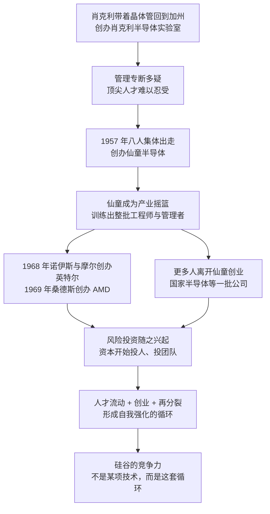

# 03｜硅谷是怎么长出来的？——八个“叛徒”与一场人才叛逃

> 为什么硅谷不是诞生在某间实验室里，而是诞生在一次次“叛逃”里？

---

## 一、先说结论

米勒的答案听上去有点反常识：**硅谷真正的竞争力不是某项技术，而是一种允许甚至鼓励“背叛”的生态。**

故事的开头很戏剧化：肖克利把晶体管带回了加州，也把一种让人难以忍受的管理方式带了过去；八个年轻人集体出走，创办了仙童半导体。从这家公司开始，“人才流动—创业—再分裂”变成一个不断重复的循环，硅谷就是在这个循环里长出来的。

**技术可以被一个人带回来，但产业只能由一群人不断离开旧公司、创办新公司才能长出来。**

---

## 二、我们先理解一个问题

我们通常以为，一项颠覆性技术出现之后，产业中心会自然出现在发明它的地方。

按这个逻辑，半导体的中心本该在贝尔实验室所在的美国东海岸。但历史给出的答案是加州的一片果园和郊区——后来被叫作硅谷。而把晶体管带到那里的，恰恰是发明者之一肖克利。

问题就来了：**肖克利既带来了技术，又带来了人才，为什么他自己没有成为硅谷的中心？**

答案有点尴尬：因为他把最有才华的那批人，一个一个逼走了。

---

## 三、作者到底提出了什么观点？

米勒的观点可以拆成三层。

第一层，**肖克利是天才科学家，也是糟糕透顶的管理者。** 他在 1956 年获得诺贝尔奖，是当时半导体领域最有号召力的人；但他管理公司的方式专断、多疑，对下属极度不信任，习惯用怀疑的眼光审视每一个人。对一群顶尖的年轻工程师来说，这比任何技术困难都更难忍受。**他能招到最好的人，却留不住最好的人。**

第二层，**八个人的出走，证明了“人才可以带着知识离开，并且成功”。** 1957 年，诺伊斯、摩尔等八人集体辞职，创办了仙童半导体，后来被史称为“八叛逆”。这件事的意义远超一家新公司：它第一次证明，一群工程师不需要留在原来的实验室里，也能把技术变成生意——**知识是可以被带走的，而且带走之后更值钱。**

第三层，也是最关键的一层：**仙童自己又不断分裂，而这些分裂塑造了整个硅谷。** 1968 年，诺伊斯与摩尔离开仙童创办了英特尔；1969 年，杰里·桑德斯创办了 AMD；国家半导体等一批公司也可以追溯到仙童。与此同时，风险投资文化也随着这批人一起成长起来。米勒的结论是：**硅谷真正生产的东西不是芯片，而是公司——它的核心能力是不断把人和想法重新组合。**

---

## 四、把这个观点翻译成人话

用一句话说：**硅谷不是一棵大树，而是一片会不断分株的竹林。**

传统工业区的结构像一棵大树：一家巨型公司做主干，周围一堆供应商做枝叶。主干倒了，整片林子就枯了。硅谷不是这样，它更像一片靠地下根系不断冒出新笋的竹林——老的竹子上长出新的，新的又长出更新的。

“叛逃”之所以能够反复发生，需要三个条件同时成立：

**第一，知识装在人的脑子里。** 芯片的设计与工艺，很大一部分是经验，不是图纸。人走了，经验就走了。

**第二，资本愿意投人，而不是只投厂房。** 有了风险投资，几个工程师带着一份计划书就能拿到钱，不必先去求一家大公司收留。

**第三，跳槽与创业的成本足够低。** 如果一家公司能用合同和诉讼把员工锁死，“叛逃”就只能是个别事件，不会变成一种生态。

三个条件凑齐，就有了一个自我强化的循环：**人离开大公司，带走经验，创办新公司，再把新公司变成下一代人的培训场。** 循环转得越快，生态越强。

---

## 五、为什么会这样？

把米勒的推理串成一条链：

这条链条里最关键的一步是 **G → H**。

风险投资的加入，把“个人选择”变成了“产业机制”。在这之前，一个工程师离开大公司，多半只能去另一家大公司；在这之后，离开本身就成了一条创业路径。**当离开的成本足够低、回报足够高时，流动性就变成了竞争力。**

---

## 六、举一个现实生活中的例子

最有说服力的证据，是仙童的“族谱”。

仙童半导体本身并不算长寿，它后来的命运也谈不上辉煌。但把它当成一棵树来看，会发现半个硅谷都是从它身上分出去的：1968 年诺伊斯与摩尔创办英特尔，1969 年桑德斯创办 AMD，国家半导体等一批公司也都可以追溯到同一批人。换句话说，**这一家公司几乎没有成为最后的赢家，却成了整个产业的母体。**

更值得注意的是这些人之间的关系。他们不是靠一份保密协议聚在一起的，而是靠同乡、同事、同学、前同事的网络。今天一家公司的技术骨干，明天可能就是隔壁新公司的创始人；竞争归竞争，人和人之间的通道始终是开着的。米勒反复强调的是：**这种“既是同事又是对手”的关系，才是硅谷最独特的产品。**

对照的另一面是肖克利本人。他拿到了科学界的最高荣誉，却在几十年里众叛亲离：最优秀的人不愿意跟着他工作，后来的公开言论又让他与主流学界彻底疏远。**一个人可以凭天才赢得诺贝尔奖，却无法凭天才建立一个产业。** 米勒用这组对照想说明的不是“谁对谁错”，而是一个更冷静的事实：产业需要的是能让人留下来的环境，而不是最聪明的那颗大脑。

---

## 七、回到书中重新理解

放在整本书里看，“人才流动”是米勒反复使用的变量。

英特尔、AMD 从仙童分裂出来，是第一次；后来台湾的半导体产业，靠的是一批从美国回来的工程师；中国大陆的中芯国际，起步时也是一群海外归来的从业者；韩国在追赶存储器时，同样从美国挖回了大量人才。**这些事件的形态不同，但内核是同一个：产业能力是跟着人走的。**

所以米勒对硅谷的解释，本质上是对“制度优势”的解释。他不认为硅谷赢在某项发明上——晶体管不是它发明的，集成电路也不是它发明的。硅谷赢在它把“背叛”这件事正常化、合法化，甚至资本化了。**在一个不鼓励流动的体系里，技术会留在公司里；在一个鼓励流动的体系里，技术会留在产业里。**

---

## 八、这个观点背后还有什么？

**第一，它有一个隐含前提：知识是可以被携带的。** 当技术主要藏在人的经验里时，人才流动的威力最大。反过来，如果技术主要锁在设备、材料与产线里，把一队人挖走的效果就会大打折扣——这也解释了为什么在芯片业里，设计与人才的关系更紧密，而制造的迁移要困难得多。

**第二，它需要资本市场的配合。** 没有风险投资，“叛逃”只能变成跳槽；有了风险投资，跳槽才能变成创业。**资本是这场流动的加速器。**

**第三，它需要法律与文化的默许。** 加州的法律传统并不鼓励把员工长期锁在一家公司里，这让跳槽与创业的成本大大降低。制度不是背景，制度是条件之一。

**第四，它也解释了硅谷的一种代价。** 这种生态让公司很难长期积累：员工流动得太快，一家公司可能刚把技术做出来，人就被挖走了。仙童自己就是最典型的受害者——**它培养出了半个硅谷，却没能保住自己。**

---

## 九、这个观点有问题吗？

米勒这条线索很有解释力，但也不是全部答案。

**说服力强的地方：** 仙童的族谱是可以一条条数出来的，人才流动与创业密度之间的相关性也显而易见。硅谷的许多公司确实是“前同事创办的”，这不是修辞。

**存在争议的地方：** 一些学者认为，把硅谷的成功主要归因于“叛逃文化”，忽略了另外几个同等重要的条件：冷战时期涌入西海岸的国防订单、斯坦福等大学与产业之间的紧密联系、战后宽松的移民环境，以及风险资本本身的制度创新。换句话说，**不是只有“允许离开”，而是“有人愿意接住离开的人”。**

**可能过度简化的地方：** 我们看到的族谱是一份成功者名单。同样从大公司出走、同样带着好点子的团队，绝大多数都消失了，没有人给他们画族谱。把幸存者的故事当成规律，容易高估“出走”本身的价值。

**关于肖克利的判断，也存在不同解释：** 主流看法把他的管理方式当成八人出走的主因；也有研究者强调技术路线与商业判断上的分歧——他押注的路线与团队想做的方向并不一致。把这段历史简化成“一个好科学家毁在一场脾气上”，未必公平。

**还有一层值得注意的反例：** 日本企业当年靠垂直一体化、终身雇佣与内部培养，也曾在存储器领域把美国逼到墙角。这说明**人才高流动不是成功的唯一路径**，它只是硅谷这条路径的核心机制。

**所以更准确的表述也许是：** 硅谷的优势不是“背叛”本身，而是一整套让背叛变成再投资、让失败可以重来的环境。

---

## 十、今天再看这个观点

**以下是基于米勒思想的现代延伸，不是作者原话：**

《芯片战争》出版于 2022 年。此后的几年里，人才流动已经从公司层面升格为国家层面的竞争：各国争相放宽技术移民、设立产业园区、用补贴吸引工程师回流，大公司则用股权与竞业条款试图把人留住。**“谁能招到人、谁能留住人”，成了产业政策的一部分。**

同时，一个新的反差出现了：在设计环节，几个工程师加一笔投资就可能做出一家新公司；在制造环节，把一队人挖走并不能变出一条产线——先进工厂的产能取决于设备、材料、工艺与良率的长年积累。**这也许正是为什么有些地方能快速复制出设计公司，却复制不出晶圆厂。** 米勒的框架在这里给出的提醒是：当技术越来越多地藏在机器里而不是脑子里时，人才流动的杠杆会变短。

---

## 十一、这一篇真正应该记住什么？

1. **硅谷不是被规划出来的，是从一次次出走里长出来的。** 它的核心能力是不断把人和想法重新组合。
2. **最好的技术，需要能留住人的环境。** 肖克利拿到了诺贝尔奖，却把最优秀的人一个个逼走。
3. **“叛逃”要变成生态，需要三个条件：** 知识可携带、资本愿意投人、跳槽与创业成本足够低。
4. **资本是流动的加速器。** 没有风险投资，出走只能变成跳槽；有了它，出走才能变成创业。
5. **这套模式也有代价。** 公司难以长期积累，最典型的例子是仙童自己——它培养出半个硅谷，却没能保住自己。

---

## 十二、留一个问题

> 如果生态的关键是“允许离开”，那么一个不允许离开的体系，能不能靠砸更多的钱，造出一个同样有活力的产业？

---

**下一篇**：人开始流动之后，接下来要解决的是一道更硬的技术难题——如何把成百上千个零件，变成一整块材料。而这道难题的答案，会给整个行业装上一个六十多年都没停过的时钟。
