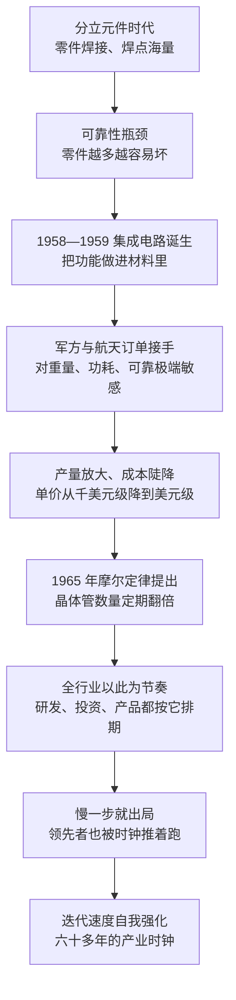

# 04｜集成电路与摩尔定律：为什么芯片业有一个“永不停歇的时钟”？

> 一个行业为什么能在六十多年里保持近乎疯狂的迭代速度，从不减速？

---

## 一、先说结论

米勒给出的答案分两半：**集成电路解决了“怎么造”，摩尔定律解决了“造多快”。**

集成电路做了一件根本性的改变：它把“一堆零件”变成了“一块材料”——功能不再靠焊上去，而是直接长在硅片里。摩尔定律则更进一步，把技术目标变成了全行业的时钟：晶体管数量定期翻倍。**它既是预测，也是一份自我实现的军令状——整个产业被它推着跑，慢一步就可能出局。**

---

## 二、我们先理解一个问题

在集成电路出现之前，电子设备是“零件拼装”出来的：把晶体管、电阻、电容一个一个焊到电路板上，再用细导线连起来。工程师们把这种困境叫作“数字暴政”——**零件越多，焊点越多，整机越容易坏。**

一台大型电子设备里可能有几十万个焊点。任何一个焊点虚接，整机就罢工；而查出一个坏焊点，可能要花上几天。这意味着电子系统的规模越大，可靠性反而越低。你可以做出更快的机器，但你不能保证它一直能工作。

于是问题变得非常尖锐：**如果系统的复杂度继续增长，电子工业会不会撞上一堵墙——造得出，但用不住？**

---

## 三、作者到底提出了什么观点？

米勒的观点可以拆成三层。

第一层，**集成电路是一次“本体”上的改变。** 1958 年 9 月，德州仪器的杰克·基尔比做出了第一块集成电路：他把多个元件做在同一块半导体材料上，用材料内部的连接代替外部导线。1959 年，仙童的罗伯特·诺伊斯用平面工艺做出了更适合量产的版本，让集成电路从“能做出来”变成“能大量做出来”。两人后来为专利收益打了漫长的官司，最终共享了这份荣誉。**但技术上的分水岭很清楚：零件不再是装上去的，而是被做进材料里的。**

第二层，**军方与航天订单把集成电路从样品推向了量产。** 早期集成电路极其昂贵，第一单的价格是每块约 1000 美元，只有对重量、功耗、可靠性极端敏感的客户才买得起。阿波罗计划就是这样的客户：飞船上的导航计算机必须足够小、足够省电、足够可靠。米勒强调，**是这类订单替产业支付了从样品到量产的过渡成本。**

第三层，也是最关键的一层：**摩尔定律把技术趋势变成了全行业的节奏。** 1965 年，戈登·摩尔发文预测集成电路上的晶体管数量将每年翻倍；1975 年，他把这个判断修正为大约每两年翻倍。米勒认为，这条曲线真正的威力不在于它预测得多准，而在于**整个产业把它当成了时间表**：设备商按它排研发，材料商按它排产能，设计公司按它排产品，客户按它排预算。**当所有人都在同一个时间表上投资时，预测就变成了自我实现。**

---

## 四、把这个观点翻译成人话

打个比方：集成电路之前，电子工业像用砖头盖房子——每块砖都得单独搬运、单独砌上，砖越多，墙越容易塌。集成电路之后，房子直接“长”在一块石头里，结构天然连成一体。

而摩尔定律，是这个行业的发令枪。

它更像一条不断加速的跑步机：**你必须跑得比它快一点点，才不会被甩下去。** 慢一代，你的产品就落后一代；落后一代，客户就走了；客户走了，你就没有钱投下一代。这个循环一旦启动，就没有人能主动喊停。

所以它有两副面孔：对追赶者，它是机会——只要在下一轮翻倍里押对了，就能重新排队；对领先者，它是负担——你已经赚到的钱，必须马上再投进去，才可能保住位置。

---

## 五、为什么会这样？

把米勒的推理串成一条链：

这条链条里最关键的一步是 **F → G**。

摩尔定律并不是物理定律，它没有约束任何人的力量。它之所以有效，是因为它被当成了共同语言：**当一家公司宣布下一代产品要翻倍时，它的供应商、竞争对手和客户都会照着这个预期做决定。** 于是曲线不再只是观察的结果，而变成了所有人合力维持的目标。

---

## 六、举一个现实生活中的例子

最能说明这个时钟威力的，是阿波罗计划。

飞船上的导航计算机必须把一整台计算机塞进飞船，重量、体积和功耗都被压到极限，分立元件根本做不到，只能靠集成电路。有记载称，到 1963 年，麻省理工学院与 NASA 的采购消耗了美国大约 60% 的集成电路产量——**也就是说，当时整个国家的集成电路产出，有六成被一个项目买走了。**

这笔订单的意义不在于金额，而在于它给产业提供了什么：一个规模足够大、要求足够苛刻、时间足够长的客户。价格随之下坠——从 1959 年第一单的每块约 1000 美元，降到 1963 年的 15 美元，再到 1969 年的约 1.58 美元。**十年时间，价格掉了三个数量级。**

这背后就是学习曲线在起作用：产量每翻一番，成本就按一个固定比例下降；成本降下来，新的客户才买得起；新客户带来新的产量，成本再降一轮。**先有量，才有便宜——这就是为什么早期的极端集中订单如此重要。**

作为对照，1971 年英特尔的 4004 处理器上只有 2300 个晶体管；而今天最先进的芯片上，晶体管数量是几百亿个。半个多世纪里，这条曲线一直没有真正停下来。

---

## 七、回到书中重新理解

在米勒的叙述里，摩尔定律是一把尺子——**每一次产业霸权更替，都发生在“谁能跟上节奏”这个问题上。**

日本当年靠质量与量产能力追上了节奏，在存储器上掀翻了美国；韩国在价格暴跌、人人亏损的时候继续借钱建厂，用逆周期投资把自己留在牌桌上；美国则在存储器上掉了队，却在微处理器上重新定义了一个新的节奏。这些故事的细节各不相同，但共同点是：**领先者往往不是被别人打败的，而是被自己过去的成功拖住的。**

所以米勒真正想让我们看到的是：芯片业最独特的地方不是它变化快，而是**它把“变化快”变成了制度**。在这个行业里，稳定不是常态，稳定才是危险信号。

---

## 八、这个观点背后还有什么？

**第一，它有一个隐含前提：物理极限还没到。** 只要晶体管还能继续缩小，成本就还能继续下降，时钟就能继续走。一旦逼近原子尺度的天花板，这条曲线就会被迫变慢。

**第二，摩尔定律的本质是“协调机制”，不只是“预测”。** 它让互不隶属的几百家公司，在同一张时间表上投资。这种共识机制在产业史上极其罕见。

**第三，它和“学习曲线”是一对搭档。** 摩尔定律说的是性能怎么涨，学习曲线说的是成本怎么降。两者叠在一起，才有了“越新越便宜”的反常现象——大多数商品是越旧越便宜，芯片恰恰相反。

**第四，它自带军备竞赛属性。** 领先者必须继续投，追赶者必须投得更多，谁停下来谁出局。**这个行业没有“守住现有市场”这个选项。**

**第五，它也是全球分工的深层原因。** 节奏这么快、投入这么大，没有任何一家公司能独自承担所有环节的技术更新——分工不是选择，而是被时钟逼出来的。

---

## 九、这个观点有问题吗？

米勒这条线索是全书最有解释力的一段，但同样需要检验。

**说服力强的地方：** 六十多年的数据大体吻合。晶体管数量的增长与成本的下降是真实的、可测量的，而产业的研发节奏确实围绕它展开。

**存在争议的地方：** 摩尔定律从来不是自然规律，而是产业约定。一些学者认为，把它当成“定律”来指导决策，会导致系统性误判——所有人都按同一个节奏扩产，结果就是周期性的产能过剩与价格崩盘。存储器的血腥周期就是最典型的例子。

**关于它到底是预测还是目标，学界存在不同解释：** 有人认为它是对技术趋势的事后总结，有人认为它是企业用来协调行业、威慑对手的工具。这个区别很重要——如果是后者，那么“定律”本身就带有自我强化的意图。

**可能过度简化的地方：** 把产业史压缩成一条曲线，会忽略商业模式、政策与市场的作用。日本与韩国的胜利，不是因为它们更懂这条曲线，而是因为它们用了别人不敢用的资本结构与组织方式。

**还有一层正在发生的松动：** 近年来这条曲线的节奏明显不如从前，每一代制程的性能提升幅度和成本下降速度都在收窄，能继续投资先进制程的厂商越来越少。**时钟还在走，但它的每一格都变得更贵了。**

**所以更准确的表述也许是：** 摩尔定律不是芯片业的原因，而是芯片业的共识。它描述了产业的节奏，也塑造了这个节奏——两者互相加固，才让这个行业看起来像上了发条。

---

## 十、今天再看这个观点

**以下是基于米勒思想的现代延伸，不是作者原话：**

《芯片战争》出版于 2022 年。今天，行业的“时钟”正在从晶体管数量转向算力：AI 训练需求被当成新的节奏来源，全行业的投资与产能规划都在围绕它重新排期。

但同时也出现了三种“绕开时钟”的做法：用先进封装把多颗芯片拼在一起、为特定任务设计专用加速器、以及用架构创新替代单纯的尺寸缩小。**这实际上是承认了一件事：单颗芯片的性价比不再自动翻倍，行业必须用别的方式维持速度。**

更值得注意的是价格逻辑的反转：过去是“规模越大越便宜”，现在先进制程每一代的投入都在上涨，规模带来的可能是稀缺而不是便宜。如果这个趋势持续，那么“永不停歇的时钟”这个比喻，也许有一天要改一改——**不是时钟停了，而是每一次滴答都要花更多的钱。**

---

## 十一、这一篇真正应该记住什么？

1. **集成电路把“一堆零件”变成“一块材料”。** 可靠性瓶颈的解法不是把零件做得更好，而是让零件消失。
2. **早期订单替产业支付了从样品到量产的学费。** 阿波罗这类客户的极端要求，正是产业最需要的推力。
3. **摩尔定律不是物理定律，而是行业共识。** 它之所以有效，是因为所有人照着它做决定。
4. **学习曲线解释了“越新越便宜”。** 先有产量，才有成本下降，才有新客户——顺序不能反。
5. **这套机制自带军备竞赛属性。** 领先者必须继续投，追赶者必须投得更多，没有人能靠守成活下来。

---

## 十二、留一个问题

> 如果有一天这个时钟真的慢下来，芯片业会像钢铁一样变成一门普通的传统工业，还是会找到一种新的节奏，重新给自己上发条？

---

**下一篇**：这个时钟越走越快，也越走越贵——贵到没有任何一家公司能独自承担全部环节。于是，一个前所未有的产业形态出现了：有人只画图，有人只制造。下一次，我们去看芯片业为什么从“一家公司全包”变成了全球分工。
