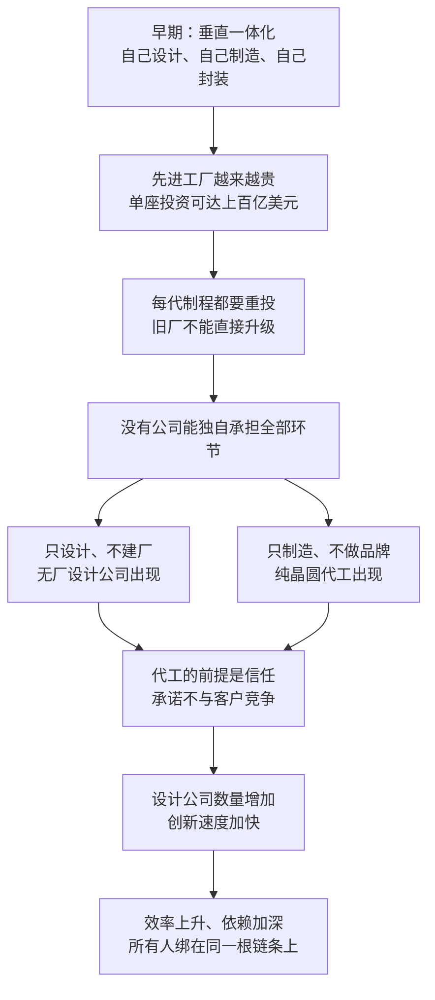

# 05｜芯片为什么从“一家公司全包”变成“全球分工”？

> 一个行业为什么会从自己设计、自己制造、自己封装，走向设计、制造、设备各管一段的全球分工？

---

## 一、先说结论

米勒给出的解释很朴素：**分工不是被规划出来的，是被成本和技术逼出来的。**

早期半导体公司都是“全能选手”：自己设计、自己制造、自己封装，也就是所谓的垂直一体化。但一座先进工厂的投资会涨到上百亿美元，而且每一代制程都要重新投一次——**当门槛高到没有一家公司能独自承担时，“只设计不建厂”和“只代工不设计”就会同时出现，因为它们互为前提。**

分工带来了效率，也把所有人绑上了同一根链条：你不需要自己拥有工厂，但你从此必须依赖别人的工厂。

---

## 二、我们先理解一个问题

先问一个看起来很简单的问题：为什么早期的芯片公司什么都自己做？

因为那时候没有别的选择。设计工具不成熟，工艺要靠自己摸索，设备与材料也大多得自己想办法；客户是军方和整机厂，他们要的是一个能交付的完整方案，而不是一份设计文件。于是公司只能把整条链握在自己手里——**这不是战略选择，而是当时唯一可行的做法。**

而且这种模式有它自己的道理：设计与制造在同一个屋檐下，改一版设计、试一炉片子、调一次参数，都只是隔壁部门的事。速度更快，磨合更好，质量更容易控制。

所以真正的问题是：**既然垂直一体化这么好，为什么它最后还是撑不住了？**

---

## 三、作者到底提出了什么观点？

米勒的观点可以拆成三层。

第一层，**成本把垂直一体化逼到了墙角。** 一座先进晶圆厂的投资可以达到上百亿美元，而且它不是一次性的：每一代制程都要求新的设备、新的工艺、新的厂房条件，旧厂不能直接升级，只能再建。对一家公司来说，这意味着它必须同时负担研发、建厂与市场开拓三笔巨额支出——**任何一笔出错，整家公司都可能被拖垮。**

第二层，**专业化让两边都变得更强。** 当设计与制造都复杂到各自需要一整支专家队伍时，同时做两件事就意味着两件事都做不到最好。于是出现了两种新角色：只做设计、不建工厂的“无厂设计公司”，和只做制造、不做自己品牌产品的“纯晶圆代工厂”。1987 年成立的台积电，就是后者的起点。

第三层，也是最关键的一层：**这两件事必须同时发生，缺一不可。** 没有代工厂，设计公司拿着图纸也无处生产；没有成群的设计公司，代工厂的产能也填不满。米勒特别强调，代工模式能够成立，靠的不只是技术能力，还有一份承诺——**永远不与客户竞争**。正因为这份承诺，设计公司才敢把最核心的图纸交出去。**分工的底层，其实是信任。**

---

## 四、把这个观点翻译成人话

用一句话说：**过去每家饭店都得自己种菜、自己磨面、自己酿酒；后来出现了中央厨房，于是餐厅只需要会做菜。**

这个变化的动力不是“分工听起来更先进”，而是**资本门槛**：当一台设备、一座厂房的价格超过任何单个玩家的承受能力时，“共用”就成了唯一的出路。

这也解释了为什么分工出现得这么晚。不是因为大家没想到，而是因为在门槛还不高的时候，自己拥有工厂更划算：**你能控制质量、控制交期、控制成本，还能把工艺优势藏在自己手里。**

顺便说一句，这场变化还伴随着一次观念的崩塌。AMD 创始人杰里·桑德斯说过一句名言：“真正的男人要有晶圆厂。”这句话代表了那个时代的信仰——自己拥有工厂，才算真正做芯片。几十年后，这句话被反复引用，但语气已经变成了自嘲：**不是信仰错了，而是账算不过来了。**

---

## 五、为什么会这样？

把米勒的推理串成一条链：

这条链条里最关键的一步是 **D → E／F**。

D 是整条链的枢纽：门槛一旦超过单个公司的承受能力，产业就必须重新安排角色。而 G 决定了分工能不能稳定——**如果没有“不与客户竞争”的承诺，设计公司永远不会把最好的设计交给一家可能变成对手的工厂。**

---

## 六、举一个现实生活中的例子

最能说明分工效率的，是苹果与台积电的搭配。

苹果做的事情是设计：它定义芯片的架构、性能与规格，画出 A 系列与 M 系列芯片的图纸；制造交给台积电完成。两家公司之间没有品牌竞争——苹果不做代工生意，台积电也不做自己的芯片品牌。**一家只画图，一家只制造，各自把资源集中在自己最擅长的那一段。**

这个组合带来的好处是双向的：苹果不需要为芯片制造投入巨额资本，也不必担心产能利用率；台积电则拿到了世界上最稳定、最舍得花钱的客户之一，可以用这笔收入继续投下一代制程。**分工让双方都变得更快、更专注。**

对照的另一面，是“真正的男人要有晶圆厂”那句话背后的世界。曾经，拥有自己的工厂是一种身份象征，也是技术能力的证明。但后来发生的事很残酷：一批重资产的半导体公司陆续退出制造、出售工厂，或者干脆不再自己生产；而一批没有工厂的公司，反而成了行业里最赚钱的玩家。米勒用这组对照想说明的不是谁更高明，而是一个冷冰冰的规律：**当资本门槛改变时，观念会被账本改写。**

---

## 七、回到书中重新理解

在米勒的整本书里，分工不是产业史的插曲，而是理解地缘政治的前提。

正因为产业被切成了设计、制造、设备、材料、封装这些段落，每一段又会因为规模经济而集中在少数地方，供应链上才会出现一个又一个“咽喉点”。**分工越彻底，集中度越高，可被卡住的位置就越具体。** 这条线索一路通向两个后果：一是台湾的制造产能变成全球都睡不着的焦点，二是管制可以精准地指向某一段而不是整个行业。

换句话说，米勒讲分工，表面上是在讲成本和效率，实际上是在解释：**为什么一条商业供应链会变成一件政治工具。**

---

## 八、这个观点背后还有什么？

**第一，它有一个隐含前提：环节之间可以被清楚地切开。** 设计可以用文件交付，制造可以用订单交付，但两者之间的接口——工艺参数、设计规则、良率数据——需要极深的协作。所以分工不等于疏远，**它要求的信任反而更高。**

**第二，它改变了竞争的性质。** 当设计和制造都能外购时，竞争从“谁的产品更好”变成“谁的生态更强”。一家设计公司可以没有工厂，但它离不开软件、指令集和代工产能，这些平台型环节的赢家往往通吃。

**第三，它重新分配了风险。** 无厂公司承担市场风险——卖不动就完了；代工厂承担资本与产能风险——产能空转就是巨额折旧。**谁的议价能力强，取决于稀缺握在谁手里。**

**第四，它让政策变得很难执行。** 一家公司的产品可能在美国设计、在中国台湾制造、在东南亚封装，任何单点干预都会牵动整条链——这正是后来所有管制与反制都如此复杂的原因。

---

## 九、这个观点有问题吗？

米勒这条线索很扎实，但仍要放进争议里看。

**说服力强的地方：** 资本门槛与专业化是看得见的事实，先进工厂的投资规模与代工模式的兴起在时间上高度吻合，苹果与台积电的搭配也证明了分工的效率。

**存在争议的地方：** 分工并非不可逆。一些学者认为，成本优势是有阶段性的，当运输、关税与地缘风险上升时，垂直一体化会重新变得有吸引力——近年来各国补贴本土制造、企业要求供应商就近生产，都是回摆的信号。**换句话说，分工可能是特定条件下的最优解，而不是终局。**

**可能过度简化的地方：** 把分工说成“成本逼出来的必然”，会忽略制度条件。代工模式能成立，需要知识产权保护、稳定的贸易环境，以及一套让客户相信“图纸不会被挪用”的商业伦理。这些东西不是账本能算出来的，但它们一旦受损，分工的收益会迅速缩水。

**还需要补充的一点是：** 垂直一体化并没有消失。存储器厂商、部分模拟与功率器件公司，仍然坚持自己设计、自己制造，因为在那些领域，工艺本身就是竞争力。**这说明分工是主流趋势，但不是唯一答案。**

**所以更准确的表述也许是：** 分工不是产业进化的终点，而是资本、技术与信任三者达成的一次阶段性平衡——三者中任何一个变了，平衡就会重新调整。

---

## 十、今天再看这个观点

**以下是基于米勒思想的现代延伸，不是作者原话：**

《芯片战争》出版于 2022 年。今天，各国都在做同一件事：给分工买保险。补贴本土建厂、要求关键环节留在境内、鼓励供应商多元化——这些政策的共同假设是：**效率可以让位给安全。**

但这里有一个很难绕过的矛盾：先进工厂的资本门槛只升不降，而单靠一个国家的市场需求，很难支撑一整条完整链条的产能利用率。于是出现了一种奇怪的组合：**分工还在继续，信任却在下降。** 链条没有被切断，但链条上的每一段都在为最坏的情况做准备——多备库存、多签长约、多找备份供应商。

这也许正是米勒想提醒的：分工把世界连在一起，也把世界锁在一起。你可以选择不再依赖别人，但代价是，你必须自己承担那些原本由别人分摊的巨额成本。

---

## 十一、这一篇真正应该记住什么？

1. **分工是被资本门槛逼出来的，不是被规划出来的。** 当一座工厂贵到没人能独自承担，角色就必须重新划分。
2. **“只设计”和“只代工”是一对孪生兄弟。** 缺了任何一方，另一方都活不下去。
3. **分工的底层是信任，不是合同。** 代工模式能成立，靠的是“不与客户竞争”这份承诺。
4. **分工提升了效率，也创造了脆弱性。** 效率越高、冗余越少，单点出问题的代价就越大。
5. **一体化没有消失，只是退到了特定领域。** 在工艺本身就是竞争力的地方，自己拥有工厂仍然是正确选择。

---

## 十二、留一个问题

> 如果分工是由资本门槛逼出来的，那么当政府愿意替企业承担这道门槛时，分工会被逆转，还是会被重新排列成另一种样子？

---

**下一篇**：分工把产业切成了许多段，但每一段并不一样重——有些环节价值不高，却能让整条链停摆。下一次，我们去数一数，一条芯片供应链上到底藏着多少个“卡脖子”的节点。
