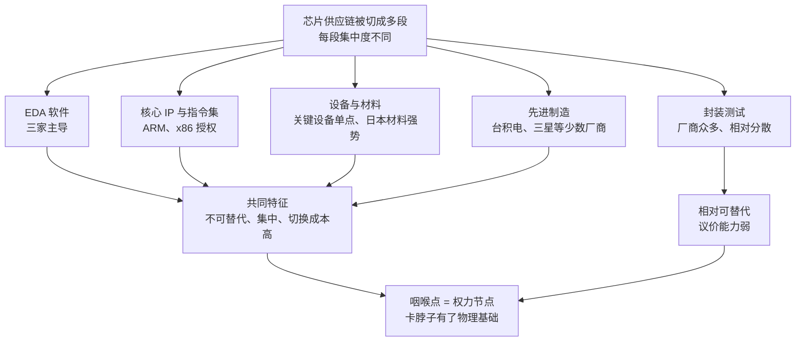

# 06｜一条芯片供应链上，藏着多少个“卡脖子”的节点？

> 一条平时看不见的供应链，为什么能变成大国博弈的武器库？

---

## 一、先说结论

米勒的回答可以概括成一句话：**芯片供应链是史上最复杂的分工，但它的复杂度并不均匀。**

有些环节有几十上百家供应商，谁都能替换；有些环节只有两三家，甚至只有一家能做——设计软件、核心指令集、关键设备、特种材料、先进制造，几乎都挤在少数玩家手里。**谁握住这些“咽喉点”，谁就握住了别人的命门。** 这就是“卡脖子”的物理基础：它不是一句政治口号，而是一张可以用零件和公司名字画出来的地图。

---

## 二、我们先理解一个问题

我们通常的直觉是：越贵的东西越重要。

但 2020 年到 2021 年发生的事，把这个直觉推翻了。那两年，全球多家车企被迫停产减产，原因不是缺钢材、缺发动机、缺轮胎，而是缺一颗几美元的芯片。**一辆价值几万美元的汽车，被一颗几美元的零件卡住了。**

更反常识的是：缺的还不是最先进的芯片。车企缺的主要是微控制器，多数用的是几十纳米级的成熟制程——技术上属于行业里的“老工艺”，谈不上尖端。

于是问题就来了：**为什么供应链上的权力，跟它的技术先进程度、跟它的价格，都不成正比？**

---

## 三、作者到底提出了什么观点？

米勒的观点可以拆成三层。

第一层，**供应链可以被切成很多段，而每一段的集中度完全不同。** 有的段落高度分散，比如封装测试，全球有一大批厂商，客户随时可以换；有的段落高度集中，比如芯片设计必需的 EDA 软件，长期由新思科技、楷登电子、西门子 EDA 三家主导。**集中度不一样，议价能力就不一样。**

第二层，**决定权力大小的不是价值，而是“不可替代性”。** 米勒反复展示的一个规律是：最容易被卡住的环节，往往不是最值钱的环节，而是最难被替换的环节。芯片设计还依赖 ARM、x86 这类指令集架构的授权，一旦生态建立起来，更换架构的代价高到几乎不可能；材料端也有类似结构，日本企业在硅片、光刻胶、高纯化学品上占据重要份额。**这些东西的市场规模都不算大，但少了它们，下游全都停摆。**

第三层，也是最关键的一层：**先进制造本身就是一个高度集中的节点。** 全球最先进的芯片制造，集中在台积电、三星等少数厂商手里。这不是偶然：越先进的产能，投资越大、门槛越高、容错越小，能留在牌桌上的玩家就越少。**当某一环少到用一只手数得过来时，它就不再是商业问题，而是战略问题。**

---

## 四、把这个观点翻译成人话

打个比方：芯片供应链像一条很长的高速公路。**路很长，但收费站只有几个。** 谁守着收费站，谁就能让整条路堵住——哪怕他收的钱不多，哪怕他不在路的尽头。

这里的关键不是“谁最有钱”，而是三个很具体的条件：

**第一，有没有第二家。** 如果只有一家能做，这一家就是命门。
**第二，上游有多集中。** 就算有三家，只要它们都在同一个地方、同一套体系里，风险就没有分散。
**第三，切换成本有多高。** 换供应商不是换零件，可能要重新设计、重新验证、重新认证，花上几个月甚至几年。

**所以权力的公式是：不可替代性 × 集中度 × 切换成本。** 三者相乘，才是真正的“卡脖子”强度——这也解释了为什么一颗几美元的芯片能卡住一辆车：它便宜，但它不可替代。

---

## 五、为什么会这样？

把米勒的推理画成一张权力地图：

这张图最值得记住的是 **G**：判断一个环节是不是“咽喉点”，看的不是它的产值，而是那三条标准。凡是三条全中的环节，就是可以在一夜之间改变整条链命运的地方。

---

## 六、举一个现实生活中的例子

先看 2020 年到 2021 年的汽车缺芯。

事情的起点其实很普通：疫情初期车企判断销量会下滑，纷纷削减订单；与此同时，居家办公带动了消费电子需求暴涨，晶圆厂的产能被这些订单填满。等到汽车需求回升，车企回头下单时，排队的位置已经排在别人后面了。

结果是多家车企停产、减产，有的整车厂只能把车造好、缺芯片的部分先空着。行业估计，2021 年全球汽车业因此损失了约 2100 亿美元的收入。**而被缺的芯片，多数只是几美元的微控制器，用的是几十纳米级的成熟制程。**

这件事最有价值的地方，是它同时暴露了三层结构：**第一，产能是有限的、要排队的；第二，成熟制程也会短缺，先进不等于关键；第三，链条上任何一段的挤兑，都会传导到最末端的整车厂。**

再看 EDA 这个“隐形咽喉”。

芯片设计必须用 EDA 软件，而这一行长期由新思科技、楷登电子、西门子 EDA 三家主导。它不生产芯片，不卖机器，也不面向消费者，甚至很多人从没听说过它的名字——**但它站在所有设计的入口。** 任何一款芯片，都要先在这套软件里画出来、验证过，才能进入制造。

EDA 的可怕之处在于它同时满足前面那三条标准：几乎不可替代、上游极度集中、切换成本高到无法承受。一家设计公司可以换代工厂，但要换掉整套设计软件，等于推倒重来，而且新软件的工艺库未必跟得上。**这就是“隐形咽喉”的含义：你平时看不见它，但你每一条路都要经过它。**

---

## 七、回到书中重新理解

现在再理解米勒为什么把书名定为“战争”，就顺了。

他讲的不是某一国的阴谋，而是一张客观存在的结构图：**供应链的复杂度本身就是权力的分布图。** 只要分工继续，集中就会继续；只要集中存在，就总有人能握住别人的命门。

这也解释了为什么芯片会成为大国博弈的中心议题——不是因为它贵，而是因为它**可以被精确地、低成本地、几乎立刻地掐住**。同时，米勒也提醒了另一面：这些咽喉点同时也是对方的市场和收入来源，用它当武器，自己也会受伤。**工具越用，越钝。**

---

## 八、这个观点背后还有什么？

**第一，它有一个隐含前提：相互依赖是双向的。** 你能卡别人，别人也在给你提供收入和规模。断供不只是一个技术决定，也是一个商业决定。

**第二，集中往往来自规模经济，而不是阴谋。** 市场越小的环节，越容易被少数玩家垄断，因为它的规模容不下更多竞争者——EDA 就是最典型的例子：全球市场不大，但必须有人做，而做了几十年的人自然最有优势。**这不是谁安排的，而是行业结构的自然结果。**

**第三，切换成本是隐形的护城河。** 卡脖子之所以有效，不是因为买不到替代品，而是因为换不起。时间在这里是不对称的：断供可以一夜之间发生，替代却需要以年计。

**第四，所以“自主”的真正目标，往往不是造出更好的产品，而是消除自己的不可替代性。** 只要能换，就不怕被卡——这也是理解后来所有国产替代努力的关键。

---

## 九、这个观点有问题吗？

米勒的“咽喉点”框架非常清晰，但清晰本身也是一种风险。

**说服力强的地方：** 汽车缺芯与 EDA 这两个例子都证明，小环节能造成大影响；集中度的事实也支持“权力与价值不成正比”这个判断。

**存在争议的地方：** 一些学者认为“咽喉点”叙事容易被夸大。第一，替代虽然慢，但一旦被逼，动力会大增，卡得越狠，被替代得越快；第二，管制会反噬施压方——失去市场和收入，会削弱自己企业的研发能力；第三，很多所谓单点其实可以绕过：用成熟制程替代先进制程、用不同架构替代现有架构、用封装和堆叠换性能。**“不可替代”往往是一个时间窗口，而不是永久属性。**

**可能过度简化的地方：** 把供应链画成一张“谁卡谁”的地图，容易让人忽略链条上的合作与共同利益，也容易忽略瓶颈是会移动的——今天卡在这个环节，三年后可能卡在另一个环节，而画地图的人往往滞后于现实。

**还有一个容易被忽略的事实：** 供应链的脆弱性不只来自政治。汽车缺芯最初的起因是需求预测失误与产能排期，而不是地缘冲突。**把所有的断供都归因于博弈，会掩盖那些更常见、更日常的脆弱性。**

**所以更准确的表述也许是：** 咽喉点是真实存在的，但它的威力有期限，也有代价。它更像一张不断改写的风险清单，而不是一张固定的胜负表。

---

## 十、今天再看这个观点

**以下是基于米勒思想的现代延伸，不是作者原话：**

《芯片战争》出版于 2022 年。疫情之后，“供应链安全”从一个采购术语变成了政策语言：各国开始补贴本土制造、要求关键环节留出冗余、为关键材料建立库存，企业也开始为成熟制程的产能提前锁单、与代工厂签长期协议。

但这里有一个新矛盾正在浮现：**多元化会推高成本。** 同样的芯片，分散在更多地方生产，单价一定更贵；而更贵的成本，最终会转嫁给消费者或者纳税人。安全是有价格的，只是这个价格平时不写在账单上。

另一个变化是：过去企业只算效率和成本，现在必须同时算风险。这意味着供应链的每一次重构，都不是回到从前，而是走向一个**效率略低、冗余略多、信任略少**的新平衡。

---

## 十一、这一篇真正应该记住什么？

1. **供应链的复杂度并不均匀。** 真正的权力不在最值钱的环节，而在最难被替换的环节。
2. **权力的公式是三条相乘：** 不可替代性、上游集中度、切换成本。
3. **便宜的东西也能卡住昂贵的东西。** 一颗几美元的微控制器，可以让一辆几万美元的汽车下不了线。
4. **最危险的咽喉点往往最不显眼。** EDA 这类不生产芯片、不卖机器的环节，恰恰站在所有设计的入口。
5. **咽喉点的威力有时间限制，也有反噬代价。** 断供可以一夜发生，替代要以年计，但被逼出来的替代最终会让单点失效。

---

## 十二、留一个问题

> 如果权力的来源是“不可替代”，那么对任何一方来说，最理性的目标也许不是赢下这场博弈，而是让对方的不可替代性慢慢消失——可这样一来，世界会变得更安全，还是更分裂？

---

**下一篇**：在所有咽喉点里，有一台机器的位置格外特殊——它不生产芯片，却决定了谁能造出最先进的芯片；全世界只有一家公司能把它造出来。下一次，我们就从这台机器说起。
