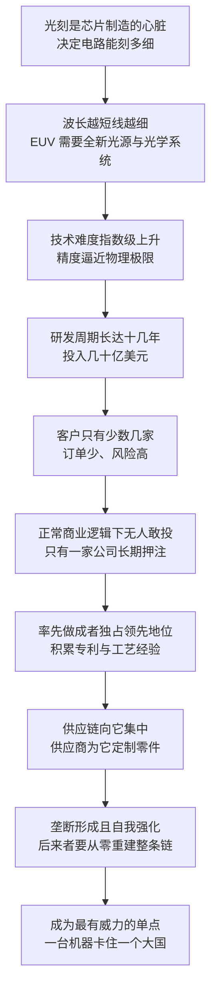

# 07｜光刻机：为什么一台机器能卡住一个大国？

> 一台要三架飞机才能运走的机器，为什么全世界只有一家公司造得出来？

---

## 一、先说结论

米勒给出的判断是：**光刻是芯片制造的心脏，而制造最先进芯片所需的 EUV 光刻机，是人类造过最复杂的机器。**

它的复杂度超出常识：十万个以上的零部件、几千家供应商、几十年的技术积累，最后装成一台重约一百八十吨的设备。而全世界能造出它的只有一家公司——荷兰的 ASML。

米勒认为，这种垄断既不是阴谋，也不是纯粹的运气，而是产业规律“筛”出来的结果：这门生意的投入太大、回报太远、客户太少，按正常的商业逻辑，没有人愿意干，只有“疯子”才敢一直赌下去。**而正因为敢赌的人只有一个，这台机器就成了整条供应链上最有威力的单点。**

---

## 二、我们先理解一个问题

先问一个基础问题：芯片到底是怎么造出来的？

简单说，芯片制造的核心步骤叫光刻——把设计好的电路图案，用光投射到涂了感光材料的硅片上，让光“画”出电路，再通过刻蚀把图案固定下来。这个过程要重复几十次，一层一层地叠出上百亿个晶体管。

关键在“光”上。光的波长越短，能画出的线条就越细，同样面积的芯片就能塞进更多晶体管。所以整个产业几十年来其实只做一件事：找更短波长的光。从普通紫外光，到深紫外光，再到极紫外光（EUV）。

问题随之而来：**当“光”变成一种必须用极端手段才能产生、控制和聚焦的东西时，能造出这台机器的人，还剩几个？**

---

## 三、作者到底提出了什么观点？

米勒的核心观点是：**光刻机的垄断是被产业规律筛选出来的，而不是被谁规划出来的；而这种筛选出来的垄断，恰恰是最难打破的。**

他把这个过程拆成几层。

第一，技术门槛是叠加的。EUV 光刻机不是把旧机器改一改，而是几乎重造了一遍：全新的光源、全新的镜片、全新的真空环境、全新的控制精度。有人形容，这相当于让一架飞机在飞行中给另一架飞机刻字，而且要刻得比头发丝细上几千倍。

第二，投入与回报严重错配。EUV 的研发从上世纪九十年代就开始了，直到 2018 年前后才真正进入量产，中间烧掉了十几年的时间和巨额资金。任何一家需要向股东交季报的公司，都很难承受这种节奏。

第三，客户数量少到危险。全世界买得起、也用得起最先进光刻机的厂商只有那么几家。客户少，意味着订单少、风险高；但也意味着一旦做成，别人几乎不可能从零开始追。

米勒的结论是：**这不是一台机器的胜利，而是一整套选择、承诺与耐力的胜利。** 也正因为只有一家公司走到了终点，这台机器才成了“卡脖子”最有威力的抓手。

---

## 四、把这个观点翻译成人话

打个比方：造一台先进光刻机，就像造一台“用激光在头发丝上写字的打印机”。

这台打印机需要五千多家供应商提供零件，它们分布在四十多个国家；它的内部有约三千条线缆、四万个螺栓、约两公里长的软管；装好之后重约一百八十吨，运到客户那里需要二十辆卡车，或者三架满载的波音 747。

再换个比方：这更像一场只有一个人坚持到终点的登山比赛。路线极长、天气极差、补给极贵，中途退出的选手不是不聪明，而是算过账——投入十几年、客户只有几家，中途任何一年资金链断掉，前面的钱就全部打水漂。**所以真正稀缺的不是技术本身，而是“在看不到回报的时候还敢继续投”的胆量与耐力。**

而当比赛结束时，先到的人不仅拿到了山顶，还拿到了路线图、补给站，以及后来者必须付费使用的全部经验。

---

## 五、为什么会这样？

把米勒的推理拆成链条，大致是这样的：

这条链条里最关键的一步，是 **D → F**。

为什么“无人敢投”？因为这门生意的风险结构是反直觉的：投入是确定的——几十亿美元、十几年时间；回报却是不确定的——客户只有几家，而且随时可能选择别的技术路线。米勒反复强调的是，芯片业最难的从来不是“知道该做什么”，而是“在别人都不做的时候还敢做”。ASML 赌赢了，于是它成了唯一的赢家。

---

## 六、举一个现实生活中的例子

最直观的例子，就是 EUV 光刻机本身。

ASML 于 1984 年从飞利浦分拆成立，当时是与 ASM International 合资的公司，总部设在荷兰的费尔德霍芬。今天，它造出的 EUV 光刻机是人类工业史上最复杂的单台设备之一：超过十万个零部件，供应商超过五千家、分布在四十多个国家，单台售价约一点五亿美元；更新一代的 High-NA 机型，价格已经涨到约三点五亿到四亿美元。

它的运输本身就是一场工程：约一百八十吨的设备要先拆解，再用二十辆卡车或三架满载的波音 747 运到客户工厂，抵达之后还要几个月才能安装调试完成。

更有说服力的对照，是尼康的起落。上世纪八十年代，尼康是光刻机市场的霸主，日本厂商几乎垄断了这个环节。转折点出现在 2000 年前后：行业在争论下一代光刻技术路线时，ASML 押注浸没式光刻，尼康则犹豫了。**一步押错，追赶者变成了领先者，领先者变成了追赶者。** 此后 ASML 一路走到 EUV 时代，尼康再没能回到原来的位置。

一台机器，就这样同时解释了“垄断是怎么形成的”，和“垄断又是怎么换手的”。

---

## 七、回到书中重新理解

现在再回看米勒写光刻机的用意，就清楚了。

他讲光刻机，不是在做技术科普，而是在给“卡脖子”找一个物理基础。整条芯片供应链上有许多咽喉点，但光刻机是最硬的那一个：设计软件可以被替代（慢，但可行），制造产能可以被复制（贵，但可行），而一台 EUV 需要五千家供应商、几十年的试错记录，以及一整套围绕它生长起来的生态——这不是钱的问题，是时间的问题。

米勒还提醒了一个容易被忽略的事实：**垄断者自己也被链条绑住。** ASML 的机器里凝结着多个国家的技术，它的出口要受到多方规则的约束。它既是卡住别人的那只手，也是被别人牵着的那只手。光刻机的故事说明，在全球分工里，没有任何一个位置是真正自由的。

---

## 八、这个观点背后还有什么？

**第一，效率与风险是同体的。** 全球分工把研发成本摊薄到极限，让人类用最快的速度造出了最复杂的机器；但同样的分工把风险集中到了一个点上——一个国家的工厂停工，全世界的先进芯片都要排队。

**第二，时间壁垒比技术壁垒更硬。** 追赶者可以买到设备、挖到人才、画出图纸，但买不到别人用十几年试错积累下来的经验。米勒的论证指向一个不太温柔的结论：越复杂的机器，越难以被“复制”。

**第三，客户结构决定了产业格局。** 全世界能大规模采购 EUV 的厂商只有两三家，这种极端的买方集中，让整个环节既脆弱又稳定：脆弱在于客户一有风吹草动就影响全局，稳定在于没有新玩家能轻易挤进来。

**第四，它重新定义了“产业安全”。** 如果一台机器就能决定谁能造出最先进的芯片，那么安全就不只是“有没有工厂”，而是“能不能持续拿到这台机器，以及它的服务与零件”。

---

## 九、这个观点有问题吗？

米勒的解释力很强，但把它放进争议里检验，会更准确。

**有说服力的地方：** 技术难度、资本门槛、时间成本这三重壁垒是真实存在的，而且可以量化——十万个零件、五千家供应商、十几年的研发周期，任何一项都足以劝退绝大多数企业。尼康的案例也证明，这个环节的领先地位确实会因为一次技术路线选择而彻底翻转。

**存在争议的地方：** 一些学者认为，把 ASML 的地位完全归因于“只有疯子才敢投”可能过于浪漫。它的成功还包含大量组织与商业因素：与客户的深度绑定、与供应商的长期契约、对关键环节的整合能力，以及一个愿意长期提供支持的资本市场。把这些都折叠成一句“敢赌”，会丢掉一半的解释。

**可能过度简化的地方：** 把光刻机说成“无法绕过”的绝对壁垒，也许低估了替代路径。历史上多次出现“被判定为不可能”的领域被后来者攻破的例子；而在成熟制程上，多重曝光等替代方案也让“没有 EUV 就造不出芯片”这句话需要加上限定条件——造不出最先进的，不等于造不出能用的。

**还有其他解释：** 也有观点认为，光刻机之所以成为“单点”，部分原因是下游客户的选择高度集中。如果买机器的客户更多、技术路线更分散，这个单点的威力会被稀释。换句话说，垄断既是供给端的结果，也是需求端的结果。

---

## 十、今天再看这个观点

**以下是基于米勒思想的现代延伸，不是作者原话：**

《芯片战争》出版之后，光刻机从产业话题变成了外交话题。先进光刻设备的出口需要荷兰政府的许可，而许可的尺度又与美国的管制规则紧密联动——一台机器的去向，成了国家间谈判桌上的议题。

这恰好印证了米勒的判断：**当某个环节不可替代时，它就自动获得了超越商业的政治重量。** 而对追赶者来说，光刻机的故事也把问题提得更清晰了：不是“能不能造出一台机器”，而是“能不能重建一整张供应链，并且有耐心等上十几年”。

---

## 十一、这一篇真正应该记住什么？

1. **光刻是芯片制造的心脏。** 波长决定精度，精度决定性能，所以谁掌握光刻，谁就掌握制造的节奏。

2. **EUV 是人类造过最复杂的机器。** 十万个以上零件、约一百八十吨、五千多家供应商、十几年研发周期——复杂度本身就是护城河。

3. **垄断来自产业规律，不是阴谋。** 投入大、回报远、客户少，正常商业逻辑下没人愿意干，所以最后只剩下一个玩家。

4. **技术领先会被一次路线选择翻转。** 尼康的失守提醒我们，壁垒再高，也不是永久的。

5. **最硬的壁垒是时间，不是钱。** 追赶者可以买设备、挖人才，但买不到别人用十几年试错换来的经验。

---

## 十二、留一个问题

> 如果光刻机的壁垒本质上是“时间”而不是“技术”，那么追赶者真正该做的，是砸钱买一台一样的机器，还是去找一条不需要这台机器的新路？
> 两条路都很难，但代价完全不同。

---

**下一篇**：光刻机解释了“为什么造不出”，接下来要解释“为什么赚不到”——同样是芯片，为什么存储器生意会像坐过山车一样，在暴赚和血亏之间反复横跳？我们从一根内存条的价格说起。
