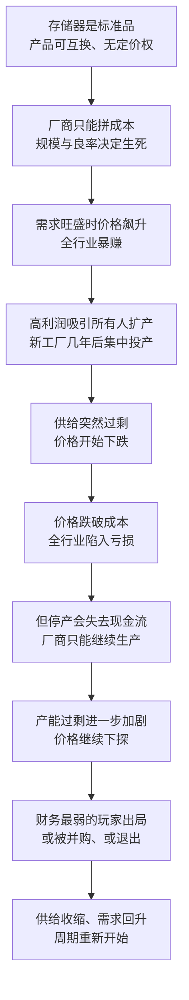

# 08｜为什么存储器生意总在“暴赚”和“血亏”之间摇摆？

> 同样是芯片，为什么只有存储器会周期性地变成一台“绞肉机”？

---

## 一、先说结论

米勒给出的答案是：**因为存储器是芯片业里的“大宗商品”。**

它不像处理器那样靠架构、生态和品牌卖高价；它更像大豆、原油或者钢材——各家产品可以互换，价格由供需决定，谁的成本低谁赢。这种属性带来两个后果：需求一紧，全行业暴赚；供给一松，全行业血亏。

在米勒看来，存储器因此成了芯片业最血腥的战场，也成了一个反复换主人的市场。**因为它是标准品，所以后来者只要把成本压得更低，就有机会翻盘。**

---

## 二、我们先理解一个问题

先看一个日常现象。

同样装在电脑里的芯片，处理器的价格很少大起大落，内存条的价格却像过山车：某一年翻倍，隔一年腰斩。装过机的人大概都有体会——内存条是可以“等一等再买”的，因为它的价格一直在变。

问题就来了：**都是芯片，都是高科技，为什么处理器能维持相对稳定的价格，存储器却要反复经历暴涨暴跌？** 这不是某一家厂商经营不善，而是这类产品的“生意属性”决定的。

---

## 三、作者到底提出了什么观点？

米勒的核心观点是：**存储器之所以周期性崩盘，是因为它是一种标准品——价格由供需决定，厂商只能接受价格。**

他把这个逻辑讲得很清楚。

第一，DRAM 是标准品。不同厂家生产的内存条，规格一致、可以互换，客户不关心是谁造的，只关心价格和供货。这意味着厂商没有定价权：你不能因为自己的工艺更先进就卖得更贵，因为客户随时可以换供应商。

第二，成本决定生死。既然价格由市场决定，那么唯一能自己掌控的就是成本。谁能用更低的成本造出同样规格的产品，谁就能在价格战中活下来。而成本又主要取决于两件事：产能规模（越大越摊薄）和良率（越高越便宜）。

第三，供给是刚性的。建一座存储器工厂要花几年时间和巨额资金，建好之后就不能轻易关停——所以这个行业无法像普通商品那样“按需调节产量”。需求稍微一变，价格就会剧烈震荡。

米勒的结论是：**“标准品”加上“刚性供给”，让存储器市场天生就是一台周期性绞肉机。** 它不是由于管理失误才崩盘，而是因为它就是这样一门生意。

---

## 四、把这个观点翻译成人话

打个比方：存储器市场像一群挤在同一部电梯里的人。

电梯的载重是有限的（需求有限），但每个人都在往里挤（所有人都在扩产）。谁也不想先出去，因为出去就意味着把位置让给别人。于是电梯越挤越危险，直到某一刻所有人都被压得喘不过气——价格跌破成本，全行业一起亏。

这时候最反直觉的事情发生了：**明明在亏钱，厂商却不能停产。**

原因是现金流。工厂停产意味着设备闲置、员工流失、客户转单，而固定的折旧和债务还要继续还。继续生产虽然每卖一颗亏一点，但至少能换回现金去还利息、维持运转。于是所有人都在亏损中继续生产，产能过剩进一步加剧，价格继续下跌——这就是所谓的“死亡螺旋”。

**价格跌到成本以下，不是因为有人在恶意倾销，而是因为没有人敢先停下来。**

---

## 五、为什么会这样？

把这条逻辑画出来，大致是这样的：

这条链条里最关键的一步，是 **F → G**。

如果亏损时厂商能干脆停产，价格很快就会回升，周期也不会这么剧烈。但现实中，停产的代价比继续亏本生产还高：现金流一断，企业立刻死；继续生产，至少还能撑到下一轮涨价。**正是这种“个体看来理性”的选择，把整个行业推向了集体的非理性结局。**

---

## 六、举一个现实生活中的例子

最直观的例子，就是内存条价格的暴涨与暴跌。

2016 年到 2018 年，内存价格经历了一轮大涨，内存条在零售市场上的价格几乎翻倍。那几年里，装机的用户发现预算被内存吃掉了一大块，手机厂商也在抱怨存储成本上升。到了 2019 年，行情急转直下，价格又大幅下跌，同一根内存条的售价相比高点明显缩水。

对普通消费者来说，这只是一次“买贵了”或者“等对了”的体验；但对产业链来说，这是一轮完整的周期：涨价时所有人都在扩产、抢产能，跌价时所有人都在清库存、砍订单。而价格下跌并不会让工厂停下来——**这正是“死亡螺旋”的可怕之处：大家都知道自己应该减产，但没有一个人敢做第一个。**

存储器生意的血腥，不在于技术不先进，而在于它把所有人都放进了同一场没有退路的博弈。

---

## 七、回到书中重新理解

米勒讲存储器周期，讲的不只是生意经。

在他的叙事里，这个周期性市场是理解芯片史的一把钥匙：**因为它反复换主人，所以它反复改写参与者的命运。** 一个市场如果像处理器那样靠生态和品牌锁定客户，领先者可以稳坐几十年；但如果它像存储器这样完全拼成本，那么领先地位就只是暂时的——只要有人愿意在低谷期继续投资，王座就会易主。

这也是米勒在书里反复使用的一条线索：存储器市场的每一次洗牌，背后都是“谁敢在别人恐惧时下注”的问题。那些具体的争霸故事是另一段历史；这一篇要记住的，是这条周期的机械原理本身——**它不是意外，而是这门生意自带的节拍器。**

---

## 八、这个观点背后还有什么？

**第一，周期是一台筛选机。** 它淘汰的是财务最脆弱的玩家，留下的是成本最低、耐力最强的玩家。所以存储器行业的集中度往往是在低谷期提高的，而不是在高峰期。

**第二，标准化既是诅咒也是门票。** 因为产品可以互换，后来者只要做到成本更低就能进场，不需要建立生态或品牌；也因为产品可以互换，领先者永远无法把技术优势变成定价权。

**第三，现金流比利润更重要。** 在这个行业里，“账上还有多少钱”比“这个季度赚了多少”更决定生死。谁能在低谷期继续投入，谁就能在下一个高点收获全部。

**第四，成本曲线是一条可以抢跑的跑道。** 单位成本会随着累计产量增加而下降，所以规模本身就是一种技术优势：谁先跑到更大的量，谁就能在同样的价格下活得更久。这解释了为什么存储器厂商会不惜代价地扩产——**扩产不只是为了今天的利润，而是为了明天还能活着。**

---

## 九、这个观点有问题吗？

“大宗商品”这个解释框架很有力，但它也有边界。

**有说服力的地方：** 标准品、无定价权、供给刚性，这三个条件叠加起来，确实会制造出剧烈的周期。这个框架不需要假设任何厂商“愚蠢”或“恶意”，就能解释为什么整个行业会集体亏损——这是它最漂亮的地方。

**存在争议的地方：** 一些学者认为，周期并不完全由“大宗商品”属性决定。厂商之间的产能协调、政府补贴、技术代际切换（比如从一代制程跳到下一代，成本结构会突然变化）都会显著改变周期的形态。也有研究指出，随着行业集中度提高，主要玩家在扩产上变得更克制，周期的振幅可能会减弱——关于存储器周期未来会不会“变温和”，学界存在不同解释。

**可能过度简化的地方：** 把 DRAM 比作大豆，忽略了它的技术门槛。大豆谁都能种，存储器却只有少数几家企业造得出来，而且每一代工艺都需要巨额研发。**它不是“完全竞争”，而是“少数玩家之间的成本战”** ——这一点会让周期表现出和大宗商品不完全一样的行为。

**还有其他解释：** 周期也可能主要来自需求侧——个人电脑的普及、智能手机的爆发、数据中心的扩张，每一轮都对应一次需求结构的突变。把周期完全归因于供给行为，可能低估了需求变化的作用。

---

## 十、今天再看这个观点

**以下是基于米勒思想的现代延伸，不是作者原话：**

近几年，存储器行业出现了一些新变化：面向人工智能服务器的高带宽内存（HBM）需求爆发，而这类产品比普通内存更接近“定制件”——它需要和客户深度配合，技术门槛更高，价格也相对稳定。

如果这个趋势持续，米勒的“大宗商品”框架可能需要打一个折扣：**当一部分存储器产品开始脱离标准品属性，它的一部分周期性也许会被削弱。** 但反过来看，产能仍然要好几年才能建成，扩产的冲动也仍然存在——只要这两点不变，存储器的“过山车”大概还会继续开下去。

---

## 十一、这一篇真正应该记住什么？

1. **存储器是标准品，所以没有定价权。** 价格由供需决定，厂商只能拼成本。

2. **成本由规模和良率决定。** 这是唯一能自己掌控的变量，也是所有价格战的战场。

3. **供给刚性是周期的放大器。** 建厂要好几年、停产代价极高，所以行业无法按需调节产量。

4. **“死亡螺旋”的根源是现金流。** 亏本还要生产，不是不理性，而是没有更好的选择。

5. **周期是筛选机，也是翻盘窗口。** 它淘汰财务最弱的人，也给敢在低谷下注的人留了机会。

---

## 十二、留一个问题

> 如果存储器生意的胜负手是“谁能在低谷期继续投入”，那么决定成败的就不只是企业的技术能力，而是它背后的资金来源与耐心——同样的技术、同样的周期，不同的资本结构会不会走出完全不同的命运？

---

**下一篇**：存储器周期解释了“为什么会崩盘”，却没有解释“为什么领先者总是守不住王座”。如果技术每隔几年就换代一次，那些曾经的霸主是怎么被自己的成功绊倒的？我们从英特尔错过 iPhone 的那一年说起。
