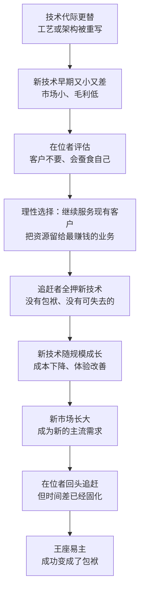

# 09｜为什么领先者总是掉队？——芯片业的“创新者困境”

> 芯片业的霸主，为什么总是守不住自己的王座？

---

## 一、先说结论

米勒的答案可以概括成一句话：**因为芯片业的技术每隔几年就换代一次，而每一次换代都是一次重新洗牌。**

领先者被自己最赚钱的业务绑住，追赶者则在下一代技术上孤注一掷。米勒在书里反复展示的，不是某个公司犯了多少错误，而是一个更冷的结构——**成功如何变成包袱。**

---

## 二、我们先理解一个问题

在大多数行业里，领先地位是可以守很久的：品牌、渠道、专利、规模，都会变成护城河。但在芯片业，霸主掉队几乎成了常态。

原因在于这个行业有一条特殊的节拍：晶体管尺寸每隔一段时间就要缩小一代，工艺要换代，架构也可能换代。换代意味着游戏规则被重写——上一代的优势（设备、工艺经验、客户关系）不会自动延续，有时甚至会变成负债：旧设备、旧流程、旧思维，全都要推翻重来。

于是问题就来了：**如果一个行业的规则每隔几年就要重写一次，那么上一局的冠军，凭什么还能赢下一局？**

---

## 三、作者到底提出了什么观点？

米勒的核心观点是：**在位者的失败，通常不是因为它看不见新技术，而是因为它被现有的成功锁住了。**

他把这把锁拆成两重。

第一重是客户结构。领先者最赚钱的客户，要的是现有产品的改良——更快一点、更省电一点、更便宜一点。没有人会要求供应商“把自己现有的生意颠覆掉”。所以当一项新技术出现时，最忠诚的客户恰恰会给它最负面的反馈。

第二重是组织惯性。公司的流程、人才结构、考核指标、投资决策方式，全都是为现有业务优化过的。转向新技术意味着承认过去十年的投入不再重要，意味着要在内部重新分配资源——这在任何组织里都是最困难的事情。

而追赶者没有这些包袱。新技术在早期往往又小又差，市场小、毛利低，对领先者来说“不值得做”，对追赶者来说却是唯一的入场券。**它们愿意用全部的筹码，去换一张通往下一局的票。**

米勒强调，这不是道德问题。领先者不是变懒了，也不是变笨了，而是被自己的成功“锁”住了。

---

## 四、把这个观点翻译成人话

打个比方：这就像一位冠军背着金牌游泳。金牌是他过去的荣耀，也是他此刻的负担——他不能丢，只能带着它一起往前游。

再换个比方：一家生意最好的餐厅，最赚钱的是招牌菜。厨师、供应链、菜单、服务流程，全都围着这道菜转。当客人的口味开始变化时，餐厅不是不想改，而是改菜单会得罪所有老客人、浪费所有库存、否定所有师傅的手艺。于是它选择继续把招牌菜做好——直到有一天，客人已经走光了。

管理学里有一个对应的理论，叫“创新者的困境”，由克里斯坦森提出：在位企业会被现有客户和利润结构绑住，从而错过颠覆性技术。**米勒笔下的芯片史，几乎就是这套理论的一份大型案例集。**

---

## 五、为什么会这样？

把这条逻辑画出来，大致是这样的：

这条链条里最关键的一步，是 **C → D**。

在位者的选择，在当期看是最优的：把资源投给最赚钱、最确定的业务，这是任何一家公司都应该做的事。只有站在十年之后回看，它才是错的。**这就是“困境”两个字的真正含义——它不是判断失误，而是一连串正确决定的累积后果。**

---

## 六、举一个现实生活中的例子

最典型的例子，是英特尔错过 iPhone 与 10 纳米难产。

2007 年 iPhone 出现时，英特尔并没有接下为它供应移动芯片的订单。时任 CEO 欧德宁后来公开表示，这是他最懊悔的决定之一。当时从财务角度看，这笔生意并不划算：手机芯片单价低、利润薄，而且会分散公司在个人电脑与服务器上的资源。但十年之后，手机成了全球最大的芯片市场之一，英特尔却基本缺席。

对照来看，手机时代真正完成了对个人电脑时代霸主的侧翼包抄：个人电脑比拼的是单核性能，而手机比拼的是每瓦性能——在电池和散热受限的前提下，谁更省电谁赢。ARM 架构正是从这个侧翼切入的，它放弃了在最高性能上的正面竞争，转而在能效这条新赛道上建立起优势。**游戏规则被换掉了，旧冠军的最强项不再是决胜项。**

与此同时，英特尔在自己的主场也开始失速：10 纳米工艺原计划在 2015 到 2016 年量产，实际一直拖到 2019 年，同期台积电、三星在先进制程上完成了反超。一家靠制程领先了几十年的公司，同时错过了新的架构战场，又在自己的主场上被人超越。

需要说明的是，英特尔并没有因此垮掉：在个人电脑和服务器市场，它仍然长期保持着强大地位。这个案例真正说明的不是“巨头的崩溃”，而是**一个领先者如何在两个战场同时失去主动权**。

---

## 七、回到书中重新理解

米勒用整本书反复演示同一个模式：美国企业在存储器上被日本逼退，垂直一体化的巨头被代工模式拆散，制程领先者被架构变化绕过。这些故事表面上是不同的产业段落，底层却是同一个结构——**在位者的优势，恰好就是它在下一代技术上的劣势。**

因为它的能力、客户、利润和流程，全都是为旧技术优化过的。它越成功，这套优化就越彻底，转身的代价就越高。

所以米勒讲这些故事，不是为了评选谁更聪明。他真正想说明的是：在芯片业，“领先”从来不是一个可以继承的状态，而是一件需要不断重新赢得的事情。**每一代技术，都是一次重新发牌。**

---

## 八、这个观点背后还有什么？

**第一，沉没成本与路径依赖。** 越成功的企业，越难承认自己需要重来。已经投入的设备、人员、流程，都会变成反对变革的理由。

**第二，资本市场的节奏与技术的节奏错位。** 季报奖励守成——守住现有业务、守住当期利润；而技术换代需要十年才能看到结果。两种时间尺度的冲突，本身就是一种结构性压力。

**第三，追赶者唯一的优势是“没有可失去的”。** 这不是精神胜利法，而是资源结构决定的：它们可以在一条还没被证明的路上连续投入几年，而不必向现有客户解释。

**第四，摩尔定律提供了固定的洗牌节拍。** 每两三年一次小换代，十几年一次大换代，意味着机会窗口会不断重新出现。这是芯片业与其他行业最大的不同。

**第五，自我颠覆是可能的，但极其罕见。** 它需要组织把“下一代”当成主线而不是副业，需要有人愿意在内部承担“否定自己”的代价。

---

## 九、这个观点有问题吗？

“创新者困境”这套解释很有吸引力，但也需要检验。

**有说服力的地方：** 它不需要假设任何人愚蠢，就能解释为什么最优秀的公司会错过最明显的机会。案例密度也足够高：从存储器到架构，从工艺到商业模式，米勒几乎在每一段历史里都能找到同样的结构。

**存在争议的地方：** 克里斯坦森的理论在学界受到过批评。一些学者认为它存在事后归因的偏差——失败之后回头去找“它忽视了颠覆性技术”，但成功者当年也做过类似冒险，只是没人记得。也有研究指出，在位者往往能通过收购、内部孵化等方式进入新市场，颠覆性技术并不必然导致在位者死亡。

**可能过度简化的地方：** 把英特尔 10 纳米难产单纯归因于“被现有业务绑住”，可能掩盖了技术层面的具体问题——工艺路线的选择、良率的攻关、内部执行的节奏，都是独立的变量。关于 10 纳米延期的主要原因，业界与学界存在不同解释。

**还有其他解释：** 人才流失、组织政治、资源分配机制、甚至纯粹的运气，都可能改变结局。把每一次掉队都装进同一个框架，会有过度解释的风险。

**所以更准确的说法是：** 创新者困境是一种“倾向”，而不是一条“定律”。它解释了为什么领先者容易掉队，但没有说领先者必然会掉队。

---

## 十、今天再看这个观点

**以下是基于米勒思想的现代延伸，不是作者原话：**

今天，芯片业的代际更替已经从“制程”扩展到了“架构”和“系统”：算力形态的变化，让原本处在边缘位置的玩家进入了舞台中心。对任何在位者来说，问题都不再是“要不要做下一代”，而是“下一代会不会从完全没想到的方向来”。

这给“创新者困境”加了一条新的注脚：**当颠覆不再来自同一张技术路线图，而是在另一条赛道上发生时，在位者的评估机制甚至无法把它识别为威胁。** 换句话说，最危险的对手，往往是那个在报表上还看不见的对手。

---

## 十一、这一篇真正应该记住什么？

1. **每一次技术换代都是一次重新发牌。** 领先地位不能继承，只能重新赢得。

2. **成功会变成包袱。** 客户结构、组织惯性、利润结构，都会把在位者锁在旧赛道上。

3. **在位者的选择在当期是理性的。** 困境的本质不是犯错，而是正确决定的长期累积后果。

4. **追赶者的优势是“没有可失去的”。** 新市场早期的小与差，对领先者是拒绝理由，对追赶者是入场券。

5. **这是倾向，不是定律。** 掉队很常见，但不是必然；能不能自我颠覆，决定了领先者能否穿越换代。

---

## 十二、留一个问题

> 如果“成功会变成包袱”，那么一家公司或者一个国家，有没有可能在还领先的时候，主动把自己最赚钱的业务降级？
> 这件事说起来容易，但历史上真正做到的人屈指可数。

---

**下一篇**：芯片业第一次真正意义上的“王座易主”，发生在太平洋两岸。一个战后从零开始的工业国家，用大约十年时间拿下了全球存储器市场——它是怎么做到的？
