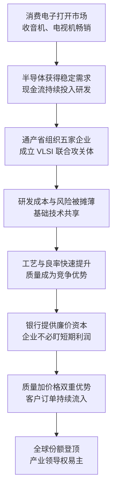

# 10｜日本是怎么在十年里把美国逼到墙角的？

> 一个战后从零开始的工业国家，为什么能在十年里拿下全球存储器市场？

---

## 一、先说结论

米勒的答案很直接：**日本的崛起不是市场奇迹，而是“举国体制”的产物。**

通产省把五家企业组织起来联合攻关，银行体系提供廉价资本，企业则用质量换市场——良率高、交货稳、价格低。三件事叠加，让日本在十年左右的时间里从追赶到反超。

在米勒看来，这段历史最大的意义不在于日本赢了，而在于它证明了一件事：**芯片业的领导权不是固定资产，它可以在十年内易主。**

---

## 二、我们先理解一个问题

战后日本几乎是从废墟上重新开始的。它没有硅谷那样的创业生态，也没有美国那样的军方订单，甚至在很多基础技术上都是后来者。

但从上世纪七十年代中期到八十年代中期，只用了大约十年，日本就在全球存储器市场上占据了主导地位。这个速度意味着：追赶不是线性积累，而是可以在一个技术代际之内完成的跃迁。

于是问题就来了：**一个战后从零开始的国家，凭什么能在十年里拿下全球存储器市场？** 是运气，是某个天才企业家的胜利，还是某种可以被复制的体系？

---

## 三、作者到底提出了什么观点？

米勒认为，日本的成功由三根支柱支撑。

第一根是需求入口：从消费电子切入。索尼在 1955 年推出晶体管收音机，由盛田昭夫主导。这台产品证明了一件事——日本可以把美国发明的技术，做成全世界都愿意买的商品。收音机、电视机等消费电子产品带来的巨大销量，反过来为半导体产业提供了稳定的需求和现金流。

第二根是政府组织：联合攻关。1976 年到 1980 年，通产省组织富士通、日立、三菱、NEC、东芝五家企业，实施被称为 VLSI 技术联合体的超大规模集成电路计划，共同攻关最难的、也最贵的基础技术。五家企业平时是竞争对手，在这个项目里却共享成果、分摊成本与风险。

第三根是资本与质量：银行体系提供廉价资本，让企业不必盯着短期利润做决策；而企业拿出的武器是质量——良率高意味着单位成本更低，交货稳定意味着客户敢把自己的生产线押上去。

米勒的结论是：**这不是某一家公司的胜利，而是一套“国家—银行—企业”协同体系的胜利。** 需求、研发、资金形成了闭环，而闭环一旦转起来，追赶的速度会快得超出所有人的预期。

---

## 四、把这个观点翻译成人话

打个比方：这像一支国家队。

五家平时互相厮杀的俱乐部，被拉进同一个训练基地，共享技术、共担成本；后面还有银行长期供应粮草，他们不必在研发的第三年就回答“什么时候能赚钱”。而这恰恰是追赶最需要的东西——时间。

也可以换一个角度看：美国的对手从来不是某一家日本企业，而是一整套体系。**需求入口（消费电子）、研发组织（联合体）、资金来源（银行）、竞争武器（质量），四样东西凑齐了，追赶就变成了必然。**

反过来说，很多国家的产业政策之所以不成功，往往是因为只补齐了其中一环：有钱没有市场，或者有市场却没有耐心。

---

## 五、为什么会这样？

把这条逻辑画出来，大致是这样的：

这条链条里最关键的一步，是 **A → B**。

很多人的直觉是：日本靠的是政府补贴和低价倾销。但米勒的叙事提示了另一条更根本的路径——**先有市场，才有产业。** 消费电子给了日本半导体一张长期饭票：只要收音机和电视机在卖，芯片就有稳定的订单和现金流，研发就敢往最贵的方向投。政府和企业的作用，是把这张饭票的效用放大到极致。

---

## 六、举一个现实生活中的例子

把索尼晶体管收音机和日本 DRAM 的登顶放在一起看，这条路径就非常清楚。

1955 年，索尼推出晶体管收音机，由盛田昭夫主导。当时的晶体管还是美国贝尔实验室的发明，美国公司也做得出收音机，但索尼把它做成了小巧、省电、可以随身携带的商品，一举打开了全球市场。这件事的意义不只是卖出了一款产品，而是为日本半导体建立了一个持续运转的需求入口。

二十年之后，这条路径结出了果实：1980 年代中期，日本在 DRAM 市场上的份额一度达到约 80%（1987 年）；1986 年，日本超过美国，成为全球最大的半导体生产国。

而日本企业的武器，并不只是便宜。**它们真正的杀手锏是质量：良率高，单位成本自然更低；交货稳定，客户就敢把整条生产线押上去。** 价格战的前提是你能赚钱地打下去，而质量优势让日本可以一边降价一边盈利。

对照来看，通产省与 VLSI 联合攻关提供了另一半解释：1976 年到 1980 年，五家企业坐进同一个项目，共同攻关超大规模集成电路的基础技术。这个联合体并没有替代企业，而是替企业承担了最难、最贵、回报最远的那一段研发。**企业省下的不只是钱，更是时间和风险。**

---

## 七、回到书中重新理解

米勒写日本，不是为了给谁鼓掌，也不是为了指控谁。他真正要说明的，是一个更深的东西：**芯片业的领导权不是固定资产，它可以在十年内易主。**

这段历史同时打破了两条常见的假设。

第一条是“美国天然领先”。美国确实领先过，但领先可以被追上，而且被追上的速度可能比所有人预想的都快。

第二条是“产业政策是发展中国家的特殊手段”。在芯片史上，政府深度介入其实是常态：美国的早期发展靠的是军方订单，日本靠的是通产省与联合攻关，后来的追赶者也大多如此。米勒的叙事里，**市场与政府从来不是二选一，而是不同阶段的组合。**

他还提醒了一个容易被忽略的前提：日本的胜利，建立在存储器是标准品这个事实之上——只要质量好、价格低，就能赢下订单。而当竞争的规则从“标准品成本战”转向“生态与架构之争”时，同样的武器就不一定管用了。

---

## 八、这个观点背后还有什么？

**第一，举国体制的关键不是替企业做决定，而是降低协调成本。** 通产省没有替企业选产品，它做的是把竞争前的共性技术组织起来，让五家企业不用重复烧钱。

**第二，消费电子是半导体的现金流入口。** 有了下游整机业务，上游芯片才敢投长期研发。这个结构后来被韩国、中国台湾等地区用不同方式复制过。

**第三，廉价资本是一种隐形竞争力。** 能承受更长的回报周期，就等于能跑更长的比赛。在技术追赶的赛道上，“耐心”是可以折算成“速度”的。

**第四，质量是价格战的高级形态。** 靠补贴打价格战，钱会烧完；靠良率打价格战，成本会一直低下去。前者是战术，后者是结构。

**第五，十年足够长，也足够短。** 足够完成一次技术代际的追赶，却不足以建立不可替代的护城河。日本的胜利证明了领导权可以易主，也预告了领导权可能再次易主。

---

## 九、这个观点有问题吗？

“举国体制”这个解释很有力，但它也是学界争论最集中的地方之一。

**有说服力的地方：** 日本的案例链条完整——需求、研发组织、资本、质量，每一环都有具体的事实支撑；而且时间线清晰，十年之内完成反超，很难用偶然来解释。

**存在争议的地方：** 一些学者认为“通产省神话”被夸大了。VLSI 计划确实有贡献，但日本企业的内部竞争、私营部门自身的研发投入、全面质量管理等组织创新，以及美国市场对日本产品的开放，都是同等重要的变量；也有经济史研究者强调，日本成功的一部分原因，是美国企业自己在七十年代的战略与投资失误。**关于政府与企业在日本半导体崛起中各自贡献了多少，学界存在不同解释。**

**可能过度简化的地方：** 把崛起归因于单一因素，会忽略当时的时代条件——廉价资本、汇率环境、开放的外部市场。这些条件在今天很难被完整复制，所以“照着日本做一遍”未必可行。

**还有其他解释：** 也有观点认为，日本真正的优势是制造业的组织能力，而不是产业政策本身。政策提供的是舞台，真正唱戏的是企业。

---

## 十、今天再看这个观点

**以下是基于米勒思想的现代延伸，不是作者原话：**

日本的故事今天被反复引用，因为各国重新开始大规模使用产业政策：补贴建厂、组织联合研发、设立国家级基金。这在某种程度上，是对日本剧本的集体模仿。

但条件已经变了：当年的需求入口、资本成本和外部市场环境都不可复现；更重要的是，今天竞争的焦点已经从标准品转向了生态与架构。**可以学的是方法，不能照搬的是环境。** 政策能买到时间和规模，但买不到一个已经长成的产业生态——这可能是日本经验留给后来者最真实的一条限制。

---

## 十一、这一篇真正应该记住什么？

1. **日本的崛起是体系的胜利。** 需求入口、联合攻关、廉价资本、质量优势，四件事凑成了一个闭环。

2. **先有市场，才有产业。** 消费电子提供的现金流，是半导体敢于长期投入的前提。

3. **产业政策的关键是降低协调成本。** 组织竞争前的共性技术攻关，比直接给钱更有效。

4. **质量是价格战的高级形态。** 良率高带来成本优势，交货稳带来客户黏性。

5. **领导权可以在十年内易主。** 这段历史最大的启示不是日本赢了，而是王座并非不可撼动。

---

## 十二、留一个问题

> 如果日本的胜利靠的是“需求—研发—资本”这个闭环，那么当一个后来者只补齐了其中一环（比如说，只解决了钱），它能走多远？
> 这个问题的答案，可能决定了很多国家产业政策的成败。

---

**下一篇**：日本的崛起只是硬币的一面。另一面是：美国在自己开创的产业里节节败退——当价格被打穿、利润被抹平，一家要向股东交季报的公司还能撑多久？我们从格鲁夫与摩尔之间的一段对话说起。
