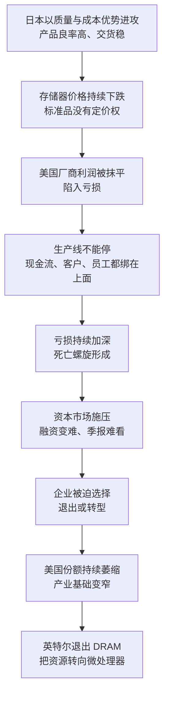

# 11｜美国为什么输掉了存储器之战？

> 发明了芯片的美国，为什么会在自己开创的产业里节节败退？

---

## 一、先说结论

米勒的判断是：**输掉存储器不是一次战役的失败，而是商业模式与产业生态的失败。**

日本用低价高质的产品把价格打穿，让美国企业陷进“越亏越要生产”的死循环；而美国企业背后是资本市场，必须按季度向股东交代，撑不住一场长年累月的消耗战。

英特尔的退出，是这场失败最清晰的标志：**它意味着美国从“什么都做”，转向“只做最赚钱的”。**

---

## 二、我们先理解一个问题

美国是芯片的发明者，也是这个产业最早的霸主。晶体管、集成电路、最早的存储器，都诞生在美国。

但在存储器这个最早的芯片大类上，美国企业却一路后退，最后几乎全部离场。这不太符合直觉：如果只是技术不如人，那还可以追；可美国并不缺技术，也不缺人才，更不缺市场。

所以真正的问题不是“美国会不会造”，而是：**当一门生意变成无差别的价格战，一家靠资本市场活着的公司，能撑多久？** 答案不在实验室里，而在资产负债表上。

---

## 三、作者到底提出了什么观点？

米勒把美国的失败拆成三层。

第一层是价格机制。存储器是标准品，产品可以互换，价格由供需决定。日本企业用质量与成本优势发起进攻，把价格一路打下去，美国企业则陷进“死亡螺旋”：价格跌破成本，但生产线不能停——停产意味着现金流断裂、客户流失、员工解散。于是亏损越滚越大，越生产越亏，越亏越要生产。

第二层是资本结构。美国企业依赖资本市场，需要向股东交代季度利润，亏损两个季度就会面临融资困难；而日本企业背后有银行与交叉持股的支撑，可以承受更长的亏损期。这不是谁更聪明的问题，而是**谁能熬的问题**。

第三层是战略选择。与其在无差异的价格战里持续流血，不如把资源转移到更赚钱、更差异化的微处理器上。于是“退出”从一个失败的结果，变成了一次主动的取舍。

格鲁夫与摩尔的那场对话，就是这三层压力汇聚到一个人身上的时刻。

---

## 四、把这个观点翻译成人话

打个比方：这像同一条街上两家店打价格战。

一家背后有银行长期输血，亏三年也不影响开门；另一家要向股东交季报，亏两个季度就撑不住。打到最后，后者并不是被彻底打败的，而是选择离场——去开一家利润更高、竞争更少的店。

这个选择在当时看是止损，在长期看是转型。**但代价是：美国从此失去了对存储器这个环节的话语权。** 退出从来不是免费的：你换来了利润，也交出了阵地。

而且，退出的决定越“理性”，它就越容易被复制。当每一家企业都做出对自己最有利的选择时，整个国家的产业版图就会一起收缩——这不是某一次决策失误，而是一连串正确决策的合力。

---

## 五、为什么会这样？

把这条逻辑画出来，大致是这样的：

这条链条里最关键的一步，是 **E → F**。

技术差距不是主因，**耐力差距才是**。当亏损持续的时间超过了资本能承受的长度，退出就只是时间问题。米勒的叙事在这里给出了一个很冷的结论：在一个标准品市场里，决定胜负的往往不是谁的技术更好，而是谁的钱更便宜、耐心更长。

---

## 六、举一个现实生活中的例子

最有画面感的例子，是格鲁夫与摩尔之间那段著名的对话。

1985 年，存储器价格崩盘，英特尔在 DRAM 业务上持续失血。格鲁夫在《只有偏执狂才能生存》里回忆说，他问摩尔：“如果我们被踢出董事会，新的 CEO 会做什么？”摩尔回答：“退出存储器。”格鲁夫接着说：“那我们为什么不自己走出这扇门，自己动手做这件事？”

于是他们自己动手了：英特尔退出 DRAM 业务，把资源集中到微处理器上。多年以后回看，这是公司历史上最重要的一次转向——它把英特尔从一家存储器公司，变成了一家处理器公司。

但米勒提醒我们，这个过程一点都不浪漫。这不是因为看清了未来才做出的决定，而是因为旧战场已经无法立足。**“被踢出董事会的新 CEO”只是一个心理装置，它让当事人有勇气承认自己就是那个该动手的人。** 这也说明，最难的一关不是看到答案，而是接受答案。

同时也要看到，并不是所有美国公司都退出了：也有企业选择留下来，在随后的行业整合中成为少数幸存者。

而在企业层面之外，还有国家层面的动作。1986 年 7 月签订的《日美半导体协议》，要求日本停止倾销，并争取在 5 年内让外国芯片在日本市场的份额达到 20%；1987 年 3 月，美国以日本未遵守协议为由，对价值 3 亿美元的日本商品征收 100% 的惩罚性关税；1991 年，双方又签订了第二次协议。这些动作说明，美国的应对并不只是企业转型，还有谈判与施压。

---

## 七、回到书中重新理解

米勒把英特尔的退出看成整本书的一个枢纽：**它标志着美国产业战略的根本转向——从“什么都做”，变成“只做最赚钱的”。**

在旧模式下，一家公司从设计到制造、从存储器到处理器，全部自己做；在新模式下，美国企业开始把利润最薄的环节交出去，自己牢牢握住设计与架构。这一转向在短期内是撤退，在长期却把美国推向了新的高地：微处理器与个人电脑生态的崛起，成了下一段历史的主线。

所以米勒的判断不是简单的“美国输了”，而是“美国换了一个战场”。**输掉一场战役不等于输掉战争，但前提是：你必须有能力在别的地方赢。** 而“能不能在别处赢”，取决于你手里是否还有别人绕不过去的东西——这正是美国后来反击的底气所在。

---

## 八、这个观点背后还有什么？

**第一，退出是一种能力，也是一种代价。** 放弃存储器让美国失去了对大宗商品环节的话语权，也让它的产业基础变窄：从此以后，美国在“最赚钱的环节”上很强，在“最基础的环节”上却越来越依赖别人。

**第二，资本市场是双刃剑。** 它逼企业聚焦利润、及时止损，也让企业无法承受长周期的消耗战。同一套制度，在创新上可能是优势，在耐力赛里可能是劣势。

**第三，贸易协议与关税是事后补救。** 它们能改变规则、增加谈判筹码，但不能直接恢复竞争力。市场份额是用产品和成本赢回来的，不是用协议写出来的。

**第四，组织心理是最难的一关。** 格鲁夫的故事说明，人在面对自己亲手建立的业务时，最难的不是分析，而是承认——“如果我是外人，我早就会砍掉它”。

**第五，理性的个体选择会累积成集体的后果。** 每一家企业退出存储器都是理性的，但所有企业一起退出，就变成了整个国家的产业收缩。这种“合成谬误”，是理解产业兴衰时最容易被忽略的一环。

---

## 九、这个观点有问题吗？

米勒的解释逻辑完整，但也需要放进争议里检验。

**有说服力的地方：** 价格、资本、战略这三层解释互相咬合，而且有当事者的第一手回忆作为支撑。格鲁夫的那段对话，几乎是“困境”二字最生动的注脚。

**存在争议的地方：** 一些学者认为，“资本市场短期主义”的解释可能被夸大——美国企业当年也在研发上投入巨大，失败可能更多来自技术选择与组织执行；也有研究者指出，贸易保护措施在帮助美国企业争取时间的同时，也提高了下游产业的成本。**关于“美国退出存储器到底是明智的聚焦，还是战略性的失误”，学界存在不同解释。**

**可能过度简化的地方：** 把格鲁夫的一段对话当成历史转折点，可能过度戏剧化。退出是渐进的、被动的，是多重压力叠加的结果；对话更像是一个仪式，而不是一个原因。

**还有其他解释：** 汇率变动、新玩家的进入、个人电脑兴起带来的需求结构变化，都在改变这场竞争的胜负条件。把失败完全归因于“资本结构”，可能会低估这些外部变量。

---

## 十、今天再看这个观点

**以下是基于米勒思想的现代延伸，不是作者原话：**

几十年后，“只做最赚钱的环节”这套逻辑开始被重新审视。当制造环节大规模外移，供应链的脆弱性在地缘紧张和缺芯潮中暴露出来，美国又开始用补贴与立法把制造拉回本土。

这等于承认：**当年那笔看起来很理性的交易，账还没算完。** 聚焦利润的选择在财务上是成功的，但在产业安全上是留了缺口的。米勒的框架因此给今天留下了一个问题：如果每一次“退出不赚钱的环节”都是理性的，那么谁来为整个产业版图的长期收缩负责？

---

## 十一、这一篇真正应该记住什么？

1. **输掉存储器是体系的失败，不是单点失误。** 价格机制、资本结构、战略选择三层叠加，才把美国企业推出了这个市场。

2. **标准品市场里，耐力比技术更决定胜负。** 谁能承受更长的亏损期，谁就能笑到最后。

3. **资本市场的双刃剑效应。** 同一套制度既奖励聚焦与止损，也让企业无法打消耗战。

4. **退出的代价是话语权。** 放弃一个环节，等于把这个环节的规则制定权交给别人。

5. **理性的个体选择会累积成集体的收缩。** 当所有人都做对自己最有利的事，产业版图可能一起变小。

---

## 十二、留一个问题

> 如果“退出最不赚钱的环节”在每一家企业看来都是理性的，那么这笔账的代价，最终会落在谁身上？
> 更麻烦的是：要过多久，人们才会发现自己付了这笔账？

---

**下一篇**：美国退出了存储器，却没有退出芯片战争。接下来要讲的，是它如何反击——政府与企业联手攻关、把战场换到自己有优势的地方、逼日本签下市场准入协议。为什么说这次反击，改写了整个产业的规则？
