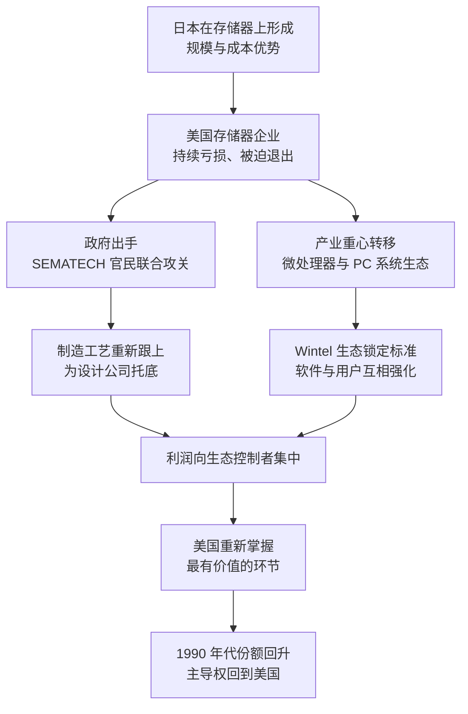

# 12｜美国是怎么反击的？——从“日本第一”到硅谷复兴

> 面对日本在存储器上的压倒性优势，美国到底用什么办法把芯片业的主导权抢了回来？

---

## 一、先说结论

米勒在书里给出的答案不是一场正面强攻，而是三件事的组合。

第一，**政府与企业联合攻关**。1987 年，美国政府与 14 家美国半导体企业共同组建 SEMATECH，政府与企业各承担约一半预算（政府每年出资约 1 亿美元），目标是把美国的半导体制造能力重新拉起来。

第二，**把战场换到自己有优势的地方**。美国不再在存储器上死磕，而是转向微处理器与系统生态。IBM 在 1981 年推出个人电脑时选择了英特尔的 8088 处理器与微软的 DOS，从此“Wintel”联盟与 PC 时代成型。

第三，**逼日本签下市场准入协议**。用贸易谈判与关税压力打开日本市场，为美国企业争取时间。

而美国真正学到的经验是：**不必在每个环节都赢，只要握住最有价值的环节。**

---

## 二、我们先理解一个问题

1980 年代中期，美国半导体产业的气氛相当灰暗。日本企业在存储器上拿下了全球市场的大半份额，价格一路下压，美国公司连年亏损；当时美国舆论场上最流行的说法是“日本第一”，讨论的焦点是日本式的产业政策是不是更有效率。

问题就来了：**如果存储器已经打不过了，美国是不是只能认输？**

更麻烦的是，存储器不是一个可以随手放弃的小生意。它是当时芯片业最大的单一市场，也是工艺与产能的练兵场——谁在存储器上领先，谁就在制造能力上领先。放弃存储器，看起来像是放弃整个芯片业的地基。

所以这一篇要回答的是：美国用什么办法夺回了主导权？它的反击为什么有效？

---

## 三、作者到底提出了什么观点？

米勒的观点可以概括成一句话：**美国不是把存储器抢回来的，而是重新定义了“赢”的位置。**

具体是三件事。

**第一件是官民联合攻关。** SEMATECH 的成立，是为了解决一个市场自己解决不了的组织问题：单家美国企业既没有那么多钱，也没有那么大的胆量，去追日本那种举国体制下的制造工艺投入。于是政府出钱、企业出人出技术，共同研究制造工艺，成果再共享给成员企业。它不生产芯片，它生产的是“美国企业重新跟上制造节奏”的能力。

**第二件是换战场。** 米勒反复强调，芯片业的价值不是均匀分布的。存储器是标准品，靠成本和规模取胜；而微处理器加上操作系统构成的系统生态，靠的是网络效应和客户锁定。美国的优势在设计、软件、标准与市场，于是它把资源集中到了这条赛道上。

**第三件是贸易协议。** 通过谈判与关税压力，美国迫使日本在市场上做出让步、开放准入。协议本身不会立刻把份额还给美国企业，但它改变了谈判筹码与各方预期，为美国企业争取到了喘息的时间窗口。

米勒从中提炼出的经验是：**在一条全球分工的链条上，赢家不是守住所有环节的人，而是握住最赚钱、最难被替代的那一环的人。**

---

## 四、把这个观点翻译成人话

打个比方：两个人坐在一张牌桌上赌钱，其中一个人手里全是好牌，因为这套规则比的就是谁的成本低、谁的量产规模大。另一个人发现自己按这套规则必输，于是做了一件事——**换牌桌**。

新的牌桌上，比的不是谁的芯片便宜，而是谁的标准被更多人采用。谁定标准，谁就能收“过路费”：软件要为我写，工程师要学我的指令集，客户的整个技术栈都围着我转。日本在旧牌桌上依然强悍，但价值已经流向了新牌桌。

再换一个说法：SEMATECH 是“补课”，贸易协议是“争取时间”，而换赛道是“换一种赢法”。三件事缺一不可——只补课不换赛道，就还得在最血腥的战场里拼成本；只换赛道不补课，美国企业连设计芯片所需要的制造基础都会丢掉。

---

## 五、为什么会这样？

把米勒的推理拆成链条，大致是这样的：

这条链条里最关键的一步，是 **D → F**。

为什么微处理器与 PC 生态这么值钱？因为它有网络效应：用 x86 和 Windows 的人越多，愿意为它写软件的人就越多；软件越多，新用户就越只能选它。这个循环一旦转起来，就会把竞争者挡在门外——哪怕竞争者的硬件更便宜。

而存储器没有这种保护。它是标准品，谁便宜谁赢，昨天的领先者随时可能被今天的低价者取代。**同一个产业里，可以同时存在两种完全不同的竞争逻辑。**

---

## 六、举一个现实生活中的例子

最能说明问题的，是 Wintel 联盟与 PC 时代。

1981 年，IBM 推出个人电脑时做了一个决定：处理器用英特尔的 8088，操作系统用微软的 DOS。IBM 当时的目的是尽快把产品做出来，但它无意中把两个供应商变成了整个行业的标准——因为 IBM 的机器太成功了，市场上出现了大量“兼容机”，而兼容机也必须跑同样的处理器、同样的操作系统。

于是奇怪的事情发生了：**IBM 自己后来在 PC 业务上并不算赢家，但它选中的两个伙伴成了大赢家。**

对用户来说，买电脑时真正关心的不是谁造的机器，而是“能不能跑我的软件”；对软件公司来说，优先支持的永远是用户最多的平台。x86 加上 Windows，就这样从一套产品变成了一个生态。

对照来看，SEMATECH 解决的是另一个层次的问题。它不追求商业上的成功，而是把 14 家企业拉到一起共同研究制造工艺，政府与企业各出一半钱。它针对的是“单打独斗谁都追不上”的集体行动困境——这在美国的产业传统里相当少见，也正因如此，它成了那场反击里最具争议、也最被反复讨论的一步。

---

## 七、回到书中重新理解

把这一段放回《芯片战争》的时间线里，它的意义就很清楚了。

日本在 1980 年代靠存储器把美国逼到墙角；美国在 1980 年代末到 1990 年代重新抬头，1992 年前后美国与日本并列成为最大的芯片出口国，此后美国的份额持续回升。米勒没有把这段复兴写成“美国企业的英雄故事”，而是写成一个结构调整：**美国放弃了在成本上竞争，转而在标准和生态上竞争。**

更重要的是，这次反击塑造了此后三十年的格局。美国后来能“卡脖子”，靠的不是它还在生产最便宜的存储器，而是它握住了设计软件、核心 IP、设备与 x86 生态这些环节——这些正是 1980 年代那次战略选择留下的资产。

换句话说，美国在这场战争里学到的东西，比它夺回的份额更重要。

---

## 八、这个观点背后还有什么？

**第一，价值链不是均匀的。** 同一个产业里，不同环节的利润与权力差别巨大。制造要拼资本和成本，标准与生态却能收“租金”——米勒的整个叙事都建立在这个区分之上。

**第二，政府可以扮演“补课者”，而不是“操盘手”。** SEMATECH 的模式很特别：政府出钱，但研究什么、怎么攻关，主要由企业来定。它的作用不是替代市场，而是把企业从“谁都不敢先投”的僵局里拉出来。

**第三，贸易协议的价值在于时间。** 市场准入协议不会直接把份额送给美国企业，但它改变了谈判筹码与预期，给产业调整争取了几年——在技术迭代以年为单位计算的行业里，几年就是一代产品。

**第四，生态优势有自我强化的惯性。** 一旦用户、软件、人才都被锁定在一个平台上，领先者即使技术暂时落后，也不容易被替换。这也是为什么后来的挑战者往往不从正面进攻，而是从“下一代计算平台”切入。

---

## 九、这个观点有问题吗？

米勒的框架解释力很强，但需要放在争议里检验。

**有说服力的地方：** Wintel 的锁定效应后来持续了二十多年，直到移动时代才被真正撼动；“握住最有价值环节”这条经验，也在此后的美国政策里反复出现。时间线与这个解释基本吻合。

**存在争议的地方：** 一些学者认为，把美国复兴归功于这三件事，可能低估了外部条件——日元大幅升值、日本泡沫经济破裂、韩国在存储器上的加入，都重创了日本企业的投资能力。美国的份额回升，有多少是自己赢回来的，有多少是日本自己跌下来的，很难精确区分。

**还有关于 SEMATECH 的分歧：** 一些研究者对它的评价不高，认为它对具体技术的贡献有限，更多是象征意义和组织方式上的创新；另一些研究者则认为，它让美国企业重新重视制造工艺，作用被低估了。关于这一问题，学界存在不同解释。

**也可能过度简化：** 把美国企业转向微处理器说成一次“战略选择”，听起来很聪明，但当时也有很强的被迫成分——存储器实在打不过，不转不行。历史的回望视角，容易让被迫的撤退显得像主动的布局。

**其他解释：** 也有学者强调美国风险资本与创业文化的活力，认为真正让硅谷复兴的是无数新公司的试错，而不是任何一项政策。这个说法与米勒的叙述并不冲突，但重心不同。

---

## 十、今天再看这个观点

**以下是基于米勒思想的现代延伸，不是作者原话：**

今天的美国管制思路，几乎就是“握住最有价值环节”的翻版：不是禁止所有芯片贸易，而是集中卡住最先进的制程、最关键的设备与设计软件。它承认自己在成熟制程上没有优势，也不打算在那里硬拼。

但值得追问的是：这套经验还能用多久？Wintel 那种单一生态锁定的时代，前提是全世界共用一套技术栈；而在今天，开放的指令集、自研的操作系统与云端算力平台，都在尝试绕开这种锁定。当“标准”本身开始分裂成几套并行体系时，美国还能不能像 1990 年代那样，靠握住一个环节就握住全局？

这个问题没有确定答案，但它决定了下一个十年的竞争形态。

---

## 十一、这一篇真正应该记住什么？

1. **美国的反击是三件事的组合：** 官民联合攻关、换赛道、用贸易协议争取时间。单靠任何一件都不够。
2. **换牌桌比硬拼更有效。** 在别人的规则下打不赢，就去制定自己的规则——从存储器转到微处理器与 PC 生态，是这场反击的关键转折。
3. **价值链不是均匀的。** 不必在每个环节都赢，握住最赚钱、最难替代的那一环，就能掌握全局。
4. **生态一旦形成，就有惯性。** 用户、软件与人才互相强化，让领先者即使技术落后也不易被替换。
5. **历史评价需要留有余地。** 日本自身的困境、外部条件的变化与美国政策的成效交织在一起，很难把功劳精确归给某一方。

---

## 十二、留一个问题

> 如果“赢”的定义是握住最有价值的环节，那么对追赶者来说，是先补上被卡住的那一环，还是先去占住下一个还没被占住的环节？
> 这两条路的时间成本，可能完全不同。

---

**下一篇**：13｜苏联的芯片计划为什么失败了？——抄近路的代价。有一个国家没有换牌桌，而是把整张牌桌照抄了一遍——为什么倾举国之力复制美国芯片，却始终差着一代？故事从一座叫泽列诺格勒的城市说起。
