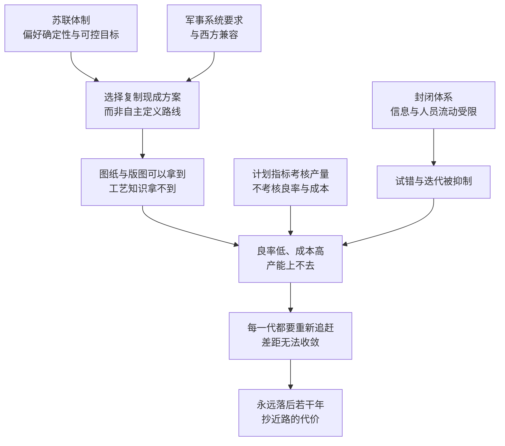

# 13｜苏联的芯片计划为什么失败了？——抄近路的代价

> 一个能造出原子弹、把人送上太空的国家，为什么在芯片上追了三十年，还是差着一代？

---

## 一、先说结论

米勒给出的答案不是“缺钱”，也不是“缺科学家”，而是**选错了追赶方式**。

苏联的选择是复制：从晶体管到大型机，从大型机到芯片，一代一代地把美国的产品拆开、照着做。这条路看起来最省时间，实际上却把自己锁进了一个永远追不上的结构里——因为芯片业的终点线每两年就往前挪一次，而复制永远只能追上一代。

更根本的问题在体制：计划经济压制了试错与迭代，而工艺知识藏在无数细节里，无法从一张图纸上抄走。**抄近路的代价，是永远在追一条移动的终点线。**

---

## 二、我们先理解一个问题

先看几个事实。

苏联的起点并不差：泽列诺格勒（Zelenograd）1958 年规划、1962 年建成，是苏联专门为微电子打造的科学城，被称为苏联的“硅谷”；苏联的科学家在早期也独立做出过晶体管方向的研究。以举国之力办一件事，苏联是很有经验的——原子弹、氢弹、人造卫星、载人航天，都办成了。

那为什么芯片办不成？

这个问题比“苏联技术落后”要深得多。苏联并非没有投入，也并非没有人才。它的真正问题在于：**投入的方向从一开始就选错了，而这个选择又与整个体制的逻辑紧紧绑在一起。**

---

## 三、作者到底提出了什么观点？

米勒的核心判断是：**苏联把芯片当成了一份可以抄的作业。**

1960 年代后期，苏联在微电子上转向了“复制”美国产品的路线。这个选择有它自己的道理：苏联的军事与工业系统需要与西方的数据和软件兼容，与其自己从头定义一套体系，不如直接照着做。于是复制变成了路线：从器件结构到系统架构，都以美国产品为模板。

代价随即出现。

**第一，复制只能得到结果，得不到过程。** 芯片的价值不只在设计图纸上，还在工艺里：掺杂的浓度、温度曲线、洁净度控制、设备调校、良率爬坡的经验。这些东西是成千上万次试验积累出来的隐性知识，逆向工程拿不到。

**第二，复制是在追一个移动的目标。** 芯片业按摩尔定律迭代，大约两年换一代。你花五年把这一代做出来，别人已经在做第三代了。差距不会收敛，只会被重新拉开。

**第三，计划体制压制了迭代。** 工厂考核的是产量指标，不是良率与成本；企业之间、科研院所之间、军用与民用之间信息难以流动；没有市场竞争，也就没有必须改进的压力。米勒反复强调的“学习曲线”，在苏联的体系里几乎无法形成。

---

## 四、把这个观点翻译成人话

抄作业能抄到答案，抄不到解题过程。

把同学的作业抄一遍，考试遇到同一道题你能得高分；但题目一换，你还是不会。而芯片业的题目每两年换一次，并且换得越来越难。

再换一个比方：**复制是一种“延迟的追赶”。** 你追的永远是别人几年前的位置，而别人还在往前跑。你不是在缩小差距，你只是在保证差距不被拉得更大——直到某一天，代差大到连复制都失去了意义。

而真正致命的，是复制会让人放弃另一种能力：自己定义问题、自己承担失败、自己从错误里学。**这种能力一旦不长出来，就永远只能跟着别人走。**

---

## 五、为什么会这样？

这条链条里最关键的一步，是 **B → D**。

为什么“拿不到工艺知识”这么致命？因为芯片制造不是照图施工，而是在极限条件下维持稳定。同样的设备、同样的设计，不同的工艺参数与洁净度控制，良率可能差出好几倍。**良率就是隐性知识的成绩单，而它只能靠自己一遍遍试出来。**

---

## 六、举一个现实生活中的例子

苏联最有名的复制案例，是克隆 IBM System/360。

IBM 在 1960 年代推出 System/360 大型机，用一套统一的架构取代了此前互不兼容的多条产品线，成为计算机史上的一个转折点。苏联随后照它做出自己的 ES EVM 系列大型机——**连型号编号都与 IBM 的机型一一对应。** 为什么要这么彻底地照抄？因为软件兼容：如果型号与架构都对齐，西方的软件与数据就能直接拿来用。

这个决定的短期收益是明显的，长期代价也是明显的：**苏联的整个计算机工业被绑定在别人的架构上，只能沿着 IBM 的路线图前进。** 当 IBM 推出下一代产品，苏联就要把整个追赶流程再走一遍。

与复制路线配套的，是克格勃“T 局”这样的机构。它专门搜集西方科技情报，规模不小——1980 年代初，法国情报部门曝光的“Farewell”档案，让外界看到了这类工作的组织程度。但这里有一个残酷的对比：**情报可以拿到图纸，拿不到良率。** 一份偷来的设计图，不会自动变成一座能稳定量产的工厂。

---

## 七、回到书中重新理解

米勒把苏联的故事放在美日争霸的同一部分，是有意为之的对照。

日本也靠政府组织、也靠产业政策，但日本企业在市场上真刀真枪地竞争：要跟客户打交道，要拼良率，要压成本，要在质量上被检验。苏联的工厂不需要面对这些，它只需要完成计划。**同样是“国家出手”，一个把竞争压力引入体系，一个把竞争压力排除在体系之外。**

米勒由此提出的更深一层论点是：芯片是一种“学习型产业”。真正的资产不是设备，也不是图纸，而是一个组织持续迭代的能力。设备可以买，图纸可以偷，但学习能力只能自己长出来——这可能是全书里反复出现、也最值得记住的一层意思。

---

## 八、这个观点背后还有什么？

**第一，显性知识与隐性知识的分野。** 芯片产业里可写下来的部分很少，不可写下来的部分很多。这决定了“引进—消化—吸收”的难度：引进的是显性部分，消化与吸收靠的是自己反复试。

**第二，计划体制擅长追赶已知目标。** 造原子弹、送人上太空，目标明确、路径清楚，举国动员非常有效。芯片不一样：目标是移动的，路径是不确定的，试错是必需的。**同一套体制，在不同类型的任务上表现完全不同。**

**第三，封闭的代价是学习速度。** 参与全球技术网络的国家，能从别人的失败里学习；封闭体系只能从自己的失败里学习，而自己的失败数量远远不够。

**第四，军事需求是把双刃剑。** 在美国，军费喂养了早期的半导体产业；在苏联，军事需求却强化了“必须与对手兼容”的逻辑，把复制路线锁得更死。

---

## 九、这个观点有问题吗？

**有说服力的地方：** 苏联长期落后美国若干年（通常的说法是五年以上）、良率低、成本高，这些都是长期存在的公开事实。复制路线与体制性缺陷之间的关联，也有大量材料支持。

**存在争议的地方：** 一些学者认为，把苏联的失败主要归因于体制，可能忽略了外部封锁的作用。西方通过出口管制体系长期限制先进设备与技术流向苏联阵营，这让苏联即使想自主发展，也很难获得关键的制造设备。这更像封锁的结果，而不完全是体制的结果。

**还有需求端的解释：** 也有学者指出，苏联对计算的需求本身就被压抑了——在中央计划的逻辑里，计算机主要用来做统计与计划，不需要普及到企业和个人，用户规模小，产业自然长不大。缺少海量用户，就缺少迭代的动力。

**可能过度简化：** 把“复制”说成纯粹的错误选择，也未必公平。在当时的环境下，如果国内没有软件生态、没有配套产业、没有用户市场，从零定义一套独立的技术体系，成本可能高到无法承受。**复制是一个在约束下的理性选择，但它的代价是把追赶变成了永久状态。**

**所以更准确的表述也许是：** 苏联失败的关键不在于抄，而在于只抄、且只能抄——它始终没有建立起“抄完之后自己往前走”的机制。

---

## 十、今天再看这个观点

**以下是基于米勒思想的现代延伸，不是作者原话：**

苏联案例在今天的技术管制讨论里经常被引用，但引用方式往往互相矛盾：一方说它证明了封锁有效，另一方说它证明了封锁只会逼出对手的决心。

如果从米勒的框架出发，更值得问的也许是另一个问题：**在今天的条件下，一个被限制获取先进设备的国家，有没有可能绕开“抄作业”的陷阱？**

今天的变量与苏联时代不同：市场规模的量级完全不同，用户需求是真实而庞大的；软件与指令集可以自建生态；人才可以在全球流动。这些都可能改变学习的速度。但另一个变量也没有变：工艺知识仍然藏在细节里，仍然只能靠自己一遍遍试出来。

所以这个问题是开放的——它取决于能不能把“买来的能力”变成“长出来的能力”。

---

## 十一、这一篇真正应该记住什么？

1. **苏联的问题不是不努力，而是选错了追赶方式。** 复制看起来最省时间，实际上把自己锁进了永远落后的结构。
2. **图纸可以拿到，工艺拿不到。** 良率与成本是隐性知识的成绩单，逆向工程抄不走。
3. **终点线在移动。** 在一个每两年换代一次的产业里，追赶本身就是一场不会结束的赛跑。
4. **计划体制擅长追固定目标，不擅长追移动目标。** 试错与迭代被抑制，学习曲线就无法形成。
5. **封锁与体制都在起作用。** 外部管制限制了可获得的技术，内部体制限制了学习的速度——两个解释并不互相排斥。

---

## 十二、留一个问题

> 如果一个产业的技术每两年换代一次，那么“引进—消化—吸收”这条路，到底能不能走通？
> 或者说：一个国家要怎样才算真正“拥有”了一项技术——是造出了同样的产品，还是拥有了不断改进它的能力？

---

**下一篇**：14｜韩国是怎么用一场“逆周期豪赌”上位的？苏联没能在芯片上翻身，但另一个起点更低的国家做到了——它敢在行业最惨烈的时候继续借钱建厂。韩国到底赌的是什么？故事从三星的一次“东京宣言”说起。
