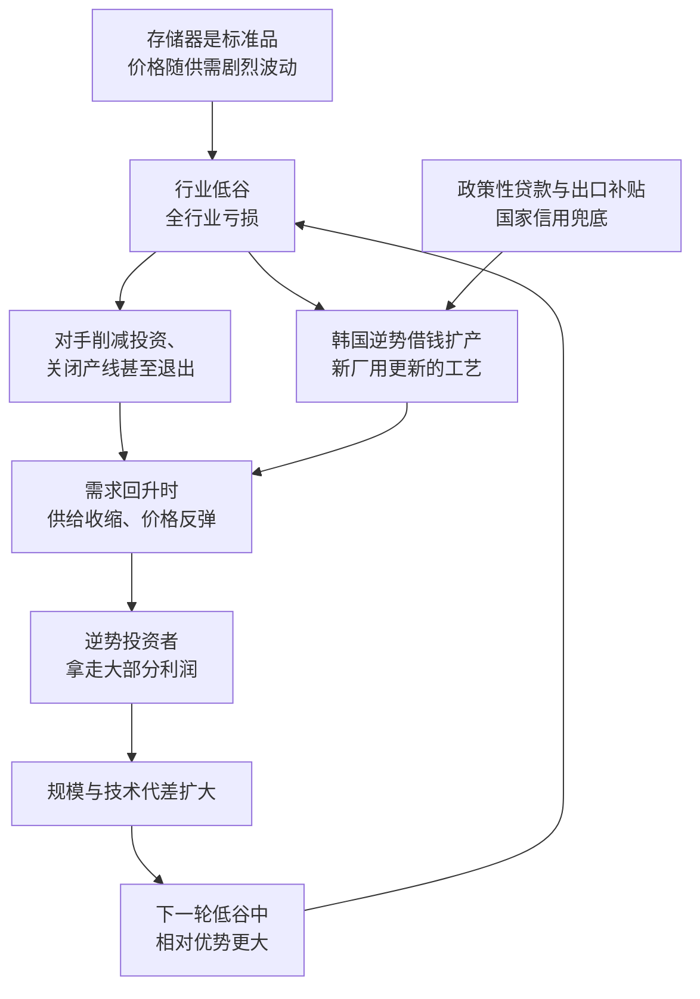

# 14｜韩国是怎么用一场“逆周期豪赌”上位的？

> 比日本更晚起步、没有技术积累的韩国，凭什么在存储器的血海里杀出重围？

---

## 一、先说结论

米勒的答案很直接：韩国的武器是**逆周期投资**。

存储器是一个强周期的生意，价格暴跌的时候人人亏损，大家的本能反应是削减投资、保住现金。韩国反其道而行：**在最惨的时候继续借钱建厂、继续上产能、继续买设备。** 等下一轮需求回升，只有它准备好了，于是它把对手一个个熬死。

三星的每一次豪赌，都是拿公司命运下注；而支撑这场豪赌的，是国家信用在兜底。

---

## 二、我们先理解一个问题

先摆一个背景：存储器是标准品，价格随供需剧烈波动，好年份暴赚、坏年份血亏。这个机制本身不难理解，真正的难题在策略层面。

1983 年三星宣布进军半导体的时候，日本企业已经拿下全球存储器市场的大半江山，而且工艺更成熟、成本更低、客户关系更稳固。韩国比日本起步更晚，技术要从零学，市场要从零挤。

那么问题就是：**一个后来者，凭什么在一个已经杀成血海的市场里赢？** 靠技术更好？不现实。靠成本更低？日本也不会主动让路。韩国手里真正多出来的东西，是别的东西。

---

## 三、作者到底提出了什么观点？

米勒把韩国的成功归结为两点：**逆周期投资的胆量，加上国家信用的托底。**

**第一，逆周期投资。** 存储器的周期规律是：需求下滑、价格崩盘、全行业亏损；随后产能出清、供给减少；需求一旦回升，价格迅速反弹，而那时还有能力供货的人赚得盆满钵满。于是决定胜负的不是繁荣期的表现，而是低谷期的选择——**谁能在最不该投资的时刻投资。**

**第二，规模与技术代差互相强化。** 逆周期扩产不只是加产能，还是在技术换代时抢占先机：新厂天然用更新的工艺，更新的工艺带来更低的单位成本，更低的成本又支撑更大的规模，规模再摊薄研发与折旧。这个循环一旦转起来，后来者就变成了领先者。

**第三，国家信用兜底。** 逆周期投资需要巨量、长期、且能在低谷中继续供给的资金。韩国的财阀并不是靠自有现金流完成这场赌博的：政策性贷款、出口补贴，以及政府与金融体系的支持，才是背后的杠杆。

---

## 四、把这个观点翻译成人话

别人在冬天烧柴取暖，韩国在冬天买地盖房。

它赌的不是自己的运气，而是周期一定会回来。等到春天，别人手里只剩烧完的柴，它手里有新厂房和新产线。

但这个比喻要补一句：**冬天盖房的前提，是有人肯在冬天借钱给你，而且你撑得到春天。** 所以韩国真正的武器不是“胆量”，而是“胆量加上融资能力”——同样的胆量，放在一个融不到钱的企业身上，就是自杀。

---

## 五、为什么会这样？

这条链条里最关键的一步，是 **E → D**。

为什么融资结构这么关键？因为逆周期投资在商业逻辑上是“反人性”的：在亏损最严重、股价最低、董事会最恐慌的时候，你要做出金额最大、风险最高的投资决定。没有外部信用支持，这个决定几乎不可能被通过。**所以韩国的胜利，本质上是融资制度的胜利。**

---

## 六、举一个现实生活中的例子

三星的两个时刻最能说明问题。

**第一个时刻是 1983 年。** 三星的创始人李秉喆在东京宣布进军半导体（这一宣布后来被称为“东京宣言”），当年就开发出 64K DRAM，次年实现量产。从一个没有半导体基础的公司，到量产当时主流的存储产品，只用了很短的时间——这背后是引进技术、招揽人才和巨额投入的组合。

**第二个时刻是 1997 年。** 亚洲金融危机席卷韩国，外汇告急、企业负债率极高，整个国家都在收缩。三星却在行业寒冬中继续投资扩产，靠的是政府与金融体系的支持。等到危机过去、需求回暖，它的产能与技术代差同时到位——此后，三星在 1990 年代中后期成为全球最大的 DRAM 厂商，并长期占据存储器市场的顶端位置。

**对照来看，三星的内部改造同样重要。** 1993 年，会长李健熙在法兰克福发布“新经营”宣言，留下了那句著名的话：“除了老婆孩子，一切都要变。”这句话针对的不是产能，而是组织与文化——从追求数量转向追求质量。**外部赌周期，内部改组织，两件事合起来才是完整的故事。**

---

## 七、回到书中重新理解

米勒把韩国放在美日争霸之后，是因为韩国的上位与日本的退潮是同一件事的两面。

日本的成功让存储器变成了一门“规模加成本”的生意。而当一个产业变成这样，它就会奖励最敢下注、最有融资能力的玩家。韩国接过了日本的剧本，并且在危机中把它推到了极致：**不只是扩张，而是在所有人收缩的时候扩张。**

同时，这种模式也埋下了隐患。1997 年的金融危机本身就是高杠杆模式的一次清算，而韩国挺过来了——代价是整个国家的金融体系都被卷了进去。米勒的叙述里没有把这场豪赌写成轻松的成功学：它赢了，但它赢得很险。

---

## 八、这个观点背后还有什么？

**第一，周期行业的胜负在低谷决定。** 繁荣期大家的报表都好看，真正拉开差距的是低谷期的选择。这也是存储器行业反复上演的规律。

**第二，融资结构决定战略能力。** 不同的金融体系支持不同的打法：政策性金融能支持长期、反周期的重资产投资，资本市场则更偏好短期回报。同一门生意，在不同融资结构下会走出完全不同的路径。

**第三，财阀模式的双面性。** 集中资源能打大仗——举全集团之力押注一个方向；但风险也集中，一次判断错误可能拖垮整个集团，甚至拖累国家。

**第四，技术学习不是自动的。** 韩国的赌注不只是产能，还包括在每一代技术上紧跟最前沿。如果只扩产不升级，逆周期投资就会变成一场没有回报的消耗。

---

## 九、这个观点有问题吗？

**有说服力的地方：** 时间线与解释吻合——韩国在几轮行业低谷中持续投资，最终在 1990 年代中后期登顶全球存储器市场。逆周期投资此后也成了这个行业的标准打法之一。

**存在争议的地方：** 一些学者认为，把三星的成功主要归因于逆周期豪赌，会低估另外两个因素。一是技术与人才的学习：引进技术、招揽有经验的工程师、与外部企业合作，都不是“有钱就能办到”的事。二是外部条件：日本企业在 1990 年代陷入自身的困境，投资能力下降，这给了韩国宝贵的窗口期。

**也可能过度简化：** 政府信用兜底听起来像一条万能公式，但现实是，同样获得政策支持的财阀里，并非每一家都成功了。**赌注本身不是保证，赌对方向、赌对时点，并且真的把工艺做出来，才是。**

**其他解释：** 也有学者强调，韩国赢在“组织能力”——能够把巨额投资、技术引进、人才招募和量产爬坡在极短时间内整合起来。这种执行力本身就是一种稀缺资源。

---

## 十、今天再看这个观点

**以下是基于米勒思想的现代延伸，不是作者原话：**

逆周期投资今天仍然是存储器行业的基本打法，但门槛变了。过去，决定胜负的是企业敢不敢下注、银行肯不肯借钱；今天，产业基金、国家资本和“供应链安全”的政治意志都加入了进来，**“谁能在低谷里继续投”越来越不只是企业的商业决策。**

这也带来一个新的问题：当所有主要玩家都能拿到国家支持、都学会了逆周期投资，这个策略就从“独门武器”变成了“入场券”。到那时，胜负会重新回到更朴素的地方——工艺、良率、成本和人才。

---

## 十一、这一篇真正应该记住什么？

1. **韩国的武器是逆周期投资。** 在人人收缩的行业低谷里继续建厂，用规模和代差把对手熬死。
2. **真正的门槛是融资能力。** 逆周期投资反人性，没有国家信用与政策金融兜底，这个决定很难做出、也很难坚持。
3. **周期行业的胜负在低谷决定。** 繁荣期看不出差距，低谷期的选择才决定谁能在下一轮拿走大部分利润。
4. **赌产能也要赌技术。** 新厂必须用更新的工艺，否则逆周期投资只会变成没有回报的消耗。
5. **豪赌赢得很险。** 这种模式把企业与国家金融体系绑在一起，成功与风险同样巨大。

---

## 十二、留一个问题

> 如果一个国家的优势来自“敢在冬天盖房子”，那么它真正的护城河是钱，还是让钱敢在冬天出场的那个制度？
> 更重要的是：当所有对手都学会了冬天盖房子，这招还灵吗？

---

**下一篇**：15｜张忠谋与台积电：代工模式为什么是天才的设计？一个 55 岁才开始创业的人，决定只做制造、永远不做设计——为什么这个看起来自断一臂的决定，反而催生了整个芯片设计产业？
