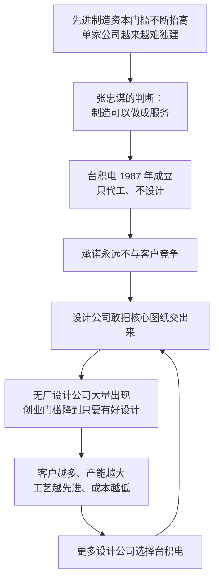

# 15｜张忠谋与台积电：代工模式为什么是天才的设计？

> 一个“只代工、不设计”的商业模式，凭什么能重塑整个芯片产业？

---

## 一、先说结论

米勒讲台积电的故事时，重点从来不是技术，而是**信任结构**。

在台积电之前，一家芯片公司必须自己设计、自己制造。台积电做的事情看起来很“低级”：只接订单、只做制造，不设计、不卖自己的产品。但它加上了一个决定性的承诺——**永远不与客户竞争。**

正是这个承诺，让所有设计公司都敢把最核心的图纸交给它。于是制造从“一家公司的能力”变成了“整个行业的公共基础设施”，无厂设计产业由此诞生。

---

## 二、我们先理解一个问题

先理解一个很朴素的困境。

假设你有一个很好的芯片设计，但你没有工厂。在 1980 年代，这不是一个可以绕开的问题：建一座晶圆厂要花巨额资金，而且工艺每几年就要升级一次，旧厂很快就不够用了。**有想法的人没钱建厂，有钱建厂的人未必有好想法。**

所以当时的行业形态是“垂直一体化”：设计、制造、封装、销售都在一家公司里完成。这个形态有个副作用：创新被资本门槛锁住了。没有几亿美元，就别想进入芯片业。

于是问题来了：**能不能把制造这件事单独拿出来，变成一种卖给所有人的服务？** 如果可以，为什么以前没人做成？

---

## 三、作者到底提出了什么观点？

米勒认为，张忠谋看准了两件事。

**第一，未来的瓶颈在制造，而不是设计。** 设计能力会随着工具与人才的普及而扩散，但制造能力会随着资本门槛的抬升而集中。谁掌握最先进的制造，谁就掌握了产业的地基。

**第二，制造可以做成中立的服务。** 关键在于信任：客户把最核心的设计交给代工厂，等于把命门交了出去。如果代工厂自己也做设计、也卖芯片，那么它就是客户最危险的竞争对手。**所以台积电必须放弃设计，而且必须公开、明确地承诺永不与客户竞争。**

这个承诺不是道德姿态，而是商业设计的一部分。米勒的洞察是：**台积电卖的不只是产能，还有“不竞争”的保证。** 而后者才是它真正的护城河。

---

## 四、把这个观点翻译成人话

想一家印刷厂。

如果这家印刷厂说：“我也写书，而且专写你最畅销的那一类。”那么没有任何一个作家敢把稿子交给它——因为它随时可以用你的稿子做出自己的书。

台积电说的是：“我只印书，不写书。”于是所有作家都来了，包括那些最怕被抄的人。

**中立性本身就是产品。** 它不能用技术优势替代，也不能靠合同条款完全替代——它必须体现在商业模式上：只要台积电自己卖一颗芯片，这份信任就崩了。

---

## 五、为什么会这样？

这条链条里最关键的一步，是 **D → E**。

为什么信任这么值钱？因为芯片设计是高度保密的资产，一次泄露就可能毁掉一家公司。代工模式要成立，必须先解开这个“谁先信任谁”的死结。台积电的解法是：**用放弃一整块业务来换取信任。** 这在商业史上是很少见的自我约束。

---

## 六、举一个现实生活中的例子

台积电的起点，是一场国家级赌注。

张忠谋 1931 年出生，在德州仪器工作了二十多年，一直做到资深副总裁，却没有登上最高位置。1985 年，他回到台湾担任工研院院长；1987 年 2 月，台积电成立，他担任董事长。**那一年他 55 岁——在多数人的职业生涯里，这已经是准备交棒的年纪。**

股权结构说明了这件事的分量：台湾当局（国发基金等）出资约 48.3%，荷兰飞利浦出资 27.5%，台湾民间出资约 24.2%。政府几乎出了一半的钱，飞利浦作为外资股东还带来了技术授权与专利方面的支持。**换句话说，这不是一个人的创业，而是一个地区把资源押在一种还没被验证的商业模式上。**

而验证这个模式的，是客户的名单。英伟达、高通、苹果都成了台积电的客户；英伟达创始人黄仁勋多次公开强调与台积电之间的信任关系——一家设计公司把最核心的图纸交给一家有能力自己做芯片的公司，需要的正是这种承诺。苹果从 2016 年起把 A 系列芯片全部交给台积电代工，则是对这种信任关系最直白的背书。

**对照来看，“永远不与客户竞争”这句话的价值，恰恰体现在它拒绝了什么。** 台积电本可以像很多代工厂一样，看到某个产品赚钱就自己做；但它没有。三十多年里，这个承诺一直是它最核心的商业资产。

---

## 七、回到书中重新理解

把台积电放回米勒的叙事里，它的意义是**一次结构性的断裂**。

在这之前，芯片业的竞争单位是“公司”：谁的产品更好、更快、更便宜。在这之后，竞争单位变成了“环节”：谁在哪个环节最强。设计公司不需要建厂，工厂不需要做品牌，设备商不需要做芯片——每一段都可以独立成家。

这也解释了一个看似矛盾的现象：**制造外包出去之后，美国的芯片设计业反而更繁荣了。** 因为创业门槛下降了：一个几十人的团队，只要设计够好，就能用上世界最先进的制程。芯片业的创新从此不再被资本门槛卡住。

而制造这一段，则越来越集中在少数地方。米勒把这种集中称为效率的顶点——但效率的顶点，往往也是风险的顶点。

---

## 八、这个观点背后还有什么？

**第一，信任是可交易的资产。** 台积电用放弃设计业务换来了客户的信任，而这份信任此后不断产生回报：越多的客户带来越大的产能，越大的产能带来越先进的工艺。

**第二，中立基础设施有“公共品”属性。** 一旦全行业都依赖它，它就从供应商变成了单点——所有人都离不开，所有人也都在担心它。

**第三，规模在代工业里的作用与存储器不同。** 存储器靠规模压成本，代工靠工艺与信任取胜。这也是为什么代工龙头的位置，比存储器龙头的位置更稳固。

**第四，地缘后果是内生的。** 制造集中到一地，效率极高，风险也极高。这个后果不是意外，而是这种商业模式自然生长的结果——它直接引出了下一层的争论。

---

## 九、这个观点有问题吗？

**有说服力的地方：** 无厂设计产业的兴起、以及台积电此后长期占据晶圆代工市场的最大份额，都与“中立代工”的逻辑高度吻合。时间顺序也很清楚：先有承诺，后有生态。

**存在争议的地方：** 一些学者认为，代工模式的成功不能只归功于“信任”。更硬的条件同样关键：当地政府的资本、土地与政策支持，工研院积累的技术基础，从美国回流的人才，以及一个不可忽视的背景——美国企业在存储器战争中元气大伤，已经无力持续投资新厂，因此愿意把制造外包出去。**换句话说，代工模式的窗口，是别人让出来的一条缝。**

**也可能过度简化：** “永远不与客户竞争”这条承诺的边界，一直在被讨论。随着台积电在先进封装、设计参考流程等环节越做越深，它与客户之间的边界确实变得更模糊了。这不是说承诺失效，而是说**这个承诺的具体含义，需要随着业务演进而不断被重新界定。**

**其他解释：** 也有学者强调，台积电真正的能力在于“服务制造”——它把良率、交期、产能协调做成了一种别人很难复制的组织能力。这种解释与米勒的“信任结构”并不矛盾，但把重心放在了执行，而不是承诺上。

---

## 十、今天再看这个观点

**以下是基于米勒思想的现代延伸，不是作者原话：**

今天，主要经济体都在用补贴吸引先进制造落地，本质上是在尝试复制台积电的“基础设施”角色。但基础设施可以复制，信任结构很难复制：**一个由多国政府补贴、并且背负着各方政治期待的代工厂，客户会不会同样放心？**

另一个变化是，“中立”在今天变得越来越难。当制造能力本身成为地缘政治的焦点，代工厂的客户名单、产能分配，甚至工厂选址，都可能被当作政治问题来看待。台积电当年靠放弃一块业务换来的中立，如今要在更复杂的压力下继续维持——这才是它面临的新考验。

---

## 十一、这一篇真正应该记住什么？

1. **代工模式的颠覆性在信任结构，不在技术。** 台积电承诺永远不与客户竞争，才换来整个设计产业的信任。
2. **中立性本身就是产品。** 它必须体现在商业模式上，而不能只是口头承诺。
3. **它把制造变成了公共基础设施。** 设计公司不必建厂，创业门槛下降，无厂设计产业因此诞生。
4. **成功不只靠模式。** 政府资本、技术基础、回流人才与外部窗口期，都是代工模式得以成立的条件。
5. **集中是效率的顶点，也是风险的顶点。** 制造集中到一地，是这种商业模式自然生长的结果。

---

## 十二、留一个问题

> 台积电的护城河到底是它的工艺，还是它的“不竞争”承诺？
> 如果有一天客户不再相信这个承诺，或者这个承诺不再能换来中立，它还剩什么？

---

**下一篇**：16｜“硅盾”：为什么台湾的芯片产能让全世界睡不着觉？当全世界的先进芯片都集中在一座岛上，同一个事实为什么会推出完全相反的结论？
