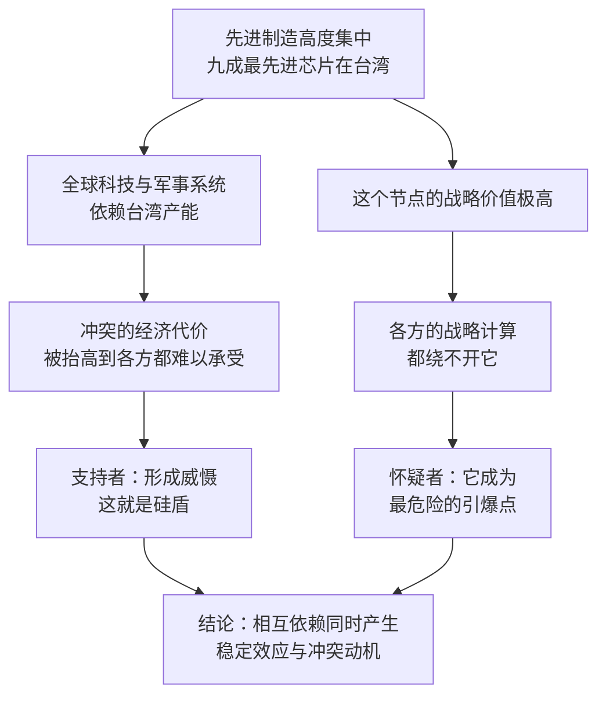

# 16｜“硅盾”：为什么台湾的芯片产能让全世界睡不着觉？

> 一座岛上的芯片工厂，为什么会被叫作“硅盾”？

---

## 一、先说结论

“硅盾”是一个地缘政治比喻，它指向一个事实：台湾生产了全球约九成的最先进芯片，台积电一家就占全球晶圆代工市场的一半以上。

这个事实带来了两种截然相反的推论。

**支持者认为，它是护身符。** 一旦台海发生冲突，全球最关键的科技供应链都会被摧毁，代价高到各方都难以承受，因此产能集中本身就构成一种威慑——别人需要你越深，就越不敢动你。

**怀疑者认为，它是风险源。** 正因为这个节点如此关键，它的安全与归属才具有极高的战略价值，各方的战略计算都会把它放在最优先的位置。过度集中的产能，本身就是风险。

米勒在书里呈现了这两种解释，他自己的倾向更接近两者并存：**硅盾既是护身符，也是风险源。**

---

## 二、我们先理解一个问题

“盾”是用来挡住攻击的。但这里说的盾，不是武器，也不是防御工事，而是一种**相互依赖**：因为别人离不开你，所以别人不敢毁掉你。

这个逻辑听起来很顺，但它有一个前提：**对方必须真的认为“离不开”这件事无法承受。**

于是问题就变成了：这种依赖真的能起到保护作用吗？它在什么条件下有效，在什么条件下会失效？——这才是“硅盾”这个概念真正值得讨论的地方。

---

## 三、作者到底提出了什么观点？

米勒的叙述分三层。

**第一层是事实。** 台湾生产全球约 90% 的最先进芯片；台积电占全球晶圆代工市场一半以上。这意味着从智能手机到数据中心，从汽车到军事系统，几乎所有先进计算都要经过台湾。米勒还提到一个很有冲击力的细节：**美国最先进的 F-35 战斗机，也依赖台湾制造的芯片。**

**第二层是“硅盾”论的推论。** 既然全球科技供应链如此依赖台湾，那么台海一旦发生冲突，各方的经济基础都会同时受到重创。这种相互依赖因此被视为一种威慑，也就是“硅盾”。

**第三层是反向推论。** 正因为这个节点如此关键，围绕它的安全与归属问题就变得格外重要，任何一方的战略计算都绕不开它。**关键到不能失去的东西，也往往是竞争最容易集中爆发的地方。**

需要说明的是，“硅盾”这个概念并非米勒首创，它在此前的政策与学术讨论中已经出现；米勒做的是把它放进整条产业链的历史里，让读者看到这个结构是怎么一步步形成的。

---

## 四、把这个观点翻译成人话

可以把它想成一个小区里唯一的一口井。

所有住户每天都要来打水，所以没有人想砸掉它——这是盾：**你的价值保护了你。**

但如果两个邻居为了这口井的归属争执起来，那么这口井也正是争执的原因——这是风险：**你的价值也让你成为目标。**

同一个事实，两种解释。区别不在于事实，而在于你假设各方会怎么计算代价：**是因为代价太大而克制，还是因为价值太高而冒险。**

---

## 五、为什么会这样？

这条链条里最关键的一点，是 **C 与 F 同时成立**。

依赖确实抬高了冲突的代价，这一点没有疑问；但依赖也抬高了控制这个节点的收益，这一点同样没有疑问。**当成本与收益被同时抬高时，结果取决于各方如何权衡，而不取决于依赖本身。** 这就是为什么同一个事实可以支撑两种相反的结论。

---

## 六、举一个现实生活中的例子

米勒书里那个关于 F-35 的细节，值得单独说一下。

美国最先进的战斗机，其芯片供应链也绕不开台湾。这个细节的意义不在于“台湾拥有武器”，而在于：**连实力最强的一方，也无法把自己的军事能力与这座岛完全解耦。** 这正是“硅盾”论最核心的经验基础——如果连美国都需要台湾的芯片，那么供应链的集中就不只是一个经济问题。

**对照来看一个近年的事例（这属于书出版之后的延伸）：** 2024 年 4 月 3 日，花莲发生 7.4 级地震，全球媒体的第一反应是关注台积电产线的恢复情况。这是一次自然灾害，却被当作全球供应链的风险事件来报道。这个反应本身就说明，“硅盾”的逻辑已经渗透进日常：**人们不需要讨论战争，也会本能地意识到那座岛上的工厂与自己的生活有关。**

---

## 七、回到书中重新理解

米勒把“硅盾”放在全书的靠后位置，是因为它是前面所有历史的一个合成结果。

日本、韩国、中国台湾的接力，把制造一步步集中到了一个地方；代工模式又让这种集中变得更深——因为中立的代工厂越成功，客户就越不需要自己建厂，集中度也就越高。于是这个节点同时成为**效率的顶点和风险的顶点**。

米勒的写法是克制的：他陈述事实，列出两种推论，然后提醒读者，相互依赖既可能是和平的压舱石，也可能是最危险的引信。**他没有给出一个确定的结论，而这个不确定性本身，就是他想传递的信息。**

---

## 八、这个观点背后还有什么？

**第一，集中与效率的悖论。** 全球分工追求效率，结果是把风险堆在一个点上。这是所有高度优化的系统共有的特征。

**第二，威慑不只来自军事。** 经济上的相互依赖也是一种威慑手段，但它的可靠性存在争议——历史上，经济代价并不总能阻止冲突。

**第三，盾需要各方都相信它。** 如果一方认为这种依赖可以被替代，比如通过自建产能、寻找替代供应商，那么盾的效力就会下降。**这也在一定程度上解释了为什么近年来各方都在补贴本土制造。**

**第四，关于当事人的态度。** 一些观察者认为，张忠谋本人对“硅盾”的说法持谨慎甚至怀疑的态度，他更强调半导体产业本身的全球化与相互依赖，而不是把产能当作政治筹码。这一点常被引用来说明：**产业界与政策界对同一件事的判断，未必一致。**

---

## 九、这个观点有问题吗？

**有说服力的地方：** 产能高度集中是公开事实；这种集中确实让各方在评估冲突代价时，必须把全球供应链的损失计算进去。

**争议一（概念层面）：** 一些学者认为，“硅盾”把复杂的安全问题简化成了经济依赖问题。历史上的相互依赖并不总能阻止战争——当政治与安全目标被认为足够重要时，经济代价可能被压过。

**争议二（时效层面）：** 也有学者指出，盾的效力可能随时间衰减。如果其他地区建成先进产能，或者技术路线发生转移，台湾的不可替代性就会下降。**换句话说，盾的厚度取决于别人有多难替代你。**

**争议三（反身性）：** 这是最耐人寻味的一点：正因为“硅盾”论流行，各方都开始为“供应链中断”做准备；而这种准备本身，又会削弱盾的效力。这是一个自我否定的逻辑——**谈论风险的人，正在改变风险的形状。**

**争议四（视角层面）：** 把台湾主要描述成“盾”或者“风险点”，也可能把当地社会自身的意愿与复杂性简化成一个供应链参数。这一点在公共讨论中经常被忽略，但它关系到任何分析的完整性。

**所以更稳妥的表述也许是：** “硅盾”是一个关于代价与动机的分析框架，而不是一个预言。它说明相互依赖会同时产生稳定与不稳定的力量，但哪一种力量占上风，取决于具体的选择与时间。

---

## 十、今天再看这个观点

**以下是基于米勒思想的现代延伸，不是作者原话：**

书出版于 2022 年，此后几年的趋势有两股，方向相反。

一股是**加固**：人工智能带来的算力需求，让先进制程的重要性进一步上升，短期内台湾产能的关键地位并没有下降。

另一股是**分散**：主要经济体纷纷把“供应链风险”写进产业政策，补贴本土先进制造，试图降低对单一节点的依赖。

这两股力量同时存在。哪一股更强，现在还没有答案。但可以确定的是：**“硅盾”的效力并不只由产能本身决定，还由别人为“不再需要它”付出了多少努力决定。**

---

## 十一、这一篇真正应该记住什么？

1. **“硅盾”的本质是相互依赖。** 它靠的不是武器，而是别人离不开你。
2. **同一个事实可以推出相反的结论。** 依赖既抬高了冲突的代价，也抬高了控制这个节点的收益。
3. **集中是效率与风险的同一种表现。** 全球分工把制造推向一个点，效率最高，风险也最高。
4. **盾的厚度取决于替代的难度。** 一旦别人能绕开你，保护作用就会下降——这也是各方补贴本土制造的原因之一。
5. **这是一个分析框架，不是预言。** 它提醒我们相互依赖会同时产生稳定与不稳定的力量，而不是告诉我们结果一定是什么。

---

## 十二、留一个问题

> 如果“硅盾”的效力来自别人离不开你，那么当所有人都开始想办法不再离不开你的时候，这面盾会变厚，还是变薄？

---

**下一篇**：17｜中国大陆的芯片产业是怎么起步的？同一条赛道上，还有一条追赶之路在同时展开——从买设备到建厂，再到举国基金，为什么每一步都这么难？
