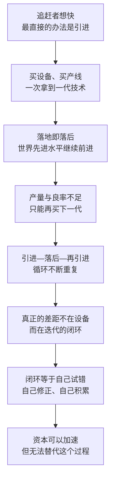

# 17｜中国大陆的芯片产业是怎么起步的？

> 中国在芯片上追赶了半个多世纪，为什么每一步都这么难？

---

## 一、先说结论

米勒在《芯片战争》里讲中国的那几章，有一条很清晰的线索：**中国大陆的芯片产业，走的是一条从“买设备”到“买公司”，再到“自己造”的路。**

这三个动作对应三个时代。1980 年代的 863 计划，想用国家科研攻关把技术“做出来”；1990 年代的 908 工程与 909 工程，想用合资引进把生产线“搬进来”；2000 年之后，张汝京带着一批海归在上海创办中芯国际，才第一次把接近世界水平的制造能力放到中国大陆的土地上；到了 2014 年，千亿级的大基金登场，追赶正式变成国家资本主导的长期工程。

但米勒真正想让人记住的，不是这些项目的规模，而是它们反复撞上的同一堵墙：**技术可以引进，产能可以买来，迭代能力只能自己长出来。**

---

## 二、我们先理解一个问题

一个后发国家要追赶一个先进产业，最自然的想法就是“买”：买设备、买产线、买图纸，钱够多的话，甚至可以把整家公司买下来。这条路看起来最短，也最省时间。

可芯片行业偏偏是这条路上最难走的一个。为什么？

因为芯片不是一件静态的产品，而是一条**会自己往前跑的终点线**。今天你花大价钱买到的设备，是世界先进水平；两年之后，它就成了“上一代”。你花钱买到的永远是别人今天的答案，而这场比赛考的是明天的答案。更麻烦的是，追赶者没有停下来的选项：一停，差距立刻重新拉开。

所以真正的问题不是“能不能买到”，而是：**买来的东西，能不能长成自己的能力？**

---

## 三、作者到底提出了什么观点？

米勒把中国的追赶拆成几个阶段，每一个阶段都比上一个更接近问题的核心。

第一阶段是国家科研攻关。863 计划在 1986 年启动，全称是国家高技术研究发展计划，半导体是重点方向之一。它要回答的是“要不要做、有没有人做”的问题——在当年，这已经是很重要的一步。但米勒的叙述里有一条隐含判断：从实验室成果到能赚钱的量产，中间隔着一条很宽的沟，科研项目跨不过去。

第二阶段是合资引进。1990 年代，中国先后推出 908 工程与 909 工程，试图通过与外资合资的方式建立本土的芯片制造能力，华虹与日本 NEC 的合资就是其中的代表。这一步比上一步更实际：直接学怎么建厂、怎么生产。结果却不理想——**引进的生产线常常一落地就落后于世界先进水平，而世界水平还在继续往前走。** 米勒把这种状态概括为“引进—落后—再引进”的循环。

第三阶段是海归创业。2000 年 4 月，中芯国际在上海成立，创办人是张汝京。他曾在德州仪器工作约二十年，之后创办世大半导体，那家公司后来被台积电收购，创办中芯国际已经是他的第三次创业。2004 年，中芯国际在香港和美国两地上市。这一次不一样的地方在于：跟着他回来的是一整批懂工艺、懂设备、懂管理的人。

第四阶段是国家资本。2014 年 9 月，国家集成电路产业投资基金一期成立，募资 1387.2 亿元；2019 年 10 月，二期成立，注册资本 2041.5 亿元。追赶从此有了一个可以持续输血的钱袋子。

米勒的落点在于：**产业政策可以提供资本、决心和市场规模，但它提供不了“迭代能力”。** 迭代能力是工程师在一次次流片、失败、修正中长出来的，它藏在细节里，不在合同里。

---

## 四、把这个观点翻译成人话

你可以买到全世界最好的钢琴，但买不到一双手。

你也可以把一整套顶级厨房搬回家，但厨艺不会跟着设备一起到货。设备是死的，能力是活的——它由无数次的失败、调整和重复构成，只能长在自己身上。

芯片业的残酷之处在于，它考的从来不是“能不能做出来”，而是“**能不能一直做出来、越做越好、越来越便宜**”。一次成功不算数，一百次稳定的成功才算数。这是一场关于节奏的比赛，而不是关于单点的比赛。

所以“引进—落后—再引进”的循环，并不是因为引进错了，而是因为引进只能解决起点，解决不了节奏。**买来的是一条产线，长不出来的是一整个学习的过程。**

---

## 五、为什么会这样？

把这条循环拆开看，逻辑是这样的：

链条里最关键的一步是 **E 到 F**。

为什么设备会“落地即落后”？因为芯片产业的进步不是靠某一台机器，而是靠整条线上所有环节同时改进：设备、材料、工艺参数、良率控制、工程师的判断。这些东西的共同点是——**它们只会随着生产本身而变好。** 你造得越多，才越知道哪里会出问题；你出的问题越多，才越知道怎么修。

这就是迭代能力。它不能被写进技术转让合同，因为它根本不是一份文档，而是一种组织记忆。米勒反复提示的正是这一点：**在芯片业，落后不是缺一台机器，而是缺一个能持续改进的系统。**

---

## 六、举一个现实生活中的例子

张汝京的轨迹，几乎就是这段历史的一个缩影。

他在德州仪器工作了大约二十年，那是一家把“制造纪律”刻进骨子里的公司；之后他创办世大半导体，把一家新厂从零带到有规模，最后被台积电收购；2000 年，他在上海创办中芯国际，开始第三次创业。

值得注意的是他带回来的东西。当然有资金、有设备、有订单，但最关键的是一批人——从海外回来的工程师和管理者，他们知道一条先进产线该怎么建、设备怎么调、良率怎么爬。**对于当时的中国大陆来说，这些人本身就是最接近“可迁移技术”的东西。**

中芯国际 2004 年在香港和美国上市，说明这条路径至少在资本市场上被认可了。但米勒的叙述也提醒我们：即便有这样一批人、这样一家公司，中国大陆与世界最先进水平之间的差距仍然存在，而且不是靠一次创业就能抹平的。**一个人可以把整套经验带回来，但他带不回那套经验继续生长的环境——环境必须自己建。**

---

## 七、回到书中重新理解

把中国放进全书的时间线里，米勒的用意会更清楚。

他写过几种不同类型的追赶者：日本用举国体制和联合攻关，把存储器做到了世界第一；韩国用逆周期豪赌，在价格最低谷的时候继续建厂；苏联则想靠复制美国的设计抄近路，结果永远差一代——**抄得到图纸，抄不到迭代**。中国大陆在很长一段时间里走的是另一条路：引进。

这条路本身没有错，日本和韩国早期也大量引进技术。区别在于时机和空间：日本、韩国在追赶的时候，全球的技术流动相对开放；而当中国大陆真正具备追赶能力的时候，这条通道开始被管制的墙堵住。于是题目变难了：**必须在技术流动被限制的条件下，自己长出一套迭代系统。**

米勒没有在书里下结论说这条路能不能走通。他给出的是一套判断标准：**看一个国家在芯片上有没有真本事，不要看它有没有某个产品，要看它有没有持续改进的能力。**

---

## 八、这个观点背后还有什么？

**第一，资本的规模说明决心，但不说明能力。** 大基金一期募资 1387.2 亿元，二期注册资本 2041.5 亿元，这是任何私人资本都很难独立承担的体量。但钱能买到产能、买到团队、买到时间，唯独买不到“经验必须经历的那几次失败”。

**第二，产业政策有一个隐含前提：只要投入足够，差距就能被补齐。** 这个前提在面板、光伏等行业里被部分验证过，但在芯片上要打个折扣——因为芯片的终点线移动得更快，而且它的关键环节更集中在少数外国公司手里。

**第三，追赶者最缺的可能不是钱，而是需求。** 一个愿意持续使用国产芯片的庞大市场，是唯一能提供“反复试错机会”的练兵场。没有订单，就没有迭代；没有迭代，就没有进步。

**第四，海归模式的价值与局限同样明显。** 人可以被请回来，但整个产业生态——供应商、客户、竞争、人才的再培养——必须在地生长。

---

## 九、这个观点有问题吗？

**有说服力的地方：** “引进—落后—再引进”这个循环是真实存在的，它精确地指出了后发追赶的结构性困境——你能买到的，永远是别人准备放弃的东西。而迭代能力只能自己长出来，这一点在芯片业的历史上被反复验证。

**存在争议的地方：** 一些学者认为，米勒对中国产业政策的长期作用估计偏低。中国大陆在成熟制程、封装测试、部分设备和材料上确实逐步站住了脚，这些进展不是靠某一次引进完成的，而是长期投入的结果。也有研究者指出，把几十年的产业史压缩成一条“引进—落后”的曲线，会忽略阶段之间的巨大差异：1990 年代的中国和 2010 年代之后的中国，手里的牌完全不同。

**可能过度简化的地方：** “买设备、买公司、自己造”这三步，在叙述上很整齐，但现实中它们是并行发生的——中国大陆从来没有停止过自主研发，也从来没有放弃过引进。三者之间不是替代关系，而是同时下注。

**还有别的解释：** 追赶速度不只取决于自身努力，也取决于外部环境。全球分工的位置变化、下游市场的爆发、外部管制的松紧，都会显著改变追赶的难度。**把结果全部归因于“能力有没有长出来”，可能低估了运气与时机的分量。**

---

## 十、今天再看这个观点

**以下是基于米勒思想的现代延伸，不是作者原话：**

《芯片战争》出版之后，形势继续沿着米勒描述过的轨迹演进：管制的范围不断扩大，“买设备”和“买公司”这两条路都明显变窄，剩下的选择几乎只有“自己造”。与此同时，国家资本的投入规模继续放大，成熟制程成为最主要的战场，国产设备与材料被推到台前。

如果米勒的框架成立，那么判断进展就不该只看某个产品的突破，而要看三件事：**工艺改进的速度是否在加快，上下游是否开始互相喂养，人才是否能在地持续培养出来。** 单点突破可以靠集中力量实现，而迭代能力只能靠时间。

这也意味着，接下来的竞争很可能不是“谁先造出某颗芯片”的竞争，而是**两套产业体系各自生长速度**的竞争。

---

## 十一、这一篇真正应该记住什么？

1. **中国大陆的芯片之路是三步：买设备、买公司、自己造。** 每一步都比上一步更接近问题的核心。
2. **“引进—落后—再引进”的根源，是迭代能力无法转让。** 买得到设备，买不到让设备持续变好的那套系统。
3. **产业政策能提供资本、市场与决心，提供不了工艺节奏。** 1387.2 亿元能买很多东西，但买不到“必须经历的那几次失败”。
4. **人是最接近“可迁移技术”的东西。** 张汝京带回来的工程师团队，比任何一台机器都更接近能力的本体。
5. **终点线一直在移动。** 追赶的目标不是今天的芯片，而是两年后的芯片——这决定了追赶永远是一场关于速度的比赛。

---

## 十二、留一个问题

> 如果一个产业的能力只能从自己的试错里长出来，那么国家资本最应该买的，究竟是设备、是人，还是时间？

---

**下一篇**：当中国大陆的产业能力一步步长出来之后，为什么最先被瞄准的不是芯片公司，而是两家做通信设备的公司？中兴和华为究竟站在了哪个位置上，才会让大洋彼岸的管制第一枪，打向它们？
