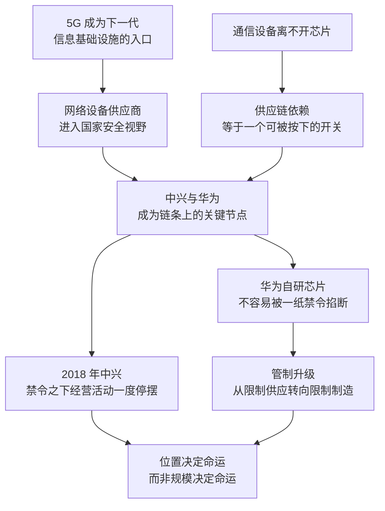

# 18｜为什么中兴和华为先后成为靶子？

> 为什么美国“芯片战争”的第一枪，打向的是两家通信设备公司？

---

## 一、先说结论

米勒的判断可以概括成一句话：**因为中兴和华为站在了“芯片—通信—国家安全”的交汇点上。**

5G 不只是网速更快。在米勒的叙述里，它被视为未来信息基础设施的入口：工厂、电网、港口、交通、甚至军事通信，都可能挂在同一张网上。谁提供这些设备，谁就在某种意义上参与了一个国家的神经系统。而华为的特殊之处还不止于此——它有自己的芯片设计能力，这让它不像一家纯粹的组装厂那样可以被轻易掐断。

于是出现了两个先后发生的标志性事件：2018 年的中兴事件，证明了“一纸禁令”的威力；2019 年之后的华为事件，则证明了这种威力的极限。

---

## 二、我们先理解一个问题

在 2018 年之前，芯片领域的摩擦已经存在了很多年，但火力为什么没有首先落在手机厂商、电脑厂商身上，而是先落在两家做通信设备的公司身上？

答案要从它们卖的东西说起。一部手机卖不动，影响的主要是一家公司的营收；一张通信网络由谁来建，影响的却是一个国家信息流动的方式。通信设备不是消费品，它是基础设施。

所以问题变成了：**当一个产业的产品变成了别国的基础设施，这个产业里的公司，还能不能只被当作公司来看待？**

---

## 三、作者到底提出了什么观点？

米勒的观点可以拆成三层。

**第一层：通信基础设施天然是国家安全议题。** 5G 被普遍视为下一代信息基础设施的底座，它的价值不在于让手机下载更快，而在于把更多东西连上网络。这意味着网络设备的供应商，会进入各国安全部门的视野——不是因为设备本身危险，而是因为位置太关键。

**第二层：供应链依赖就是一个可以被按下的开关。** 中兴高度依赖美国的芯片和元器件，这个事实在平时只是成本账，到了冲突时刻就变成了杠杆。禁令一出，中兴的主要经营活动一度停摆。米勒想说明的是：**在全球分工的链条上，依赖越深，被人按住的能力就越强。**

**第三层：自研能力会改变博弈结构。** 华为在 2004 年成立了海思半导体，这让它拥有了芯片设计能力，米勒因此把华为描述为一个“无法被轻易控制的节点”。对管制方来说，这意味着一纸禁令不足以让它停下——管制必须升级，从限制芯片供应，升级到限制制造环节。

---

## 四、把这个观点翻译成人话

卖手机，像是卖家电；建通信网络，像是修铁路。

家电坏了，最多是用户抱怨；铁路的走向、由谁运营，从来都是国家层面的事。通信设备公司之所以被另眼相看，就是因为它们修的是信息时代的铁路。

再换一个比喻：**买芯片的公司是租客，能自己设计芯片的公司是房东。** 租客再有钱，房东一句“不租了”，租客就得搬家；而房东至少还有谈判的余地。但房东也有自己的软肋——设计图纸可以自己画，房子却不一定能自己盖。华为后来的处境，正好证明了这一点。

所以中兴与华为的区别，不在于谁更大，而在于**它们被按住的位置不同**：一个被按住的是采购，一个被按住的是制造。

---

## 五、为什么会这样？

这条逻辑链大致是这样的：

链条里最关键的一步是 **G 到 H**。

如果只限制芯片供应就能让一家公司停摆，那故事在 2018 年就结束了。但华为有海思，能自己设计芯片，于是管制必须往下游走——走到代工制造这一环。2020 年 9 月 15 日起，受美方管制影响，台积电停止为华为代工。**这说明一件事：只要链条上还有一环在别人手里，自研就只能延长抵抗的时间，不能取消依赖。**

---

## 六、举一个现实生活中的例子

先看中兴。2018 年 4 月 16 日，美国商务部以中兴违反此前达成的制裁协议为由，禁止美国企业向其出口零部件。禁令之下，中兴的主要经营活动一度停摆。同年 7 月，双方达成和解：中兴支付 10 亿美元罚款并缴纳 4 亿美元保证金之后，禁令解除。**这是一个教科书式的演示：一纸文件，就能让一家大型科技公司几乎停转。**

再看华为。华为 1987 年由任正非创立，2004 年成立海思半导体。2018 年 12 月，孟晚舟在加拿大被捕，2021 年 9 月回国。2019 年 5 月 16 日，华为及数十家关联公司被列入美国实体清单。2020 年 9 月 15 日起，受美方管制影响，台积电停止为华为代工。

面对断供，华为启动“备胎转正”，海思芯片与鸿蒙系统走到台前。**这就是两个案例最大的差别：中兴的脆弱来自依赖，华为的韧性来自提前准备。** 但华为的韧性也有边界——设计可以自研，制造要靠代工厂，所以管制最终打到了制造环节，而不是停在设计环节。

---

## 七、回到书中重新理解

米勒把华为放在 5G 与芯片的交汇点上：5G 与芯片自研能力，让华为成为“无法被轻易控制的节点”。这个判断有两层含义。

一层是技术上的：能设计芯片的公司，在供应链上比纯采购方更有回旋空间。另一层是政治上的：当一家公司的设备被大量装进别国的通信网络，它就不再只是一家外国供应商，而会被当作一个战略变量来对待。

书中也记述了围绕通信安全的政策辩论如何进入大国关系：美方以国家安全为由推动限制，并动员盟友采取类似立场；华为方面则一直否认相关指控。**围绕这些指控，各方说法长期不同，学界与政策界的争论也持续存在。** 米勒没有把这场争论写成定论，他写的是它如何改变了产业的走向。

---

## 八、这个观点背后还有什么？

**第一，管制的对象在变化：从“行为”转向“能力”。** 中兴的案例带有处罚性质，指向的是具体行为；华为的案例更接近于对技术能力的限制，指向的是“你能不能做出先进的东西”。这是一次性质上的升级。

**第二，清单提供的是“点名”能力。** 一家公司一旦被列入实体清单，它的供应链就会从美国技术这一端被收紧，这比针对某一笔交易的限制要彻底得多。

**第三，事件把公司、国家与司法绑在了一起。** 孟晚舟事件就是一个典型：美方提出了违反制裁与银行欺诈方面的指控并寻求引渡，中方认为这是一起政治事件，华为方面否认相关指控。**同一件事，各方给出了完全不同的解释框架。**

**第四，供应链上的其他公司也被迫做选择。** 供应商、代工厂、盟友企业夹在规则与市场之间：一边是合规要求，一边是收入与客户关系。管制的成本从来不只由被管制者承担。

---

## 九、这个观点有问题吗？

**有说服力的地方：** 中兴的案例确实证明了依赖的脆弱性——这不是理论推演，而是一次真实的压力测试。5G 作为基础设施的定位也是真实的：它确实比前几代通信技术更深地嵌入经济与社会运行。而华为的自研能力确实改变了管制的路径，这一点从规则后来必须延伸到制造环节就能看出来。

**存在争议的地方：** 关于安全指控本身，公开证据的充分程度一直是争论焦点。一些学者认为，其中混合了技术竞争与地缘政治因素，把商业公司安全化会带来长期的制度成本；另一些学者则认为，关键基础设施的安全关切是合理的政策议题，不能等出事之后再补。**这是学界与政策界长期存在分歧的问题，没有共识答案。**

**可能过度简化的地方：** 把中兴与华为并列为同一类案例，会掩盖两者之间的重要差异。中兴的困境源于自身违规与高度依赖，华为的处境更多来自它的技术能力与市场地位；两家公司的规模、治理结构、应对能力也不在同一个量级。把两件事讲成一个故事，容易得出过于整齐的结论。

**还有别的解释：** 标准话语权之争、市场份额竞争、5G 商用节奏的先后，都可能影响政策出手的时机。把这一切只归因于安全考虑，会漏掉产业竞争的动机；只归因于产业竞争，又会漏掉安全部门真实的担忧。

---

## 十、今天再看这个观点

**以下是基于米勒思想的现代延伸，不是作者原话：**

《芯片战争》出版之后，这条线索继续延伸：被列入各类限制清单的中国企业数量增加，管制的范围从通信设备扩展到更多技术领域；华为则在压力下重构自己的供应链，把业务重心向国内与多元化方向调整。孟晚舟 2021 年 9 月回国，也让这一事件的司法与外交层面告一段落。

如果米勒的框架成立，那么接下来值得关注的不是“某家公司能不能活下来”，而是三个更结构性的问题：**基础设施的安全化会不会成为常态？企业为不确定性付出的成本由谁承担？以及，当供应链的信任被消耗之后，还有多少合作空间可以保留？**

---

## 十一、这一篇真正应该记住什么？

1. **位置决定命运。** 站在“芯片—通信—国家安全”交汇点上的公司，会被当作基础设施而不是普通企业来对待。
2. **依赖就是开关。** 中兴事件证明，一纸禁令足以让一家大型科技公司的经营活动一度停摆。
3. **自研是缓冲垫，不是护身符。** 海思让华为多撑了很久，但制造环节仍然要靠代工厂，所以管制最终打到了制造端。
4. **管制的对象在升级。** 从针对具体行为，到针对技术能力；从限制芯片供应，到限制先进制造。
5. **安全叙事里，证据与信任同样是战场。** 各方说法长期不同，判断时需要区分事实、指控与解释框架。

---

## 十二、留一个问题

> 如果一家公司的产品被视为别国基础设施的一部分，它还能不能只按商业逻辑做决定？反过来，如果一个国家可以随时切断别人的供应链，企业又该如何为这种不确定性定价？

---

**下一篇**：要切断一条供应链，靠的不是领土，而是技术。美国凭什么能管到一家荷兰公司卖机器给中国？这套被反复提到的工具箱里，究竟装了哪几件东西？
