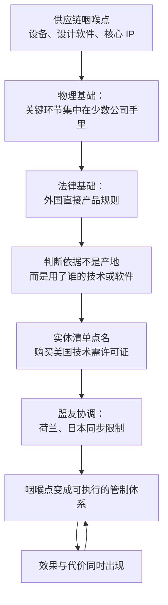

# 19｜美国的“卡脖子”工具箱里到底有什么？

> 美国凭什么能管到一家荷兰公司卖机器给中国？

---

## 一、先说结论

米勒给出的答案有点反直觉：**美国管制的力量不来自领土，而来自“技术含量”。**

一台在荷兰组装、准备卖给中国客户的机器，为什么需要美国点头？因为这台机器里包含了美国来源的技术、软件或零部件。美国的规则主张：只要一件产品在生产过程中使用了美国的技术或软件，美国就主张对它拥有管辖权——这就是外国直接产品规则。

在这套逻辑之上，美国还配了两个放大器。一个是实体清单，把特定公司排除在美国技术之外；另一个是盟友协调，让日本、荷兰这些掌握关键环节的国家采取同样的限制。三者叠加，供应链上的咽喉点就从地理事实，变成了一套可执行的管制体系。

---

## 二、我们先理解一个问题

一个国家的法律，通常只管自己境内发生的行为。可现实是：一家荷兰公司、一台荷兰制造的机器、一个中国客户，三方都不在美国境内，美国却能让这笔交易停下来。

这件事之所以值得追问，是因为它不能只用“实力强”来解释。实力强只能说明它有动机，不能说明它凭什么合法地、可持续地做到这一点。**真正的问题是：实力是怎么被翻译成规则的？**

要回答这个问题，得先看清楚两件事：供应链上最关键的东西握在谁手里，以及美国的规则凭什么能管到境外产品。

---

## 三、作者到底提出了什么观点？

米勒的分析可以拆成四层。

**第一层，物理基础：咽喉点。** 管制能生效，前提是供应链上存在少数难以替代的环节——最先进的制造设备、核心设计软件、关键的知识产权。这些东西不是谁都能做的，而它们恰好集中在少数国家和公司手里。

**第二层，法律基础：技术含量。** 外国直接产品规则把管辖权的判断标准，从“产品在哪里制造”改成了“产品在生产中用了谁的技术”。2020 年 5 月，这套规则被扩展适用于华为；2022 年 10 月，又被扩展适用于先进计算芯片。

**第三层，执行基础：清单与许可证。** 实体清单由美国商务部工业与安全局管理，1997 年设立。被列入清单的公司，需要获得许可证才能购买美国的技术产品，而这类许可证通常很难获批。清单提供的是“点名”能力，许可证提供的是“开关”能力。

**第四层，放大基础：盟友协调。** 如果只有美国一家限制，被管制方还可以从别处买到同样的东西。只有掌握关键环节的盟友同步跟进，限制才真正合围。这也是为什么美国要反复与日本、荷兰等国交涉。

---

## 四、把这个观点翻译成人话

它不是设一道边境墙，而是在每一件商品里埋一个“美国成分”的开关。

边境墙的逻辑是：不让你进来。而这套规则的逻辑是：不管你在哪里造、卖给谁，只要你的东西里带着我的技术，我就有话说。**它管的不是地理位置，而是技术的血缘。**

换个比喻：这就像物业门禁。物业并不管你住在哪一栋、去哪里买菜，但它管你手里那张卡是谁发的。卡一旦被停掉，你的活动范围立刻就变了——不是因为你搬家了，而是因为你的通行资格变了。

所以这套工具箱里最厉害的不是清单，而是那条把“技术含量”当成管辖依据的规则。**清单是点名，规则才是边界。**

---

## 五、为什么会这样？

把整条逻辑串起来，大致是这样：

链条里最关键的一步是 **C 到 D**。

如果管辖依据是产地，那么只要把生产线搬出美国，规则就管不到了。可一旦管辖依据变成“技术含量”，规避的成本就完全不同了：你不仅要换掉一个零件、一台设备，而是要重建整套技术来源。**这正是这套规则的设计意图——让绕开的代价高到不值得绕。**

---

## 六、举一个现实生活中的例子

来看一台荷兰光刻机。

光刻机是人类造过最复杂的机器之一，一台机器由数量惊人的零部件组成，供应商遍布全球。米勒在书中记述，美国官员曾多次与荷兰政府以及 ASML 交涉，阻止把 EUV 光刻机卖给中国客户。美国之所以有底气这样做，原因有两层：一是这台机器里含有美国来源的技术与部件，因而落入美国规则的管辖范围；二是光刻机本身就是整条供应链上最难替代的咽喉点——没有它，先进制程无从谈起。

**一台机器的国籍是荷兰，但它的技术血缘是全球的，其中相当一部分来自美国——这就是它会被美国规则管住的原因。**

对照来看，管制随后明显升级。2022 年 10 月 7 日，美国出台了一轮覆盖面很广的芯片管制：限制 16 纳米与 14 纳米以下逻辑芯片、18 纳米以下 DRAM、128 层以上 NAND 的相关设备与技术出口到中国，限制美籍人员参与中国的先进制程，并对先进计算芯片的对华出口加以管制。2023 年 10 月，AI 芯片方面的管制进一步收紧。与此同时，美国推动日本、荷兰等盟友同步限制设备出口，荷兰从 2023 年起限制部分 DUV 光刻机的出口。

这里有一个容易被忽略的变化：**管制的单位从“产品”变成了“能力”。** 不是不许卖某一台机器，而是不许帮你获得某一代制造能力。这比禁售某件商品要难对付得多，因为它没有明确的清单边界。

---

## 七、回到书中重新理解

米勒把这套做法称为把相互依赖“武器化”。

全球分工本来是为了效率：每个国家做自己最擅长的一段，成本最低、进步最快。但分工的副产品是集中，而集中的副产品是杠杆——每个环节的垄断者，都握着别人绕不过去的东西。管制做的事情，就是把这些杠杆从经济事实变成政策工具。

所以米勒的框架里有一个很关键的判断：**在这场博弈里，重要的不是谁的地盘大，而是谁握着别人绕不过去的东西。** 一个国土面积不大的国家，只要在某个环节上不可替代，就能影响整条链的走向；反过来，一个经济体量很大的国家，如果在关键环节上依赖别人，也会在关键时刻受制。

---

## 八、这个观点背后还有什么？

**第一，这套规则的判断逻辑是“技术血缘”而非“生产地”。** 它把出口管制的适用范围，从美国境内的交易，延伸到了境外使用美国技术生产的、再转卖给第三方的产品。理解这一点，才能理解为什么管制的覆盖面会显得如此之广。

**第二，许可证制度是这套体系的日常形态。** 规则写在纸上，执行靠审批：哪些申请能批、要审多久、需要什么证明，都会直接改变企业的行为。对企业来说，最昂贵的往往不是被拒绝，而是不知道会不会被拒绝。

**第三，盟友协调有政治成本。** 盟友企业会失去市场，盟友政府会担心主权与产业竞争力，国内也会有反对声音。协调的深度，决定了管制的成色——**没有同步，限制就会被绕开；同步得太深，代价又要盟友自己承担。**

**第四，被管制方会做出反应。** 寻找替代供应商、加大自研投入、重构供应链，都是可预期的应对。管制越严，这些应对的动力越强。

**第五，范围与精度之间存在矛盾。** 覆盖面越大，规避的动力越强；规则越精细，执行越复杂、漏洞越多。这套体系从来不是一劳永逸的开关，而是一场持续的补漏。

---

## 九、这个观点有问题吗？

**有说服力的地方：** 中兴的案例证明了管制在现实中的威力；外国直接产品规则确实能把管辖延伸到境外生产的产品，这一点在规则文本和实际案例中都能看到；盟友协调也确实让限制更难被绕开。米勒把“咽喉点”与“规则工具”连起来的思路，解释力很强。

**存在争议的地方：** 长臂管辖的合法性与正当性，长期存在争论。一些国家与学者认为，把本国规则适用于境外生产、境外交易，超出了国际法的通常理解，是对他国主权的侵犯；美国方面则认为，这是防止规避、维护管制效果的必要手段。**关于这一问题，学界与国际社会存在不同解释，没有统一结论。** 也有研究者指出，这套体系的效力高度依赖盟友配合，一旦盟友不愿继续承担代价，管制就会出现漏水。

**可能过度简化的地方：** 把管制想象成一个“开关”会失真。真实世界里，它是一套需要不断更新、需要执法资源、会被规避、需要打补丁的过程。规则写得越细，企业越会寻找规则没有覆盖的路径。

**还有别的解释：** 管制的实际效果还取决于技术替代的速度、市场规模的大小、以及企业游说的力量。把这些变量全部归到规则本身，会高估法律工具的威力。

---

## 十、今天再看这个观点

**以下是基于米勒思想的现代延伸，不是作者原话：**

《芯片战争》出版之后，这套工具箱继续扩充：管制清单越来越长，AI 芯片的规则多次调整，设备与技术的限制范围也在扩大；荷兰与日本的限制陆续落地，管制的重心从单点产品转向整代制造能力。

如果米勒的框架成立，那么判断这套工具箱的走向，要看三个变量：**盟友的配合意愿还剩多少，规则的可执行性能维持多久，以及替代技术出现得有多快。** 前两个决定管制的当下效力，第三个决定管制的长期边界。

值得注意的是，管制的成本并不会自动消失：它会被分摊到企业收入、盟友关系、以及供应链的信任存量上。这些代价在短期内看不见，在长期里却会改变很多人的选择。

---

## 十一、这一篇真正应该记住什么？

1. **管制的力量来自技术含量，不来自领土。** 判断依据是产品用了谁的技术，而不是在哪里制造。
2. **外国直接产品规则是这套工具箱里最关键的一件。** 它把管辖权延伸到了境外生产的、转卖第三方的产品。
3. **实体清单提供“点名”能力，许可证提供“开关”能力。** 二者配合，构成日常执行的形态。
4. **盟友协调决定管制的成色。** 没有同步，限制就会被绕开；同步太深，代价由盟友分担。
5. **这不是一个开关，而是一场持续的补漏。** 范围与精度互相冲突，规避与更新同时进行。

---

## 十二、留一个问题

> 如果一套规则的力量来自“技术含量”，那么当被管制的一方把技术含量一点点替换掉之后，这套规则的边界会停在哪里？而在替换完成之前，断裂的供应链又该由谁来付账？

---

**下一篇**：工具已经摆在桌面上了，真正的问题才刚开始——出口管制到底是在延缓追赶，还是在逼对手加速自立？同一套政策，为什么会有两套完全相反的解读？
