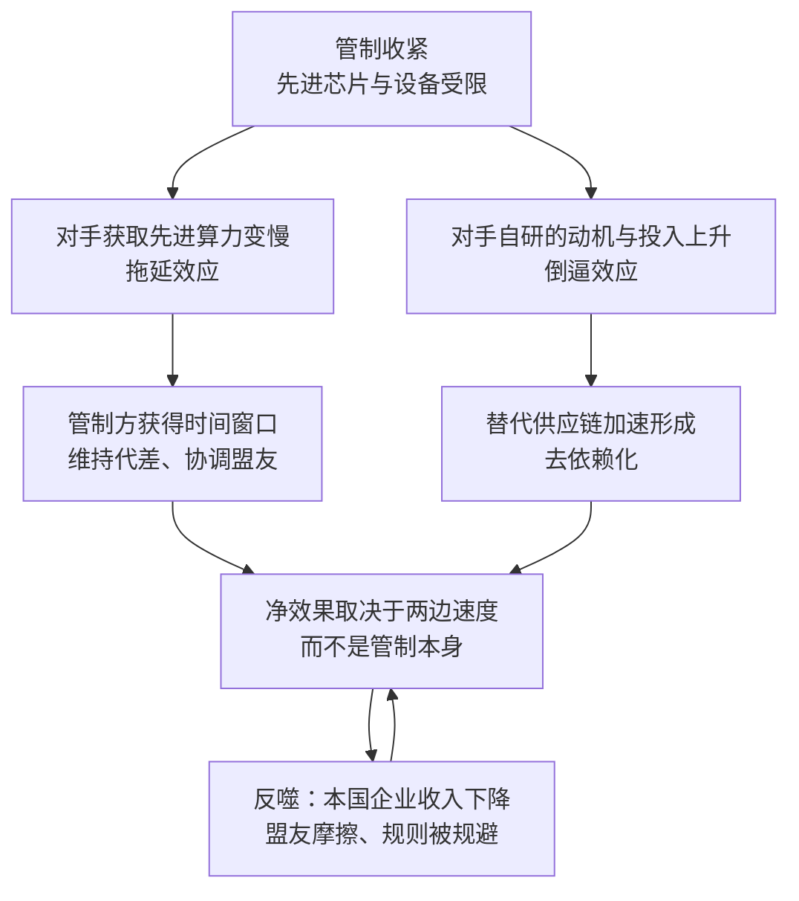

# 20｜“卡脖子”真的有效吗？

> 出口管制到底是在延缓中国的追赶，还是在逼中国加速自立？

---

## 一、先说结论

米勒的判断更接近八个字：**拖延有效，封锁无效。**

他认为管制确实能拖慢中国获得先进算力的速度，也能为管制方争取到一段宝贵的时间窗口——维持代差、协调盟友、给自己的产业补课。但他同样不认为封锁能终结追赶：技术封锁无法替代自身的持续创新，而管制本身会制造出最强的动员理由。

所以这是全书最尖锐的一处争议。同一套政策，在支持者眼里买到的是时间，在反对者眼里浇下的是催化剂。而米勒的立场，恰好落在两者之间：**能拖慢速度，但拖不出终局。**

---

## 二、我们先理解一个问题

要评价管制有没有效，得先确定用什么尺子量。

如果标准是“让对手永远追不上”，那么历史上几乎所有的技术封锁都失败了——被封锁的一方最终大多还是做出了东西，只是慢一些、贵一些。如果标准是“让对手慢几年”，那么答案可能完全不同：几年时间，足以决定一代产品、一批订单、甚至一段联盟关系的走向。

所以真正的问题不是“有效还是无效”，而是：**它究竟买到了什么，又付出了什么？** 把这两个问题分开看，争议才可能被看清楚。

---

## 三、作者到底提出了什么观点？

米勒在书中的判断可以拆成四点。

**第一，管制能拖慢，但不能终结。** 限制先进芯片与设备的获取，确实会让追赶者多花时间、多花钱、多走弯路。这是管制最直接、也最容易验证的效果。

**第二，时间窗口是有价值的，但价值需要用掉才算数。** 管制争取到的时间，可以用来维持技术代差、协调盟友立场、补强自身产业。如果这些事没做，时间窗口就等于白白流逝。

**第三，技术封锁不能替代自身的持续创新。** 这是米勒反复强调的一点：如果管制方自己停下来，再严的封锁也守不住位置。真正的竞争力来自自己继续往前跑，而不是来自对手被绊住。

**第四，管制会改变对手的成本结构与动机结构。** 当采购变得不可靠时，自主研发就从“划算不划算”的问题，变成了“要不要活下去”的问题。这种动机的转换，往往比资金投入更彻底。

---

## 四、把这个观点翻译成人话

管制更像减速带，而不是墙。

减速带能让车慢下来，但只要路还在，车终究会开过去——甚至可能换一条路，或者在别处修一条新路。墙不一样，墙是要让路彻底断掉。而在这条供应链上，真正的墙很难修起来：技术有太多条腿，市场有太多扇门。

换个说法：**时间窗口像借来的钱。** 借到钱本身不是成就，能不能把它变成资产，才决定这笔借款是赚了还是亏了。管制方如果把这几年用在自己的创新上，窗口就有价值；如果只是站在原地庆幸对手慢了，窗口就会在不知不觉中关掉。

而站在被管制者那一边，逻辑同样清楚：**当你发现随时可能被断供，自研就不再是商业选择，而是生存选择。** 这种选择一旦做出，通常不会因为管制放松而撤回。

---

## 五、为什么会这样？

把两股相反的力量放在一起看，图景是这样的：

这张图里有两个关键点。

第一，**拖延效应和倒逼效应是同时发生的**，不是二选一。管制在让对手变慢的同时，也在让对手变得更坚决。评价管制，必须把这两笔账一起算。

第二，**最终结果取决于速度的对比**：替代技术成熟得有多快，被管制方的自研体系成长得有多快，管制方的产业进步得有多快。管制本身只是改变了起点和坡度，并不决定终点。

---

## 六、举一个现实生活中的例子

**注意：下面这件事发生在《芯片战争》出版之后，属于现代延伸，不是书中内容。**

2023 年 8 月，华为在没有预热的情况下发布了 Mate 60 Pro，其中搭载的麒麟 9000S 芯片由中芯国际制造，被广泛认为达到了 7 纳米级别。由于此前外界普遍认为这类制造能力会因管制而难以获得，这次发布被广泛解读为对出口管制的一次回应；美国商务部随后表示，将评估相关情况，此后相关规则也继续更新。

这个案例之所以值得反复讨论，不是因为它在宣判谁赢谁输，而是因为它同时支撑了双方的论据。

支持管制的一方会说：如果没有管制，对手的进展只会更快，这次发布恰恰说明技术获取的通道被收窄了，因而进展被推迟了。反对管制的一方会说：正因为管制，才有这样一次不惜成本的投入——如果没有被逼到墙角，未必会有这样的决心和资源倾斜。

**同一件事，两套解读，而且两套解读都能自圆其说。** 这正是这场争论最难有定论的地方。

---

## 七、回到书中重新理解

米勒在书中给出的判断是：管制能拖慢中国，但无法终结追赶；技术封锁不能替代自身的持续创新。

他也提供了一个历史视角：技术封锁常常产生意想不到的结果。被封锁的一方往往会被激出更强的动员能力，把原本分散的资源集中到被卡住的环节上。**关于苏联与日本的经验，书里有专门的叙述；这里只需要记住那条一般性的规律：封锁改变的不只是对手的能力，还有对手的意志。**

这就构成了管制最深的一层悖论：**它越有效，就越有理由让对手投入替代；它越无效，就越有压力继续加码。** 两条路都会把政策推向同一个方向——管制不断扩张，而扩张本身又制造出新的替代动力。

---

## 八、这个观点背后还有什么？

**第一，时间窗口的价值需要被具体化。** “争取了几年”这句话本身没有意义，有意义的是这几年被用来做了什么：代差维持住了吗？盟友的立场稳定了吗？自己的产业补上短板了吗？

**第二，反噬是真实存在的。** 管制会减少本国芯片公司对华销售收入，而收入下降会反过来影响研发投入；供应链上的“去美国化”动力会增强；盟友企业被夹在规则与市场之间，长期配合的意愿会被消耗。**这些代价不会立刻显现，但会持续累积。**

**第三，衡量效果存在结构性困难。** 我们永远无法知道“如果不管制会怎样”，因为不存在那个反事实的世界。所有的效果评估，本质上都是推断，而不是实验。

**第四，还有一个常被忽略的变量：时间尺度。** 管制的短期效果和长期效果，很可能方向相反。短期内它拖慢了对手；长期内它可能让对手建立起一套不依赖外部的新体系。

---

## 九、这个观点有问题吗？

这一节需要把双方的论据都摆出来。

**支持管制的论据：** 管制可以拖延对手获得先进算力的时间，从而维持技术代差；它能为盟友协调争取时间，让限制从单边变成多边；它会提高对手的成本，迫使对手把资源投向重复劳动而不是新方向。从这个角度看，管制的价值在于“买时间”，而不是“定胜负”。

**反对管制的论据：** 管制会倒逼对手投入巨资自研，把原本可以通过采购解决的问题，变成必须自己解决的难题；它会伤害本国企业的收入，进而影响研发能力；它会加速供应链的“去美国化”，让原本的相互依赖变成相互脱钩；而从历史上看，封锁往往会加速被封锁者的动员，把分散的力量集中起来。从这个角度看，管制的代价可能比收益更持久。

**可能过度简化的地方：** 把结果归因于管制这一个变量，是双方都容易犯的错。追赶的进展也可能来自市场规模、人才积累与产业升级的长期趋势，而不只是被逼出来的；同样，进展缓慢也可能来自管理效率、良率难度与人才缺口，而不只是管制的功劳。

**还有别的解释：** 有研究者更强调执行层面的变量——盟友的配合程度、企业规避的空间、规则更新的频率。在他们看来，管制的效果不是一个理论问题，而是一个执法问题。

**所以更准确的表述也许是：** 管制改变的是速度与成本，而不是方向。它既不是万能钥匙，也不是无用功；它买来的是时间，而时间会不会变成优势，取决于两边各自怎么用。

---

## 十、今天再看这个观点

**以下是基于米勒思想的现代延伸，不是作者原话：**

《芯片战争》出版之后，管制继续收紧：2023 年 10 月 AI 芯片方面的规则进一步加码，设备与技术的限制范围持续扩大，Mate 60 Pro 引发的讨论也一直没有停。争论的双方都在等待更多证据，而证据本身总是滞后于政策。

如果米勒的框架成立，那么这场争论的答案，很可能要等到十年之后才看得清楚——因为它最终取决于两件事的速度对比：**替代技术的成熟速度，与被管制方自研体系的成长速度。** 前者决定管制能守住多久，后者决定追赶能跑多快。

在那之前，可以确定的是两件事：管制不会轻易停下，因为它已经变成了产业政策与国家安全的一部分；而自主也不会轻易停下，因为它已经从选项变成了前提。

---

## 十一、这一篇真正应该记住什么？

1. **先确定尺子。** 让对手“慢下来”和让对手“停下来”，是两个完全不同的目标，评价标准不同，结论就不同。
2. **米勒的判断是拖延有效、封锁无效。** 能拖慢速度，但拖不出终局。
3. **时间窗口是借来的，只有用在自身创新上才值钱。** 技术封锁无法替代持续创新，这是米勒反复强调的一点。
4. **管制有反噬。** 本国企业收入、盟友关系、供应链的信任存量，都会被持续消耗。
5. **同一件事会有两套解读。** 一次突破既可以被读成管制的失败，也可以被读成管制之下进展被推迟的证明——这正是这场争论难有定论的原因。

---

## 十二、留一个问题

> 如果管制的最终效果取决于两边各自的进步速度，那么十年之后回头看，人们会用哪一件事实来判断它究竟成功还是失败？而在那件事实出现之前，政策又该依据什么继续往前走？

---

**下一篇**：争论归争论，产业本身不会停下来等结论。在管制层层加码的这几年里，中国的芯片自主究竟补上了哪些短板，又还差着哪些环节？进展是真实的，还是分布得极不均匀？
