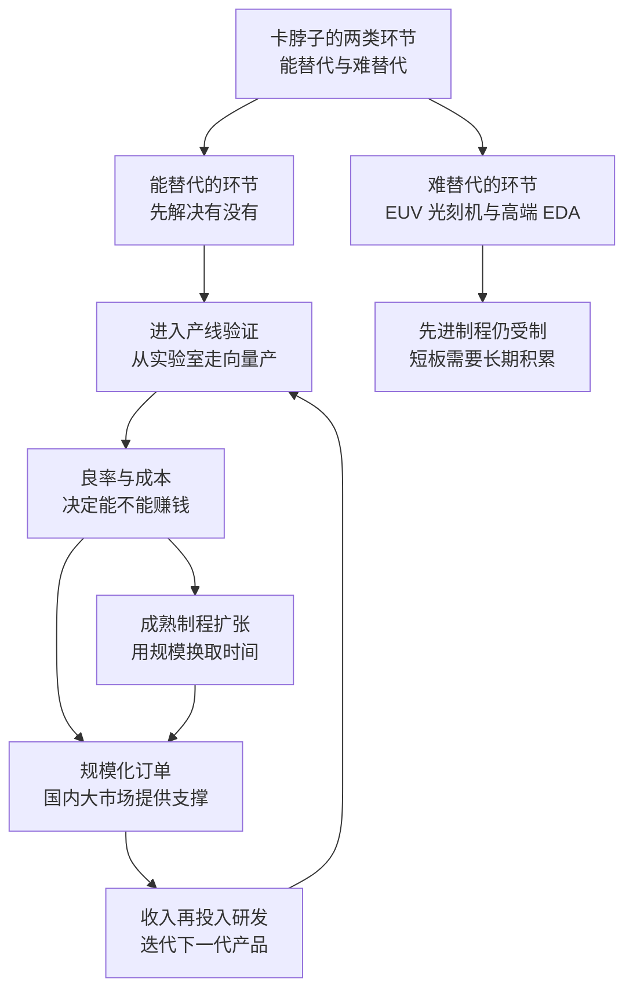

# 21｜中国的芯片自主，走到了哪一步？

> 在被“卡脖子”之后，中国的芯片产业补上了哪些短板，还差哪些？

---

## 一、先说结论

中国的芯片自主走到今天的位置，可以用一句话概括：**进展是真实的，但分布极不均匀。**

在成熟制程、封装测试、部分设备与存储器上，中国已经站住了脚，有些环节甚至开始进入全球供应链的关键位置；但在 EDA 软件、先进光刻机、高端制造与部分核心材料上，短板依然明显。

所以“自主”这件事真正的问题不是“有没有”，而是**“能不能持续迭代”**：做出一款产品不算数，能量产、能赚钱、能下一代继续跟上，才算真正把短板补上了。

---

## 二、我们先理解一个问题

“卡脖子”听起来像一道封锁线，好像只要突破某个点，一切就迎刃而解。

但真实的芯片产业不是一道墙，而是一条被切成几十段的链条：设计要用 EDA 软件，制造要用光刻机与刻蚀机，设备里又有上万个零件，材料里还有光刻胶、特种气体和硅片。每一段都有自己的门槛，也都有自己的玩家。

所以问题得问得更细：**在被限制之后，中国究竟在哪些段落站住了脚，哪些段落还在爬坡？**

---

## 三、作者到底提出了什么观点？

米勒在书里对中国的位置有两条判断。

第一条：**中国在成熟制程与存储上的推进速度不容低估。** 芯片不是只有“最先进”这一种活法。汽车、家电、工业设备用的芯片，大多不需要最先进的制程，而中国有全球最大的市场需求、最完整的电子产业链和大量的工程师——这些条件足以支撑一个庞大的产业循环。

第二条：**先进制程受设备与人才的限制。** 米勒反复强调，芯片制造的难点不只是某一台机器，而是整套工艺的积累：设计、设备、材料、制造必须互相喂养，缺一环，整个循环就跑不快。而最先进的设备与工具，恰恰集中在少数国家的少数公司手里。

把这两条合起来，就是他对“自主”的判断：**关键不是能不能造出来，而是能不能形成持续迭代的循环。**

---

## 四、把这个观点翻译成人话

可以把芯片产业想象成一条不断向上移动的自动扶梯。

追赶者不是原地跳一下就能登顶，而是要在扶梯运行的过程中一级一级往上爬：今天追上了 28 纳米，别人已经走到 7 纳米；等你走到 7 纳米，扶梯又往前挪了。**追赶的对象永远在移动。**

更麻烦的是，这条扶梯需要“客流”才能运转：要有足够多的订单，工厂才能开满产能；开满产能，才有钱继续研发；继续研发，才能跟上下一代。订单、良率、利润、研发，是一个闭环。

所以“自主”不是一件产品，而是一个循环。**一次技术突破能上新闻，持续迭代才能活下去。**

---

## 五、为什么会这样？

这张图里最关键的一步是 **C → D**。

在实验室里做出一颗芯片，和在工厂里每天稳定产出几十万颗合格芯片，是完全不同的两件事。良率上不去，成本就压不下来；成本压不下来，就拿不到订单；拿不到订单，就没有钱做下一代。**卡住追赶者的往往不是“造不出来”，而是“造出来不划算”。**

而 EUV 光刻机和高端 EDA 之所以是最硬的短板，是因为它们不在循环的内部，而在循环的入口：没有它们，先进制程这条路从起点就被限住了。

---

## 六、举一个现实生活中的例子

先看存储。

闪存是全球竞争最激烈、周期性最强的战场之一，长期由韩国、美国、日本的几家公司主导。中国的长江存储在这条战线上做出了实质性的突破：**2022 年发布 232 层 3D NAND 闪存，进入全球第一梯队。** 层数是这个行业最直观的技术刻度，能做到第一梯队的层数，意味着它在堆叠工艺上跨过了一个关键门槛。

再看设备。

芯片厂里的刻蚀机，是重要性仅次于光刻机的关键设备。中国的中微公司在刻蚀设备上取得了进展，其设备已经进入台积电的产线——**能被全球最先进的代工厂采购，本身就是一种技术认证。**

但这两件事都要看清边界。长江存储的突破发生在存储这条线上，而存储与逻辑制程是两套不同的技术体系；中微的设备进了产线，可中国在光刻机、尤其是 EUV 上仍然空白，在高端 EDA 上仍然依赖进口。

与此同时，在成熟制程（一般指 28 纳米及以上）这条线上，中国的产能扩张速度很快，被一些观察者称为“农村包围城市”：不去争夺最尖端的高地，而是先把量大面广的中低端市场填满，让全球的汽车、家电、工业设备都离不开自己。这条路有没有效果，取决于两件事：**良率与成本能不能压过对手，以及这个市场的利润够不够支撑下一代研发。**

需要说明的是，长江存储的 232 层产品、中微设备进入台积电产线，以及成熟制程的产能扩张，都是《芯片战争》出版之后的进展，属于对米勒框架的现代延伸，不是书中的内容。

---

## 七、回到书中重新理解

把这两条线放回《芯片战争》的历史脉络里，会发现它们都不新鲜。

苏联那一章讲得很清楚：靠逆向工程复制别人的芯片，永远差一代——因为**工艺知识藏在细节里，而细节只能自己长出来。** 日本和韩国的故事则提供了另一种剧本：先用大规模制造把成本打下来，在市场上赚到钱，再用赚到的钱去追下一代技术。它们的追赶都不是靠一次灵光闪现，而是靠“市场—利润—研发”这个循环转起来。

米勒的框架还提醒我们注意另一件事：供应链上的每个环节，可替代性并不相同。存储器接近标准品，谁的成本低谁占优，替代相对容易；而 EUV 光刻机和 EDA 软件是长期积累的产物，替代需要的不只是钱，还有时间和生态。**同样是短板，补起来的难度相差极大。**

---

## 八、这个观点背后还有什么？

**第一，“自主”其实是分层的。** 一台国产设备里，可能装着进口的零部件；一款国产芯片的设计，可能用的是进口软件；一片国产晶圆，可能用的是进口材料。只看整机，会高估自主程度；只看零件，又会低估进展。

**第二，迭代速度取决于试错机会。** 谁能更频繁地把新产品放进真实的生产环境里打磨，谁就进步得快。中国最大的资产不是某项技术，而是庞大的内需市场提供了大量试错机会——这是很多国家没有的条件。

**第三，封锁真正的作用是“管理时间差”。** 管制不能让追赶者停下来，但可以让领先者保持一到两代的差距。差距能不能被缩短，取决于双方各自的迭代速度。

**第四，完全自主是有代价的。** 什么都自己做，意味着放弃全球分工带来的效率。所以现实中的选择往往不是“要不要自主”，而是“在哪些环节必须自主，在哪些环节可以继续买”。

---

## 九、这个观点有问题吗？

**有说服力的地方：** 米勒的判断避免了两个极端。它既没有把中国的进展说成“不值一提”，也没有把某一次突破说成“格局已定”。把注意力放在“迭代能力”上，比盯着单点新闻更接近产业规律——历史反复证明，芯片业的胜负不取决于某一次发布，而取决于谁能在下一代继续跟上。

**存在争议的地方：** 关于成熟制程这条路，学界与产业界看法不一。一些观察者认为它有真实的战略价值：当全世界都依赖你的产能时，你就握有了筹码，这正是“农村包围城市”的逻辑。另一些观察者提醒，**产能扩张不等于技术领先**——成熟制程的门槛相对低，容易陷入价格战，利润薄，还存在产能过剩的风险；靠低利润的业务去养高投入的研发，未必撑得住。两种判断其实指向同一个问题：规模能不能转化为能力。

**可能过度简化的地方：** 用“卡脖子”这一个镜头看整个产业，容易忽略市场本身的力量。企业扩产、人才流动、下游需求的爆发，很多时候是商业逻辑在驱动，而不是政策设计的结果。此外，技术路线本身也在变化——先进封装、芯片堆叠与新架构，都可能改变“哪些环节最关键”的地图，今天最卡脖子的地方，未必永远是。

**其他解释：** 中国的进展也可以部分归因于全球产业的人才流动与知识扩散——很多关键人物有海外学习与工作经历。这提示我们：技术的扩散比管制更难阻止，任何封锁都是在和扩散规律赛跑。

---

## 十、今天再看这个观点

**以下是基于米勒思想的现代延伸，不是作者原话：**

《芯片战争》出版于 2022 年。此后几年，两边都在加速：一边是出口管制不断收紧，从设备、软件延伸到 AI 芯片与更多工具；另一边是国产替代在更多环节上出现进展，成熟制程的产能继续扩张，也引发了关于产能过剩的讨论。

如果米勒的框架成立，那么衡量中国芯片自主的进度，就不该看某款产品是不是“国产”，而要看三个更硬的指标：**国产设备与材料在产线中的实际占比、关键环节的良率与成本、以及下一代技术有没有按时跟上。** 这三件事很少出现在新闻标题里，但它们决定了循环能不能转起来。

也要看到，这场追赶没有固定的终点线——当追赶者接近时，领先者也在移动。所以“走到了哪一步”这个问题，永远只能回答“相对谁、在哪一年”。

---

## 十一、这一篇真正应该记住什么？

1. **进展真实，但分布极不均匀。** 成熟制程、封装、部分设备与存储已经站住脚，EDA、先进光刻、高端制造仍然受制于人。
2. **自主的关键不是“有没有”，而是“能不能持续迭代”。** 一次突破是样品，循环转起来才是能力。
3. **卡住追赶者的往往不是“造不出来”，而是“造出来不划算”。** 良率与成本决定订单，订单决定下一代。
4. **规模不等于领先。** 产能扩张能带来筹码，但能不能转化为技术能力，是另一回事。
5. **封锁管理的是时间差，不是结局。** 差距能否被缩短，取决于双方的迭代速度，而不是某一纸禁令。

---

## 十二、留一个问题

> 如果一个国家能把成熟制程做到全世界都离不开，它是否还需要在最先进制程上追平对手？
> “够用”与“最强”之间，哪一个才是自主真正的目标？

**下一篇**：22｜为什么说现代战争打的就是芯片？——芯片决定的不只是工厂能不能开工，还有炮弹能不能命中。从 1991 年的海湾战争到 2022 年的乌克兰，武器变“聪明”的秘密，藏在一颗颗芯片里。
