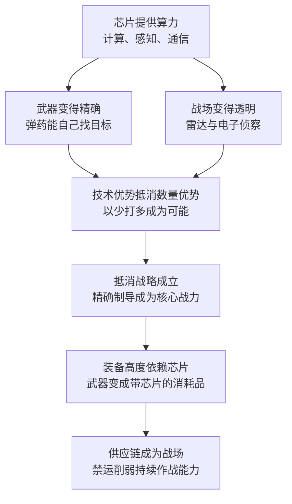

# 22｜为什么说现代战争打的就是芯片？

> 从海湾战争到乌克兰，芯片是怎么变成武器核心的？

---

## 一、先说结论

现代战争比的已经不只是谁的火力更猛，而是**谁的火力更准**。

精确制导、雷达、电子战、无人机、通信——现代战争的每一项核心能力，最终都要折算成芯片的算力。米勒把这种变化称为“抵消战略”的胜利：用技术优势抵消数量优势，让少数精确武器打败数量庞大的对手。

而当武器离不开芯片，芯片供应链本身也就成了战场的一部分——**禁运一颗芯片，可能等于让一支军队少一种弹药。**

---

## 二、我们先理解一个问题

二战时，衡量一国战争潜力的方法很直接：数钢铁、数石油、数飞机大炮的产量。谁造得多，谁就更有底气。

但在 1991 年的海湾战争里，这种算法失灵了。多国部队的兵力并不占绝对优势，战争却以极快的速度结束。真正决定性的东西，不是炮弹的数量，而是炮弹的“脑子”。

问题就来了：**为什么武器变“聪明”之后，战争的胜负逻辑就变了？而让武器变聪明的东西，为什么偏偏是芯片？**

---

## 三、作者到底提出了什么观点？

米勒在书里给出的解释，核心是“抵消战略”。

1970 年代，美国国防部面对一道不乐观的算术题：苏联在坦克、火炮、兵力上的数量优势几乎无法在和平时期追平。既然数量上追不上，就换一条赛道——**用精确制导、传感器和信息技术，把“以多打少”变成“以准打多”。** 一枚能精确命中坦克顶部的导弹，可以抵掉好几辆坦克的价值；一套能看见战场的雷达与通信系统，可以让指挥官比对手看得更远、反应更快。

这个战略之所以能成立，前提是芯片。精确制导需要实时计算，雷达需要高速信号处理，通信与电子战需要海量的算力。米勒认为，正是芯片让“技术优势”变成了可以落地的战术优势，也让数量优势第一次不再等于胜势。

他还指出另一个变化：**芯片供应链本身就是战争的一部分。** 现代武器里塞满了芯片，一旦供应链被切断，补充与维修都会出问题——于是出口管制从贸易工具变成了作战工具。

---

## 四、把这个观点翻译成人话

可以这样理解：过去的战争像两个人比谁的砖头多，砸得快、砸得狠的人赢；现在的战争像一个人蒙着眼睛扔砖头，另一个人戴着夜视仪、拿着激光测距仪——**后者不需要更多的砖头，只需要看得见、算得准。**

芯片在这个比喻里，就是夜视仪和测距仪背后的那台小电脑。它让一枚普通的炸弹变成“会找目标”的炸弹，让一门火炮变成“第一发就能命中”的火炮。

再换一个角度：武器是消耗品。战争打起来，炮弹、导弹、无人机每天都在损耗。过去补货靠的是钢铁产能，现在补货还要看芯片供应——**这意味着一场战争的持续时间，可能取决于谁能持续拿到芯片。**

---

## 五、为什么会这样？

这条链条里最关键的一步是 **A → B**。

武器从“扔出去就完了”变成“扔出去还在计算”，靠的就是弹上那颗芯片。它要在极短的时间里完成目标识别、轨迹修正和抗干扰——这是算力问题，不是火力问题。

而最后一步 **F → G** 是米勒特别想让人看到的：当武器变成“带芯片的消耗品”，供应链就不再只是经济问题。谁能决定别人能不能拿到芯片，谁就在战前握有了筹码。

---

## 六、举一个现实生活中的例子

2022 年 2 月爆发的乌克兰战争，几乎成了现代芯片战争的一次实况演示。

乌克兰战场上最出名的一种武器是标枪反坦克导弹。它的特点是“发射后不管”：射手锁定目标后即可转移，导弹自己飞向坦克最脆弱的顶部。**每一枚标枪导弹，依赖两百多个半导体芯片**——它不需要射手有多准，它需要芯片算得够快。

对面则是另一种困境。俄罗斯在精确制导弹药上库存有限，很多装备高度依赖进口的民用级芯片。由于本土芯片制造能力薄弱，大致停留在 90 纳米级别的工艺，一旦西方实施芯片出口管制，补充这些电子部件就变得非常困难。

关于俄军的困境，有一个流传很广的说法：他们拆解家用电器（比如洗衣机）里的芯片，装到军事装备上。对这类报道应当谨慎：**有报道称存在这种现象，但它反映的更多是“民用芯片可以顶替一部分军用需求”这一事实，不宜当作普遍做法的定论。** 一些分析者认为个别案例被放大了，也有研究者认为它确实折射出供应链被切断后的真实窘境。

这一对照说明了两件事：第一，现代武器的战斗力高度依赖芯片；第二，芯片管制可以在不发射一颗子弹的情况下，削弱一支军队的持续作战能力。

需要说明的是，米勒的书在 2022 年出版时已经写到乌克兰战争的开端；本篇中标枪导弹的芯片数量、以及关于俄军拆解家电芯片的报道，多来自此后公开报道中的讨论与延伸，用来把书中的判断放进更完整的战场背景里。

---

## 七、回到书中重新理解

把这一章放回全书，会发现“芯片与战争”是一条贯穿始终的线索。

芯片产业的第一桶金，本来就来自军方订单：冷战时期的导弹与航天计划，不计成本地喂养了早期的半导体产业。而到了 1970 年代，军方不再只是买方，还成了技术路线的设计者——**抵消战略第一次把“算力优势”写进了国防战略。**

米勒想说明的是，这条线索一直没有断：从精确制导到无人机，从雷达到 AI 辅助的目标识别，军事竞争的核心始终是“谁能更快地处理信息”。这也解释了为什么芯片管制会被当作国家安全工具——在他的框架里，芯片不是军需品的一种，而是军需品的前提。

---

## 八、这个观点背后还有什么？

**第一，芯片的“军民两用”属性让管制特别难做。** 同一颗芯片可以装在汽车里，也可以装在无人机上。界限模糊，管制就必然要面对“管得太宽”与“漏得太多”的两难。

**第二，芯片只是硬件底座，软件与算法同样关键。** 精确制导是芯片、传感器、算法、数据共同作用的结果。只盯着芯片，会低估整条“杀伤链”的复杂度。

**第三，供应链依赖是双向的。** 实施管制的一方，自己的企业与盟友也会失去市场；被管制的一方，会想尽办法寻找替代与绕行渠道。管制的效果，取决于执行的严密程度和时间的长度。

**第四，战争会加速消耗。** 弹药是一次性消耗品，芯片也是。这带来一个新的国防问题：和平时期该囤多少芯片？囤货能撑多久？产能能不能在战时快速扩张？

**第五，精确打击能力正在扩散。** 廉价无人机加上商用芯片，就能让非国家行为体拥有过去只有大国才有的打击能力。芯片让战争变“聪明”的同时，也让战争更容易发生。

---

## 九、这个观点有问题吗？

**有说服力的地方：** 从海湾战争到乌克兰，米勒的论证有大量实例支撑。精确制导确实改变了战场的算术：技术优势可以在一定程度上替代数量优势，这一点在过去三十多年的多场冲突中被反复验证。

**存在争议的地方：** 把战争简化为“芯片的胜负”仍然有风险。一些军事研究者提醒，数量、后勤、训练、指挥与士气依然是决定性的变量——乌克兰战场上的炮战消耗、兵员补充与工事防御，说明传统战争要素并没有消失。技术优势能改变效率，但不能替代全部。

**可能过度简化的地方：** 关于“拆家电芯片”这类报道，证据的可靠性参差不齐，把它当成定论会放大叙事的戏剧性。同样，“芯片禁运决定战争走向”也可能高估了管制的即时效果——制裁的作用往往是长期的、间接的，很难在战场上直接量化。

**其他解释：** 也有学者从制度与联盟的角度解释同样的现象：乌克兰能持续作战，不只因为拿到了精确武器，还因为获得了情报、训练、财政与外交支持。把结果全部归因于芯片，等于忽略了战争背后的组织能力。

---

## 十、今天再看这个观点

**以下是基于米勒思想的现代延伸，不是作者原话：**

《芯片战争》出版于 2022 年。此后几年的战场又给出了新的注脚：廉价的第一人称视角无人机成了消耗量最大的武器之一，双方比拼的不再只是导弹的精度，还有无人机的产量与芯片供应；AI 开始被用于目标识别与情报分析；各国在讨论 AI 芯片出口管制时，也越来越多地把它与军事用途联系起来。

如果米勒的框架成立，那么未来的军备竞赛会有两个新特征：**第一，比拼的重点从“平台”转向“算力”——坦克和飞机的重要性，可能不如背后的传感器与算法；第二，供应链的韧性会成为国防规划的一部分，芯片库存、产能与替代来源，都会像弹药储备一样被计算。**

这也意味着，芯片管制与军事竞争会越来越难分开——而这正是米勒在书里反复提示的方向。

---

## 十一、这一篇真正应该记住什么？

1. **现代战争比的是“准”，不是“多”。** 精确制导、雷达、电子战、无人机，核心都是算力。
2. **“抵消战略”用技术优势抵消数量优势。** 这是 1970 年代以来美国国防思路的核心，也是芯片进入战争中心的起点。
3. **武器是带芯片的消耗品。** 战争持续时间，可能取决于谁能持续拿到芯片。
4. **供应链本身就是战场。** 出口管制可以在不开火的情况下削弱对手的作战能力。
5. **但芯片不是战争的全部。** 数量、后勤、训练与联盟依然重要，技术决定论会误判战局。

---

## 十二、留一个问题

> 当一颗商用芯片就能让廉价无人机变成精确武器，精确打击能力扩散到更多行为体之后，世界会变得更安全，还是更危险？
> 技术的门槛在降低，而使用技术的约束，是否跟得上？

**下一篇**：23｜AI 时代的芯片战争：为什么英伟达成了焦点？——当算力变成比石油更稀缺的资源，一家做游戏显卡起家的公司，为什么会被推到大国博弈的正中央？
