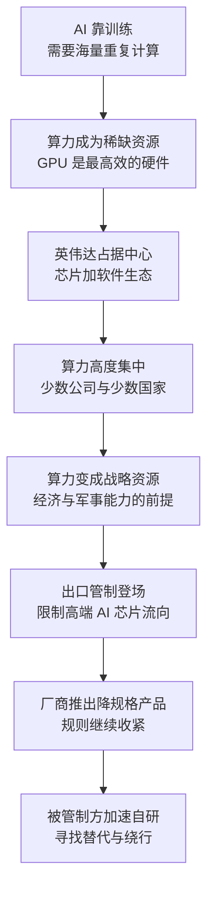

# 23｜AI 时代的芯片战争：为什么英伟达成了焦点？

> 为什么训练人工智能的芯片，会成为大国争夺的新焦点？

---

## 一、先说结论

人工智能把算力变成了比石油更稀缺的资源。

训练一个大模型，需要在短时间内完成天文数字级别的计算。**谁有最多的 GPU，谁就能训练出最强的模型；而最强的模型，意味着经济与军事上的优势。** 于是 GPU 从游戏玩家的配件，变成了国家战略物资。

英伟达恰好站在这个新战场的正中央：它既是最大的受益者，也成了出口管制的头号目标。**当一样东西既能赚最多的钱，又能决定别人能不能造出最强的 AI，它就不再只是一家公司的产品。**

---

## 二、我们先理解一个问题

要理解这件事，先要理解 AI 与传统软件的区别。

传统软件是“写”出来的：程序员把逻辑一条条写清楚，计算机照着执行。而大模型更像是“练”出来的：给它海量数据，让它反复调整内部的参数，直到它学会预测下一个词、识别一张图。

“练”这个动作，本质上就是海量的重复计算。而做这种计算最高效的硬件，正是图形处理器（GPU）——它原本为游戏里的画面渲染而设计，因为要同时处理几百万个像素，天然擅长并行计算。

问题就来了：**为什么这种原本为游戏服务的芯片，会变成大国争夺的战略资源？**

---

## 三、作者到底提出了什么观点？

米勒的书出版于 2022 年，那时 AI 训练对算力的渴求已经进入他的视野：他在书里写到 GPU 在 AI 训练中的角色，也写到英伟达在这场新竞赛中的重要性。

他给出的框架，和他讲芯片的一贯逻辑一致：**算力就是国力。** 如果说过去的战争比的是钢铁和石油，信息时代比的是计算能力，那么当 AI 开始成为生产力的核心，算力就从“基础设施”变成了“战略资源”——它决定了谁能训练出最强的模型，而最强的模型会被用在经济、情报与军事的每一个角落。

从这个框架往下推，出口管制的目标就很清楚了：**管制不是要阻止 AI 发展，而是要让最先进的算力留在自己的阵营里。** 芯片供应链上的咽喉点——GPU 设计、先进制造、高带宽存储器、光刻机——在 AI 时代被重新点亮，因为每一个节点都关系到“谁能训练出下一代模型”。

需要区分的是：米勒书里已经点出了 GPU 与 AI 算力的重要性，但“AI 芯片成为管制头号目标”的完整故事，主要发生在书出版之后，属于对这套框架的现代延伸。

---

## 四、把这个观点翻译成人话

可以把训练大模型想象成盖一座摩天大楼。

数据是砖瓦，算法是图纸，算力是塔吊和工人。图纸再好，如果没有足够的塔吊，楼就盖不起来；盖得慢一点，别人就先封顶了。而 GPU 就是那种可以同时吊起几百块砖的塔吊——**它不是更聪明的工人，而是能干几百倍活的工人。**

再换一个角度：算力像油田，模型像炼出来的汽油。谁家油田大，谁就能先炼出足够多的汽油去驱动经济。石油可以到处买，但最先进的 AI 芯片只有少数公司能设计、只有少数工厂能制造——**这就把“算力”变成了一个可以被卡住的资源。**

而英伟达的位置，是既握着油田设备的核心技术，又收着全世界的“过路费”：它的芯片贵、难替代，围绕它还长出了一整套软件生态。

---

## 五、为什么会这样？

这张图里最关键的一步是 **D → E**：当算力集中到少数公司手里，它就自动变成了战略资源。

而集中不是偶然的——芯片设计需要几十年的架构积累，制造需要最先进的代工厂，训练需要成千上万张卡连成集群，软件生态又把用户牢牢锁住。**每一层都在加深集中，每一层都是一个咽喉点。**

也正因为如此，管制才会层层加码：先限制最顶级的型号，被降规格产品绕过之后，再修改规则，把降规格产品也框进去。

---

## 六、举一个现实生活中的例子

2022 年 11 月，ChatGPT 发布，几周之内成为全球现象。它背后的模型之所以能训练出来，依赖的是微软为 OpenAI 搭建的一个庞大计算集群——**大约一万张 A100 GPU 连在一起运转。** 这个数字让外界第一次直观地意识到：一个顶级 AI 模型的门槛，不只是聪明的人，还有一座“算力工厂”。

而这座工厂里的核心零件，来自英伟达。

英伟达 1993 年由黄仁勋等三人创办，最初做的是游戏显卡。2006 年，它推出了 CUDA——一套让 GPU 可以做通用计算的软件平台，等于把显卡变成了“小型超级计算机”。2012 年，一个叫 AlexNet 的图像识别模型用 GPU 训练成功，深度学习浪潮由此开启。十年之后，大模型时代到来，英伟达正好站在所有人的必经之路上。

接下来发生的事，把商业问题变成了地缘问题：**2022 年 10 月，美国禁止 A100 与 H100 等高端 AI 芯片对华出口**，英伟达随后推出了符合规则的降规格版本 A800 与 H800；**2023 年 10 月，新规进一步收紧，连降规格产品也被禁止出口。** 与此同时，英伟达的市值在 2023 至 2024 年大幅上涨，一度成为全球市值最高的公司。

需要说明的是，从 ChatGPT 发布到管制层层加码、再到英伟达市值登顶，这些进展都发生在《芯片战争》出版之后，属于对米勒框架的现代延伸。它们真正说明的是同一件事：**在 AI 时代，最抢手的芯片，同时也是最敏感的战略物资。**

---

## 七、回到书中重新理解

把这件事放回《芯片战争》的框架，会发现它并不意外。

米勒在书里讲过很多次“咽喉点”的故事：光刻机只有一家公司能造，EDA 软件只有几家能提供，先进制造集中在少数工厂。AI 时代没有改变这个结构，只是把新的节点接了进来——**GPU 的设计、高带宽存储器、先进封装，以及把几万张卡连起来的网络设备。**

他也讲过“军方订单喂养产业”的历史：早期芯片靠导弹和航天计划长大。今天的关系反了过来——**民用 AI 的算力竞赛，正在反过来定义军事能力的上限。** 谁能训练更强的模型，谁就可能拥有更好的情报分析、更快的指挥决策和更自主的武器系统。

所以英伟达成为焦点，不是因为它做错了什么，而是因为它刚好站在了“算力—模型—权力”这条链条的入口。

---

## 八、这个观点背后还有什么？

**第一，算力不只是一块芯片。** 一座 AI 数据中心还要解决电力、散热、网络和土地问题。芯片再强，电不够也跑不起来——算力竞赛的下半场，很可能是能源竞赛。

**第二，真正难替代的是生态。** CUDA 积累了十几年的开发者和工具链，让用户换芯片的成本远高于换硬件的成本。**硬件可以被追上，生态很难被搬走。** 这也是为什么替代方案往往先要解决“软件好不好用”的问题。

**第三，管制会改变产品形态。** 降规格产品、规则更新、绕行方案——每一次管制升级，都会催生一轮新的博弈。管制的效果不只取决于规则本身，还取决于执行的严密程度。

**第四，效率的提升会部分抵消算力的差距。** 同样的模型，通过算法优化和更高效的训练方法，可以用更少的算力达到接近的效果。算力是重要变量，但不是唯一的变量。

**第五，AI 的军事用途边界模糊。** 用于推荐商品的模型，也可能被用于情报分析。这种模糊性让管制很难精确，也让企业很难完全避开政治。

---

## 九、这个观点有问题吗？

**有说服力的地方：** 从 ChatGPT 到管制升级，现实确实在按“算力即权力”的剧本走。各国政府把 AI 算力写进战略文件，企业把 GPU 当成最重要的资产，这些都说明算力已经不只是商业问题。

**存在争议的地方：** “算力决定模型能力”这个假设本身有争议。一些研究者认为，算法创新、数据质量与人才的重要性不亚于算力，单纯堆卡未必能换来同等的模型能力；也有学者指出，管制的效果很难评估——它可能延缓被管制方训练顶级模型的进度，也可能加速其自研，同时让美国企业失去一部分收入与生态影响力。**关于“管制是有效还是反噬”，目前没有共识。**

**可能过度简化的地方：** 把 AI 竞争简化为“谁的 GPU 多”，会忽略电网、数据中心、人才和监管环境这些同样稀缺的条件。此外，AI 的军事意义有时被夸大，有时又被低估——由于缺乏公开数据，很多判断只能停留在推测层面。

**其他解释：** 也有人从产业角度解释英伟达的地位：它的成功首先是商业与工程的成功——长期投入一个当时没人看好的技术方向，赶上了深度学习的爆发。把它的崛起完全归因于地缘政治，反而会看不清一家公司真正的护城河在哪里。

---

## 十、今天再看这个观点

**以下是基于米勒思想的现代延伸，不是作者原话：**

《芯片战争》出版之后，AI 芯片的管制成了整场芯片战争升级最快的战线：规则从限制型号走向限制性能指标，从芯片本身延伸到制造设备与存储器；与此同时，各国开始把“算力主权”当作政策目标，补贴本土数据中心与芯片产业，围绕电力和水资源的争夺也随之出现。

如果米勒的框架成立，接下来值得关注的不是“谁的模型更大”，而是三个更根本的问题：**算力会不会长期集中在少数公司手里？替代方案能不能建立起自己的软件生态？以及，当模型能力越来越依赖算力，管制与创新的赛跑谁会跑得更快？**

这些问题没有现成答案，但它们决定了 AI 时代的权力会如何分配。

---

## 十一、这一篇真正应该记住什么？

1. **AI 把算力变成了比石油更稀缺的资源。** 模型是“练”出来的，练需要海量的并行计算。
2. **英伟达站在“算力—模型—权力”链条的入口。** GPU 加软件生态，让它在 AI 时代几乎不可绕过。
3. **算力集中，就意味着权力集中。** 设计、制造、存储、光刻，每一层都是一个咽喉点。
4. **管制的效果没有共识。** 它可能延缓追赶，也可能加速自研、反噬自身，评估需要长期观察。
5. **算力不是唯一变量。** 算法、数据、人才、电力，共同决定 AI 竞争的结局。

---

## 十二、留一个问题

> 如果最强的模型需要最多的算力，而算力又可以被少数国家管制，那么 AI 的未来会是“少数人的俱乐部”，还是被逼出来的多极格局？
> 封锁能挡住芯片，但能挡住聪明的算法吗？

**下一篇**：24｜终局：芯片战争会怎么结束？——封锁能拖慢追赶，却拖不出结果；相互依赖既是和平的压舱石，也是最危险的引信。这场战争的终点，也许不是某一方的胜利，而是一个所有人都必须回答的选择题。
