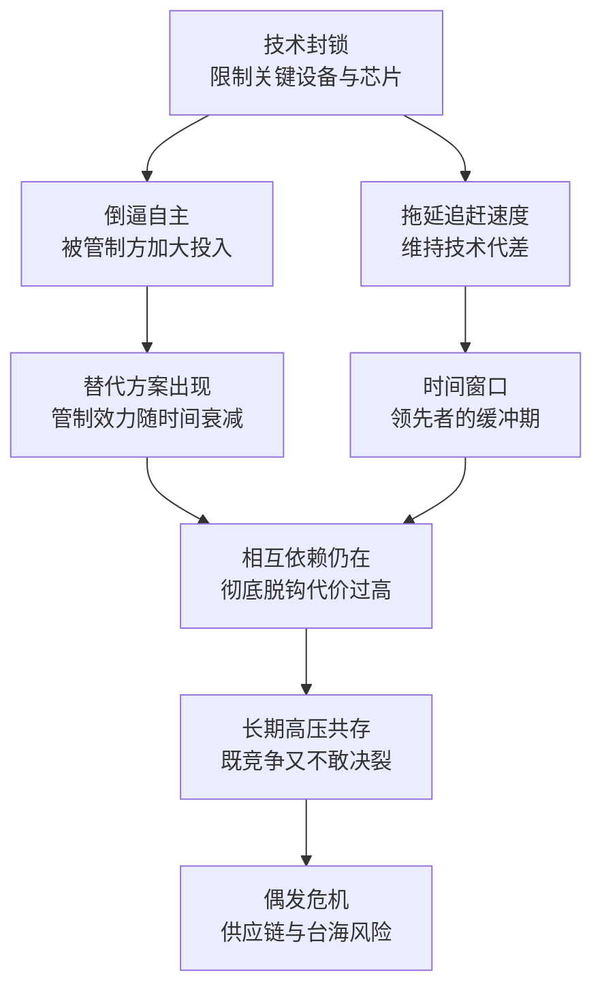

# 24｜终局：芯片战争会怎么结束？

> 这场围绕芯片的竞争，最终会走向何方？

---

## 一、先说结论

米勒没有给出乐观的答案。

他的判断可以概括为三句话：**技术封锁能拖延追赶，但无法终结追赶；供应链的相互依赖既是和平的压舱石，也是最危险的引信；真正的终局不是某一方“赢”，而是世界必须在“更分裂”与“更克制”之间做出选择。**

换句话说，芯片战争不会以一份协议、一场胜利或一次技术突破告终。它更可能以“长期共存的高压状态”延续下去——没有赢家，只有代价不同的选项。

---

## 二、我们先理解一个问题

要谈“终局”，先要问一个更基本的问题：**什么样的情况才算“结束”？**

如果把它当成一场球赛，那终局就是分出胜负、有人捧杯。但如果它是一场结构性的竞争——两边都离不开同一条供应链，都在补自己的短板，又都在盯着对方的短板——那就没有终场哨。

所以真正的问题不是“谁会赢”，而是：**这场竞争会以什么形态稳定下来？** 是彻底脱钩、各自为政，还是维持一种脆弱但可控的相互制约？

---

## 三、作者到底提出了什么观点？

米勒在书里给出的，是一个不讨喜但很清醒的结论。

第一，**管制能拖延，但不能决定结果。** 出口管制可以拉大或维持技术代差，为领先者争取时间窗口。但历史反复显示，封锁会同时产生两个效果：延缓追赶者的速度，以及给追赶者最强的动员理由。这两个效果会互相抵消一部分，最后剩下的是一个谁也无法精确计算的净结果。

第二，**相互依赖是双刃剑。** 全球分工让所有人都握着别人的一部分命门。平时，这种依赖是和平的压舱石——因为开战的代价太大；紧张时期，它又变成最危险的引信——因为任何一环被切断，都可能引发连锁反应。

第三，**台湾是最关键的节点，也是最危险的节点。** 全球最先进的芯片产能高度集中在那里，这让它既有“硅盾”的价值，也是整个体系最脆弱的地方。米勒没有假装这个问题有容易的解法。

---

## 四、把这个观点翻译成人话

可以用一个比喻：这场竞争不像拳击赛，更像两个人被锁在同一根链条的两端。

链条让他们谁都不能全力挥拳——用力过猛，自己也会被拽倒；但链条也让他们彼此防备——一旦有人决定砸断链条，双方都会受伤，只是伤得不一样。

另一个更贴切的比喻是“修堤坝”：每个国家都在加固自己的堤坝（补贴、自研、管制），但水是流动的——**你可以改道，却很难让水消失。** 技术、人才、资本、市场，都会自己找出口。

所以终局的样子，可能不是“谁赢了”，而是一组并存的现实：一部分领域彻底分家，一部分领域继续互相依赖，一部分领域在灰色地带里博弈。**它不会是干净的结局，而是一种长期的不舒服。**

---

## 五、为什么会这样？

这张图里最关键的一步是 **C → D**：管制的效果不是线性的。第一年可能很痛，第五年可能逼出一条替代链。**这并不意味着管制无效，而是说它的效力会随时间衰减，所以它更像是在管理“时间差”，而不是在解决问题。**

而 **F** 是整张图的枢纽：彻底脱钩在技术上可能、在经济上昂贵、在政治上危险。所以现实中的选择往往不是“脱不脱钩”，而是“在哪些环节脱钩、以什么速度脱钩、由谁承担代价”。

---

## 六、举一个现实生活中的例子

这一篇不引入新的案例，而是把全书讲过的三个概念放在一起看——它们正好构成终局的三个侧面。

**第一个是“硅盾”。** 全球最先进的芯片产能高度集中在台湾，这让台湾对全世界具有“人质价值”：任何冲突都会立刻波及全球电子产业，因此各方都有动机维持现状。但同一件事也让它成为最危险的单点：正因为太重要，它成了所有人战略计算里的核心变量。护身符与风险源，是同一枚硬币的两面。

**第二个是“咽喉点”。** 从光刻机到 EDA 软件，从先进制造到关键材料，供应链上散布着若干个“谁都不多、谁都不能少”的节点。管制之所以有威力，是因为这些节点可以被单独瞄准；而终局之所以难预测，也是因为这些节点会移动——**今天卡得住的地方，明天可能被替代；今天不起眼的环节，明天可能变成新的命门。**

**第三个是“时间窗口”。** 管制真正的价值，是为领先者争取时间；追赶者真正要做的，是在窗口关闭前建立自己的循环。时间窗口是双向的：领先者在用窗口加固优势，追赶者在用窗口缩小差距。**所以终局的走向，取决于窗口内发生的事，而不是窗口本身。**

把这三个概念放在一起，就能看清米勒的结论为什么谨慎：芯片战争没有单一战场，也没有单一结局；它是一个由无数节点、无数参与者、无数时间窗口组成的长期博弈。

---

## 七、回到书中重新理解

现在回头看《芯片战争》这本书，会发现它的结构本身就是一种回答。

米勒从 1947 年的晶体管讲起，一路讲到日本崛起、美国反击、韩国豪赌、台积电诞生、中国入场与 AI 竞赛。这段历史里，领导权换过好几次手，每一次都不是因为某一方“赢了”，而是技术代际更替、商业模式变化与政策选择共同作用的结果。

他反复展示的，是同一个规律：**领先者的优势会被自己的成功绑住，追赶者的机会来自下一代技术。** 所以任何“终局”判断都必须留有余地——今天看起来牢不可破的结构，可能就是下一轮洗牌的对象。

书名叫“战争”，但米勒写的不只是冲突。他写的是一条把世界连在一起的链条：它让合作成为必要，也让冲突变得危险。**终局的形态，取决于人类如何处理这个矛盾。**

---

## 八、这个观点背后还有什么？

**第一，技术主权与效率之间必须取舍。** 越追求自主，成本越高、效率越低；越依赖分工，越有效率、越脆弱。每个国家都在找一个自己愿意承受的平衡点，而这个点会随局势变化。

**第二，时间窗口是双向的。** 管制争取来的时间，追赶者也在利用。领先者如果只是守住旧优势而没有新的突破，窗口就会自然关闭。

**第三，台湾问题的特殊性无法回避。** 它既是最先进的产能所在地，又是地缘政治最敏感的焦点。米勒没有给出解法，只是反复提示：整个体系的稳定性，悬在这个单点上。

**第四，管制工具箱的边际效力在变化。** 规则越细，绕行成本越高；但执行越难，漏洞越多。管制与规避的军备竞赛会长期存在。

**第五，技术本身在移动。** 先进封装、芯片堆叠、新架构、新材料，都可能改变“哪里最关键”的地图。终局的形态，会被今天还没成为主流的技术改写。

---

## 九、这个观点有问题吗？

**有说服力的地方：** 米勒的谨慎是有道理的。“拖延有效、封锁无效”这个判断，既承认了管制的现实作用，也没有把管制当成万能药。它避免了两种常见错误：一种认为封锁能一劳永逸地锁死对手，另一种认为封锁完全无用、只会加速对手崛起。

**存在争议的地方：** 一些学者认为脱钩会比米勒预想的更快、更深——当安全考量压过经济考量，企业和政府会愿意承担更高的成本；另一些学者则认为全球分工的引力太强，成本与能力的现实会让“去风险”停留在局部。关于台湾风险的评估，学界同样分歧明显：有人认为它是威慑的基石，有人认为它是最可能引发危机的地方。

**可能过度简化的地方：** “拖延有效、封锁无效”本身也是一种概括。管制的效果高度依赖行业、时间尺度与执行强度：在某些环节它可能极其有效，在另一些环节则可能几乎无效。用一个统一结论覆盖所有情况，会丢掉很多细节。

**其他解释：** 也有研究者认为，决定终局的变量可能不在政治，而在技术本身——如果出现一种全新的计算范式，让今天的设备与工艺不再关键，那么整张咽喉点地图都会重画。历史确实出现过这样的时刻：晶体管的出现，让真空管时代的领先者一夜之间失去了优势。

---

## 十、今天再看这个观点

**以下是基于米勒思想的现代延伸，不是作者原话：**

《芯片战争》出版之后，世界的走向基本沿着它描述的轨道：管制在加码，补贴在增加，供应链在区域化，“去风险”成了各国的共同语言；AI 算力的竞争又给这场博弈加了一层新的战场。

如果米勒的框架成立，那么未来几年真正值得观察的，不是某一次管制的松紧，而是三个更慢的变量：**技术代差是在扩大还是在缩小？替代链条是在形成还是在停滞？以及在关键节点上，各方是在加固相互依赖，还是在拆解它？** 这三个变量的方向，比任何一次新闻事件都更能说明终局的走向。

也必须承认，预测从来都是这场博弈里最不可靠的部分。米勒本人在书里也没有给出时间表——他给出的是一套理解结构的方法，而不是一份预言。

---

## 十一、这一篇真正应该记住什么？

1. **封锁能拖延，不能终结。** 管制管理的是时间差，不是结局。
2. **相互依赖是双刃剑。** 它既是和平的压舱石，也是最危险的引信。
3. **台湾是最关键也最危险的节点。** 硅盾既是护身符，也是风险源。
4. **时间窗口是双向的。** 领先者在用它加固优势，追赶者在用它缩小差距。
5. **终局不是某一方“赢”，而是世界在“更分裂”与“更克制”之间做出的选择。**

---

## 十二、留一个问题

> 如果相互依赖既是压舱石又是引信，那么未来十年，世界更该努力的方向是“减少依赖”，还是“为依赖建立规则”？
> 这个问题没有标准答案，但它决定了我们这一代人会生活在什么样的世界里。

---

## 系列收束：从一块芯片到一整个世界

这个系列一开始提出过三个判断，现在可以把它们重新摆在一起——它们既是最初的起点，也是整条线索的终点。

**芯片是新时代的石油。** 它既是所有产业的基础技术，也是军事能力的基础。从 1947 年的晶体管到今天的 AI 数据中心，变的是一块硅片上能装下多少个晶体管，不变的是“算力决定能力”这条底层逻辑。经济增长要靠算力，国家安全要靠算力——所以芯片问题从来不只是生意。

**权力的来源是咽喉点。** 不必拥有整条供应链，只要垄断其中不可替代的环节，就能卡住所有人。光刻机、EDA 软件、先进制造、AI 芯片，这些节点之所以重要，不是因为它们值钱，而是因为短期找不到替代。门槛越高，集中度越高；集中度越高，权力越大——这是整条链条最冷酷的规律。

**相互依赖是双刃剑。** 分工让和平时期更繁荣，也让冲突时期更危险。每一段依赖都是潜在的筹码，每一个筹码都可能被使用。全球化没有终结竞争，它只是把竞争变成了另一种形态。

这三个判断合在一起，给出的不是答案，而是一副看世界的眼镜：当你看到一条新闻——某国补贴芯片厂、某家公司被列入清单、某种芯片被禁止出口——你可以试着问三个问题：**这涉及的是哪个咽喉点？谁在依赖谁？这个动作是在争取时间，还是在改变结构？**

《芯片战争》讲的是过去七十年的故事，但它真正的价值，是让人在下一则新闻出现时，能看得比别人深一层。故事还没有结束——它正在被每一个做出选择的国家、公司和人所书写。至于它会走向哪里，答案不在书里，而在每个读者自己的判断里。
