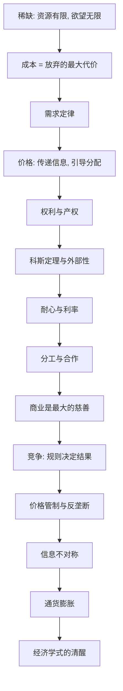

# 《薛兆丰经济学讲义》深度解读系列

## 系列简介

《薛兆丰经济学讲义》的目标，是把一整套经济学思维方式，讲成人人能懂的常识。它不追求公式与模型，而是反复训练一个动作：**换一个角度看世界。**

它的起点是最朴素的一句：**稀缺。** 因为资源有限、欲望无限，所以一切社会都必须回答"谁来用、怎么分"。围绕这个问题，经济学提供了一串强大的概念：成本是放弃的最大代价、价格在传递信息、权利是竞争出来的、耐心也有价格、竞争规则决定结果、管制常常适得其反。

薛兆丰最想传授的不是知识，而是**一种反直觉的清醒**：很多"好心"的政策之所以办坏事，是因为忽略了看不见的代价；很多"常识"之所以错误，是因为只看到了看得见的受益者，没看到沉默的受损者。本系列围绕 **18 个核心问题**，从稀缺与成本，一路讲到产权、合作、竞争、管制与宏观常识。

---

## 全书核心问题

| 层次 | 问题 |
|---|---|
| 基础问题 | 经济学为什么从"稀缺"和"成本"开始？ |
| 市场问题 | 需求、价格、竞争是如何协调社会的？ |
| 制度问题 | 权利、产权、外部性该如何理解？ |
| 合作问题 | 耐心、分工、商业为什么能创造财富？ |
| 政策问题 | 竞争、管制、反垄断、通胀有哪些反直觉？ |

---

## 全书知识地图



---

## 全系列目录

### 第一部分：基础——稀缺与成本

#### 01｜为什么经济学要从“稀缺”开始？

核心问题：为什么"稀缺"是一切经济问题的起点？

核心观点：资源有限，而人的欲望无穷，这就是稀缺。因为稀缺，任何社会都必须回答三个问题：生产什么、如何生产、为谁生产。所有经济制度——市场、计划、习俗——本质上都是回答这三个问题的不同方式。理解了稀缺，才能理解为什么"既要又要"往往做不到。

理解难度：★★☆☆☆

关键词：稀缺、选择、机会、资源配置

---

#### 02｜为什么“成本”不是你花了多少钱？

核心问题：成本到底该怎么算？

核心观点：经济学里的成本，是**你为了这件事所放弃的最大代价**（机会成本），而不只是账单上的支出。你去看一场演唱会，真正的成本是那几个小时本可以做的最有价值的事。把"放弃的东西"算进来，很多决策的答案会完全不同。

理解难度：★★★☆☆

关键词：机会成本、放弃、隐性成本、决策

---

#### 03｜为什么“免费”往往最贵？

核心问题：既然不要钱，为什么免费反而可能是陷阱？

核心观点：表面上没有价格的东西，往往在别处收费：时间、隐私、注意力、排队，或最终由别人替你买单。免费会掩盖真实成本，让人做出错误决策。经济学的提醒是：**没有真正的免费，只是账单换了个地方付。**

理解难度：★★★☆☆

关键词：免费、隐性成本、注意力、真实代价

---

#### 04｜为什么越便宜，买得越多？

核心问题：需求定律为什么被称为经济学最可靠的规律之一？

核心观点：需求定律：价格越低，需求量越大；价格越高，需求量越小。它不只适用于商品，也适用于时间、婚姻、犯罪等等。理解它，就能理解为什么涨价能抑制需求、降价能刺激消费，也能识破"既想便宜又想不排队"这类自相矛盾的期待。

理解难度：★★★☆☆

关键词：需求定律、价格与数量、弹性、替代

---

### 第二部分：需求与价格

#### 05｜价格到底在起什么作用？

核心问题：价格除了"收钱"，还在做哪些更重要的事？

核心观点：价格有三个功能：传递信息（什么稀缺）、引导激励（谁该生产）、分配资源（谁该得到）。它是把分散在千万人手里的知识和偏好，压缩成一个数字的机制。因此，"价格被管住"往往意味着"信息失灵"。

理解难度：★★★★☆

关键词：价格、信息、激励、资源配置

---

#### 06｜为什么“抢不到”往往是因为价格没放开？

核心问题：挂号难、抢票难、堵车，真的是"东西不够"吗？

核心观点：很多时候"抢不到"，不是因为东西绝对不足，而是因为价格没有发挥调节作用。当价格被压低，需求被刺激、供给被抑制，于是只能靠排队、关系、运气来分配——这些"非价格竞争"同样有成本，只是更隐蔽、更不公平。

理解难度：★★★★☆

关键词：价格管制、非价格竞争、排队、短缺

---

### 第三部分：权利与产权

#### 07｜“权利”到底是谁给的？

核心问题：我们说"这是我的权利"，权利是天生的还是人造的？

核心观点：经济学视角下，权利不是天上掉下来的，而是通过竞争与制度安排"界定"出来的。很多权利冲突（噪音、通行、排污）本质是"谁有权对谁做某事"。理解这一点，才能理解为什么权利的边界总在移动、总有争议。

理解难度：★★★★☆

关键词：权利、界定、冲突、制度

---

#### 08｜为什么保护产权如此重要？

核心问题：一张房产证、一项专利，为什么能决定一个国家的兴衰？

核心观点：产权（财产的占有、使用、收益、转让权）提供的是**稳定的预期**。当人们相信自己的努力成果不会被随意夺走，才会投资、创新、积累。产权保护不只保护富人，它保护的是每一个愿意长期努力的普通人。

理解难度：★★★☆☆

关键词：产权、预期、投资、激励

---

#### 09｜科斯定理：为什么“外部性”可以靠谈判解决？

核心问题：工厂的噪音打扰了邻居，除了政府管，还能怎么办？

核心观点：科斯定理指出：只要产权明确、交易成本足够低，当事人可以通过谈判自行达成有效率的解决方案，无论权利最初分给谁。现实中的问题往往不在"谁对谁错"，而在**交易成本太高、产权不清**。这为思考污染、噪音、拥堵提供了新框架。

理解难度：★★★★★

关键词：科斯定理、外部性、交易成本、谈判

---

### 第四部分：耐心与合作

#### 10｜为什么“耐心”也是一种资源？

核心问题：借钱为什么要付利息？利息的本质是什么？

核心观点：利息是"耐心的价格"，也是时间的价格。人天生偏好现在多于未来（时间偏好），要让人愿意把钱让给别人先用，就必须给出补偿——这就是利率。理解利率，就理解了储蓄、投资、借贷与通胀的底层逻辑。

理解难度：★★★★☆

关键词：耐心、利率、时间偏好、贴现

---

#### 11｜为什么分工与合作能创造财富？

核心问题：财富不是靠劳动"辛苦"出来的吗？为什么协作能凭空多出价值？

核心观点：分工让每个人专注于自己相对更擅长的事，再通过交换互通有无，整体产出远高于各自为战。财富的增长，很大程度上不是"更辛苦"，而是**协作范围更大、分工更细**。这也是城市与市场的意义。

理解难度：★★★☆☆

关键词：分工、比较优势、交换、协作

---

#### 12｜商业为什么是“最大的慈善”？

核心问题：逐利的商业，为什么可能比慈善更能改善穷人的生活？

核心观点：商业通过价格与竞争，持续地把商品做得更便宜、更可得。它不需要道德动机，就能让大量陌生人受益——这正是市场机制的奇妙之处。当然，这不等于商业万能或慈善无用，而是提醒我们：**动机不崇高，效果也可能很好。**

理解难度：★★★★☆

关键词：商业、市场、可得性、效果与动机

---

### 第五部分：竞争与管制

#### 13｜竞争，究竟在争什么？

核心问题：为什么"竞争"的关键不是努力，而是"规则"？

核心观点：竞争无处不在，但决定谁胜出的，是竞争规则：比价格、比分数、比关系、比权力。同一群人、同一份努力，规则不同，结果天差地别。因此，讨论"公平竞争"时，真正要问的是：**我们在按什么标准分配稀缺的机会？**

理解难度：★★★★☆

关键词：竞争、规则、分配标准、寻租

---

#### 14｜为什么价格管制常常适得其反？

核心问题：限价明明是保护消费者，为什么常常伤害他们？

核心观点：价格上限会刺激需求、抑制供给，导致短缺、排队、质量下降与黑市。房租限价让房子更难租、药品限价让药品更紧缺。经济学的教训是：**看得见的是被保护的一方，看不见的是被赶走的供给与恶化的质量。**

理解难度：★★★★☆

关键词：价格管制、短缺、黑市、看不见的代价

---

#### 15｜反垄断，反的到底是什么？

核心问题：企业做大就该被拆吗？垄断到底伤害了什么？

核心观点：反垄断的核心争议在于：判断标准应是"市场地位"还是"对消费者的伤害"。企业变大，可能来自效率（更低成本、更好服务），也可能来自排他。学界对"规模即垄断""垄断即有害"都没有一致结论。这一篇要提醒的是：**别把"看不惯的大"直接等同于"该管的坏"。**

理解难度：★★★★★

关键词：反垄断、市场势力、效率、消费者福利、争议

---

#### 16｜为什么会出现“信息不对称”？

核心问题：为什么二手车市场容易"劣币驱逐良币"？

核心观点：当一方比另一方知道得多，市场就可能失灵：买家怕被坑而压价，好卖家退出，坏商品留下。信息不对称解释了为什么需要品牌、担保、认证、中介与监管。它提醒我们：**信任本身也是需要制度来生产的。**

理解难度：★★★★☆

关键词：信息不对称、柠檬市场、逆向选择、信誉

---

### 第六部分：宏观与常识

#### 17｜通货膨胀到底是谁的问题？

核心问题：物价普遍上涨，究竟是谁"拿走"了你的钱？

核心观点：通胀本质是货币现象：当货币增长快于产出，单位货币的购买力就下降。它像一种隐形的税，悄悄转移财富——对持有现金的普通人伤害最大。理解通胀，就理解了"钱为什么会越来越不值钱"。

理解难度：★★★★☆

关键词：通货膨胀、货币、购买力、隐形税

---

#### 18｜学经济学，究竟能让人变得怎样？

核心问题：这门课真正想给你的，是知识还是思维方式？

核心观点：经济学的价值，不在于背结论，而在于**多问一句"我没看到什么"**：谁承担了成本？谁是被忽略的受损者？这个"好事"的代价是什么？它让人对"好心办坏事"更敏感，也对复杂世界更谦逊。这是一种清醒，而不是一套标准答案。

理解难度：★★★★☆

关键词：经济学思维、看不见的代价、谦逊、清醒

---

## 推荐阅读顺序

**主线顺序（推荐）：01 → 18。**

```text
第一段｜基础（01–04）   稀缺 → 成本 → 免费最贵 → 需求定律
第二段｜价格（05–06）   价格的作用 → 抢不到的真相
第三段｜权利（07–09）   权利的来源 → 产权 → 科斯定理
第四段｜合作（10–12）   耐心与利率 → 分工 → 商业即慈善
第五段｜竞争（13–16）   竞争规则 → 价格管制 → 反垄断 → 信息不对称
第六段｜宏观（17–18）   通胀 → 经济学式的清醒
```

**阅读建议：**

- **想先抓住骨架**：读 01、02、05、08、13、14 六篇。
- **对政策辩论感兴趣**：05、06、14、15 是核心。
- **对商业/创业感兴趣**：08、11、12、16 更有用。
- **想练习批判性阅读**：重点看 09、12、15 三篇。

---

## 全系列状态

> 本系列共 18 篇，正文生成中。
