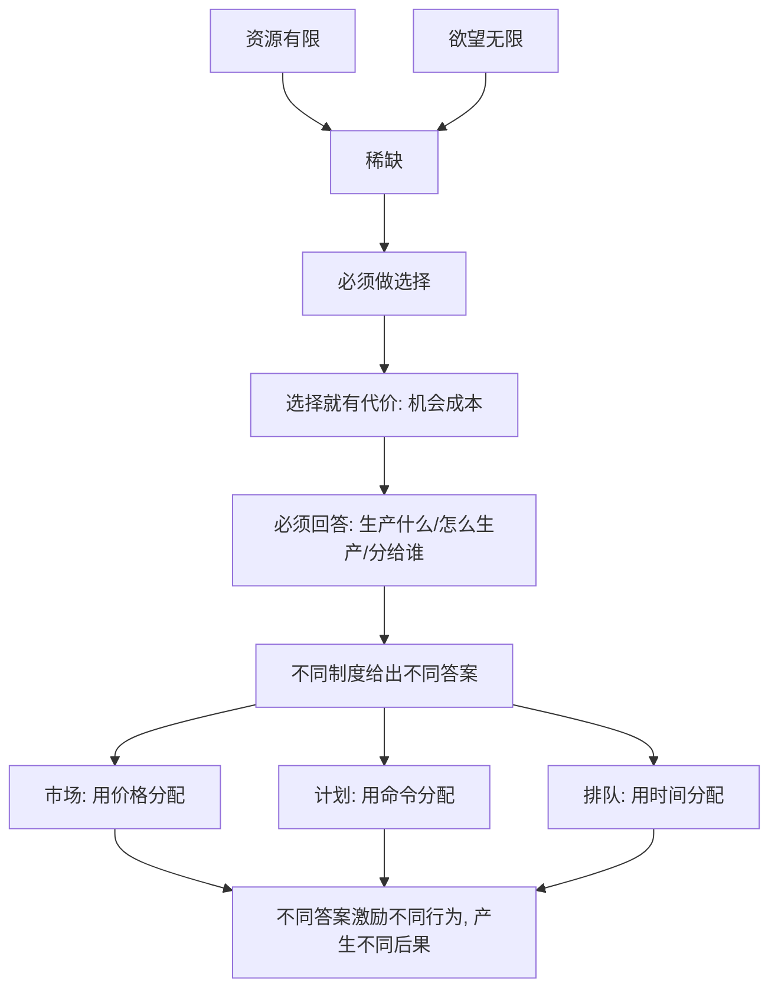

# 01｜为什么经济学要从“稀缺”开始？

> 为什么"稀缺"是一切经济问题的起点？

---

## 一、先说结论

薛兆丰把经济学的地基，压在一个最朴素的词上：**稀缺。**

资源是有限的，而人的欲望是无限的——这就是稀缺。因为稀缺，任何社会都必须回答三个问题：**生产什么、怎么生产、分给谁。** 市场也好，计划也好，习俗也好，本质上都是回答这三个问题的不同方式。

理解了稀缺，你就理解了经济学为什么既"冷"又"实"：它研究的不是钱，而是**在无法满足所有人的前提下，如何做选择**。

---

## 二、我们先理解一个问题

先看几件你习以为常的事。

- 想上最好的大学，名额是有限的；
- 想住在最好的地段，房子是有限的；
- 想在高峰时段打车，路上的车和司机是有限的；
- 想挂到最好的专家的号，专家一天的时间是有限的。

这些东西有个共同点：**大家都想要，但数量不够。**

于是问题就来了：

> 既然是"不够分"，那到底该怎么分？谁该得到，谁该等待，谁该出局？

这个问题看起来是道德问题，其实是一切制度的起点。经济学之所以要谈稀缺，正是因为它决定了：**没有一种分配方式能让所有人满意，社会必须做出取舍。**

---

## 三、作者到底提出了什么观点？

薛兆丰反复强调：**稀缺是经济学的第一前提。**

由此可以推出几个关键判断：

1. **选择必然伴随代价。** 因为资源给了 A，就不能给 B——这就是"机会成本"的来源（第 02 篇）。
2. **没有"既要又要"。** 想要更多免费的东西、又不愿付出任何代价，在稀缺面前是自相矛盾的。
3. **所有制度都在解决同一个问题。** 市场用价格分配，计划用命令分配，排队用时间分配，关系用人情分配——方式不同，本质相同：**用某种标准决定谁得到稀缺的东西。**

他的关键洞见是：**讨论哪种分配方式"更好"，不能只看愿望，而要看它实际激励了什么行为、产生了什么后果。**

---

## 四、把这个观点翻译成人话

想象一个只有一块蛋糕的生日会。

十个人都想吃，可蛋糕只有一块。这时只有几种可能：

- 按人头平均分（可能有人吃不饱，也可能有人不满意）；
- 谁出钱多谁先吃（价格）；
- 谁来得早谁先吃（排队）；
- 谁跟主人关系好谁先吃（人情）；
- 由主人说了算（权力）。

你会发现：**每一种分法，都会让一部分人不高兴，也都会奖励某种行为。** 平均分奖励"参与"，出价法奖励"有钱"，排队奖励"有时间"，人情奖励"会来事"，权力奖励"顺从"。

稀缺逼着我们选一种分法，而**选哪种分法，就决定了这个社会鼓励什么。** 经济学的全部讨论，几乎都从这里长出来。

---

## 五、为什么会这样？

把逻辑拆成链条：

关键在 **C → D → E** 这一段。

稀缺不是"东西少"，而是"相对欲望而言不够"。它逼出选择，选择逼出代价，代价逼出权衡。所以经济学从一开始就不是在研究"如何让所有人都满意"，而是在研究：**在不能满足所有人的情况下，怎样做取舍，代价是什么。**

---

## 六、举一个现实生活中的例子

看一个无数家庭都经历过的场景：**抢学区房。**

好学校是稀缺的，好地段也是稀缺的。于是家长面临选择：

- 花高价买学区房——用**钱**竞争；
- 租房落户、提前多年排队——用**时间和规划**竞争；
- 托关系、找人脉——用**人情**竞争；
- 或者搬去别处，接受另一所学校——用**妥协**竞争。

有意思的是，无论用哪种方式，"稀缺"都没有消失。钱不够的人被淘汰，时间不够的人被淘汰，关系不够的人被淘汰。**大家不是在争夺"有没有竞争"，而是在争夺"用哪种规则竞争"。**

这也解释了为什么学区房、车牌摇号、专家号这类话题总能吵翻天——因为争论的表面是政策，实质是：**我们用哪种标准，来分配那些大家都想要、却不够分的东西。**

---

## 七、回到书中重新理解

现在再回看薛兆丰为什么开篇就讲稀缺，就顺了。

他要建立的，是一种**冷静的问题意识**：经济学不承诺"让所有人都满意"，它研究的是"资源不够时怎么选、选了之后会怎样"。先接受这一点，后面的成本、需求、价格、产权、管制，才有统一的落脚点。

所以第一篇真正重要的，不是"稀缺"这个词，而是它背后的态度：**世界是有限度的，任何选择都要付代价，任何"好事"都要问一句——钱从哪来、谁在承担。**

---

## 八、这个观点背后还有什么？

**第一，稀缺是相对的，不是绝对的。** 空气在一个房间里不稀缺，在潜水时极其稀缺——稀缺取决于"相对于需求"。

**第二，稀缺不必然导致冲突，但必然导致分配。** 分配可以是和平的（价格、排队），也可能是暴力的（争夺）。

**第三，不同分配方式的"代价"不同，且常常被隐藏。** 价格分配让穷人吃亏，排队分配让时间多的人占优，关系分配让没背景的人受挫——没有一种方式是"零成本"的，只是成本落在不同人身上。

**第四，它是整本书的统一前提。** 后面每一个概念，都是对"稀缺如何被处理"的深入回答。

---

## 九、这个观点有问题吗？

有，主要是"以稀缺为起点"可能带来的视角局限。

**第一，"稀缺是前提"容易滑向"现状是合理的"。** 如果一切都归因于稀缺，就可能忽略：很多"稀缺"其实是制度人为制造的（如牌照、指标、准入限制）。薛兆丰本人也强调这一点，但读者容易只记住"不够分"而忘记"为何不够分"。

**第二，过度强调权衡，可能低估道德与分配正义。** 并非所有东西都应当交给价格决定：医疗、教育、投票权，是否适合纯价格分配，学界和社会都有大量争论。

**第三，经济学视角会天然偏爱"效率"，而效率不是唯一价值。** 公平、尊严、权利，同样是重要的社会目标，不能只用"代价"来衡量。

**第四，但它提供了不可替代的清醒。** 在讨论"该不该免费""该不该限价"时，稀缺与代价的视角能有效防止"好心办坏事"。

**所以更准确的说法是**：稀缺是理解经济问题的必要起点，但"以稀缺为切口"是一种分析视角，而非全部真理；分配正义与人为制造的稀缺，同样值得追问。

---

## 十、今天再看这个观点

以下部分是基于薛兆丰思想的现代延伸，不是他在书里的原话。

在数字时代，"稀缺"发生了一个有趣的反转：注意力成了最稀缺的资源。

信息不再稀缺——恰恰相反，它过剩得让人窒息；真正不够分的是**你的时间和注意力**。于是各种平台用免费内容争夺你的注意力，再把注意力卖给广告主。你以为自己在免费消费，其实你付出的，是远比钱更稀缺的东西。

这正好印证了全书的提醒：**当一样东西看起来免费，稀缺并没有消失，只是换了一种形式，由另一群人以另一种代价承担。**

---

## 十一、这一篇真正应该记住什么？

1. **稀缺 = 资源有限 + 欲望无限。** 它是一切经济问题的起点，也是所有制度要回答的问题。
2. **稀缺逼出选择，选择必有代价。** 得到了 A，就意味着放弃了 B，这就是机会成本。
3. **所有制度都在解决"怎么分"。** 价格、计划、排队、关系，本质是不同分配标准。
4. **没有零成本的分配方式。** 每种分法都奖励某种行为，也都让一部分人受损。
5. **但它是一种视角，而非全部。** 分配正义与人为制造的稀缺，同样值得追问。

---

## 十二、留一个问题

> 如果一切"不够分"的东西，都必然要用某种标准来分配，
> 那么你现在争到手的东西，
> 是靠钱、靠时间、靠关系，还是靠"规则刚好站在你这边"？

---

**下一篇**：既然资源不够分，做选择就必然有代价。可"代价"到底是什么？为什么经济学家总说，你付出的远不止你掏的那些钱？

下一篇我们就来拆开这个问题——**为什么"成本"不是你花了多少钱？**
