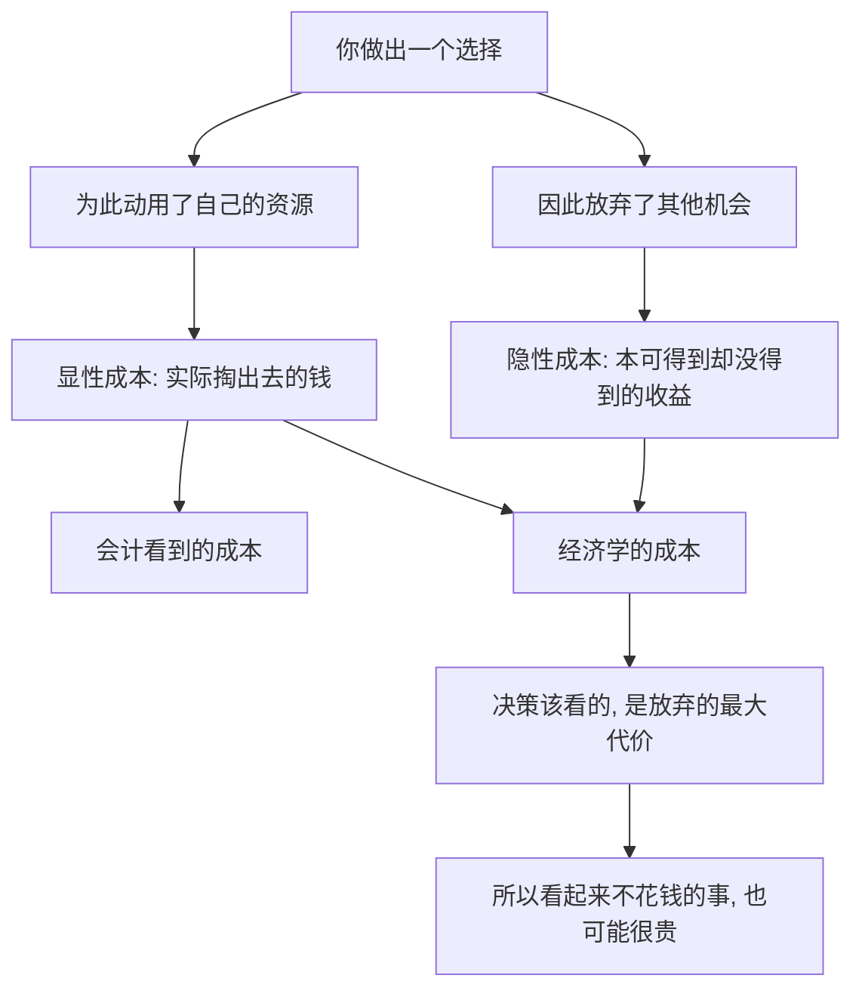

# 02｜为什么“成本”不是你花了多少钱？

> 成本到底该怎么算？

---

## 一、先说结论

薛兆丰认为，经济学里的成本，不是你实际掏出去的那笔钱，而是**你为了做成这件事，所放弃的最大代价。**

花五十块钱看一场电影，账面上的成本是五十块。但如果你本来可以用这两个小时接一份能赚三百块的活，那么这场电影的真实成本就是三百块——那五十块，只是顺带付出的零头。

**成本的关键不在“你付出了什么”，而在“你放弃了什么”。** 看得见的支出只是冰山一角，看不见的机会才是水下的大块。

---

## 二、我们先理解一个问题

先看几个熟悉的场景。

- 你周末去加班，拿到了加班费，这算不算“赚了”？
- 你把十万块存进银行，拿一点点利息，这算不算“赚了”？
- 你用一下午刷短视频，一分钱没花，这算不算“没有成本”？

如果只看账面，答案似乎都是肯定的：有钱进就赚了，没花钱就没成本。

可换个角度，这几笔账立刻变了样：

- 加班的那天，你放弃了陪家人、休息、做副业的时间；
- 存款拿利息的那一年，你放弃了这笔钱本可以带来的其他收益；
- 刷短视频的那个下午，你放弃了本可以用来学习、运动或休息的时间。

于是真正的问题变成了：

> 我们平时说的“成本”，是不是从一开始就算错了？

---

## 三、作者到底提出了什么观点？

薛兆丰反复强调一个反直觉的判断：**成本是被放弃的最大代价，而不是实际支出的金额。**

由此可以推出几层意思：

第一，**成本由选择决定，而不由账单决定。** 只要你做了选择，就一定要放弃别的选项；被放弃的选项里最值钱的那个，就是你的成本。

第二，**会计成本不等于经济成本。** 会计只记录“实际流出去的钱”，而经济学要把“本来可以得到的收益”也算进来。前者看得见，后者看不见，但后者常常更大。

第三，**沉没成本不是成本。** 已经花掉、收不回的钱，不该再影响接下来的决定。真正的成本永远是“向前看”的：从此刻起，你选择 A 而非 B，会损失什么。

第四，**成本因人而异。** 同样一小时，对律师和对无业者价值不同，所以同一件事的成本，对不同人完全不一样。

薛兆丰的关键洞见是：**“花钱”只是成本的一种形式，而“放弃”才是成本的本体。**

---

## 四、把这个观点翻译成人话

用一座城市里的同一块地来说。

这块地，用来盖商场，还是盖住宅，还是空着？

如果只看盖商场的花费——买地、施工、装修——那是会计意义上的成本。可经济学要问的是：**这块地不盖商场，最好的用途是什么？**

假如它拿来盖住宅能挣两个亿，那么选择盖商场，真正的成本就至少是两个亿，而不是只把工程款加起来。

再比如你手里有十万块。存银行、买基金、开店、还房贷，你只能选一个。你选的那个，账面上的付出看得见；你放弃的那些，看不见却真实存在——**它们才是你真正付出的东西。**

一句话：**你付出去的是钱，你失去的是另一个可能。**

---

## 五、为什么会这样？

把逻辑链条拆开：

关键在于 **C 到 E 再到 G** 这一段。

资源和钱一样，是有限的。你把它用在这里，就不能用在那里。所以任何选择都自带一个“被放弃的最佳替代方案”，而这个替代方案的价值，才是你真正付出的代价。

这也解释了为什么很多决策一旦把隐性成本算进来，答案会完全反转：**原来“划算”的可能变亏，“免费”的可能最贵。**

---

## 六、举一个现实生活中的例子

看一个几乎人人都做过、却很少算对的决定：**读大学。**

账面上，读大学的成本很清楚：学费、住宿费、书本费、生活费。四年下来，这是一笔不小的数目。

但经济学会提醒你：**读大学最大的成本，其实不是这些，而是这四年你本来可以赚到、却因为上学而没有赚到的工资。**

一个高中毕业生，如果直接工作，四年里可能挣到十几万甚至更多。选择读大学，就意味着放弃这笔收入。它不进账单，不进流水，却是实打实的代价——这就是典型的**机会成本**。

想清楚这一点，很多讨论就变得不再简单：

- 如果一个专业毕业后月薪并不比高中毕业时高多少，那么读它的真实回报，可能远没有表面看起来那么吸引人；
- 如果一个学生这四年读大学，比用来打工、学手艺更值得，那么这笔账就是划算的——因为被放弃的那份工作，价值更低。

**学费只是明面上的价格，被放弃的四年收入，才是那门课真正的标价。** 这笔账算清楚，人就不会只盯着“学费贵不贵”，而会去问：**这四年换来的东西，值不值我放弃的那份收入？**

---

## 七、回到书中重新理解

现在再回看薛兆丰为什么要花这么大力气讲成本，就顺了。

他要建立的是一种**重新计算的能力**：不要只盯着账单，要盯着机会。因为人在做决定时最容易犯的错误，就是把“没花钱”当成“没代价”，把“看得见的支出”当成“全部的成本”。

所以这一篇真正重要的，不是“机会成本”这个术语，而是它背后的追问：**为了得到它，我放弃了什么？那个被放弃的东西，值多少？**

---

## 八、这个观点背后还有什么？

**第一，成本是主观的，因人因时而异。** 同样一次加班，对急着攒钱的人是机会，对急着陪孩子的人是损失。没有一把统一的尺子。

**第二，成本是“向前看”的。** 已经泼出去的水收不回来，沉没成本不该参与决策。很多人舍不得退出一件“已经投入很多”的事，正是被沉没成本绑住了。

**第三，它把“收益”也重新定义了。** 你说一件事“赚了”，严格说，是指它的回报高于你为它所放弃的最佳替代方案。

**第四，它是整本书的分析工具。** 需求定律、价格、产权、管制，几乎每一个概念背后，都站着“成本就是放弃”这句话。

---

## 九、这个观点有问题吗？

有，而且争议不小。

**第一，机会成本常常无法精确量化。** 你能算清学费，却很难算清“这四年如果没上大学会怎样”。被放弃的选项往往只存在于想象中，它的价值只能估计，不能精确测量。

**第二，它容易变成“事后诸葛亮”。** 事前你并不知道哪个替代方案最好，只有事后回看，成本才清晰。用它来做决策，难免带有不确定性。

**第三，会计成本并非无关紧要。** 对企业来说，现金流和账面亏损决定了它能否活下去。只谈机会成本、不谈实际支出，公司可能早就撑不住了。

**第四，不是所有代价都能被货币化。** 陪家人的时光、健康、尊严，很难折算成钱。若一味用“值多少钱”去衡量一切，会把很多无法定价的东西抹掉。

**所以更准确的说法是**：机会成本是理解“真实代价”的一把关键尺子，但它是一把粗略的尺子；用它可以看得更远，却不能指望它给出精确到小数点的答案。

---

## 十、今天再看这个观点

以下部分是基于薛兆丰思想的现代延伸，不是他在书里的原话。

在今天的“注意力经济”里，机会成本变得前所未有地重要。

看一条免费视频、刷一个免费信息流，账面上你一分钱没花。但你真正付出的，是那段时间本可以用来做别的事的最大价值。平台争的，正是这份被放弃的东西。

同样，在很多职业选择上，人们开始算的不再只是薪水高低，而是“这份工作让我放弃了什么”：更好的行业、更自由的时间、更近的城市。**当账单越来越隐形，机会成本就成了判断值不值的那把尺。**

---

## 十一、这一篇真正应该记住什么？

1. **成本 = 被放弃的最大代价**，而不只是实际支出的钱。
2. **会计成本看得见，机会成本看不见**，但后者常常更大。
3. **沉没成本不是成本**，它只影响过去，不该左右未来。
4. **成本因人而异、因时而异**，没有统一标准。
5. **算清成本，答案常常反转**——原来“划算”的未必划算，“免费”的未必便宜。

---

## 十二、留一个问题

> 如果成本是你放弃的最大代价，
> 那么你今天做的每件事，
> 真正让你付出的，究竟是那点钱，
> 还是那段再也回不来的时间？

---

**下一篇**：既然很多代价并不写在账单上，那么那些标价为零的东西，代价藏在哪里？为什么经济学反复提醒我们——**没有真正的免费，只有换了个地方的账单**？

下一篇我们就来拆开这个问题——**为什么“免费”往往最贵？**
