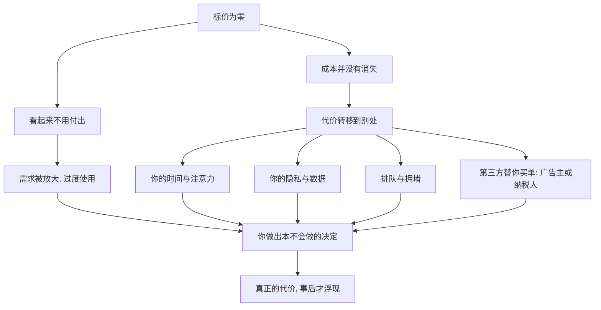

# 03｜为什么“免费”往往最贵？

> 既然不要钱，为什么免费反而可能是陷阱？

---

## 一、先说结论

薛兆丰有一条贯穿全书的提醒：**天下没有免费的午餐。** 一件东西标价为零，不等于它没有成本，只等于**成本换了个地方付。**

价格消失的地方，代价往往转移到你看不见的地方：你的时间、你的注意力、你的隐私、你排队等待的耐心，或者最后由广告商、纳税人、另一群消费者替你买单。

免费最危险的地方不在于它贵，而在于它**让你以为自己什么都没付出**——于是你放松警惕，做出本不会做的决定。

---

## 二、我们先理解一个问题

先看几件“不要钱”的事。

- 手机上很多 App 下载免费、使用免费；
- 城市里有些公园、博物馆免费开放；
- 商家发免费试用装、免费体验课；
- 平台给你免费的新闻、视频、地图。

把它们放在一起看，问题就冒出来了：

> 这些东西确实没有问你要钱，可它们背后的人力、服务器、内容、场地，是谁在支付？

答案通常不是“没人付”，而是**你没付**。有人替你付了，或者你用了别的东西付了。于是真正值得追究的问题，不是“它是不是免费”，而是：

**这笔账，到底记在谁头上？**

---

## 三、作者到底提出了什么观点？

薛兆丰的观点可以概括成三层。

第一，**价格只是成本的一种表达方式，不是成本本身。** 承接上一篇：成本是放弃的最大代价。免费只是把“用钱支付”换成了别的方式，放弃的东西并没有减少。

第二，**免费会掩盖稀缺。** 一样东西一旦不标价，人们就感受不到它有多紧张，于是需求被放大、被过度使用。承接第一篇：稀缺没有因为免费而消失，只是不再被价格提醒。

第三，**免费的账单总会落到某个人身上。** 可能是广告主，可能是平台用你的数据变现，可能是纳税人，也可能是未来某个更弱的一方。**“有人付”并不等于“你付”，但也不等于“无人付”。**

他的关键判断是：**看到“免费”，第一反应不应该是高兴，而应该是问——谁在为它买单？**

---

## 四、把这个观点翻译成人话

想象一顿标价固定的自助餐：交了钱就随便吃。

你会发现，大多数人会拿得比平时多，也更容易浪费。为什么？因为“再拿一份”的边际价格是零，短时间内感觉不到代价，于是不知不觉就吃撑了、剩下一桌。

或者想一片免费开放的鱼塘。谁都可以钓，谁都不必付钱买鱼。结果往往不是鱼越来越多，而是被钓光——每个人多钓一条的好处归自己，鱼塘变空的代价却由所有人分担。

这两个例子说明同一件事：**当一样东西不向你收费时，你就失去了“节制”的信号。** 价格是提醒你“这是有限的”的那个开关，开关一关，过度使用就来了。

---

## 五、为什么会这样？

把链条拆开：

关键在 **A 到 B 到 D** 和 **C 到 E** 这两条线。

一条讲的是心理：不花钱，就没感觉，于是用得多。另一条讲的是结构：成本不会凭空蒸发，它只是从你眼前挪到了别处。

两条线合起来，就是“免费往往最贵”的完整解释：**你在付，只是没意识到自己在付。**

---

## 六、举一个现实生活中的例子

最典型的，是**免费 App。**

下载不要钱，注册不要钱，使用也不要钱。看起来你什么都没失去。但仔细看，这笔账其实是这样结的：

- 你每一次滑动、停留、点击，都在贡献**时间和注意力**，平台把这份注意力打包卖给广告主；
- 你提供的搜索、位置、通讯录、消费偏好，构成了它的**数据资产**；
- 为了换取“免费”，你要忍受广告、推送、诱导分享，甚至难以关闭的自动续费。

于是你会发现一个反常识的结论：**你不是这款 App 的顾客，你更像它卖给广告主的商品。** 你付出的不是钱，而是比钱更难收回的东西——注意力和隐私。

这也是为什么很多“免费”服务一旦开始收费，用户会突然清醒：原来它一直有价值，只是以前由别人替你付，或者由你用别的方式付了。

---

## 七、回到书中重新理解

现在再回看薛兆丰为什么反复强调“没有免费的午餐”，就顺了。

他要训练的是一种**追问账单的习惯**：看到零价格，不要停在“白得”，而要追到“谁在付、用什么付、以后会不会加倍还回来”。

所以这一篇真正重要的，不是“免费不好”，而是它背后的警觉：**价格消失的地方，往往更需要你睁大眼睛。**

---

## 八、这个观点背后还有什么？

**第一，免费会制造“公地”。** 凡是人人可用、却无人负责维护的东西，都容易被过度使用。免费带来的拥堵、滥用、劣质，正源于此。

**第二，注意力是一种被长期低估的资源。** 它有限、不可存储、无法再生，却在免费时代被大规模地消耗与交易。

**第三，免费常常靠“交叉补贴”维持。** 一部分人付费，补贴另一部分人免费使用；或一个业务不赚钱，靠另一个业务来补。理解这一点，才能看懂很多商业模式的真相。

**第四，它和成本、稀缺一脉相承。** 稀缺没消失，成本没消失，只是价格这一层被拿掉了——而被拿掉的那层，恰恰是最容易被忽略的。

---

## 九、这个观点有问题吗？

有，不能一边倒地说“免费都是陷阱”。

**第一，免费确实能带来真实的福利。** 开源软件、义务教育、公共图书馆、基础防疫，都是“不向使用者收费”却极大造福社会的例子。关键在于成本由谁承担、是否可持续，而不在于“免费”本身。

**第二，隐性支付可以是自愿且双赢的。** 你愿意用看广告换取免费内容，这是一种交换，未必吃亏。真正的问题不是“有没有隐性成本”，而是**你是否知情、能否退出**。

**第三，把“免费”一律说成欺骗，会误伤公共品。** 很多公共服务的价值，恰恰在于它不按钱分配，让支付能力弱的人也能获得。

**所以更准确的说法是**：免费不是问题，“免费的代价被刻意隐藏、且你无法拒绝”才是问题。经济学的提醒，是让你看清账单，而不是让你拒绝一切免费。

---

## 十、今天再看这个观点

以下部分是基于薛兆丰思想的现代延伸，不是他在书里的原话。

今天，“免费”已经演化成一套精密的商业结构：

- **免费增值**：基础功能免费，关键功能收费，用免费把人留住；
- **数据换服务**：用隐私和注意力支付；
- **补贴换规模**：先用巨额亏损把价格压到零，等市场被占领后再谈条件。

于是新的问题出现了：当免费变成一种**获客手段**，用户要警惕的就不再是“贵不贵”，而是“**我以后会不会被锁住、被迫按新价格付费**”。价格可以为零，替代方案却可能被你亲手放弃了。

---

## 十一、这一篇真正应该记住什么？

1. **没有真正的免费，只有换地方付的账单。**
2. **成本不会消失**，它只是转移到时间、注意力、隐私或第三方身上。
3. **免费会掩盖稀缺**，放大需求，导致过度使用与拥堵。
4. **看到免费，先问“谁在买单”**，而不是先高兴。
5. **免费本身不是罪**，隐藏账单、无法退出才是陷阱。

---

## 十二、留一个问题

> 如果每天免费占用你几个小时的那些东西，
> 都按你真正付出的代价来计费，
> 你还会像现在这样，
> 觉得它们是“白拿”的吗？

---

**下一篇**：既然价格一变，人的行为就会跟着变，那么“便宜就多买、贵了就少买”这条规律，究竟有多可靠？为什么经济学家把它称为最坚固的一条经验？

下一篇我们就来拆开这个问题——**为什么越便宜买得越多？**
