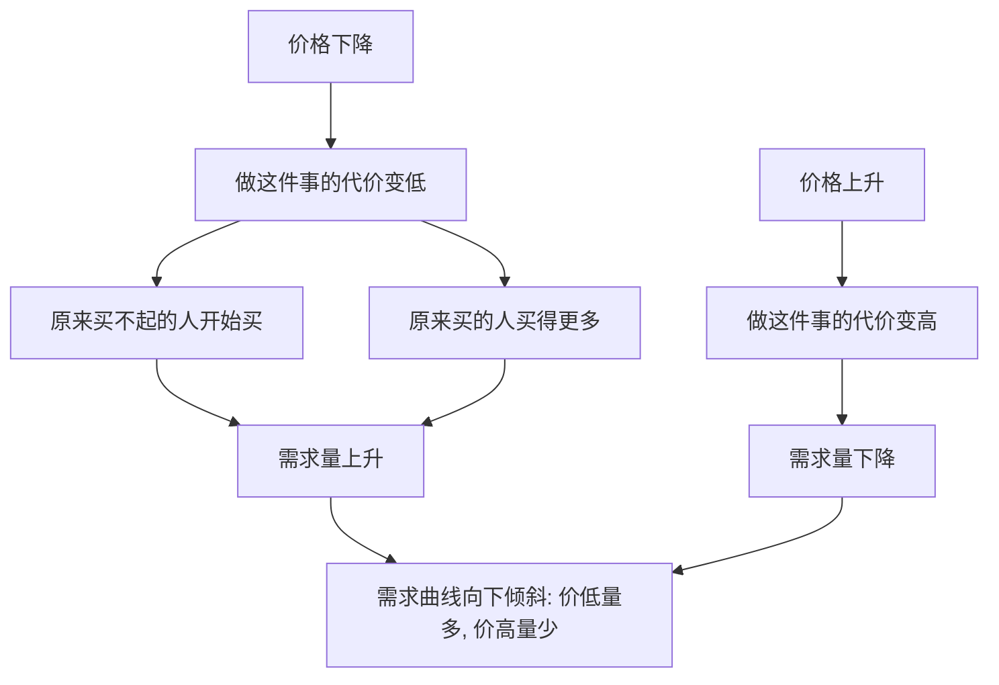

# 04｜为什么越便宜，买得越多？

> 需求定律为什么被称为经济学最可靠的规律之一？

---

## 一、先说结论

薛兆丰认为：**需求定律**——在其他条件不变时，价格越低，需求量越大；价格越高，需求量越小——是经济学里最可靠、最经得起检验的规律之一。

它不只适用于买东西，也适用于时间、婚姻、犯罪、排队：**只要一件事有代价，代价降低，人们就会做得更多；代价升高，人们就会做得更少。**

理解了它，你就能看懂为什么涨价能抑制需求、降价能刺激消费，也能识破那些“既想要便宜，又不想排队”的自相矛盾。

---

## 二、我们先理解一个问题

先做一个思想实验。

同一件商品，摆在两个不同的柜台上，一个卖十块，一个卖五块。你会买哪个？买多少？

再想几个现实里的场景：

- 超市打折时，你会不会顺手多拿几件？
- 旺季机票贵得离谱，你会不会把出行往后推？
- 打车很难、又很贵的时候，你会不会改坐地铁？

这些场景看着各不相同，背后却指向同一个问题：

> 当一件事变便宜，我们的行为，究竟会怎么变？

答案出奇地一致：**便宜了就多做一点，贵了就少做一点。** 而这条朴素的规律，正是经济学的第一块试金石。

---

## 三、作者到底提出了什么观点？

薛兆丰把需求定律放在非常核心的位置，他的表述可以拆成几层。

第一，**价格与需求量反向变动。** 价格降，需求量升；价格涨，需求量降。这是需求定律最直接的表述。

第二，**要分清“需求”和“需求量”。** “需求量”是在某个具体价格下你愿意买的数量；“需求”则指整条关系。价格变化时，我们说的是“需求量”沿着曲线移动；而收入、偏好、替代品价格等因素变化时，才是整条“需求”在移动。

第三，**前提是“其他条件不变”。** 需求定律不是孤立成立的，它描述的是：在别的因素都不动的前提下，光看价格和数量之间的关系。

第四，**它源于“代价”这个更根本的逻辑。** 承接前面的成本与稀缺：价格是你要付出的代价之一，代价变了，愿意做的事自然就变。

**薛兆丰的关键判断是：需求定律之所以可靠，是因为它不需要假设人是理性的，只需要假设人有趋利避害的本能。**

---

## 四、把这个观点翻译成人话

把价格理解成一道门槛。

门槛低，跨过去的人就多；门槛高，跨过去的人就少。所谓“需求曲线向下倾斜”，说的就是这件事——**价格像门槛，数量像过门的人。**

更日常一点：

- 某样东西便宜了，你就“舍得用”了——原来舍不得开的空调，现在敢开；
- 某样东西贵了，你就“开始省”了——原来随手就买的东西，现在要掂量一下。

有意思的是，同一个你，什么都没变，只是价格变了，行为就变了。这说明价格从来不只是账单上的数字，它还是**一个挂在每个人面前的信号灯**，告诉你“该多来一点，还是该少来一点”。

---

## 五、为什么会这样？

把逻辑拆成链条：

关键在 **A 到 B 再到 E** 这一段。

价格下降，意味着代价下降。代价一下降，两类行为同时发生：**新的买者进场**（原来觉得贵、干脆不买的人开始买），**老买者加量**（原来只是偶尔买的人开始多买）。两者叠加，需求量自然上升。

反过来，价格上升，一部分人退出，一部分人减量，需求量下降。

**这条规律之所以“可靠”，是因为它把复杂的人心，简化成了一个可预测的方向：代价向上，行为向下；代价向下，行为向上。**

---

## 六、举一个现实生活中的例子

看一个你和商家都再熟悉不过的场景：**打折促销。**

平时卖一百块的东西，标价突然变成六十块。你会怎么反应？

- 你可能会买一件，而不是像平时那样看看就走；
- 你可能会多买几件囤着，想着“反正以后用得上”；
- 你甚至可能原本没打算买，看到促销就顺手带一件。

商家对这条规律的理解，比谁都深。所以他们才会设计满减、第二件半价、限时折扣、会员价——所有这些花样的背后，都站着同一个逻辑：**把价格降下来，把需求量推上去。**

反过来看也成立：一旦恢复原价，销量往往会明显回落。同一件商品、同一群人，只是价格变了，购买行为就变了。

这正是需求定律最生动的证据：**不用说服，不用教育，只要动一下价格，人的行为就会跟着动。**

---

## 七、回到书中重新理解

现在再回看薛兆丰为什么把需求定律放在那么重要的位置，就顺了。

他要建立的是一个**预测行为的基本方向感**。世界很复杂，但如果连“便宜多买、贵了少买”都不成立，那么讨论价格、管制、税收、竞争就都失去了支点。

所以这一篇真正重要的，不是背下“价升量减”这四个字，而是理解它背后的态度：**人会对代价作出反应。想预测人的行为，先去看代价往哪边走。**

---

## 八、这个观点背后还有什么？

**第一，弹性决定反应的幅度。** 需求定律只说“方向”，不说“多少”。有些东西降一点价，销量就暴涨（弹性大）；有些东西即使大降价，销量也变化不大（弹性小）。米面油盐和珠宝首饰，就完全不是一回事。

**第二，替代品会放大效应。** 一样东西越容易被别的东西替代，价格一变，需求量的变动就越剧烈。

**第三，它和时间尺度有关。** 短期内人们来不及调整，长期内调整空间大得多。价格变化的影响，常常要过一段时间才完全显现。

**第四，它适用于价格之外的一切“代价”。** 排队变长、手续变繁、门槛变高，本质上都是“变贵了”，需求量同样会下降。

---

## 九、这个观点有问题吗？

有，需求定律虽然坚固，但并非没有例外和争议。

**第一，确实存在一些“越贵越买”的现象。** 比如某些奢侈品、身份象征品，价格高反而更受追捧，因为高价本身就是它的价值来源之一。经济学把这类东西称为特殊商品，它们并不推翻需求定律，而是在提醒：价格有时也在传递身份和品质的信号。

**第二，有些商品的需求由预期驱动。** 房价上涨时有人反而抢着买，是因为预期还会继续涨——起作用的是预期，不是当下的价格。

**第三，“其他条件不变”在现实中很难满足。** 现实里收入、偏好、替代品、政策同时在变，所以我们很少能干净地观察一条纯需求曲线。这也是为什么经济学结论总带着“在假定条件下”的限定。

**第四，成瘾性商品、生活必需品会有特殊反应。** 对它们的需求，价格变化的反应可能很钝，甚至出现方向异常的短期现象。

**所以更准确的说法是**：需求定律是理解人类行为最可靠的起点之一，但它是方向上的规律，不是精确的公式；遇到例外，不是要否定它，而是要追问——这里面还藏着什么别的因素？

---

## 十、今天再看这个观点

以下部分是基于薛兆丰思想的现代延伸，不是他在书里的原话。

在算法和数据时代，需求定律被使用得比以往任何时候都更精细。

商家不再只是打折，而是**对每个人给出不同的价格**：新用户首单立减、老用户满减券、深夜时段特价、根据你浏览习惯推送的个性化优惠。本质上，这都是在对不同的人、在不同的时刻，精准地测试“降到什么价格、需求会升多少”。

这对消费者既是机会也是挑战：**你既可能因为算法而买到更便宜的东西，也可能因为算法的诱导而买了本来不需要的东西。** 需求定律没变，变的是“价格”这件事被拆得越来越细、越来越隐蔽。

---

## 十一、这一篇真正应该记住什么？

1. **需求定律：价格降，需求量升；价格涨，需求量降。** 它是最可靠的经验规律之一。
2. **分清“需求量”和“需求”**，前者沿曲线移动，后者是整条关系的位移。
3. **它建立在“代价”之上**，不只适用于钱，也适用于时间、门槛、麻烦。
4. **弹性决定幅度**，替代品、时间尺度都会改变反应的强弱。
5. **有例外，但例外不是否定**，而是提醒你价格之外还有别的力量。

---

## 十二、留一个问题

> 如果人的行为总是对价格作出反应，
> 那么当一样东西的价格被人为压住、不再自由变动时，
> 人们又会靠什么来决定“谁先得到、谁多得到”？

---

**下一篇**：价格似乎只是一串数字，可它真的只是“收钱”吗？为什么经济学家说，价格还在悄悄做着几件我们平时看不见的事？

下一篇我们就来拆开这个问题——**价格到底在起什么作用？**
