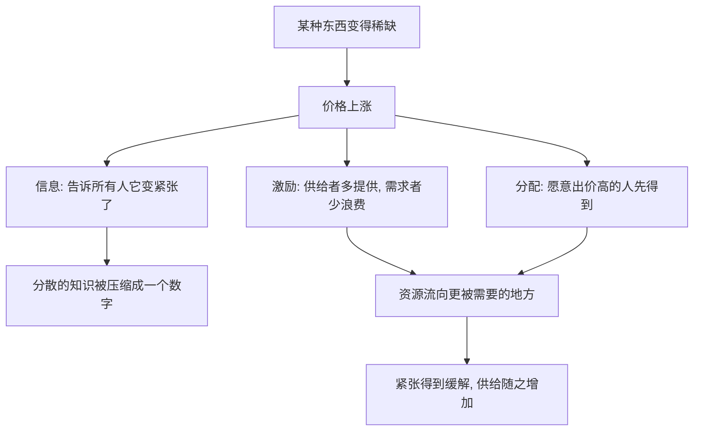

# 05｜价格到底在起什么作用？

> 价格除了“收钱”，还在做哪些更重要的事？

---

## 一、先说结论

薛兆丰认为，价格从来不只是“收钱的工具”，它至少还在做三件更根本的事：**传递信息、提供激励、分配资源。**

价格上涨，是在告诉所有人“这样东西变紧张了”；它同时激励供给者多提供、需求者少浪费；最后，它把有限的资源，分配给愿意付出最高代价的人。

更关键的是，价格并不需要谁来指挥，它是**自发形成的**。它像一台机器，把分散在千万人头脑里的知识和偏好，压缩成一个简单的数字。

---

## 二、我们先理解一个问题

想象一个暴雨天。

路上的车并没有变少，可突然之间，想打车的人多了好几倍。于是出现了同一个难题：

> 有限的这些车，该先给谁？

现实里大概只有几种办法：

- **排队**：谁先到、谁等得久，谁先走；
- **抽签**：谁的运气好，谁先走；
- **出价**：谁愿意多付，谁先走。

每种办法都在回答“谁得到”，但后果完全不同。排队时，稀缺变成了“时间的竞争”；抽签时，稀缺变成了“运气的竞争”；出价时，稀缺变成了“意愿的竞争”。

真正值得琢磨的是：**这三种办法里，哪一种能最快让“想坐车的人”和“能提供车的人”匹配起来？** 这背后，就是价格在起作用的那个位置。

---

## 三、作者到底提出了什么观点？

薛兆丰对价格的理解，可以拆成三层功能。

第一，**价格传递信息。** 一样东西变得稀缺，价格就会上涨。这个上涨本身，就是一个信号，告诉所有人：它变紧张了，请节约着用、请多生产一点。人们不需要知道为什么缺水、缺车、缺电，只需要看到价格变了。

第二，**价格提供激励。** 价格上涨，供给者觉得有利可图，就更愿意多提供；需求者觉得代价高了，就会主动减少浪费。价格不靠命令，却能把双方的行为同时往“缓解稀缺”的方向推。

第三，**价格决定分配。** 谁愿意付最高的价格，谁就先得到。这未必“公平”，但它是一种清晰、可执行、不需要额外监督的分配规则。

而这三条串起来，指向同一个洞见：**价格是把分散的知识压缩成一个数字的机制。** 没有谁需要掌握全部信息，价格自己就完成了协调。

---

## 四、把这个观点翻译成人话

还是那个暴雨天打车的例子，把三种办法摆在一起比一比。

**排队**的结果是：谁时间不值钱，谁更可能等得起；赶时间的人反而走不了。**抽签**的结果是：谁运气好谁走，可运气和“谁更需要”毫无关系。**出价**的结果是：谁最急着走、最愿意为此多付一点，谁就先走。

你会发现，价格在这里做的事，远不止“收钱”：

- 它**筛选出了最需要的人**——愿意多付，通常意味着这件事对你更重要；
- 它**把车调动到了更紧张的地方**——价格高的时段和路段，司机更愿意往那里开；
- 它**不需要任何人下命令**——没有调度员挨个指挥，车自己就流动起来了。

所以价格不是一张冷冰冰的账单，它更像**城市里的红绿灯**：不用谁站岗，大家看着它，就知道该走还是该停。

---

## 五、为什么会这样？

把价格的三个功能画成一张图：

关键在 **B 分出的三条线**。

价格上涨的同一个动作，同时完成了三件事：告诉所有人情况变了（信息），让大家改变行为（激励），决定东西归谁（分配）。

**这就是价格最奇妙的地方：一个数字的变动，同时解决了“知情”“动员”和“分配”三个问题。** 而它之所以能做到这一点，是因为它不需要一个全知全能的指挥者——这正是它比计划更灵活的原因。

---

## 六、举一个现实生活中的例子

最好的例子，是**高峰期打车的动态加价。**

下雨天、早晚高峰、演唱会散场，打车需求暴涨。这时平台会把价格往上调。表面的理解是“平台在趁机多赚钱”，但如果从价格的功能看，事情不止于此：

- **信息**：价格一涨，乘客立刻知道“现在车很紧张”，一部分不那么着急的人会改坐地铁、改走路，需求被自然分流；
- **激励**：价格一涨，更多司机愿意绕路、愿意放弃休息出来接单，供给被调动起来；
- **分配**：那些确实赶时间、愿意多付的人，更容易叫到车——有限的车，流向了最需要它的人。

如果不允许涨价，结果往往是：车没有变多，乘客却在原地干等，最后靠运气和手速决定谁走。**价格被压住，不代表稀缺消失了，只是“谁先得到”变成了一场更隐蔽的竞争。**

这也正是价格的真正作用：**它不只回答“多少钱”，更回答“有限的东西，到底该流向谁”。**

---

## 七、回到书中重新理解

现在再回看薛兆丰为什么反复强调价格，就顺了。

他要打破的，是把价格简单理解成“商家收钱手段”的直觉。价格的本质，是一套**分散协调机制**：它让互不相识的人，通过一个数字，就能各自作出与整体相协调的决定。

所以这一篇真正重要的，不是记住“三大功能”这个清单，而是理解它背后的态度：**价格失灵的地方，往往就是信息失灵、激励失灵、分配失灵的地方。**

---

## 八、这个观点背后还有什么？

**第一，它背后是“知识分散”的思想。** 一个社会里，关于谁需要什么、谁更能生产什么的信息，分散在无数人手中，任何中心都难以全部掌握。价格的意义，在于让这些分散的信息，通过交易自动汇集。

**第二，价格同时是收入。** 对买家，价格是成本；对卖家，价格是收入。所以价格既引导资源配置，也决定谁分到多少，这两件事本来就缠在一起。

**第三，价格是一种自发秩序。** 它不是谁设计出来的，而是无数人在追求各自利益的过程中“长”出来的。这也是它常常比人为安排更灵活的原因。

**第四，它是理解后面很多问题的钥匙。** 短缺、排队、管制、黑市，本质上都是“价格没能正常发挥作用”之后的结果。

---

## 九、这个观点有问题吗？

有，而且围绕价格的争论，一直非常激烈。

**第一，价格不表达公平。** 谁出价高谁得到，意味着支付能力强的人更有优势。对医疗、教育、基本住房这类东西，很多人认为不该完全交给价格决定。关于这一问题，学界和社会都存在不同看法。

**第二，价格无法反映“外部性”。** 有些交易的好处和坏处会落到交易双方之外的人身上，价格只管交易双方，管不了这些溢出效应。这类情况，往往需要别的制度来补。

**第三，需求不等于“需要”，而是“有效需求”。** 一个很想坐车却付不起钱的人，在价格机制里等于不存在。这是价格机制冷酷的一面。

**第四，紧急时刻的涨价有伦理争议。** 灾难、停电、疫情中涨价，能激励供给，却可能被指责趁火打劫。一些经济学家认为它有助于快速恢复供应，另一些经济学家和公众则更强调此时的分配正义。两边都有各自的道理。

**所以更准确的说法是**：价格是一种强大的协调工具，但它只擅长回答“如何把东西分给愿意付最多的人”，而不擅长回答“谁更应该得到”。把价格当万能药，或者当万恶之源，都不准确。

---

## 十、今天再看这个观点

以下部分是基于薛兆丰思想的现代延伸，不是他在书里的原话。

数字平台把价格的三大功能，推到了一个新阶段。

动态定价、峰谷定价、算法定价，让价格可以**按分钟、按路段、按每个人**不停调整。信息传递更快了，激励反应更灵敏了，分配也更精确了。

但新的问题也随之而来：当价格由算法随时调整，消费者往往看不清它为什么变贵；当同一个服务对不同人显示不同价格，公平感就成了新的争议焦点。**价格依然在做它那三件事，只是它变得更快、更细，也更需要被理解。**

---

## 十一、这一篇真正应该记住什么？

1. **价格至少有三个功能**：传递信息、提供激励、分配资源。
2. **它把分散的知识压缩成一个数字**，不需要指挥者就能协调社会。
3. **价格失灵，往往意味着信息和激励同时失灵。**
4. **价格擅长配置资源，不擅长判断公平。**
5. **把价格压住，稀缺不会消失**，只是换一种更隐蔽的竞争方式。

---

## 十二、留一个问题

> 如果价格真正的作用，是把有限的东西分给“最愿意付出代价的人”，
> 那么当价格因为种种原因不能自由上涨时，
> 那些“抢不到”的东西，
> 到底是变少了，还是只是换了一套规则在分配？

---

**下一篇**：挂号难、抢票难、堵车堵到心累，真的仅仅是因为东西不够吗？如果价格不能正常发挥作用，稀缺的东西又是靠什么来分配的？

下一篇我们就来拆开这个问题——**为什么“抢不到”往往是因为价格没放开？**
