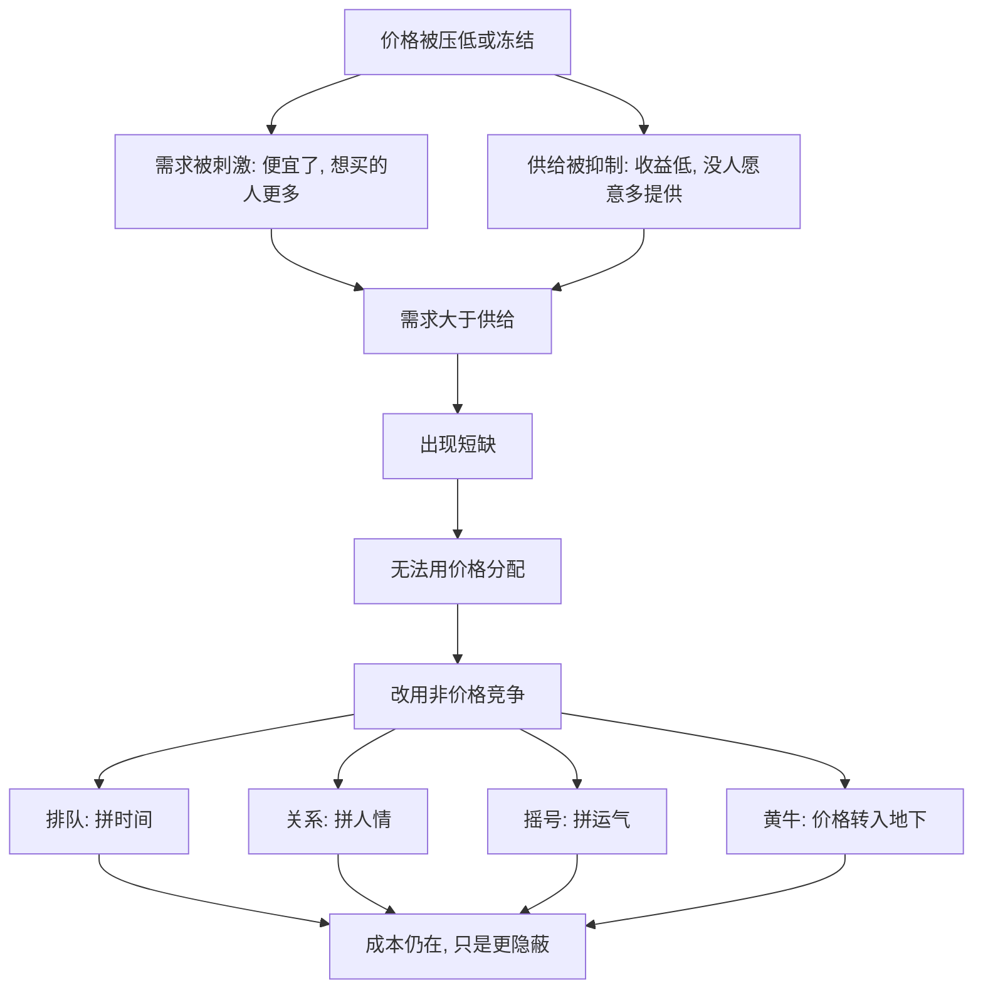

# 06｜为什么“抢不到”往往是因为价格没放开？

> 挂号难、抢票难、堵车，真的是“东西不够”吗？

---

## 一、先说结论

薛兆丰认为，很多“抢不到”，不是东西绝对不够，而是价格没能发挥作用。价格本该承担两件事：把稀缺的信息传递出去，让愿意付更高代价的人先得到，同时激励供给增加。一旦价格被压住甚至冻结，需求被刺激、供给被抑制，短缺就只能以排队、托关系、拼运气的方式表现出来。

这些替代方式叫“非价格竞争”。它们看起来不花钱，实际上同样有成本，只是成本更隐蔽、分配更不公平。

---

## 二、我们先理解一个问题

先看几件让人烦躁的事。

专家号一放号就被秒光，黄牛手里却总有号；春运火车票开售即“无票”，但总有人能想办法搞到；早晚高峰的主干道堵成停车场，可同一条路深夜却空得可以散步。

直觉告诉我们：人太多、车太多、票太少，所以抢不到。

但请再想一层：如果只是“东西不够”，为什么加价之后，很多时候突然就有货了？为什么同一趟航班，愿意多付钱的人往往能买到票？为什么深夜的同一段路反而不堵？

问题就变成：到底是资源不够，还是分配资源的方式出了问题？

---

## 三、作者到底提出了什么观点？

薛兆丰的核心判断是：价格是一种分配机制，也是一种激励信号。当价格被允许自由浮动时，它会同时做三件事。

第一，传递信息。价格涨，说明这里稀缺；价格跌，说明这里宽松。

第二，引导行为。价格高，激励供给方多生产、多投入；价格低，抑制一部分需求。

第三，完成分配。愿意付更高代价的人先得到，这是一种标准，也是一种筛选。

反过来，如果价格被按住，这三件事就同时失灵：稀缺的信息传不出去，供给没有增加的动力，需求反而被“便宜”刺激得更多。剩下的分配任务，只好交给排队、摇号、关系、特权。

薛兆丰强调，非价格竞争不是“没有竞争”，而是换了一种竞争规则。票价被压低，竞争就转移到“谁时间多、谁手速快、谁关系硬”上。

---

## 四、把这个观点翻译成人话

想象一家只卖十碗面的面馆。

如果一碗定价十元，门口立刻排起长队，因为便宜。队伍里有人等三小时，有人找熟人插队，有人雇人代排。你以为自己在“免费”排队，其实付出的是时间；你以为黄牛是在赚黑心钱，其实他赚的是“帮你省下排队时间”的钱。

如果这碗面涨到五十元，队伍短了，一部分人选择不吃，供给方可能多开一家分店。价格把“谁真的想要”筛了一遍。

两种情况下，面还是那十碗，需求还是那么多。区别只在于：我们用什么来竞争，用钱，还是用时间、关系、运气。

这就是“价格没放开”的真正后果：它不是消灭了竞争，而是把竞争从明处赶到了暗处。

---

## 五、为什么会这样？

把逻辑画成链条：

关键在于 A 到 D 再到 F 这一段。

价格一旦不能动，短缺就不会自动消失，它只会换一副面孔。你以为省下的钱，往往从别的地方被拿走——从你的时间、耐心、公平感里拿走。

---

## 六、举一个现实生活中的例子

最典型的，是专家号。

三甲医院的热门专家，一天只能看几十个病人，这确实是稀缺。但“挂不上号”还有第二层原因：挂号费被定得很低。几十元就能看顶级专家，需求自然爆满；价格又不足以激励更多供给，专家再多也不可能无限增加出诊。

于是分配只能靠别的标准：凌晨排队、手机抢号、托熟人、找黄牛。

再看春运抢票。火车票价格长期被压在一个相对低的水平，回家过年又是刚需。结果就是：放票瞬间涌入海量需求，谁网速快、谁设备好、谁用抢票软件，谁就更有机会。很多人的“抢不到”，其实是“不愿意或没办法付出更高的非价格代价”。如果票价能在不同时段、不同席别之间更灵活地浮动，一部分需求会主动错峰，供给方也更有动力加开临客。

这两件事的共同点很清楚：短缺的背后，常常站着一个不肯松动的价格。

---

## 七、回到书中重新理解

现在再看薛兆丰为什么反复讲价格的三大功能，就顺了。

他要纠正的，是一种流行的错觉：以为“抢不到”就说明“东西太少”，于是本能地想“管住价格、限制涨价”，把它当成保护弱者的善政。

但价格一旦被管住，稀缺并不会消失，它只会改用另一种方式分配。看得见的，是你少花了钱；看不见的，是你多排了队、托了人、欠了人情，以及被抑制的供给和恶化的服务质量。

经济学在这里提供的，不是“涨价的理由”，而是一句冷静的追问：既然总要有人得不到，我们到底希望用哪种标准来决定？

---

## 八、这个观点背后还有什么？

第一，非价格竞争也有赢家和输家。拼时间，时间多的人赢；拼关系，有背景的人赢；拼运气，谁都不服气。价格竞争至少是明码标价的，非价格竞争往往更不透明。

第二，价格还有“排队替代”的作用。高峰打车加价、高峰电价、拥堵收费，本质都是让“不急的人”主动让路，把稀缺资源留给“更急的人”。

第三，供给的弹性很重要。如果供给能被迅速扩大，“抢不到”可能只是暂时的；如果供给被牌照、准入、审批锁死，价格调节的空间也会受限。

第四，它和需求定律是一体两面。价格低，需求量就大；价格不能涨，需求就不会退，短缺就是必然结果。

---

## 九、这个观点有问题吗？

有，而且值得认真对待。

第一，并非所有东西都适合完全交给价格。医疗、教育、基本出行，带有很强的公共属性和公平考量。一些经济学家认为，如果一切按出价高低分配，穷人在最需要帮助的领域反而最先出局。价格能解决效率问题，却未必能解决分配正义问题。

第二，“价格没放开”有时是结果，不是原因。专家号难挂，也可能源于优质医疗资源过度集中、分级诊疗不完善；春运难，也可能源于区域发展不均衡。把问题全归到价格上，会遮蔽更深的制度成因。

第三，放开价格不等于问题自动解决。如果供给被严格管制、竞争不充分，涨价可能只是让中间环节获利，而未必带来更多产出。涨价有效，前提是它有空间去激励供给。

第四，关于这一问题，学界存在不同解释。有人强调价格机制的核心作用，也有人强调信息、制度与公平约束同样关键。比较稳妥的看法是：价格是理解“抢不到”的一把关键钥匙，但它不是唯一的一把。

---

## 十、今天再看这个观点

以下部分是价格理论的现代延伸，不是薛兆丰的原话。

平台经济的兴起，让“价格没放开”有了新的形态。网约车的动态调价、机票的收益管理、酒店的浮动房价，都是把价格当作调节稀缺的工具。它们引来很多抱怨，但也在客观上把“谁能更快打到车”从“谁运气好”变成了“谁更着急、愿意多付一点”。

与此同时，抢票软件、预约挂号、会员优先等机制，本质上都是在价格被限制之外，又长出了一套“准价格”或“准特权”的分配方式。它们提醒我们：需求不会因为你不给它价格通道就消失，它只会去找别的出口。

---

## 十一、这一篇真正应该记住什么？

1. “抢不到”常常不是东西不够，而是价格没能调节。
2. 价格做三件事：传递信息、引导激励、完成分配。按住价格，三件事一起失灵。
3. 非价格竞争不是没有竞争，它只是把竞争转移到时间、关系、运气上。
4. 短缺不会消失，只会换面孔。你省下的钱，可能从别处被拿走。
5. 但价格不是万能钥匙。公共属性、供给弹性与分配正义，同样必须被考虑。

---

## 十二、留一个问题

> 当一样东西既便宜又难抢，
> 你觉得真正稀缺的是那样东西，
> 还是我们用来“抢”它的那套规则？

---

**下一篇**：抢不到的时候，我们习惯说“我有权利先来”“我有权利被照顾”。可这些“权利”，究竟是谁给的？它真的天经地义，还是被人为界定出来的？

下一篇我们就来拆开这个问题——**“权利”到底是谁给的？**
