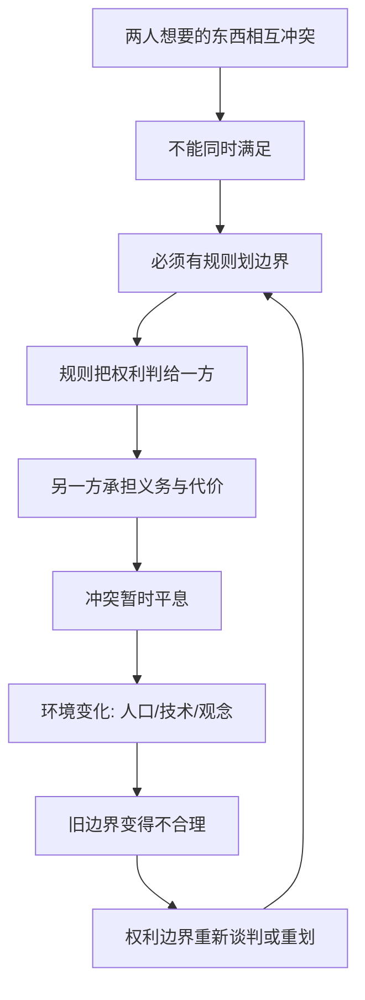

# 07｜“权利”到底是谁给的？

> 我们说“这是我的权利”，权利是天生的还是人造的？

---

## 一、先说结论

薛兆丰认为，权利不是天上掉下来的，而是被制度“界定”出来的。

经济学视角下，很多看似道德问题的争议——我能不能在深夜弹琴、你要不要让我借道通行、谁该排在前面——本质上都是同一个问题：谁有权对谁做什么。权利是一种关于“允许与禁止”的安排，它决定了冲突发生时谁让步、谁承担代价。

理解这一点，才能理解为什么权利边界总在移动，为什么“我的权利”和“你的权利”常常撞车。

---

## 二、我们先理解一个问题

想想你身边这些事。

你在自己家里深夜练琴，邻居说吵得睡不着；你住在小区里，外卖员想借道穿过院子送餐；你排了很久的队，有人过来插队，说家里有急事。

每一件事里，双方都能说出一句听起来义正词严的话：“我在自己家，凭什么不能弹琴？”“这是条路，凭什么不让我走？”“我排了这么久，凭什么让你插？”

问题到这里就卡住了：如果双方都觉得自己有理，那到底谁对？

我们习惯把这类争执看成“讲不讲道理”的问题。但经济学想换一个角度问：有没有一条被明确界定的规则，说清楚在冲突的这一刻，谁的权利优先、谁必须退让？

---

## 三、作者到底提出了什么观点？

薛兆丰的一个重要判断是：权利不是先于制度的自然物，而是制度界定的结果。

也就是说，权利不是“本来就有、别人不许侵犯”，而是“社会用规则划出一条线，规定谁可以做什么、谁不可以做什么”。这条线可以这样划，也可以那样划；一旦划定，就得有人遵守，也得有人被约束。

由此可以推出几个判断。

第一，权利冲突的实质，是“谁有权影响谁”。你能不能让邻居安静，你能不能让路人通行？这不是比谁更委屈，而是看规则把权利判给了谁。

第二，权利必须有边界，否则等于没有权利。如果我说“我有权在我家做任何事”，那你说的“我有权睡个安稳觉”就落空了。两条绝对的权利同时存在，必然打架。

第三，权利与责任是一体两面。给了你权利，就是在给别人施加义务。

第四，权利会随条件变化。城市更拥挤了、噪音标准更严了、路权分配更细了，权利的边界就会移动。

---

## 四、把这个观点翻译成人话

把“权利”想象成院子之间的一道篱笆。

篱笆不是天然的，是人修的。修在哪里，不是因为它“本来就该在那里”，而是因为双方或社会需要一个稳定、可执行的边界。

如果篱笆画在靠你这边，那邻居弹琴吵到你，就是你受委屈，规则站在他那边；如果画在靠他那边，那他得克制，规则站在你这边。篱笆一挪，输赢就换了人。

所以当我们说“这是我的权利”时，更准确的说法可能是：“现有的规则，把这件事的主动权判给了我。”权利不是一句口号，而是一条被承认、可执行的边界。

---

## 五、为什么会这样？

关键在 B 到 C 再到 D 这一段。

如果资源无限、欲望不冲突，就根本不需要“权利”这个概念。恰恰因为大家想要的东西会撞车，社会才必须划线；而划线必然意味着：有人被保护，就有人被约束。

---

## 六、举一个现实生活中的例子

看城市里的噪音。

你买了房子，觉得“在自己家想怎样就怎样”是天然权利；隔壁住户觉得“晚上睡觉不被打扰”也是天然权利。可这两条“天然权利”直接冲突。于是只能靠规则来裁：几点以后不能装修、噪音分贝上限是多少、广场舞该在什么时段、什么区域进行。

规则把线一划，冲突就变成了“谁违规”的问题，而不是“谁更有理”的问题。判给了安静的一方，活动的一方就要承担限制；判给了活动的一方，休息的一方就只能换房间或装隔音。

再看通行。行人和车辆都想用同一段路，谁优先？红绿灯、斑马线、专用道，本质都是在分配“谁在什么时刻有权通过”。没有这些规则，路口就变成纯粹的博弈，谁横谁赢。

还有排队。你觉得“先到先得”天经地义，可“先到”如何定义？是站在队里算，还是拿到号才算？能不能代人排队？黄牛排队算不算？这些细节，正是权利边界在实际操作中不断被重新界定的地方。

三件事的共同结论是：权利冲突从不缺“理由”，缺的是被共同承认、并被执行的边界。

---

## 七、回到书中重新理解

现在再看薛兆丰为什么要专门讲权利，就顺了。

传统讨论容易停在“谁更值得同情”“谁更该被照顾”。经济学的视角则往前一步：同情不能当规则用，因为双方都能讲出一套动人的理由。真正能解决问题的，是明确的权利界定——把模糊的“应该”变成清晰的“可以”与“不可以”。

他也借此提醒：讨论权利问题时，不要只问“这样公平吗”，还要问“这条线划下去，会激励什么行为、产生什么后果”。一项权利安排，不只是分配了这一次的对错，还塑造了人们长期的行为预期。

---

## 八、这个观点背后还有什么？

第一，权利界定有成本。划线本身要成本：立法、执法、监督、打官司。划得太细，成本高到无法执行；划得太粗，冲突又会不断。

第二，权利的初始分配会影响结果。同样一条边界，判给 A 还是判给 B，会导致不同的财富与行为。这也是权利问题总是敏感的原因。

第三，权利可以被交易。如果权利清晰且可以转让，双方反而可能通过协商各取所需——你真需要安静，我其实可以换个时间练琴，付点补偿就能两全。这一点，下一篇的科斯定理会专门展开。

第四，权利不是越绝对越好。绝对的权利必然和别人的绝对权利打架，真正可行的是有限、清晰、可执行的权利。

---

## 九、这个观点有问题吗？

有，值得认真对待。

第一，把权利看成“制度界定”，容易被误读为“强权即公理”。如果权利只是规则划出来的，那是不是谁掌握规则谁就说了算？一些思想家强调，权利背后还应有人道与正义的底线，不能完全还原为制度安排。经济学需要承认这一层，而不能只讲“划线”。

第二，权利不能只用效率衡量。有些权利，比如人身安全与基本尊严，即使“重新分配更有效率”，也不应被随意交易。这是经济学视角需要谨慎的地方。

第三，界定清晰不等于界定公正。一条清晰但对弱势方不利的界线，照样可能引发长期不满。清晰与公正，是两个必须分开看的问题。

第四，关于这一问题，学界存在不同解释。有学者侧重权利的道德基础，有学者侧重其制度功能。比较稳妥的理解是：权利既需要被制度界定，也受到道德观念的约束，两者共同塑造它的边界。

---

## 十、今天再看这个观点

以下部分是权利理论的现代延伸，不是薛兆丰的原话。

数字时代给“权利边界”出了一道新题：数据归谁？“看什么、买什么、刷多久”的注意力，归平台还是归你自己？你同意过的那份隐私协议，算不算一次权利的让渡？

另外，平台规则、社区公约、算法排序，正在承担过去由法律和习俗完成的“划线”工作。谁被推荐、谁被限流、谁的声音被放大，背后都有一套隐形的权利分配。它们不像红绿灯那样看得见，却实实在在地决定着谁能通行。

这提示我们：当规则的主语从“政府”变成“平台”，权利的界定机制变了，但“谁有权对谁做什么”这个老问题，一点没变。

---

## 十一、这一篇真正应该记住什么？

1. 权利不是天生的，而是被界定出来的边界。
2. 权利冲突的实质，是“谁有权影响谁”。
3. 绝对的权利必然打架，可行的是清晰、有限、可执行的权利。
4. 权利与责任一体两面：给你权利，就是给别人义务。
5. 清晰不等于公正，界定本身也需要被追问。

---

## 十二、留一个问题

> 当你理直气壮地说“这是我的权利”时，
> 你是在陈述一条天经地义的道理，
> 还是在陈述某套规则恰好站在了你这边？

---

**下一篇**：既然权利要靠界定，那么“界定得清不清、稳不稳”，就直接决定了人们愿不愿意长期投入。为什么一张房产证、一项专利，会有那么大的力量？

下一篇我们就来拆开这个问题——**为什么保护产权如此重要？**
