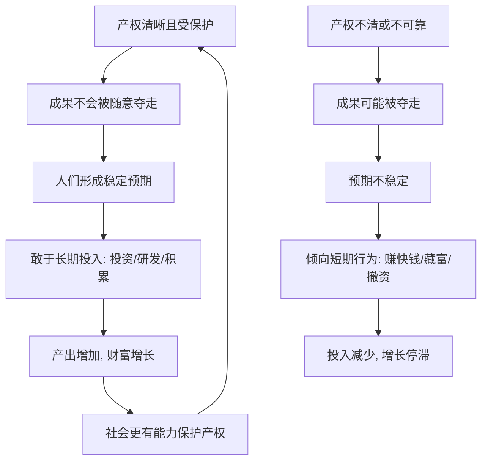

# 08｜为什么保护产权如此重要？

> 一张房产证、一项专利，为什么能决定一个国家的兴衰？

---

## 一、先说结论

薛兆丰认为，产权提供的核心东西，是稳定的预期。

当一个人相信自己的劳动成果、投资和创造不会被随意拿走，他才愿意去长期投入；当他觉得“做成了也未必是我的”，理性选择就是少投入、赚快钱、甚至干脆不做。产权保护表面上是保护财产，实质上是保护“长期努力”这件事本身。

所以一张房产证、一项专利，看似只是一纸凭证，背后却是一整套关于“未来归谁”的承诺。

---

## 二、我们先理解一个问题

看两件事。

第一件：你买了一套房，办下房产证。你为什么会愿意花钱装修、愿意精心维护、愿意在这里长住？因为你知道，这套房在法律上写着你的名字，别人拿不走。

第二件：一个公司投入几年、投入大量资金研发一项技术，如果它不能获得专利保护，竞争对手可以马上仿制，它还敢不敢投？

直觉告诉我们：有产权，才敢投入。

但请再往深想一层：产权到底保护的是什么？是一堆砖头、一份技术资料，还是别的什么？

---

## 三、作者到底提出了什么观点？

薛兆丰强调，产权的本质是一组权利：占有、使用、收益、转让。这四种权利合在一起，给人的，是可预期的未来。

他的几个关键判断是。

第一，产权提供预期。有了稳定的产权，人们才敢做长期打算：种树、盖房、读书、研发、存钱。没有预期，人只能追求眼前。

第二，产权保护的是激励，不只是财富。它让努力与回报挂上钩。劳动成果归自己，人才会努力创造；成果可能被夺走，人就会偷懒、藏富、外流。

第三，产权要能被保护、被交易。只能拥有不能转让的产权，价值会大打折扣；能清晰界定、能自由交易的产权，才能流向更能用好它的人手里。

第四，产权保护的不是某一类人，而是所有愿意长期努力的人。它既保护富人，也保护那个刚攒下第一笔钱、准备开小店的普通人。

---

## 四、把这个观点翻译成人话

把产权想象成一把伞。

晴天时，你不会觉得伞重要；可一旦下雨，你就知道它决定了你会不会被淋湿。产权也是这样：在稳定的时候，它像空气一样不被注意；可一旦它变得不可靠，所有长期计划都会开始动摇。

更准确地说，产权是一份社会给你的承诺：“你种下的，只要合法，就是你的；你付出的，不会被随便拿走。”有了这份承诺，人才会把今天的资源，投向明天。

这是“产权”和“财产”最关键的区别：财产是眼前那件东西，产权是围绕它的、关于未来的那套规则。

---

## 五、为什么会这样？

这是一个正反馈与负反馈的对照。左边是良性循环，右边是恶性循环。关键就在 B 到 C 再到 D 这一段：有没有稳定预期，决定了人们把资源投向明天还是今天。

---

## 六、举一个现实生活中的例子

先看房产证。

为什么人们如此在意那张证？因为它决定了你敢不敢在这套房上投入。有证，你愿意装修、愿意改善、愿意长期规划；如果房子随时可能被收回、被他人主张，你连墙都不敢刷。

这张证的意义，甚至超出房子本身：它是一个信号，告诉所有普通人——“你的积累是安全的”。当一个社会的普通家庭敢买房、敢存钱、敢做二十年规划，整个社会的长期资本才可能积累起来。

再看专利。

研发是典型的高投入、长周期、结果不确定。专利的作用，是在一段时间内，把新技术带来的收益锁定给发明者或投资者。正是因为有了这份锁定，企业才敢投入巨资去研发。没有专利，仿制者可以坐享其成，谁还愿意当那个投入最多、风险最大的人？

两个例子的共同逻辑很清晰：产权把“未来的回报”和“今天的努力”接了起来。没有这条接线，人就没有理由为遥远的未来辛苦。

---

## 七、回到书中重新理解

现在再回看薛兆丰为什么把产权讲得如此重要，就顺了。

他要建立的，是一种“预期”视角：经济能不能长期增长，很大程度上取决于人们相信什么。相信努力有回报、相信积累不会被夺走、相信规则会持续，人才会投资与创造。

这也解释了为什么产权保护常常和经济发展高度相关。保护产权，表面是保护一件物品，深处是保护一种心态——相信明天值得投入的心态。

经济学在这里的提醒是：讨论“该不该保护”的时候，不要只盯着被保护者的财富，而要看它给所有人提供了什么样的行为激励。

---

## 八、这个观点背后还有什么？

第一，产权不只是所有权，还是一束权利。占有、使用、收益、转让缺一不可；只给所有权不给转让权，价值就受限。

第二，清晰的产权能降低交易成本。东西是谁的、能不能卖，写清楚了，谈判和交换才能顺畅进行。

第三，产权也是责任的载体。谁拥有，谁就承担维护、纳税、担责。产权清晰，责任才清晰。

第四，它与权利界定一脉相承。产权是“权利”在财产领域的具体形式，都需要被明确划界、稳定执行。这也自然通向下一篇：当产权清晰之后，双方甚至可以通过谈判自行解决很多纠纷。

---

## 九、这个观点有问题吗？

有，需要平衡地看。

第一，产权保护不能绝对化。有些资产，比如土地与公共资源，牵涉公共利益，完全排他的产权未必合适。产权是手段，不是目的。

第二，过强的产权可能阻碍传播与创新。以专利为例，保护太弱没人愿投，保护太强、期限过长又可能抬高后来者的门槛。关于这一问题，学界存在不同解释，争论的焦点正是“多强才算合适”。

第三，产权保护与分配公平之间有张力。产权让积累被承认，但历史上很多初始产权本身就不公平。只谈保护而不谈来源，可能固化不公。

第四，执行比宣示更难。法律写得再漂亮，如果司法不独立、执行成本过高，产权也只是一句空话。稳定预期来自可执行的规则，而不是条文本身。

---

## 十、今天再看这个观点

以下部分是产权理论的现代延伸，不是薛兆丰的原话。

数字时代正在重写“财产”的边界。你的社交账号、游戏装备、数字藏品、网盘里的数据，算不算财产？平台一次封号，等于没收了你的一部分积累，这需要补偿吗？

同时，数据作为新的生产要素，引发了新的产权问题：用户产生的数据，产权归个人、归平台，还是双方共有？如果没有清晰界定，谁还愿意贡献数据？可如果界定得太死，数据又流动不起来。

这些新问题，本质仍是那句老话：谁拥有、能否交易、预期稳不稳。产权这套逻辑，只是换了个赛场。

---

## 十一、这一篇真正应该记住什么？

1. 产权的核心价值，是提供稳定的预期。
2. 它保护的不只是财富，更是长期投入的激励。
3. 产权是一束权利：占有、使用、收益、转让。
4. 产权保护的是每一个愿意长期努力的普通人，不只是富人。
5. 保护有边界：过强或过弱，都可能带来新的问题。

---

## 十二、留一个问题

> 如果你确信今天的努力，几年后一定会被拿走，
> 你还会认真种下那棵树吗？
> 你又希望用什么，来让别人相信那棵树是他的？

---

**下一篇**：产权一旦界定清楚，还会带来一个更奇妙的结果：很多看似必须由政府出手的纠纷，双方自己就能谈成。这背后的原理，就是科斯定理。

下一篇我们就来拆开这个问题——**科斯定理：为什么“外部性”可以靠谈判解决？**
