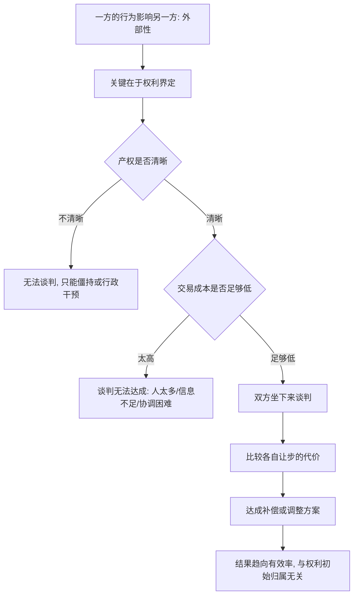

# 09｜科斯定理：为什么“外部性”可以靠谈判解决？

> 工厂的噪音打扰了邻居，除了政府管，还能怎么办？

---

## 一、先说结论

薛兆丰介绍科斯定理时，想纠正一个特别常见的思维定式：遇到“一方的行为伤害了另一方”，我们本能地想问“谁对谁错，该不该禁止”。

科斯定理的洞见是：只要产权明确、交易成本足够低，当事人可以自己谈判，达成有效率的解决方案，无论权利最初判给谁。工厂吵到邻居，未必只有“关门”或“忍气吞声”两个选项，双方完全可能谈出“赔偿”“限时作业”“加装隔音”等安排。

真正的问题往往不在“谁对谁错”，而在产权不清、交易成本太高。这一点，是理解外部性的关键。

---

## 二、我们先理解一个问题

先看一个画面。

一家工厂昼夜开工，机器轰鸣，隔壁小区居民被吵得睡不好觉。居民抱怨，工厂说“我合法经营”。双方都有一肚子理。

我们通常怎么想？要么让工厂停，要么让居民忍，要么政府出面，定个标准、罚个款。

但你有没有想过第三种可能：居民和工厂自己坐下来谈？居民凑钱请工厂加装隔音设备，或者工厂给受影响的住户一笔补偿，双方达成某种“作业时间约定”。

为什么这种谈判可能发生？又为什么它在现实中不一定发生？这一篇要回答的，就是这个问题。

---

## 三、作者到底提出了什么观点？

薛兆丰讲科斯定理时，核心是三个要点。

第一，外部性是相互的。工厂的噪音伤害居民，但如果让工厂停产，工厂和它的工人们也受到伤害。所以问题不是“谁伤害谁”，而是“让谁让步、代价更小”。

第二，在产权清晰、交易成本足够低的前提下，双方谈判可以达成有效率的结果，与权利初始归谁无关。权利判给居民，工厂想要继续开工，就得补偿居民；权利判给工厂，居民想要安静，就得补偿工厂。无论哪种，最终会走向“对双方整体最划算”的安排。

第三，现实中的障碍，主要是产权不清和交易成本太高。如果“谁有权安静”“谁有权开工”说不清，谈判就无从谈起；如果受影响的人成千上万、难以协调，谈判成本也会高到无法进行。

也就是说，科斯定理不是断言“谈判总能解决问题”，而是指出：问题多半出在前提没满足，而不在谈判本身不可能。

---

## 四、把这个观点翻译成人话

把科斯的思路想象成邻居之间的一笔交易。

假设你楼下开了家烧烤摊，烟味飘进你家。你有两个“权利版本”。

版本一：法律规定，居民有权呼吸干净空气。那摊主要继续营业，就得给你补偿——装排烟设备，或者每月给你一笔钱。

版本二：法律规定，摊主有权在自己铺面经营。那你想要他改，就得自己凑钱帮他装排烟，或者你搬走。

有意思的是，科斯说：只要两个人能自由谈、交易成本不高，两种版本最终可能都走向同一个结果——谁更能从“继续”或“停止”中获益，谁就出钱把权利买过来。区别只在于：谁付钱给谁。

这个思路的震撼之处在于：它把“道德审判”换成了“利益谈判”。

---

## 五、为什么会这样？

关键在 C 到 E 再到 G 这三步。

科斯定理的真正价值，不是“谈判万能”，而是把注意力从“谁对谁错”转移到“前提条件够不够”：产权清不清、交易成本高不高。这才是决定外部性能不能靠协商解决的真正变量。

---

## 六、举一个现实生活中的例子

回到工厂噪音与邻居。

一家工厂和附近几户居民，就噪音发生冲突。假设产权清晰，比如法律明确规定了噪声标准和权利边界，涉及的人也不多。这时双方完全可以谈：居民算一算，安静值多少钱；工厂算一算，加装隔音、调整作业时间、或直接赔偿，哪种成本最低。谈成之后，可能是工厂装隔音，可能是工厂夜间停工并补偿，也可能是居民接受一定噪音换取补偿。哪种方案“整体代价最小”，谈判就会往哪个方向走。

现在换成另一种情形：工厂周围住了几万户居民。哪怕产权清晰，要让几万户人一致行动、谈出一个方案，协调成本也高得惊人。这时谈判就很难成功，往往需要由某种统一规则，比如环保标准或政府监管，来替代。这恰恰印证了科斯的前提：交易成本低，协商才可行。

同一个道理，也适用于上下游工厂的排污、楼上的漏水、邻座的纠纷——人越少、界定越清，越容易谈；人越多、越模糊，越难谈。

---

## 七、回到书中重新理解

现在再看薛兆丰为什么把科斯定理放在产权之后，就顺了。

产权讲的是“边界要清楚”，科斯定理讲的是“边界清楚之后，很多问题可以自己解决”。两者是接力的关系：先界定，再交易。

这也纠正了一种惯性思维：一遇到外部性，就默认“必须政府管”。科斯提示我们，政府管制只是众多选项之一，而且它本身也有成本——制定标准要成本，执行监管要成本，判断失误还可能带来新的扭曲。

经济学在这里的提醒是：不要急着审判谁对谁错，先看看双方能不能谈；而谈判能不能成，取决于产权是不是清楚、交易成本是不是够低。

---

## 八、这个观点背后还有什么？

第一，交易成本是全部关键。科斯定理的另一面，其实是一个“反定理”：交易成本高时，权利的初始分配就会直接影响结果，甚至决定效率。这也解释了为什么现实中的制度安排如此重要。

第二，权利初始分配仍影响财富分配。无论谈判走向哪种“有效率”的结果，钱从谁的口袋流向谁的口袋，是与初始权利相关的。效率可能一样，公平却不同。

第三，外部性可以“内部化”。把相关方合并、让一方把另一方“买下来”，也能消除谈判障碍。企业并购、上下游一体化，很多时候就是内部化的思路。

第四，它为产权和制度设计提供了标准。制度好不好，可以看它是否让产权更清晰、让交易成本更低。

---

## 九、这个观点有问题吗？

有，学界对它有一系列重要的补充与批评。

第一，“交易成本足够低”是一个很强的假设。现实中信息不对称、人数众多、情绪对立、法律不确定，都会让交易成本高企。科斯定理更像一个基准，而不是对现实的直接描述。科斯本人也强调，研究现实时应关注交易成本为正的情形。

第二，“无论权利归谁，结果都一样”容易被误读。它成立的前提是谈判能进行且能无成本地转移支付。缺少这些条件，权利的归属会实实在在影响资源配置。

第三，公平问题它不回答。科斯定理谈的是效率，而不是公正。一个通过谈判达成的“有效率”结果，可能伴随着严重的不平等。关于这一点，学界存在不同解释，有人主张效率优先，有人认为必须叠加公平约束。

第四，它可能被滥用为“不必保护弱者”的理由。如果一味强调“双方谈判即可”，就可能忽略谈判力量本身的不对等。强势方和有组织的一方，往往在谈判中占据优势。

所以更稳妥的说法是：科斯定理是一个极其有力的分析框架，它让我们看清产权与交易成本的决定性作用；但它成立需要条件，且不替代对公平的判断。

---

## 十、今天再看这个观点

以下部分是科斯定理思想的现代延伸，不是薛兆丰的原话。

在数字时代，“外部性”和“交易成本”都换了形态。一篇文章被随意转载、一个人的照片被别人用于训练模型，这类伤害涉及的当事方可能数以百万计，逐一谈判几乎不可能——这正是交易成本高到极致的例子，也解释了为什么版权、数据授权、平台规则会以“标准化合约”的形式出现。

反过来，智能合约、标准化授权协议、行业协会的集体谈判，本质上都是在想办法把交易成本降下来，让原本谈不成的双方能够自动达成交易。

科斯的思路因此远远超出“工厂与邻居”，它实际上在问一个更大的问题：当技术让交易成本下降时，哪些原本必须靠强制解决的问题，会重新回到自愿协商的轨道上？

---

## 十一、这一篇真正应该记住什么？

1. 外部性是相互的，问题不是谁伤害谁，而是让谁让步代价更小。
2. 科斯定理：产权清晰、交易成本足够低时，谈判能达成有效率的结果。
3. 权利初始归谁不影响效率，但影响谁付钱给谁。
4. 现实障碍在产权不清与交易成本过高。
5. 它是基准与框架，不是断言；效率之外，公平仍需单独讨论。

---

## 十二、留一个问题

> 当你遇到一场“他伤害了我”的冲突时，
> 你是先急着找出谁对谁错，
> 还是先问一句：这件事的产权清不清楚，我们能不能坐下来谈？

---

**下一篇**：既然很多冲突可以靠界定与谈判解决，那为什么人们仍然愿意等待、愿意储蓄、愿意把钱借给别人？答案藏在一个更朴素的东西里——耐心，它也有价格。

下一篇我们就来拆开这个问题——**为什么“耐心”也是一种资源？**
