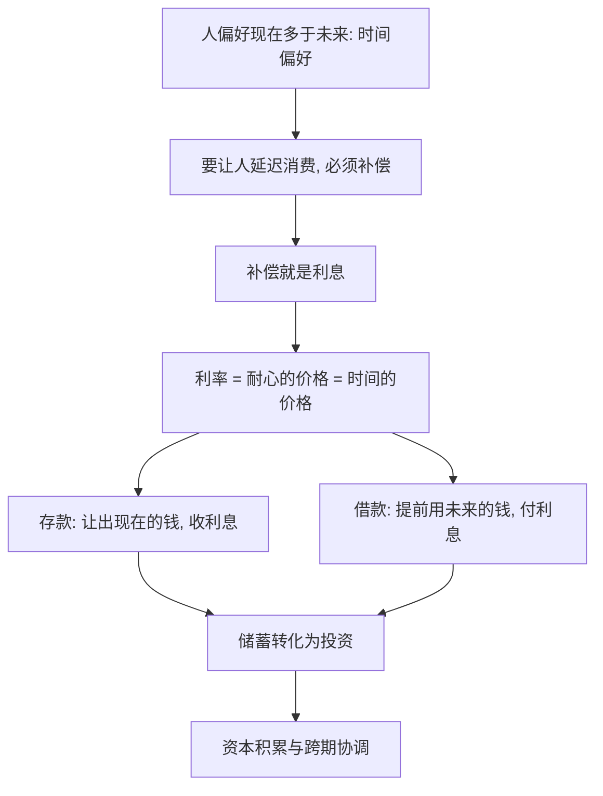

# 10｜为什么“耐心”也是一种资源？

> 借钱为什么要付利息？利息的本质是什么？

---

## 一、先说结论

薛兆丰认为，利息是“耐心的价格”，也是时间的价格。人天生偏好现在多于未来，这叫作“时间偏好”。要让一个人愿意把钱让给别人先用，就必须给他补偿——这个补偿，就是利率。

理解利率，就理解了储蓄、投资、借贷乃至通胀的底层逻辑。存款能拿到利息，不是银行好心；借钱要付利息，也不是放贷人贪心，而是**时间本身有价格**。

---

## 二、我们先理解一个问题

先想一个几乎人人都会遇到的场景。

同一笔钱，今天给你，还是明年给你，你更想要哪个？绝大多数人会选今天。这不是因为你短视，而是因为“现在就能用”这件事本身，就带来价值。

于是问题来了：

> 既然人人都更想要“现在”，那么，凭什么有人愿意把今天的钱让给你，去换一个“明年才还”的承诺？

如果没有补偿，没人愿意这么做。所以借款人必须多还一点，而这一点，就是利息。

---

## 三、作者到底提出了什么观点？

薛兆丰反复强调：**利息不是货币的产物，而是时间的产物。** 哪怕没有钱，只要存在“现在”和“未来”的差别，利息就会以别的形式出现——比如借一袋谷子，秋后还一袋半。

由此可以推出几个判断：

1. **耐心是一种稀缺资源。** 愿意延迟消费的人少，愿意马上享受的人多，耐心就变得值钱。
2. **利率是耐心的价格。** 利率高，说明大家更急着用钱、更不愿意等待；利率低，则相反。
3. **储蓄不是“存起来”，而是“借出去”。** 你把钱存进银行，本质是把它借给了需要用钱的人，利息就是这笔“让渡”的报酬。
4. **任何跨时间的决策，都绕不开贴现。** 未来的钱，要打折换算成今天的价值，这个折扣率就是利率。

他的关键洞见是：**时间偏好是理解一切资本现象的地基。**

---

## 四、把这个观点翻译成人话

想象你和朋友合租。

房间只有一间朝阳的，另一间背阴，大家都想住朝阳那间。这时，如果有人愿意去住背阴的，你会不会多少补偿他一点？会。

钱也一样。今天的一百块，是“朝阳房”；明年的一百块，是“背阴房”。要把“朝阳房”让出来，就得给补贴。**利息，就是这个补贴。**

换个说法：你今天少喝几杯奶茶，把钱存起来，等于把“现在享受”的机会让给了别人；银行付你的利息，就是你让出这份机会的价格。反过来，你急着今天就花，就得为“提前享受”买单。

所以存款有利息、借款要付息，本质上是一件事的两面：**时间被标了价，谁想改变时间的先后，谁就付钱。**

---

## 五、为什么会这样？

把逻辑拆成链条：

关键在 **A → B → C** 这一段。

时间偏好是人性，无法取消；既然人性无法取消，“等待”就必须有报酬。利率不是谁规定的，而是无数人“愿意等待”和“不愿意等待”的力量，共同“喊”出来的一个价格。

---

## 六、举一个现实生活中的例子

看一个最普通的场景：**存款有利息，借钱要付息。**

你把一万元存进银行，一年后拿到一万零几百。这几百块不是凭空变出来的，而是银行把你的钱借给了别人——可能是买房的人、开店的人、进货的人。他们急着今天用钱，愿意为此多付一点，银行分了一部分给你。

反过来，你急用钱去借了一万元，一年后要还一万零几百。多出来的这几百块，就是你为“提前拿到钱”所付的价。

有意思的是：**存钱的人收利息，是因为他愿意等；借钱的人付利息，是因为他不愿意等。** 同样的钱，只因为“时间先后”不同，价格就不同。

这也解释了为什么高利贷总在穷人扎堆的地方出现——越急着用钱、越没有办法等待的人，越要付出高利息。利息的高低，本质上是“耐心稀缺程度”的晴雨表。

---

## 七、回到书中重新理解

现在再看薛兆丰为什么把“耐心”单列一篇，就顺了。

前面讲稀缺、成本、价格，讲的都是“同一时点”的分配；而利息打开的是**跨时间**的维度：今天和明天，也是两种稀缺的资源，它们之间同样要交换、要定价。

所以这一篇真正重要的，不是让你记住“利率是什么”，而是让你意识到：**时间是资源，耐心是资源，等待本身有价值。** 一旦接受这一点，储蓄、投资、借贷、通胀，就都有了统一的解释入口。

---

## 八、这个观点背后还有什么？

**第一，利率既然是一种价格，就一样会被供求影响。** 想借钱的人多、愿意存钱的人少，利率就上升，反之下降。

**第二，贴现把未来拉回现在。** 任何长期项目——修路、研发、造林——都要把未来的收益折成今天的价值，才能和今天的成本比较。

**第三，耐心可以被“生产”。** 制度、信誉、稳定的货币，都能降低不确定性，让人更愿意等待，从而压低利率。

**第四，它把“人”和“资本”连了起来。** 资本的积累，本质上是一代代人选择“少享受一点、多留给未来”的结果。

---

## 九、这个观点有问题吗？

有，主要集中在“利率能否解释一切”上。

**第一，现实利率不只反映耐心。** 它还包括通胀预期、风险溢价、政策干预等成分。把利率完全等同于“时间偏好”，是一种简化。

**第二，不同人的时间偏好差异很大，且受处境影响。** 穷人未必“天生没耐心”，而是生存压力让他不得不优先解决眼前。把它简单归为性格，可能掩盖了结构性的原因。一些经济学家认为，时间偏好本身有一部分是环境塑造的。

**第三，“高利息是耐心的价格”可能被用来为高利贷辩护。** 关于这一问题，学界存在不同解释：有人认为高利率只是风险与稀缺的反映，也有人认为它加剧了对弱者的盘剥，因此需要管制。

**第四，但它提供了一个不可替代的视角。** 在讨论储蓄率、消费刺激、利率政策时，“时间有价格”是绕不开的起点。

**所以更准确的说法是**：利息确实根植于时间偏好，但现实利率是多种力量的混合结果；耐心是资源，却不是解释利率的唯一钥匙。

---

## 十、今天再看这个观点

以下部分是基于薛兆丰思想的现代延伸，不是他在书里的原话。

在一个“即时满足”被无限放大的时代，耐心的价格正在被重新书写。外卖要三十分钟送到，视频要十五秒抓住你，消息要秒回——技术把“等待”压缩到几乎为零，人的时间偏好被不断推向“更急”。

这带来一个反直觉的结果：**越是被即时满足包围的人，越难积累。** 因为积累的前提恰恰是延迟享受——存钱、学习、锻炼、长期主义，本质上都是“先让渡现在，以换取未来”。谁失去了等待的能力，谁就失去了让时间为自己工作的机会。

这正好印证了那个底层逻辑：**时间从来不免费，你越是急于兑现，付出得越多。**

---

## 十一、这一篇真正应该记住什么？

1. **利息是耐心的价格，也是时间的价格。** 存款有利息、借钱要付息，本质是同一件事。
2. **时间偏好是人性的默认设置。** 人偏好现在多于未来，所以等待必须被补偿。
3. **储蓄就是让渡，投资就是跨期交换。** 利率是连接今天与明天的价格信号。
4. **贴现让未来可比。** 没有利率，就没法比较长期项目的得失。
5. **但它是起点，不是全部。** 现实利率还受通胀、风险与政策影响。

---

## 十二、留一个问题

> 如果时间是资源、耐心有价格，
> 那么你现在急着要的东西，
> 有多少是“真的需要现在”，又有多少只是“不愿意等”？

---

**下一篇**：既然人愿意等待能换来利息，那么人和人之间的合作，又能换来什么？为什么一群互不相识的人，各自只做一件小事，最后却能造出远超任何个人能力的东西？

下一篇我们就来拆开这个问题——**为什么分工与合作能创造财富？**
