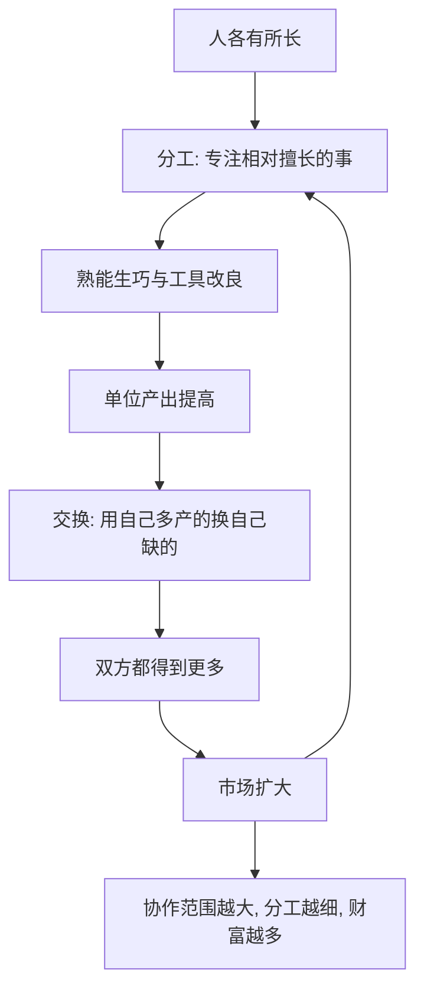

# 11｜为什么分工与合作能创造财富？

> 财富不是靠劳动“辛苦”出来的吗？为什么协作能凭空多出价值？

---

## 一、先说结论

薛兆丰认为，财富的增长在很大程度上不是“更辛苦”，而是**协作范围更大、分工更细**。分工让每个人专注于自己相对更擅长的事，再通过交换互通有无，整体产出远高于各自为战。

换句话说，一加一之所以能大于二，靠的不是把汗水加倍，而是**把力气用对了地方，再让别人补上你不会的部分**。这就是城市与市场的意义。

---

## 二、我们先理解一个问题

先看一件小事：桌上那支铅笔。

它的木头来自某个国家的林场，石墨来自另一个矿，橡皮可能来自热带的橡胶园，油漆、金属箍、胶水，各自来自不同的地方。生产它的人，没有一个人懂得全部流程——没有人能独自从头做出一支铅笔。

于是问题来了：

> 如果没有人掌握全部知识，这支铅笔为什么能被做出来，而且还便宜到随手就能买到？

答案不是“有人很聪明”，而是“无数人各自做了一小部分”。这背后，就是分工与合作。

---

## 三、作者到底提出了什么观点？

薛兆丰强调的是：**分工提高效率，交换实现互通，二者合起来创造财富。** 他延续的是亚当·斯密那条经典思路——分工受市场范围的限制，市场越大，分工越细。

由此可以推出几个判断：

1. **专业化让人更高效。** 反复做同一件事，熟能生巧，还能发明工具。
2. **交换让专业成为可能。** 如果各做各的、不交换，专业化就没有意义——你专做鞋却换不到粮，只能饿死。
3. **财富来自合作，而非独斗。** 一个社会的富裕程度，很大程度上取决于它的分工与协作范围。
4. **价格是合作的语言。** 谁需要什么、谁擅长什么，靠价格传递，无需有人统筹全局。

他的关键洞见是：**分工与交换，让陌生人之间也能高效协作。**

---

## 四、把这个观点翻译成人话

想象一件衣服。

如果你一个人从头做起：种棉花、纺线、织布、裁剪、缝纫，一年大概只能做出一两件，还未必好看。

但在市场里，每个环节都由不同的人完成：你做一颗纽扣，他缝一道边，另一个人专门染布。每个人只干一小段，却因为熟练、因为工具、因为有人专门研究这一段，效率高得惊人。

结果就是：**你付出的只是一个很小的动作，换回的却是一整件衣服。** 这不是谁亏了，而是分工把“总量”变大了——每个人只做一点点，合起来却供得起所有人。

所以财富不是被“分”出来的，而是被“合作”生产出来的。这也解释了为什么同样一群人，封闭起来各干各的会很穷，一旦互通有无就变富。

---

## 五、为什么会这样？

关键在 **B → D → E → H** 这一段。分工扩大产出，交换让产出变成各方真正需要的东西，市场随之扩大，又反过来支撑更细的分工——这是一个自我强化的循环。

---

## 六、举一个现实生活中的例子

就用**一支铅笔**。

它的生产链条跨越多个国家：木材、石墨、黏土、橡胶、金属、油漆，各有产地；采矿、冶炼、加工、运输、包装、零售，各有环节。整条链上几万个参与者，彼此大多不认识，语言不同、信仰不同，也没有一个“总指挥”。

可偏偏，只要价格信号还在，铅笔就会被源源不断造出来，还便宜到几乎人人买得起。**没有人为了让你有铅笔而操心，但你的确有了铅笔。**

这个例子的震撼之处在于：**知识的分散并没有阻碍协作，反而因为分工，让每个环节都由最合适的人去做。** 一支铅笔，是无数陌生人无声合作的结果——这正是市场最奇妙的地方。

---

## 七、回到书中重新理解

现在看薛兆丰为什么把“分工与合作”独立成篇，就明白了。

前一篇讲耐心与利率，讲的是人如何与“时间”合作；这一篇讲的是人如何与“彼此”合作。两者合起来，才能解释财富为什么能持续增长：**一部分靠积累，一部分靠协作。**

所以这一篇真正重要的，不是“分工”这个词，而是它背后的态度：**别问一个人能做多少，要问一群人能合作出多少。**

---

## 八、这个观点背后还有什么？

**第一，分工受市场范围的限制。** 市场太小，专业化就养不活自己；市场越大，分工才能越细。

**第二，协作需要信任与规则。** 陌生人不认识，就靠契约、信誉、法律来维持合作。

**第三，交通与通信是分工的血管。** 运输成本越高、信息越慢，协作的半径就越小。

**第四，它解释了城市化。** 城市之所以富，正因为人口密集、分工细、匹配快。

---

## 九、这个观点有问题吗？

有，主要在“分工一定带来好结果”这一层。

**第一，分工可能让人变得片面。** 亚当·斯密本人就担心，长期重复单一动作，可能损害工人的心智与技能。这是效率之外的代价。

**第二，全球分工有脆弱性。** 链条越长，越依赖稳定。一旦某个环节中断（如疫情、战争、断供），整条链都会受影响，过度专业化也可能带来风险。

**第三，分工的收益分配并不均匀。** 处于链条低端、可替代性强的环节，议价能力弱，容易被压价。关于全球化红利该如何分配，学界存在不同解释。

**第四，但它抓住了增长的核心机制。** 没有分工与交换，任何社会的产出都会停在极低的水平。

**所以更准确的说法是**：分工与交换确实是财富增长的核心引擎，但它的收益如何分配、链条是否稳固，同样需要认真对待。

---

## 十、今天再看这个观点

以下部分是基于薛兆丰思想的现代延伸，不是他在书里的原话。

数字时代把分工推到了一个前所未有的尺度。一部手机，芯片设计在一地，制造在另一地，系统、应用、屏幕、电池、组装分布在全球；而软件层面的分工更细——一个应用背后，可能有成千上万名开发者各写一小块。

更值得注意的是，“个人”也被拆进了分工网络：你会做设计，就把设计卖给别人；你会写文案，就接文案的活。平台把每个人擅长的“一小段”接进了全球协作，让一个普通人也能参与到过去只有大公司才能完成的协作里。

这正是分工逻辑的现代版本：**你不需要什么都会，你只需要在一个环节上足够好，然后接入网络。**

---

## 十一、这一篇真正应该记住什么？

1. **财富靠协作，不只靠辛苦。** 分工与交换让整体产出远高于各自为战。
2. **专业化的前提是交换。** 没有交换，专业化就无法生存。
3. **价格是陌生人合作的语言。** 没人统筹全局，协作照样发生。
4. **市场越大，分工越细，财富越多。** 城市与全球化都由此解释。
5. **但它有代价：片面、脆弱、分配不均。** 效率之外，还要看代价与公平。

---

## 十二、留一个问题

> 如果财富来自协作而非独斗，
> 那么你现在的收入，
> 有多少是靠你一个人能干，又有多少是靠你正好接入了哪一张协作网络？

---

**下一篇**：既然分工与协作能把财富做大，那么在这背后，那个并不高尚的动机——赚钱——为什么反而可能比善心更能改善普通人的生活？

下一篇我们就来拆开这个问题——**商业为什么是“最大的慈善”？**
