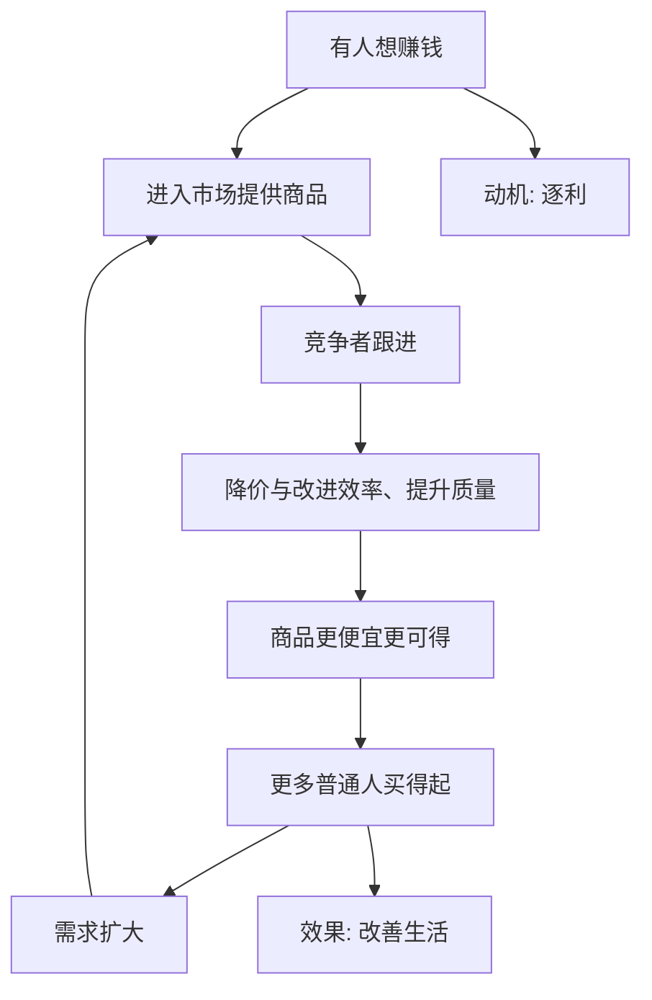

# 12｜商业为什么是“最大的慈善”？

> 逐利的商业，为什么可能比慈善更能改善穷人的生活？

---

## 一、先说结论

薛兆丰认为，商业通过价格与竞争，持续地把商品做得更便宜、更可得。它不需要道德动机，就能让大量陌生人受益——这正是市场机制的奇妙之处。

换句话说，**让一件东西对穷人真正友好的方式，往往不是有人免费送，而是有人靠它赚钱，并且很多人抢着赚。** 当然，这不等于商业万能或慈善无用，而是提醒我们：动机不崇高，效果也可能很好。

---

## 二、我们先理解一个问题

先看一个朴素的现象。

几十年前，手机是奢侈品，只有少数人用得起；如今，最普通的家庭也几乎人手一部。几十年间，它的功能越来越强，价格相对于收入却越来越低。没有人为此发起一场“送手机运动”，它却自己走进了千家万户。

于是问题来了：

> 如果没有人出于善心去送，为什么好东西还是越来越便宜、越来越普及？

答案藏在“逐利”里：因为能赚钱，所以无数人争着做，争着降成本、抢市场。这一篇，就来看清这份“不崇高”的力量。

---

## 三、作者到底提出了什么观点？

薛兆丰引用并延续了一个著名说法——商业是“最大的慈善”。他强调的是：**市场通过价格和竞争，把商品持续地变得便宜、可得，从而改善了大量普通人的生活，而这一切无需依赖道德动机。**

由此可以推出几个判断：

1. **动机与效果是两回事。** 逐利是动机，让更多人用得起是效果。评价一件事，要看效果，不只看动机。
2. **竞争让价格下降。** 只要有利可图，就会有人不断压低成本、改进效率。
3. **可得性才是对穷人最大的善意。** 让穷人能买到，往往比偶尔被施舍更重要。
4. **商业的受益面比慈善更广。** 慈善通常只能覆盖一部分人，而市场能覆盖大量陌生人。

他的关键洞见是：**不必要求每个人高尚，只要制度设计得好，自私也能产生利他的效果。**

---

## 四、把这个观点翻译成人话

想象两个场景。

场景一：一位善人，每天免费给街坊发十个馒头。街坊确实受益，但只有十个人，只有那一天。一旦善人走了，馒头就没了。

场景二：一条街上有人开馒头店赚钱。为了多赚钱，他降价、加量、开分店、改良口味，隔壁也来竞争。结果馒头越来越便宜，买的人越来越多，穷人也能天天吃上。

你会发现：**善心是有限的，因为它依赖某个人愿意付出；商业是可持续的，因为它依赖的是每个人都想赚钱。** 前者靠感动，后者靠机制。

所以“最大”二字，不是说商人心最善，而是说它的**覆盖面与持续性**远超一般慈善。

---

## 五、为什么会这样？

关键在 **C → D → E → I** 这一段。逐利只管自己，竞争却把它逼成了对消费者有利的结果。**动机不崇高，效果却可能很好**——这就是市场机制最反直觉的地方。

---

## 六、举一个现实生活中的例子

看**电商让偏远地区也能买到便宜商品**。

在电商出现之前，偏远小镇的居民选择少、价格高，很多东西要跑到县城甚至更远才能买到。这不是因为有人故意为难他们，而是因为商家太少、竞争太弱、成本太高。

电商改变了这一切。因为网络上的商家极多、竞争激烈，同一件商品能被几十家卖家比价；物流网络铺开之后，一件小商品也能送到小镇。结果就是：**偏远地区的居民，用更低的价格，买到了过去想都不敢想的东西。**

有意思的是，没有任何一家电商的初衷是“帮助偏远地区的人”——它们只是想多卖货、多赚钱。但正是这份逐利，加上企业之间为了抢市场不断降价、补贴、优化物流，最终让最偏远的消费者也受了益。

这正是那句判断的现实版本：**让穷人真正受益的，往往不是谁的善心，而是很多人为了自己赚钱，不得不把东西做得更便宜、更可得。**

---

## 七、回到书中重新理解

现在看薛兆丰为什么敢说商业是“最大的慈善”，就明白了。

他要打破的是一种直觉：好事必须出自好心。他提醒的是，**制度设计可以让自利行为产生利他结果**。这不是为逐利辩护，而是让我们学会用“效果”而不是“动机”去评价一件事。

所以这一篇真正重要的，不是“商业很高尚”，而是：**别只看谁心怀善意，要看谁的机制真的让更多人受益。**

---

## 八、这个观点背后还有什么？

**第一，竞争才是消费者真正的朋友。** 商家之间越卷，消费者越受益。

**第二，规模让便宜成为可能。** 产量越大、成本越低，价格才能一降再降。

**第三，可得性与价格同样重要。** 买得到、买得起，才叫真正友好。

**第四，它把道德问题变成了制度问题。** 与其指望人人高尚，不如设计出让自私变利他的规则。

---

## 九、这个观点有问题吗？

有，而且这一篇尤其需要平衡。

**第一，“商业即慈善”可能被滥用。** 逐利也可能带来伤害：垄断抬价、虚假宣传、污染、压榨劳工。用“你也受益了”来掩盖这些代价，是站不住的。

**第二，动机仍然重要。** 效果不好衡量，动机却直接关系到信任与道德底线。把所有评价都交给“效果”，可能滑向“成王败寇”。关于动机与效果该如何权衡，学界存在不同解释。

**第三，有些东西市场未必擅长。** 公共卫生、基础研究、赈灾等，往往回报慢、外部性强，单靠逐利未必能及时覆盖，这恰恰是慈善与政府应当补位的地方。

**第四，受益的分配并不均匀。** 商业确实让很多人受益，但红利如何分配、谁被甩下，仍需要追问。

**所以更准确的说法是**：商业在“提高可得性、降低成本”上，确实有慈善难以企及的力量，但它是“效果之一”，而不是“道德豁免”；慈善与公共机制，仍然不可替代。

---

## 十、今天再看这个观点

以下部分是基于薛兆丰思想的现代延伸，不是他在书里的原话。

平台经济把这句话推到了极致，也暴露了它的边界。一方面，电商、外卖、网约车让便宜与便利覆盖到前所未有的范围，很多过去“买不到、买不起、等不来”的服务，如今触手可得——这确实是商业的力量。

另一方面，当平台足够大、竞争减弱，当“补贴换市场”的玩法结束之后，消费者是否还能持续受益，就成了新的问题。逐利的机制之所以对消费者好，前提是**竞争仍在**。一旦竞争被削弱，机制的方向就可能反转。

这提醒我们：商业之所以像慈善，不是因为它善良，而是因为**背后始终有人在与它抢生意**。

---

## 十一、这一篇真正应该记住什么？

1. **动机与效果是两回事。** 逐利的动机，也可能带来利他的效果。
2. **竞争让商品更便宜、更可得。** 这才是对普通人最大的善意。
3. **商业的覆盖面与持续性胜过一般慈善。** 它不依赖某个人愿意付出。
4. **但它不是道德豁免。** 逐利也可能造成伤害，规则与监管不可缺席。
5. **真正的朋友是竞争。** 竞争一旦消失，受益也可能消失。

---

## 十二、留一个问题

> 如果让穷人真正受益的，是“很多人想赚他的钱”，
> 那么你所在的行业里，
> 到底是竞争在让消费者受益，还是默契在让消费者多付？

---

**下一篇**：既然逐利的商业能带来好结果，那么真正决定“谁能赚到钱”的，到底是什么？为什么同样努力的一群人，换个规则，赢家就完全不同？

下一篇我们就来拆开这个问题——**竞争究竟在争什么？**
