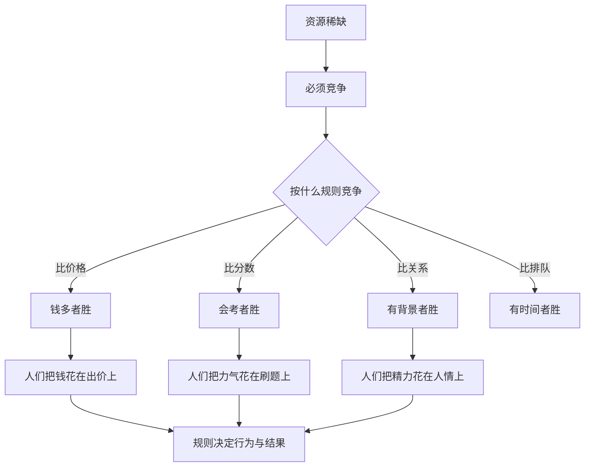

# 13｜竞争，究竟在争什么？

> 为什么“竞争”的关键不是努力，而是“规则”？

---

## 一、先说结论

薛兆丰认为，竞争无处不在，但决定谁胜出的，是竞争规则：比价格、比分数、比关系、比权力。同一群人、同一份努力，规则不同，结果天差地别。

所以讨论“公平竞争”时，真正要问的不是“谁更努力”，而是：**我们在按什么标准，分配那些稀缺的机会？**

---

## 二、我们先理解一个问题

先看一个场景。

一群人争夺同一个机会，比如一个工作岗位、一个入学名额、一笔生意。大家都很努力，甚至努力的程度差不多。

可结果往往大不相同：有人靠出价高拿到，有人靠分数高拿到，有人靠关系拿到。努力都付出了，赢的却未必是“最努力的那个”。

于是问题来了：

> 既然大家都在竞争，为什么决定胜负的，常常不是努力本身，而是“用什么来比”？

这就引出了这一篇的核心：**竞争的实质，其实是规则的竞争。**

---

## 三、作者到底提出了什么观点？

薛兆丰强调：**竞争的关键不是有没有竞争，而是用什么规则竞争。** 资源稀缺，就必然有人竞争；但竞争的标准可以是价格、分数、排队、关系、权力、运气。

由此可以推出几个判断：

1. **规则决定谁胜出。** 比价格，钱多的人赢；比分数，会考试的人赢；比关系，有背景的人赢。
2. **规则决定人们把力气花在哪。** 比分数，大家就去刷题；比关系，大家就去经营人脉。
3. **竞争会消耗资源。** 只要规则存在，人们就会为胜出而投入，而这种投入未必创造价值，可能只是“争夺”。
4. **规则本身也需要被追问。** 因为规则不是自然给定的，它由制度、政策、习惯共同塑造。

他的关键洞见是：**与其争论“能不能竞争”，不如追问“按什么标准分配”。**

---

## 四、把这个观点翻译成人话

想象一场百米赛跑。

如果规则是“谁跑得快谁赢”，大家就拼命练腿；如果规则突然改成“谁穿得贵谁赢”，大家就去买名牌；如果规则是“谁认识裁判谁赢”，大家就去打通关系。

同样的选手、同样的努力，规则一变，赢家全变。**真正塑造行为的，从来不是“要不要赢”，而是“赢的标准是什么”。**

所以竞争本身不是问题，规则才是一切结果的所在。这也解释了为什么大家会为一个政策吵得面红耳赤——表面上在吵“公平不公平”，实质是在吵“我们该用哪把尺子”。

---

## 五、为什么会这样？

关键在 **B → C → I** 这一段。稀缺逼出竞争，但“用什么比”决定了一切后续：谁受益、谁出局、大家把资源投向哪里。**换一把尺子，就换一批赢家。**

---

## 六、举一个现实生活中的例子

看**同一群人，比价格、比分数、比关系，结果完全不同**。

假设有同一群年轻人，争夺同一批稀缺的机会。

如果规则是**比价格**：谁出价高谁得到。结果是有钱的人占优，大家的行为变成“想办法筹钱”。

如果规则是**比分数**：谁考得高谁得到。结果是会读书的人占优，大家的行为变成“刷题、补课”。

如果规则是**比关系**：谁人脉硬谁得到。结果是有背景的人占优，大家的行为变成“经营关系、打点门路”。

同样是这群人，同样起早贪黑地努力，**只要规则一换，赢家就换了一批，大家努力的方向也全变了。** 更关键的是：比价格会激励人们去赚钱，比分数会激励人们去学习，而比关系、比权力，则可能激励人们去钻营——**规则不仅决定谁赢，还决定社会把多少力气用在了创造上，又浪费了多少在争夺上。**

这就是为什么，讨论“竞争”时，最该盯住的从来不是努力，而是那把尺子。

---

## 七、回到书中重新理解

现在看薛兆丰为什么把“竞争”单独立篇，就清楚了。

前面讲过稀缺、价格、产权，都是在说“竞争存在”；这一篇则往前推一步：**竞争存在之后，关键是它按什么规则进行。** 规则不同，价格、激励、结果都会不同。

所以这一篇真正重要的，不是“竞争很激烈”，而是：**别把目光停在谁赢谁输，要看清是规则在决定输赢。**

---

## 八、这个观点背后还有什么？

**第一，规则决定了“寻租”的空间。** 如果规则靠关系，人们就会把资源花在拉关系上，而不是创造价值。

**第二，规则是可以被设计的。** 制度、政策、评价标准，本质上都是在选择竞争的方式。

**第三，规则会自我强化。** 某类人在某种规则下胜出，他们往往更有能力去维护这套规则。

**第四，它把“公平”变成了可讨论的问题。** 不谈规则的公平是空的，只有说清“按什么比”，才谈得上公平与否。

---

## 九、这个观点有问题吗？

有，主要在“是否任何规则都可以随意替换”这一层。

**第一，有些规则不是随意可选的。** 价格分配看似高效，但医疗、教育、选票是否适合纯价格竞争，社会与学界存在大量争论。有些领域，非价格的标准本身承载着价值。

**第二，强调规则可能弱化个人努力的意义。** 规则固然重要，但在同一规则之下，努力程度依然是重要变量；把一切都归于规则，可能低估了个人的作为。

**第三，“哪种规则更优”并没有唯一答案。** 关于这一问题，学界存在不同解释：有人主张效率优先（价格），有人主张机会均等（分数、抽签），有人强调多元标准。选择本身就是一种价值判断。

**第四，但它提供了一个关键的追问角度。** 面对任何“竞争不公”的抱怨，先问一句“按什么比”，往往能看清问题真正的出处。

**所以更准确的说法是**：规则确实是竞争的胜负手，值得优先追问；但规则并非任意可选，不同标准背后是不同的价值取舍，没有放之四海皆准的答案。

---

## 十、今天再看这个观点

以下部分是基于薛兆丰思想的现代延伸，不是他在书里的原话。

算法时代给“竞争规则”加了一层新的变量。很多时候，决定谁被看见、谁能成交的，不再只是价格或分数，而是平台推荐的排序规则。排序规则看不见、说不出，却真实地决定了很多人的机会。

于是竞争出现了新的形态：人们不再只比拼商品和服务，还要比拼“如何被算法选中”。谁的规则更透明、更可预期，谁就更接近“公平竞争”；谁掌握着不透明的排序权，谁就在事实上握着那把尺子。

这正好延续了那一问：**竞争的关键，从来不是努力本身，而是那把衡量努力的尺子握在谁手里，又按什么标准刻着刻度。**

---

## 十一、这一篇真正应该记住什么？

1. **竞争的关键是规则，不是努力。** 同一群人、同样努力，规则一变，结果全变。
2. **规则决定行为的方向。** 比什么，人们就把力气花在什么上。
3. **规则决定谁受益、谁出局。** 比价格、比分数、比关系，赢家各不相同。
4. **有些竞争消耗而非创造价值。** 靠关系、靠权力的规则，容易催生钻营。
5. **规则可以设计，也需要被追问。** 谈公平，先问“按什么比”。

---

## 十二、留一个问题

> 如果决定输赢的不是努力，而是规则，
> 那么你现在身处的那场竞争，
> 用的到底是哪把尺子？而你，为这把尺子付出了什么？

---

**下一篇**：既然规则决定结果，那么当规则被改成“不许涨价”时，会发生什么？为什么一件看起来在保护消费者的好事，最后常常伤害了他们？

下一篇我们就来拆开这个问题——**为什么价格管制常常适得其反？**
