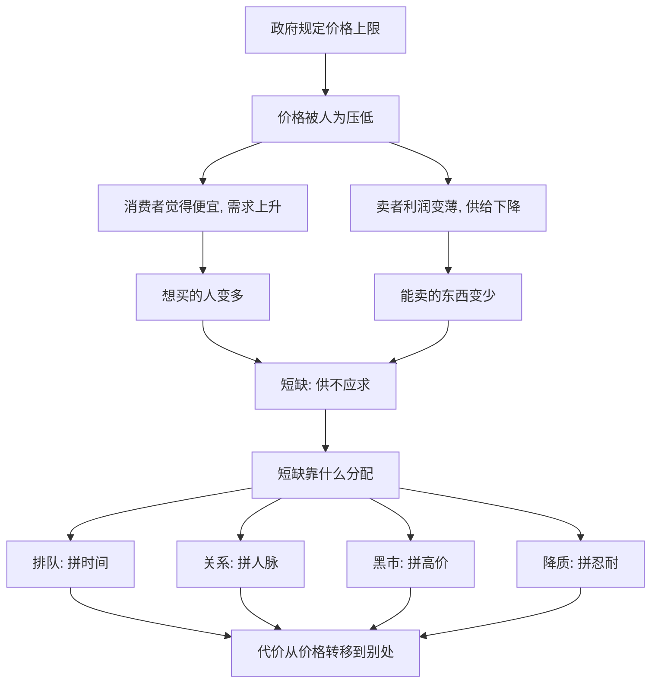

# 14｜为什么价格管制常常适得其反？

> 限价明明是保护消费者，为什么常常伤害他们？

---

## 一、先说结论

薛兆丰认为，价格管制最要命的地方，不在于它"定错了价"，而在于它**假装稀缺不存在**。

当政府规定一样东西的收费不能超过某个上限，看起来是替消费者撑腰，实际上却同时按下了两个按钮：一边让更多人想买，一边让更多人不想卖。供给被压住，需求被放开，中间的缺口不会凭空消失，只会以另一种形式冒出来——排队、短缺、质量缩水、黑市，或者一个有门路才能拿到东西的灰色地带。

所以这一篇的核心就一句话：**看得见的是被保护的一方，看不见的是被赶走的供给与悄悄变差的质量。**

---

## 二、我们先理解一个问题

先做一个小实验。

假设某条街上的奶茶只卖十块钱一杯，生意很好。突然有人规定：一杯不许超过五块。

此刻，作为顾客，你第一反应大概是"太好了，便宜了一半"。但请你再多想三步：

- 愿意在这个价位开店的老板，会不会变少？
- 已经在开店的老板，会不会想办法省成本，比如少放料、换原料、缩短营业时间？
- 想喝的人会不会更多，于是大家开始排队、找熟人、甚至加价从黄牛手里买？

你会发现，**价格被按住，但"想喝的人多于买得到的量"这个事实没被按住。** 需求还在，供给却退了，中间那道口子，总要有人去填。

这道口子怎么填，就是价格管制全部麻烦的来源。

---

## 三、作者到底提出了什么观点？

薛兆丰的观点可以概括成三句话：

**第一，价格不是商家随便贴的标签，而是供需关系挤出来的结果。**

价格高，往往不是因为人心黑，而是因为在那个价格上，想买的人刚好和想卖的人对得上。你把它强行压下去，等于把这份"对得上"给拆散了。

**第二，价格上限会同时制造两个方向的力量。**

它让需求变多（便宜了，多买点），又让供给变少（不赚钱，少做点）。这两股力量一叠加，就是短缺。

**第三，短缺不会让人变穷，但会让人开始用别的东西竞争。**

钱不够的人，可以用时间排队；时间不够的人，可以用关系找人；关系不够的人，就只能等、只能忍。价格被赶出去了，但竞争没有消失，它只是换成了更隐蔽、常常更不公平的形式。

这里要分清楚：薛兆丰讲的是价格管制的**一般逻辑**，不是说任何限价在任何情况下都必然失败。他也承认，个别场景下管制可能有短期稳定作用。他反对的，是把限价当成万能善意，而忽略它的连锁反应。

---

## 四、把这个观点翻译成人话

把价格想成"水",把市场想成"管道"。水位高低，是两边压力较劲的结果。

价格管制，就是拿一块板子把水位硬压下去。表面上看，水面确实低了，好像省了钱。可上游的水还在往管道里灌，下游的人还在等着接水，你只是把"水压"从价格挪到了别处：

- 挪到**时间**上——你要排队；
- 挪到**运气**上——你要摇号、要碰巧；
- 挪到**关系**上——你要认识人；
- 挪到**灰色市场**上——你要多花钱找人加价买。

所以价格管制的真正效果，往往不是"消灭了代价"，而是**把代价从明面上挪到了暗处，从钱包挪到了时间和人脉上。**

对那些最缺时间、最没门路的人来说，这种隐性代价往往比原来那个价格还重。

---

## 五、为什么会这样？

把逻辑拆成链条：

关键在 **B → C、B → D** 这一段。

价格本来是同时给买卖双方发信号：对买家说"这东西稀缺，省着点用"，对卖家说"这东西有人要，多做点"。你把价格压住，等于把这条双向信号线剪断了。买家收不到"稀缺"的提醒，卖家收不到"值得多产"的激励。

信号一断，两边的行为就往反方向跑：需要的人更多，能供的人更少。缺口自然出现，**而缺口一出现，分配标准就被迫从价格换成别的——这才是管制真正的副作用。**

---

## 六、举一个现实生活中的例子

来看一个被讨论了几十年的经典场景：**房租限价。**

很多大城市都遇到过"房租太贵、租客太苦"的问题。最直觉的应对方式是：规定房租不能涨，或者不能超过某个价。

站在租客角度，这确实解了燃眉之急。但接下来会发生什么？

**其一，愿意把房子拿出来出租的人变少了。** 出租要维护、要折旧、要应对各种麻烦，如果租金被锁死、还跑不赢通胀，有些房东宁可不租、宁愿自住、宁愿空着，甚至干脆把房子卖了。市场上能租的房子因此减少。

**其二，房子的质量开始下滑。** 既然租金上不去，房东就没有动力修水管、换电梯、翻新厨房。本来该修的拖着不修，本来该添的不添。**价格被管住了，服务却跟着缩水了。**

**其三，租客之间开始用非价格方式竞争。** 好房子少了，想租的人反而多了，于是房东开始挑人：要押金更高的、要关系硬的、要"看起来靠谱"的。甚至出现"明面租金不涨，暗地里收好处费"的做法。对刚来城市、没有社会关系、手里又没现金的人来说，这比单纯贵一点更难。

有意思的是：**房租限价本想保护租客，最后却常常让最容易受欺负的那部分租客更难过。**

这不是说房租问题不存在，也不是说租客不该被照顾。它只是提醒我们：一个"看起来站在弱者一边"的政策，如果不管供给会怎么反应，很可能把好意用在了错的地方。

（顺带说明：也有经济学家指出，房租管制的效果要看具体设计、覆盖范围和配套政策，不同城市的实证结论并不完全一致。这里讲的是薛兆丰强调的那条主线逻辑。）

---

## 七、回到书中重新理解

现在再回看薛兆丰为什么反复讲价格管制，就顺了。

他不是要论证"贵就是好"，而是要教我们一个动作：**看到一个人被保护的时候，立刻去找那个被排除在外的人。**

限价的直接受益者很明显——是那些在低价位买到了东西的人。但它的受损者很隐蔽：是本来愿意供给却退出了的人，是质量变差后继续用的人，是排长队、托关系、在灰色地带多花钱的人。这些人不站在聚光灯下，所以他们常常在政策讨论里"消失"了。

所以这一篇真正要建立的能力，不是记住"限价不好"这个结论，而是学会问：**价格被压住之后，代价跑到哪里去了？谁在替它买单？**

---

## 八、这个观点背后还有什么？

**第一，它和"价格的作用"是一体两面。** 价格在传递信息、引导生产、分配资源。限价之所以有副作用，正是因为它妨碍了这三件事。

**第二，它和"抢不到"是同一种病。** 抢不到的根源，常常不是东西绝对不够，而是价格没能把真实的供需关系表达出来。

**第三，它把"看不见的代价"变成了可视的问题。** 经济学最擅长的一件事，就是追问那些没发生、但本可以发生的事——被赶走的供给、没有出现的商品、被拖黄的交易。

**第四，它不等于"一切管制都不该有"。** 安全标准、环保门槛、反欺诈监管，是另一类问题，涉及外部性和信息不对称，不能都归到"限价"名下。这一篇针对的，是**直接用命令固定价格**这类做法。

---

## 九、这个观点有问题吗？

有，而且值得认真对待。

**第一，"管制必然适得其反"这句话太满了。** 现实中确实存在市场失灵的情形：当卖方高度集中、买方信息严重不足、或者存在公共品与外部性时，一定程度的价格干预未必更糟。房租管制在不同城市的实证结果就并不一致。

**第二，短期内限价确实能救人。** 在战乱、灾荒、能源价格剧烈波动时，限价有时能避免恐慌性暴涨，给社会一个缓冲。经济学的逻辑往往在长期更明显，而人在短期也是要活命的。这个时间尺度上的差别，不能被忽略。

**第三，把一切都交给价格，也可能伤害公平与尊严。** 住房、医疗、教育这些领域，是否适合完全用出价高低来分配，本身就是大量争论所在。效率之外，还有比"谁出钱多谁得到"更重要的价值。

**第四，问题的关键其实是"替代方案够不够好"。** 如果取消限价，却又没有任何办法帮到低收入者，那限价至少提供了一个粗糙的兜底。真正的难题不是"该不该管"，而是"用什么方式管，副作用更小"——比如定向补贴、增加供给、减少准入门槛，往往比一刀切的限价更少反噬。

**所以更平衡的说法是**：价格管制常常会产生出人意料的副作用，这是必须警惕的；但"警惕副作用"不等于"反对一切干预"。聪明的做法，是同时追问两件事——**限价的代价落在谁头上，以及有没有更好的替代办法。**

---

## 十、今天再看这个观点

以下部分是基于薛兆丰思想的现代延伸，不是他在书里的原话。

今天价格管制的"主战场"，早就从菜场和房租，转移到了更技术化、更隐蔽的地方。

打车平台的"高峰加价"，曾引发无数"趁火打劫"的指责；可一旦强行禁止加价，高峰期就更难打到车——因为愿意出车的司机少了。同样的逻辑也出现在网约车准入、外卖配送费、演唱会门票、机票退改签等场景里。

更微妙的是，平台时代把"隐形成本"做到了极致。价格被管住了，代价却转移到了评价、压单、隐私、算法暴露，或者"会员才能享受的价格"里。你看到的价签可能更友好了，但你不一定更容易得到你想要的东西。

这正好印证了这一篇的提醒：**价格只是代价的一种表达方式，它被压住，不代表代价消失，只代表你要去别的地方找它。**

---

## 十一、这一篇真正应该记住什么？

1. **价格是供需挤出来的结果，不是谁随手贴的标签。** 压住价格，不等于解决稀缺。
2. **价格上限同时抬高需求、压低供给，缺口必然出现。** 短缺是结构性的，不是偶然的。
3. **短缺不会消失，只会换一种分配方式。** 排队、关系、黑市、降质，都是代价的另一种形态。
4. **越是缺时间、缺门路的人，越容易被隐性代价伤到。** 好心政策有时伤到最想保护的人。
5. **它不是"反对一切管制"，而是"警惕看不见的代价"。** 关键问题是：代价落在谁身上，有没有更好的替代办法。

---

## 十二、留一个问题

> 当你看到一项"保护消费者"的限价政策时，
> 除了问"我少花了多少钱"，
> 你是否也会问一句——
> **那些因此不再愿意供给的人，后来去了哪里？**

---

**下一篇**：如果说价格管制是"不让你定价"，那还有一类更大的问题：一家企业做得特别大、把对手都挤走了，我们到底该不该管？管什么？"大"本身是不是罪？下一篇我们就来拆开这个争论——**反垄断，反的到底是什么？**
