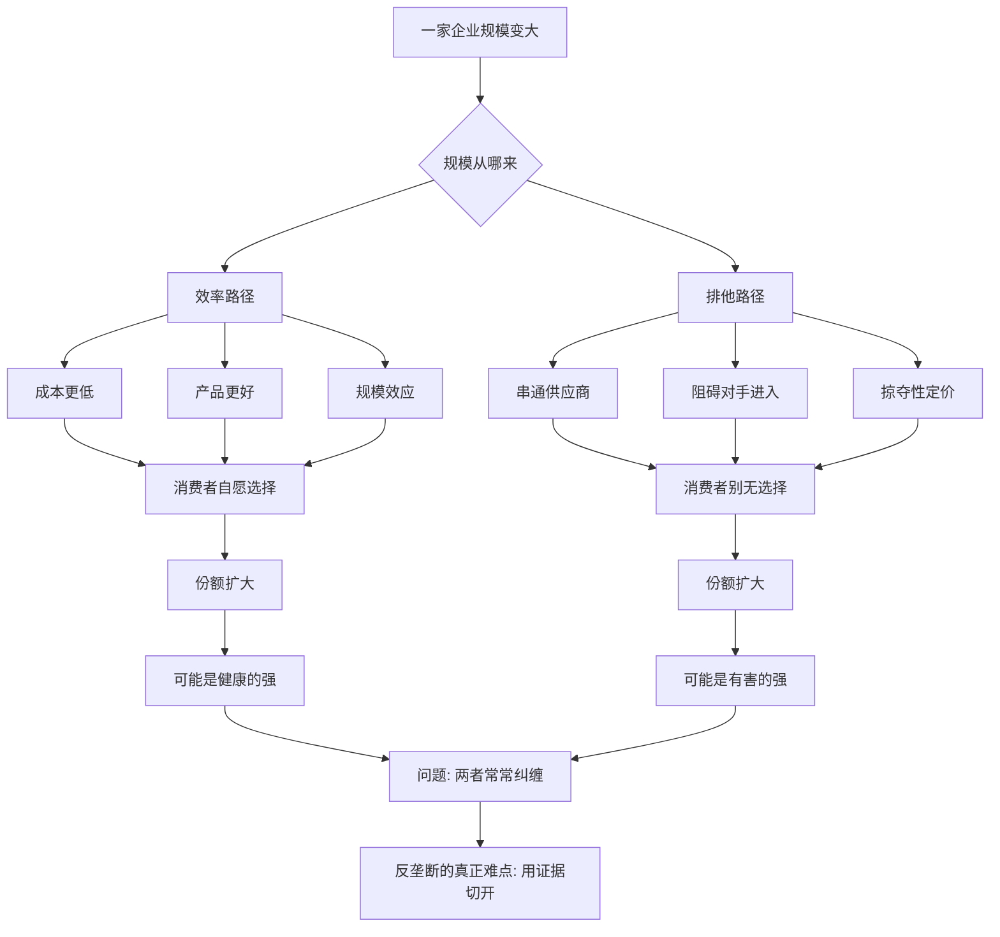

# 15｜反垄断，反的到底是什么？

> 企业做大就该被拆吗？垄断到底伤害了什么？

---

## 一、先说结论

薛兆丰认为，反垄断最容易被搞混的地方，是**把"大"当成"坏"。**

一家企业做得很大，可能有两种截然不同的原因：一种是因为它更便宜、更好用、更有效率，消费者自愿选了它；另一种是因为它用不正当手段把对手挡在门外，让人没得选。前一种"大"，是效率的结果；后一种"大"，才是伤害的来源。

所以真正该问的，不是"这家企业有多大"，而是"它的规模是怎么来的，它有没有让消费者吃亏"。薛兆丰提醒我们：**反垄断要有硬证据，不能只凭对"大"的不放心。**

需要事先说明的是：关于"规模是否等于垄断""垄断是否一定有害"，学界至今没有共识。这一篇不是给出定论，而是帮你看清这场争论的两边。

---

## 二、我们先理解一个问题

先想一个再普通不过的现象。

为什么有的商店越开越多、越做越大，有的却很快关门？

答案往往是：**做大，本身就是消费者投票的结果。** 一家超市东西更全、价格更低、离家更近，人们自然去它那；它越做越大，进货成本更低，价格能更便宜，于是更多人愿意去。这个循环里，没有谁被强迫，每一笔交易都是自愿的。

现在换个角度：如果这家超市做大之后，开始串通供应商、威胁房东、举报对手、用亏本价格把竞争者熬死，然后再涨价——那消费者的"自愿选择"，就变味了。

**同样一个大企业，可能同时具备这两种成分。** 麻烦正在这里：规模、效率和排他行为，常常缠在一起，很难切开。

而反垄断要处理的，恰恰是这个"很难切开"。

---

## 三、作者到底提出了什么观点？

薛兆丰的核心提醒，可以归纳成三点：

**第一，"市场地位"不等于"垄断伤害"。** 一家企业占了很大份额，可能只是因为对手太弱，也可能是因为它太好。市场份额高，只是嫌疑，不是罪证。

**第二，判断的落脚点应该是消费者。** 反垄断真正要保护的，是消费者能不能用合理的代价，拿到想要的东西。所以关键问题应该变成：这家企业有没有在抬价、压质、堵路，让消费者受损。

**第三，要警惕"用道德直觉代替证据"。** 看到巨头，人天然会不放心；但"看着不舒服"和"确实伤害了消费者"，是两回事。反垄断如果只凭规模判案，很容易误伤效率，反而让消费者更吃亏。

他自己反复强调一个态度：**对商业行为，先假设它可能是有效的，再要求提出伤害的证据，而不是反过来。**

---

## 四、把这个观点翻译成人话

把市场想象成一场长跑。

有人跑得快，是因为他体能好、训练科学、装备合适——他赢，凭的是本事。这样的领先，值得鼓掌，也应该允许。还有人跑得快，是因为他把别人的鞋带系在一起、在别人跑道上放钉子——他赢，靠的是破坏比赛。

现在举办方要判罚，摆在他面前的是同一个结果：**这个人跑第一名。** 但他不能只看名次就罚人，也不能只看名次就放人，他得回去看：领先是怎么来的。

反垄断的难点，就跟这个裁判一模一样。**"第一名"是公开可见的，"为什么第一名"却常常藏在成本、技术、合同、算法的细节里。** 而恰恰是后者，才决定了该不该管。

用一句更简单的话说：**先看行为，再看地位；先看消费者，再看情绪。**

---

## 五、为什么会这样？

把两套逻辑摆在一条图上比较：

关键在 **B** 这个分叉点。

现实中，效率路径和排他路径往往同时存在：一家平台因为效率而大，又用这份大去排挤对手。于是裁判面对的从来不是"干净的好"或"干净的坏"，而是**混在一起的两种力量**。

这就要求反垄断格外小心：如果只看结果（份额大），就会连着效率一起打掉；如果只看动机（它肯定想排挤人），又会变成诛心。**唯一比较硬的抓手，是行为与证据——有没有实际的抬价、压质、封锁、损害消费者。**

---

## 六、举一个现实生活中的例子

来看这几年争论最激烈的一类案例：**大型平台的垄断争议。**

在电商、外卖、出行、社交这些领域，往往会出现一两家体量巨大的平台。它们该不该被限制、被拆分，是全世界都在吵的问题。

**主张该管的一方**会说：平台一旦做大，就可能在商家端抬高佣金，在用户端减少选择；可以用"二选一"的方式逼商家站队，用算法影响流量分配，用收购把有威胁的小公司买走，甚至在把对手挤垮之后再慢慢提价。**消费者和商家的"自愿"，可能只是没有别的路可走。**

**主张谨慎的一方**会说：平台的规模，很多来自它真的更好用——网络效应让"用一个平台就能联系所有人"成为便利；它降低了交易成本、扩大了市场范围，让偏远地区的商家也能把货卖到全国。**如果只因为"大"就限制它，可能连这些好处一起伤到。** 历史上不少被预言"垄断会涨价"的企业，最后反而一路降价，因为技术和竞争比预言跑得更快。

**这场争论没有简单答案。** 一些经济学家认为，传统以"价格是否上涨"为核心的反垄断标准，未必适合平台经济，因为平台的很多服务是免费的，伤害可能体现在隐私、创新、选择空间上；另一些经济学家则认为，只要能证明消费者福利受损，现有工具已经够用。

这正是薛兆丰想让我们看到的那层复杂：**一边要防止"看不惯的大"被直接判成"该管的坏"，一边也要防止"因为免费就假装没有伤害"。** 规模不是罪名，免费也不是免罪符。

---

## 七、回到书中重新理解

现在再回看薛兆丰为什么要写反垄断，就清楚了。

他不是在给巨头辩护，而是在训练一种**证据意识**：你对一件事不舒服，不代表它就错了；你想管一件事，得先能说清楚它到底伤害了谁、怎么伤害的、有没有证据。

他真正担心的是另一种局面：反垄断本该保护消费者，结果因为标准太模糊，变成了保护竞争者的工具——**打掉的不是伤害，而是效率；赶走的不是垄断，而是更好的产品。**

所以这一篇要建立的能力，是：**遇到"要不要管大企业"这种问题时，先别站队，先问证据在哪。**

---

## 八、这个观点背后还有什么？

**第一，它连着"竞争规则"的讨论。** 反垄断本质上是在问：我们能不能接受"强者通吃"这种规则？如果不能让赢家通吃，那该用什么办法约束它？

**第二，它连着"产权"与"契约自由"。** 企业想怎么定价、想收购谁、想排他合作，都是它产权范围内的自由；反垄断就是在这份自由上划出边界。边界划在哪，本身就有争议。

**第三，它连着"效率与公平"的老问题。** 就算规模来自效率，它带来的财富集中、话语权集中，是否也需要另外处理？这已经不只是"消费者是否多花了钱"的问题。

**第四，它提醒我们：市场、政府都可能失灵。** 市场可能形成排他，监管也可能误判和寻租。真正的难题，是在两种失灵之间找更稳的位置。

---

## 九、这个观点有问题吗？

有，而且必须认真说。

**第一，"证据标准"可能设得太高。** 如果非要等到已经明确涨价、消费者福利明显下降，伤害可能早已造成。等到伤害成形再动手，常常收效有限。批评者认为，这种"事后证据"思路，可能让反垄断形同虚设。

**第二，"消费者福利"这个标准本身有争议。** 平台的伤害可能不在价格，而在隐私、数据、创新、选择多样性、对商家的议价权。用狭义的"价格福利"去衡量，容易漏掉真正的问题。

**第三，效率论证也可能被滥用。** 企业总能说"我是为了创新、为了效率、为了用户体验"，但这些说法未必都成立。把"可能有效率"当成免检牌，同样危险。

**第四，争论背后其实是价值判断，不只是事实判断。** 多大的集中度算过界、哪些属于正当竞争、哪些属于排他，这些分歧里既有实证问题，也有关于"我们想要什么样的经济"的价值选择。它不可能只靠数据一锤定音。

**所以更平衡的说法是**：既不能把"大"直接等同于"坏"，也不能因为拿不准就放任不管。**靠谱的反垄断，应该用证据说话，但也必须承认证据常常不足；它需要在"误伤效率"和"纵容伤害"两种错误之间，谨慎地找平衡。** 这可能才是这场争论最诚实的结论。

---

## 十、今天再看这个观点

以下部分是基于薛兆丰思想的现代延伸，不是他在书里的原话。

今天反垄断的战场，已经明显转向了数据和算法。

过去判断"垄断"，主要看价格；现在很多平台服务是"免费"的，价格信号消失了，伤害可能藏在别处：你可能在不知不觉中让渡了数据，可能被算法推着只看它想让你看的东西，可能作为商家被平台单方面改规则。价格没涨，但你的选择空间和不被操纵的自由，可能在悄悄缩水。

于是新的讨论出现了：数据算不算一种排他的壁垒？算法定价算不算变相串通？"杀熟"该算价格歧视还是消费者欺诈？这些问题，传统的以价格为中心的反垄断框架处理起来相当吃力。

这也让薛兆丰的观点显得更有层次：**"别把大当坏"依然是对的，但"免费"确实让问题变得更隐蔽。** 今天真正需要的，可能是一套既能承认效率、又能看见非价格伤害的新证据方式——而这套方式，学界至今还在摸索。

---

## 十一、这一篇真正应该记住什么？

1. **规模不是罪名。** "大"可能来自效率，也可能来自排他，必须切开来看。
2. **反垄断的正确落脚点是消费者，不是竞争者的委屈。** 保护的是"有没有得选、值不值",不是"同行的日子好不好过"。
3. **判断要看行为与证据，不能只看动机和印象。** "看不惯"不等于"该管"。
4. **但"证据标准太高"也是风险。** 等伤害完全成形再动手，可能已经太晚。
5. **这是一场没有定论的争论。** 该警惕的，既是一味纵容，也是一味苛责。

---

## 十二、留一个问题

> 当你对一家"太大了"的企业感到不安时，
> 你能否说清楚——
> 你反对的，究竟是它的规模本身，
> 还是它让你**失去了某个原本可以有的选择**？

---

**下一篇**：反垄断争论里最难的，是"我们根本看不清对方到底在做什么"。而在有些市场，这种"看不清"是结构性的——卖家比买家知道得多得多。这种信息上的落差，会把好东西一点点赶出市场。下一篇我们就来拆开它——**为什么会出现"信息不对称"？**
