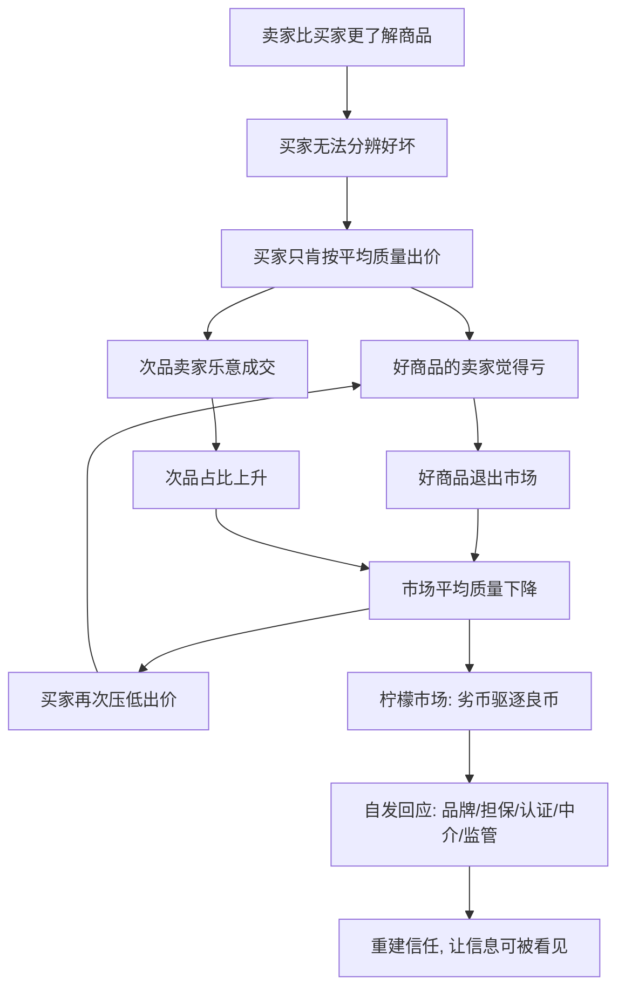

# 16｜为什么会出现“信息不对称”？

> 为什么二手车市场容易“劣币驱逐良币”？

---

## 一、先说结论

薛兆丰认为，市场要运转，前提是买卖双方大致知道自己在交易什么。可一旦**一方比另一方知道得多得多**，这个前提就塌了。

这种落差，就是信息不对称。它最经典的后果，是"柠檬市场"：买家因为分不清好坏，只肯出一个偏低的均价；手里有好东西的人觉得卖亏了，干脆退出；留在市场里的，越来越多是次品。于是价格被压得越来越低，好东西越走越少，剩下的越来越差——**劣币把良币赶了出去。**

薛兆丰由此提醒：市场不是天生就会处理一切，信任本身也是要由制度生产出来的。品牌、担保、认证、中介、监管，很多时候不是多余，而是市场为了活下去必须长出来的器官。

---

## 二、我们先理解一个问题

先做个小游戏。

假设你站在一个旧车市场，面前两台外观几乎一样的车：一台保养得很好，实际很值钱；一台问题很多，实际不值钱。只有卖家知道哪台是哪台，你只能靠眼睛看。

你会怎么出价？

理性的做法是：**按"平均水平"出价。** 你既不敢按好车出高价（怕被坑），也不愿按坏车出低价（怕错过好车），最稳妥的，是给一个不好不坏、偏保守的数。

但问题是，卖家不傻。真正握着好车的人会想："我的车明明值更多，你只给平均价，那我不卖了。"于是好车退出。**市场里好车一少，剩下的平均质量又下降，买家下次出价只会更低。** 一轮一轮往下走，最后只剩一堆"柠檬"。

这个往下滑的循环，就是信息不对称最要命的破坏力：**它不是杀价，而是杀掉了整个市场的信任。**

---

## 三、作者到底提出了什么观点？

薛兆丰的观点可以归纳为三点：

**第一，信息是有成本的，也是分布不均的。** 谁知道得多，谁就在交易里占优势。真实世界里，买卖双方几乎从不对称等，差别只在程度。

**第二，信息不对称会改变市场的结构，而不只是"让某人多赚一点"。** 它会让好商品不敢进场、让交易规模萎缩、让价格信号失真。这是市场层面的失灵，不是个别骗局。

**第三，制度是对这种失灵的自发回应。** 品牌、保修、退货、第三方认证、平台评价、专业中介、牌照监管——它们存在的一大理由，就是替买家"补上"那部分看不见的信息。

他反复强调：**市场能解决很多问题，但有些问题，市场需要先造出工具来解决。** 信息不对称，就是逼着市场造工具的那种问题。

---

## 四、把这个观点翻译成人话

把这个市场想象成一个"看不见脸的拍卖会"。

如果每个人都能看清每件商品，拍卖会按真实价值成交，皆大欢喜。可如果给每件商品蒙上黑布，只允许隔着布出价，那会发生什么？

- 谨慎的买家，只肯出一口"平均价"；
- 真有宝贝的卖家，觉得不值，拂袖而去；
- 骗子卖家，求之不得，拼命往里塞货。

几轮下来，拍卖池里就只剩骗子。**这不是买家变笨了，而是"看不见"这件事本身，把好人逼走了。**

所以信息不对称的要害，不在于"有人想骗人"——骗子哪个时代都有——而在于**在一个普通人没法分辨好坏的市场里，诚实反而变成了劣势。** 谁老实谁吃亏，最后市场就只剩下不老实的那部分。

要救这样一个市场，光靠喊"大家要诚信"是不够的。你得让信息重新能被看见：让别人替你担保，让不好的商品爆出代价，让重复交易里的信誉发挥作用。

---

## 五、为什么会这样？

把恶性循环拆成链条：

关键在 **B → C → D** 这条主线。

它揭示了一个反直觉的道理：**信息不对称的伤害，往往不是来自交易失败，而是来自交易萎缩。** 好商品没有卖出去，买家也没买到好东西，市场本该创造的互利全都落空了。

而解法也藏在这条链上：只要能打破"买家分不清"这一环，循环就能停下来。品牌之所以值钱，正是因为它是**一个坏人装不出来的、需要长期维护的信号**。

---

## 六、举一个现实生活中的例子

来看最经典的那个场景：**二手车市场的"柠檬问题"。**

为什么很多人一提到买二手车就紧张？因为这是一笔天然的"单次博弈"：车的历史只有卖家清楚，买家只能听卖家说，出了门就概不负责。

这种结构下，买家会怎么做？压价、砍价、要求各种保证。卖家又会怎么做？守着一台好车的人，面对买家的砍价，往往谈不拢就走了；而那些有问题、急于出手的车主，反而最能接受低报价，也最愿意配合。

结果就是：**市场上流通的，越来越偏向"问题车"。** 买家侥幸买到一辆没大毛病的，会大呼运气好；买到毛病的，下次就再也不碰二手车了。市场口碑一点点被消耗。

现实里，这个循环是怎么被打破的？

- **品牌与门店**：有实体、有商誉的经销商，用"跑得了和尚跑不了庙"来给买家安心；
- **质保与退换**：承诺一段时间内出问题包修，等于把风险从买家身上挪走一部分；
- **第三方检测**：让懂行的人替你验车，报告成了"看得见的信息"；
- **平台评价**：让每笔交易的记录公开，把"单次博弈"变成"重复博弈"。

你会发现，这些办法没有一个是靠"相信人性"实现的，它们全都在**降低买卖之间的信息落差**。这正是薛兆丰那句提醒的注脚：**信任不是凭空来的，它是被制度一点点生产出来的。**

（要说明的是：关于"柠檬市场"模型的适用范围和强度，学界有不同看法。一些经济学家认为，在信誉机制发达、交易频繁的领域，这个问题会被大大削弱。这里讲的是它的核心机制与一般启示。）

---

## 七、回到书中重新理解

现在再回看薛兆丰为什么讲信息不对称，就顺了。

他要破除的，是"市场万能"和"市场必败"这两种简单判断。信息不对称说明：**市场可以很强大，但它需要合适的制度配套才能强大。** 光有价格机制不够，还得有让信息变得可信的办法。

所以这一篇真正要培养的，是一种**结构感**：遇到一个"买卖双方不信任"的市场，别急着骂一方不诚信，先问——**这个市场的结构，是不是在系统性奖励不诚信？如果换成重复交易、加上担保和信誉，它会不会自己变好？**

---

## 八、这个观点背后还有什么？

**第一，它和"产权、契约"是连着的。** 担保、退换、责任划分，本质上是产权与契约在信息不对称下的延伸。

**第二，它和"成本"是连着的。** 信息本身是一种要花代价才能获得的东西。"信息成本"在很多市场里，比货物成本更关键。

**第三，它和"品牌的本质"是连着的。** 品牌之所以有价值，不是因为它漂亮，而是因为它是一个需要长期投入、坏人短期学不来的信号。

**第四，它和"制度与信任"是连着的。** 它提醒我们：一个社会能否高效交易，不只取决于法律条文，还取决于人们能否低成本地分辨好坏。

---

## 九、这个观点有问题吗？

有。

**第一，"劣币驱逐良币"未必是普遍结局。** 现实中，信誉机制、监管、平台评价常常能扭转局面。模型描述的是一种趋势，不是命中注定的下场。市场未必像理论说的那样滑落到底。

**第二，信息不对称也可能被政策"制造"或"放大"。** 有些认证门槛、行业准入，原本是想保护消费者，结果反而限制了好供给、抬高了成本，甚至成了既得利益者封锁竞争的工具。

**第三，"多披露信息"未必总是好事。** 信息有成本，披露太多可能淹没重点，或者迫使人们把精力花在应付形式上，而不是真的把产品做好。

**第四，它容易被引向"越管越好"的简单结论。** 信息不对称确实为监管提供了理由，但监管本身也可能失灵、也可能被俘获。真正要问的是：**哪一种制度能以更低成本补上信息落差，是监管、是信誉，还是竞争。**

**所以更平衡的说法是**：信息不对称真实地解释了很多市场为何失灵、为何萎缩，也解释了品牌与制度为何重要；但它不意味着"市场注定失败、只能靠管"。市场、信誉、监管各有长短，关键在于哪种机制补信息更有效、副作用更小。

---

## 十、今天再看这个观点

以下部分是基于薛兆丰思想的现代延伸，不是他在书里的原话。

数字时代给信息不对称带来了一个有趣的反转。

一方面，评价系统、交易记录、社交网络，让"信誉"变得前所未有地可积累、可查询。过去你不敢跟陌生人交易，现在你敢——因为每一笔交易都留下了痕迹。信息落差，在很多场景里被实实在在地缩小了。

但另一方面，新的不对称也在生成：算法比你更懂你自己，平台比你更清楚商家的真实成本，数据掌握在少数人手里。你看到的"评价"，可能是被精心筛选甚至刷出来的；你感到的"透明"，也可能是被设计过的透明。

于是问题从"我怎么知道这车好不好"，变成了"**我怎么知道这个信息本身可不可信**"。这层更深的不对称，正是当下监管与平台治理绕不开的难题。

---

## 十一、这一篇真正应该记住什么？

1. **信息不对称 = 一方比另一方知道得多。** 它不只是"有人骗人"，而是整个市场的结构性难题。
2. **它的核心危害，是好东西被赶走。** 买家压价、好货退出、平均质量下滑，循环恶化，就是"柠檬市场"。
3. **制度是对它的回应。** 品牌、担保、认证、中介、监管，本质都在降低信息落差。
4. **信任是被生产出来的。** 没有哪套机制靠"相信人性"运转，它们靠的是让好坏现形的激励。
5. **但解法不止监管一种。** 信誉、竞争、重复交易，同样能重建信任，且各有代价。

---

## 十二、留一个问题

> 在一个你分不清好坏的市场里，
> 你究竟是被谁骗了？
> 还是，这个市场的规则本身，
> 就在逼着老实人先退场？

---

**下一篇**：信息不对称讲的是"我们看不清对方"，而还有一种变化，是所有人都切身感受、却很少有人能说清源头：昨天能买一堆的钱，今天好像不够用了。钱在变不值钱。这到底是市场的错，还是另有原因？下一篇我们就来拆开它——**通货膨胀到底是谁的问题？**
