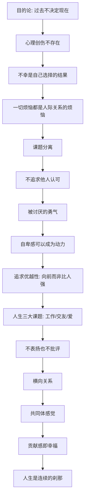

# 《被讨厌的勇气》深度解读系列

## 系列简介

《被讨厌的勇气》用一场"青年与哲人"的对话，把阿德勒心理学讲成了一套能立刻用起来的人生哲学。

它要回答的核心问题很直接：**人能不能改变？** 阿德勒的答案激进得出人意料——过去不决定你，决定你的是你现在的"目的"；你的不幸不是命运，而是你自己"选择"的结果；一切烦恼都来自人际关系，而解药是"课题分离"；真正的自由，是不再为他人的期待而活，是拥有"被讨厌的勇气"。

这本书不提供安慰，它把责任交还给你：幸福不是被别人给予的，而是自己选择、自己贡献出来的。它也不温柔——它会告诉你，你之所以停在原地，是因为"不改变"对你也有好处。

本系列围绕 **15 个核心问题**，从目的论、课题分离，一路讲到共同体感觉与"活在当下"，把这场对话拆成一套可理解、可实践的自助课程。

---

## 全书核心问题

| 层次 | 问题 |
|---|---|
| 地基问题 | 过去是否决定现在？人到底能不能改变？ |
| 自由问题 | 如何摆脱他人期待与评价的束缚？ |
| 关系问题 | 如何把竞争关系变成合作关系？ |
| 幸福问题 | 幸福从哪里来？如何活在当下？ |

---

## 全书知识地图



---

## 全系列目录

### 第一部分：阿德勒心理学的地基

#### 01｜为什么阿德勒说“过去不能决定你”？

核心问题：如果过去不能决定现在，那我们为什么总把今天归咎于昨天？

核心观点：阿德勒与弗洛伊德最根本的分歧，是"原因论"与"目的论"。弗洛伊德认为过去的经历（尤其创伤）决定了今天的你；阿德勒认为，人是先有了现在的目的，才去调动过去的经验为它服务。不是"因为过去如此，所以现在这样"，而是"为了现在的目的，所以这样解释过去"。

理解难度：★★★☆☆

关键词：目的论、原因论、弗洛伊德、决定论

---

#### 02｜所谓的心理创伤，真的存在吗？

核心问题：我们习以为常的"心理创伤"，在阿德勒看来为什么站不住脚？

核心观点：阿德勒否认"创伤本身决定人"。同一件事，有人被击垮，有人却因此成长——说明决定结果的不是事件，而是我们赋予事件的意义。这并非否认伤害的存在，而是拒绝把"过去的伤害"当成"现在不能改变"的判决书。

理解难度：★★★★☆

关键词：创伤、意义赋予、可塑性、争议

---

#### 03｜你的不幸，为什么是自己“选择”的？

核心问题：说"不幸是自己选的"，是不是在指责受害者？

核心观点：阿德勒的意思是：维持现状对你有某种"好处"——不必面对失败、不必承担改变的风险、还能获得同情。于是你选择了"不改变"。这不是道德指责，而是一个冷峻的观察：只要你说"我改变不了"，你就永远不用为改变负责。

理解难度：★★★★☆

关键词：自我选择、改变的代价、舒适区、责任

---

#### 04｜一切烦恼，为什么都是人际关系的烦恼？

核心问题：为什么阿德勒说，脱离人际关系，人的烦恼就不存在？

核心观点：自卑、嫉妒、孤独、焦虑，几乎都指向"与他人的比较"或"他人的评价"。烦恼不是来自客观处境，而是来自我们在关系中的位置感。理解这一点，才能理解为什么阿德勒的解药全都指向"如何与人相处"。

理解难度：★★★☆☆

关键词：人际关系、比较、孤独、烦恼的根源

---

### 第二部分：课题分离与自我

#### 05｜什么是“课题分离”？

核心问题：如何分清"这是我该管的"和"这不是我该管的"？

核心观点：课题分离是阿德勒最实用的工具：判断某件事的后果最终由谁承担，那就是谁的课题。你可以关心别人，但不能替别人做他的课题；别人怎么评价你，是别人的课题。人际关系的痛苦，大多来自对他人课题的干涉。

理解难度：★★★☆☆

关键词：课题分离、边界、承担后果、干涉

---

#### 06｜为什么你总在意别人的评价？

核心问题：为什么我们如此渴望被认可，甚至为此扭曲自己？

核心观点：阿德勒称之为"认可欲求"。我们习惯为了满足他人期待而活，把别人的评价当作自己的价值标准。但代价是：你把自己人生的裁判权，交给了别人。真正的自由，是停止追问"别人怎么看我"。

理解难度：★★★☆☆

关键词：认可欲求、他人期待、评价、自我价值

---

#### 07｜什么是“被讨厌的勇气”？

核心问题：为什么"不怕被讨厌"反而是获得自由的前提？

核心观点："被讨厌的勇气"不是故意惹人讨厌，而是：当你按照自己的信念生活时，不再把"是否被所有人喜欢"当作必须满足的条件。有人不喜欢你，是他人的课题；为了不被讨厌而活成别人期待的样子，才是对自己最大的不诚实。

理解难度：★★★☆☆

关键词：被讨厌的勇气、自由、他人课题、自我选择

---

#### 08｜自卑感一定是坏事吗？

核心问题：阿德勒为什么说，自卑感其实可以成为动力？

核心观点：阿德勒区分"自卑感"与"自卑情结"。自卑感是"我离理想还有距离"的健康感受，能推动人向前；自卑情结则是把自卑当成逃避行动的借口（"因为我学历低，所以做不到"）。前者是燃料，后者是刹车。

理解难度：★★★☆☆

关键词：自卑感、自卑情结、理想自我、补偿

---

#### 09｜“追求优越性”为什么不等于“比别人强”？

核心问题：阿德勒所说的"追求优越性"，和争强好胜有什么区别？

核心观点：健康的追求优越性，是朝着"理想的自己"前进，是纵向的自我超越；不健康的，是横向地踩着别人往上爬。一旦把人生当成与他人的竞争，就必然产生嫉妒、焦虑与不安全感，因为总有人比你强。

理解难度：★★★★☆

关键词：追求优越性、竞争、自我超越、嫉妒

---

### 第三部分：关系与共同体

#### 10｜人生有哪三大课题？

核心问题：阿德勒说的"工作、交友、爱"三大课题，分别难在哪里？

核心观点：三大课题对应三种人际关系：工作关系门槛最低（有共同目标），交友关系更难（没有利害，靠自愿），爱的课题最难（要长时间共同生活、深度暴露自己）。逃避课题的人，往往在工作上正常，却卡在交友和爱里。

理解难度：★★★☆☆

关键词：三大课题、工作、交友、爱、逃避

---

#### 11｜为什么阿德勒反对“表扬”？

核心问题：表扬明明是鼓励，为什么在阿德勒看来会伤人？

核心观点：表扬暗含"上下级"——表扬者处于评价者的高位，被表扬者处于被评价的低位。长期如此，人会为了"得到表扬"而行动，而不是为了事情本身。阿德勒主张用"感谢"替代表扬：感谢是平等的，指向具体贡献，而不是给人打分。

理解难度：★★★★☆

关键词：表扬、评价、纵向关系、感谢

---

#### 12｜什么是“横向关系”？

核心问题：不批评也不表扬，那到底该怎么与人相处？

核心观点："横向关系"指把每个人看作在价值上平等、只是任务和处境不同的人。不居高临下地评价，也不自卑地仰视。它的具体做法是：鼓励、感谢、请求帮助，而不是控制、奖惩、评判。

理解难度：★★★☆☆

关键词：横向关系、纵向关系、鼓励、平等

---

#### 13｜什么是“共同体感觉”？

核心问题：为什么阿德勒把"对社会的关心"看作心理健康的核心？

核心观点：共同体感觉是把"我"放进更大的整体里——家庭、职场、社会乃至更大范围——并感到"我属于这里"。它由三部分构成：自我接纳（接受不完美的自己）、他者信赖（无条件地把他人当伙伴）、他者贡献（为他人做点什么）。这三者互相支撑，构成幸福的基础。

理解难度：★★★★☆

关键词：共同体感觉、自我接纳、他者信赖、他者贡献

---

### 第四部分：幸福与当下

#### 14｜幸福为什么等于“贡献感”？

核心问题：为什么阿德勒说，幸福不是被爱，而是"我对别人有用"？

核心观点：阿德勒认为幸福就是"贡献感"——感到自己对共同体有价值。它不需要别人认可，也不需要成为英雄：只要主观上确信"我的存在对他人有意义"，人就能获得幸福。贡献感可以由自己定义，因此不被他人剥夺。

理解难度：★★★★☆

关键词：贡献感、幸福、价值感、无须认可

---

#### 15｜为什么人生是“连续的刹那”？

核心问题：如果人生是一条通往目标的线，那为什么阿德勒说它是"一个个刹那"？

核心观点：阿德勒反对把人生理解成"到达终点才算数"的登山。人生由无数"此时此刻"组成，每个当下都可以是完整的、圆满的。若只盯着未来的目标，就会永远活在焦虑里；认真过好每一个刹那，本身就是"活在当下"。

理解难度：★★★★☆

关键词：连续的刹那、活在当下、目标焦虑、人生意义

---

## 推荐阅读顺序

**主线顺序（推荐）：01 → 15，逐篇阅读。**

```text
第一段｜地基（01–04）
   目的论 → 创伤不存在 → 不幸是自己选的 → 烦恼皆关系
        ↓
第二段｜课题与自我（05–09）
   课题分离 → 在意评价 → 被讨厌的勇气 → 自卑感 → 追求优越性
        ↓
第三段｜关系与共同体（10–13）
   三大课题 → 反对表扬 → 横向关系 → 共同体感觉
        ↓
第四段｜幸福与当下（14–15）
   贡献感即幸福 → 连续的刹那
```

**阅读建议：**

- **想先抓住全书骨架**：读 01、05、07、13、15 五篇。
- **想解决"在意别人看法"**：直接读 06、07、11、12。
- **想改善关系**：读 04、10、12、13。
- **想练习批判性阅读**：重点看 02、03、09 三篇，争议最集中。

---

## 全系列状态

> 本系列共 15 篇，正文生成中。
