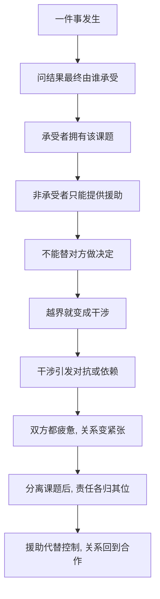

# 05｜什么是“课题分离”？

> 如何分清“这是我该管的”和“这不是我该管的”？

---

## 一、先说结论

课题分离是阿德勒心理学里最像“工具”的一个概念。它只给了一个简单的判断标准：**一件事的结果，最终由谁来承担，那这件事就是谁的课题。**

孩子学不学习，结果由孩子承担，所以那是孩子的课题；别人怎么评价你，感受和后果落在别人身上，所以那是别人的课题。你可以关心，可以帮忙，但不能替对方活。

人际关系里的大部分痛苦，都来自两种越界：要么去干涉别人的课题，要么让别人干涉你的课题。课题分离要做的，就是把这两条线重新画清楚。

---

## 二、我们先理解一个问题

先看一个几乎每个家庭都上演过的场面。

孩子坐在书桌前写作业，母亲在旁边盯着。写慢一点，母亲催；写错一道题，母亲急；孩子一走神，母亲就提高音量。到了晚上十一点，作业写完了，母亲比孩子还累，孩子却全程面无表情，仿佛学习这件事从头到尾都不是自己的。

很多父母的第一反应是：“如果我不盯，他就不写。”

但这里其实藏着一个更深的问题：**写作业这件事，到底是谁的事？**

如果它真的是孩子的课题，那父母为什么会比孩子更焦虑？如果它不是孩子的课题，那孩子又为什么要在学习里找到自己的动力？这个问题一拆开，就碰到了阿德勒所说的“课题分离”。

---

## 三、作者到底提出了什么观点？

阿德勒认为，一切人际关系的矛盾，大多源于对别人课题的干涉，或者自己的课题被别人干涉。

他给出的判断方法非常朴素：**某件事所带来的结果，最终由谁承受，谁就拥有这个课题。** 所谓干涉，就是替别人做他的课题，或者用自己的标准去要求对方完成他的课题。

用这条标准看，“学习”是孩子的课题，不是父母的课题。孩子是否认真、是否考好、是否因此吃亏，最后由孩子承担。父母可以做的，不是命令和控制，而是“把马带到水边”，告诉他这是他的课题，并在孩子求助时提供帮助。

阿德勒并不主张父母撒手不管。他区分的是“干涉”和“援助”：干涉是“按我说的做”，援助是“你需要的时候，我在”。

---

## 四、把这个观点翻译成人话

课题分离翻译成人话就是：**你可以关心，但不能替他活。**

父母能给孩子提供一张安静的书桌、买得起参考书、请得起老师、也可以耐心回答他不会的题，这些都是真诚的帮助。但父母不能替孩子经历“不好好写作业会带来什么后果”这件事，因为一旦替他经历了，学习就变成了“为父母学习”。

逼孩子写作业，短期往往有效：作业交了，成绩没掉。但它悄悄把责任的归属挪了位置——本来该由孩子背的“学习是我的事”，被父母背走了。孩子逐渐学会的是：我不用为学习负责，反正有人比我更急。

课题分离要做的，就是把这份责任还回去。还回去的过程通常会有一段阵痛，因为那个长期被保护的孩子，第一次要自己面对结果的重量。

---

## 五、为什么会这样？

把课题分离的判断过程拆成一条链：

关键在于 C 和 D 之间的那条边界。

很多人之所以越界，并不是因为坏，而是因为**他们把别人的课题当成了自己情绪的课题**：孩子成绩差，我焦虑；同事不高兴，我难受；朋友没回消息，我不安。于是为了缓解自己的焦虑，他们去控制别人。可是控制只能带来表面的顺从，带不来真正的合作。

课题分离真正难的地方，不是判断“这是谁的课题”，而是判断完之后，**你忍不忍得住不去干涉。**

---

## 六、举一个现实生活中的例子

一位母亲每天晚上陪孩子写作业到十一点，成绩一掉就睡不好。她说：“我也不想管，可我不管不行啊。”

如果用课题分离来看，她真正在承担的，是“孩子可能学不好”带来的焦虑。而这份焦虑，其实是她自己的课题，不是孩子的课题。她把两份课题捆在了一起：孩子要面对的是学习本身，她要面对的是自己无法忍受失控。

她可以做的事其实很具体：明确告诉孩子“学习是你的事，需要帮助我随时在”，然后真的忍住不去接管；孩子写错了不立刻纠正，让他第二天自己面对老师的反馈；孩子求助时认真帮，但帮完就把笔还给他。

改变的头几周通常会很难看：作业质量可能下滑，孩子可能先松懈。但只有孩子真的体验过“这是我自己的事”，学习的动力才有可能从内部长出来。母亲的克制，不是不爱，而是把爱从控制里拆出来。

---

## 七、回到书中重新理解

现在再看书中青年与哲人的那段争论，就顺了。

青年质疑：“把课题分那么清，不就是谁也不管谁吗？人不就变得冷漠了吗？”哲人的回答大意是：课题分离不是冷漠，恰恰相反，它是让人际关系变轻松的前提。因为**带着控制的关心，最终会变成怨；划清边界之后的帮助，才是干净的帮助。**

书中有一句话常被引用：可以把马带到水边，但不能强迫它喝水。这句话里有两个动作——带它到水边，是你能做的援助；强迫它喝，是它的课题被你的意志占据了。课题分离并不取消“带它到水边”，它只是拒绝替那匹马张嘴。

理解了这一点，就会发现课题分离不是全书里孤立的一招，而是后面“不追求认可”“被讨厌的勇气”“横向关系”的前提。没有边界，平等就无从谈起。

---

## 八、这个观点背后还有什么？

有几个隐含前提值得单独拎出来。

**第一，课题分离区分的是“责任”，不是“感情”。** 它没有要求你不爱、不关心，它要求的是不接管。你可以为对方着急，但最终的决定权要还给他。

**第二，它把“能改变的”和“不能改变的”分开了。** 你能改变的是自己的行动，不能改变的是别人的感受和评价。这一点和古代哲学里的“控制二分法”很接近。

**第三，它是自由的入口。** 一旦你不再替别人的情绪和评价负责，你才可能按自己的信念生活；而按自己的信念生活，一定会有人不喜欢你，这正好通向后面要讲的“被讨厌的勇气”。

**第四，它需要勇气才能执行。** 判断谁是课题主人不难，难的是判断完之后，面对对方可能的不满、失望、指责，你还站得住。

---

## 九、这个观点有问题吗？

有。这个工具非常有力，但被滥用时也会变形。

**支持它的看法认为**，课题分离能有效缓解过度负责、边界模糊和讨好型行为。很多人的痛苦确实来自替别人背了不该背的责任，把边界画清楚，关系反而变好。

**但一些心理学家认为**，这套说法带有明显的个体主义色彩。人是高度相互依赖的，尤其在亲子、伴侣、照护关系里，“这是你的事”在现实中往往意味着“我不打算和你一起承担”。家庭是一个系统，而不是若干独立课题的简单相加，只做课题分离，可能忽略关系本身的相互塑造。

**文化差异也需要考虑。** 在强调家庭责任与相互扶持的环境里，直接说“这是你的课题”，很容易被听成推卸和抛弃，效果可能适得其反。

**还有一种常见的误用**，是把课题分离当成逃避的借口：不想管就说“这是你的课题”，不想听批评就说“这是你的课题”。这时候它不再是划界，而是关门。

**更准确的理解或许是**：课题分离的核心是“责任归属”，而不是“情感隔离”。真正的分离之后，人反而更有能力去帮助别人，因为帮助里不再藏着控制。分不清这一点，就容易把它用成了冷漠。

---

## 十、今天再看这个观点

以下部分是课题分离思想的现代延伸，不是阿德勒或作者的原话。

在今天，课题分离常被翻译成一个更口语的词：边界感。它出现在职场、家庭、亲密关系里，用来处理几类很常见的困境——别人把情绪丢给你，你要不要接；同事把自己的活推给你，你要不要扛；父母的期待压过来，你要不要照着活。

一个实用的问法可以随身携带：**这件事的后果最终落在谁身上？** 如果落在对方身上，你能给的是支持，不是决定；如果落在你身上，你就要自己拿主意，而不是被人推着走。

但要提醒一点：边界不是墙。健康的边界是“我可以靠近你，也可以说不”，而不是“谁也别靠近我”。把边界当成隔绝，就等于把课题分离从一个关系的工具，变成了一个孤独的借口。

---

## 十一、这一篇真正应该记住什么？

1. **课题分离的判断标准只有一条。** 一件事的后果最终由谁承担，就是谁的课题。

2. **你可以关心，但不能替他活。** 援助和干涉的区别，是“你需要时我在”与“按我说的做”。

3. **人际痛苦多来自越界。** 要么去干涉别人的课题，要么让别人干涉你的课题。

4. **它需要勇气才能落地。** 判断不难，难的是忍住不接管，并承受对方的不满。

5. **它分的是责任，不是感情。** 用它来关门而不是划界，就背离了它的本意。

---

## 十二、留一个问题

> 如果“别人怎么看我”确实是别人的课题——
> 那你为什么还是会在一条没有人点赞的动态前，反复刷新，反复怀疑自己？

---

**下一篇**：课题分离告诉我们，评价在别人那里；可我们为什么还是戒不掉那种被认可的渴望？阿德勒把这种渴望叫作“认可欲求”，并说它才是把自己人生的裁判权交出去的根本原因。

下一篇我们就来拆开这个问题——**为什么你总在意别人的评价？**
