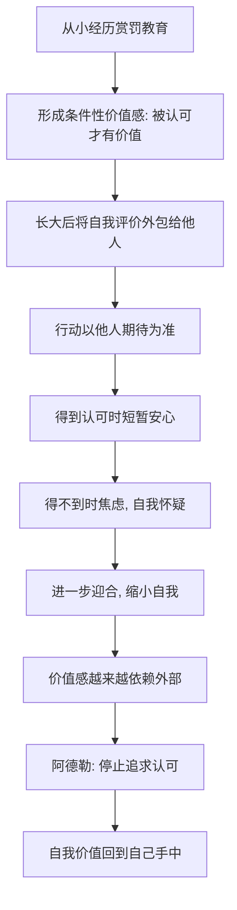

# 06｜为什么你总在意别人的评价？

> 为什么我们如此渴望被认可，甚至为此扭曲自己？

---

## 一、先说结论

阿德勒把这种渴望叫作“认可欲求”。他认为，我们从小被训练成“做了被表扬、错了被批评”的人，于是慢慢把“别人怎么看我”当成了“我有没有价值”的标准。

问题不在于你在乎别人，而在于**你把自我价值的裁判权，交给了别人**。这样一来，你的情绪、你的选择、你要不要做一件事，都由外部的评分决定。阿德勒给的解药是：停止追问“别人怎么看我”，把裁判权收回来。代价是，你不再保证被所有人喜欢。

---

## 二、我们先理解一个问题

先看一个很日常的动作：发朋友圈。

拍好一张照片，想了半天文案，发出去，然后每隔几分钟点开一次——看点赞数涨了没有，看谁点了，看谁没点。半小时后点赞停在二十几，你开始注意那条“怎么他没点”的空白，原本很好的心情变得有点闷。

一条动态，本来只是分享自己的生活，最后却变成了一次等待打分的考试。我们要问的是：**为什么一个陌生人点不点赞，能决定我这一天的心情？**

---

## 三、作者到底提出了什么观点？

阿德勒（通过书中哲人之口）提出的概念是“认可欲求”：**人有一种强烈的、想要被别人认可、被表扬、被喜欢的欲望。**

他进一步指出这种欲望的来源：赏罚教育。孩子做了让父母满意的事就被表扬，做了让父母不高兴的事就被批评。长期在这套机制里长大的人，会形成一个隐含信念——**我的价值，取决于别人是否满意。**

阿德勒并不认为这是你的错，因为这是被环境训练出来的。但他认为，成年之后继续服从这套机制，就变成了自己的选择。书里哲人说得很重：如果你活着是为了满足别人的期待，那你其实不是在为自己活，而是在为别人活。

---

## 四、把这个观点翻译成人话

认可欲求翻译成人话就是：**你把自己的裁判权，交给了别人。**

你本来是自己人生的运动员，也是自己的裁判。但认可欲求让你退到观众席上，请别人来打分，而且请的不是一个人，是所有人。于是你不可能赢，因为总有人不给高分。

从课题分离的角度看，这其实很清楚：别人怎么评价你，是别人的课题；你按什么信念生活，是你的课题。当这两个课题混在一起，你就会为了一个你无法控制的分数，不断修改自己。

点赞少就删掉，说明你分享的不是生活，是评价。而真正的问题从来不是“他们为什么不喜欢”，而是“我为什么需要他们喜欢”。

---

## 五、为什么会这样？

把认可欲求的形成和运转拆成一条链：

关键在于 B。

赏罚教育最深的后果，不是让人爱听好话，而是让人**把“我值得”这件事设成了条件句**：只有做了对的事、只有被认可，我才有价值。一旦价值感是条件性的，就必须不断从外部获取确认，因为内部的确认机制从来没被建立起来。

所以要戒掉认可欲求，不是学着“不要在乎”，而是要重新建立一个不依赖别人打分的自我价值。阿德勒把它指向“贡献感”：只要我确信自己对他人有用，我就可以不靠掌声活着。

---

## 六、举一个现实生活中的例子

一位女生去旅行，拍了很多照片，回来后精心发了一条九宫格。发完她开始频繁刷新。两小时后，点赞三十多个，评论寥寥。

她把点过赞的人一个个看过去，发现一位平时关系不错的同事没有点，心里立刻冒出一个念头：“他是不是对我有意见？”接下来一整天，她都在回想最近和这位同事的每一次接触，试图找出哪里得罪了他。

这就是认可欲求的典型现场：**一条动态的点赞数，接管了她一整天的心情。** 她没有做错什么，照片也很美，但她的自我评价此刻并不由自己掌握，而是挂在那三十几个小红心上。

如果换一个视角：她真正想做的事是记录一次旅行、分享一点快乐，这件事在按下发布键的那一刻就已经完成了。别人的点赞，是别人的课题，不是她这条动态的一部分。

---

## 七、回到书中重新理解

现在再看书中青年与哲人关于“认可”的辩论，就顺了。

青年几乎是替所有读者喊出来的：“想被别人认可，这不是很自然吗？难道要我们不顾别人的感受，自私地活着吗？”哲人的回答大意是：不是让你自私，而是让你不要把人生的方向盘交给别人。你不是为了满足别人的期待而活着，别人也不是为了满足你的期待而活着。

哲人对赏罚教育的批评尤其尖锐：如果一个人做事的动力永远来自“会不会被表扬”，那他就永远无法体验到“这件事本身值得做”。这也是为什么阿德勒后来主张用“感谢”代替“表扬”——表扬是评价，感谢是平等的回应。

---

## 八、这个观点背后还有什么？

有几个隐含前提值得单独拎出来。

**第一，认可欲求和课题分离是连着的。** 只有承认“评价是别人的课题”，才可能停止为评价扭曲自己。

**第二，它直接通向“被讨厌的勇气”。** 一旦你不再追求所有人的认可，就必然会有人不喜欢你，这不是失败，而是自由的账单。

**第三，阿德勒区分了“被认可”和“有价值”。** 他把价值感的来源从“别人说你好”移到“你确信自己对共同体有贡献”，这样价值就不再被别人一句话夺走。

**第四，它不等于说所有反馈都该无视。** 建设性的意见、真诚的批评，仍然是重要的信息；区别在于，你是用它来改进，还是用它来给自己定罪。

---

## 九、这个观点有问题吗？

有。“不要在意别人的评价”这句话，如果理解得粗糙，会带来新的问题。

**支持者认为**，对大量讨好型、易受暗示、为他人期待而活的人来说，这套说法是一次解放。也有不少研究指出，过度依赖外部奖赏会削弱内在动机，这与阿德勒的观察方向一致。

**但一些心理学家认为**，“完全不追求认可”被表述得过于极端。人本来就是社会性动物，一定程度的认可需求是健康的，它是归属感和连接的基础，而不是病。问题不在“需要被认可”，而在“是否被它支配”。把正常的归属需求一并否定，可能让人走向另一种孤立。

**还有一种担心是文化上的。** 在强调集体与人情的环境里，“不活在别人的期待里”容易被读成冷漠和不负责任，尤其在家庭关系里，这句话的代价可能比书里描述的大得多。

**另外，书里的表述容易被误用**：把“我就是我，别人怎么看无所谓”当成挡箭牌，用来拒绝一切反馈。这其实是把阿德勒的“不被他人的评价支配”，偷换成了“不在乎任何人”。

**更准确的理解或许是**：目标不是消灭被认可的渴望，而是让自我价值不再由它决定。别人的评价可以听，但不该成为你给自己打分的唯一标准。

---

## 十、今天再看这个观点

以下部分是针对认可欲求现象的现代延伸，不是阿德勒或作者的原话。

社交媒体是认可欲求的放大器。它把“被看见”变成了可量化的数字：点赞、转发、粉丝、浏览量。这些数字每天都在给我们的价值感打分发，而且算法偏爱最能挑动情绪的内容，于是我们不只是渴望认可，还会被鼓励去表演。

在这种环境里，一个简单的自测很有用：**我是在表达，还是在乞讨认可？** 如果发布之后你反复刷新、事后懊悔、为了数据修改自己，那你很可能已经不在表达，而在等一个来自外部的评分。

把认可欲求看清楚，不是为了变成不在乎的人，而是为了夺回自己人生的裁判权。这一点，是现代人比阿德勒时代更需要的练习。

---

## 十一、这一篇真正应该记住什么？

1. **认可欲求的核心，是外包了自我价值的裁判权。** 不是你在乎别人，而是你的价值由别人定义。

2. **它多半是被赏罚教育训练出来的。** 条件性的价值感，让人必须不断从外部获取确认。

3. **别人怎么评价你，是别人的课题。** 你能决定的，是按什么信念生活。

4. **真正的解药不是冷漠，而是价值感向内迁移。** 用贡献感之类的内部标准，替代掌声与表扬。

5. **但别把它推成“谁的意见都不听”。** 目标是不被评价支配，不是拒绝一切反馈。

---

## 十二、留一个问题

> 如果停止追求认可、把裁判权收回来，就一定会有人不喜欢你——
> 那我们凭什么敢承担这份不喜欢？这份“被讨厌”的底气，究竟从哪里来？

---

**下一篇**：认可欲求的反面，是一种看起来更“不讨喜”的能力。它不是故意去得罪人，而是在你按自己的信念生活时，不再把“是否被所有人喜欢”当成必须满足的条件。

下一篇我们就来拆开这个问题——**什么是“被讨厌的勇气”？**
