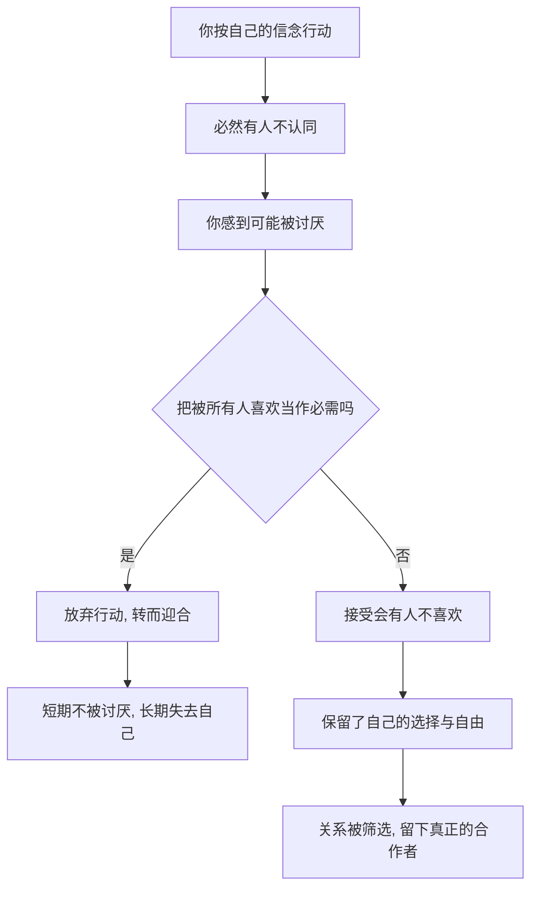

# 07｜什么是“被讨厌的勇气”？

> 为什么“不怕被讨厌”反而是获得自由的前提？

---

## 一、先说结论

“被讨厌的勇气”不是教你去惹人讨厌，也不是让你变得刻薄。它的意思是：**当你按照自己的信念生活时，不再把“是否被所有人喜欢”当成必须满足的条件。**

阿德勒认为，自由就是不再寻求认可。而一旦你不再按别人的期待活，就一定有人不喜欢你，因为总有人希望你活成他想要的样子。所以“被讨厌”不是意外，而是自由的代价，也是自由的证明。

有人不喜欢你，是别人的课题；为了不被讨厌而活成别人期待的样子，才是对自己最大的不诚实。

---

## 二、我们先理解一个问题

先看一个很多人每天都在经历的场景。

同事又来找你帮忙：“这份材料你比较擅长，帮我弄一下吧，我今晚有约。”你手上堆着一堆自己的活，心里明明不想答应，嘴上却说：“行，没问题。”

你答应了，然后加了自己的班，心里却生出怨气：他怎么好意思？他是不是把我当免费劳动力？可是下一次他再来，你还是答应了。

这里真正卡住你的，不是“帮不帮”，而是**你不敢拒绝**。而不敢拒绝的背后，往往藏着一句没有说出口的话：“我怕他觉得我不好。”这就碰到了“被讨厌的勇气”。

---

## 三、作者到底提出了什么观点？

阿德勒认为，**自由就是不再寻求认可。** 而“被讨厌的勇气”，是获得这种自由必须付出的代价。

书里哲人的推理很直接：如果你不想被任何人讨厌，那你只能不断按别人的期待调整自己。今天这个人的期待、明天那个人的要求，你都要满足，最后你不但什么都做不了，连自己是谁都不知道了。

所以，被讨厌的勇气不是一种攻击性，而是一种取舍：**我愿意为了按自己的信念生活，承担“有人不喜欢我”这件事。** 阿德勒同时指出，别人讨不讨厌你，是别人的课题；你要不要因为怕被讨厌而改变自己的人生，是你的课题。

---

## 四、把这个观点翻译成人话

翻译成人话就是：**你不可能同时满足所有人，所以别再把“被所有人喜欢”列进目标。**

这不是要你自私，而是要你把一个不可能完成的任务，从人生清单里删掉。删掉之后，你才有余力去做真正重要的事，也才有余力去真诚地对待少数重要的人。

注意这里的区别非常关键：被讨厌的勇气不是“我要故意惹你讨厌”，而是“如果我的选择让你不满意，我不因此觉得自己有罪”。前者是挑衅，后者是承担。真正的勇气，往往很安静——它只是一个平静的“这次我帮不了”，而不是一场宣布独立的争吵。

---

## 五、为什么会这样？

把“被讨厌的勇气”的运转逻辑拆成一条链：

关键在于 D 这个分岔口。

同样是一句拒绝，有人说完如释重负，有人说完愧疚三天。差别不在技巧，而在 D 处对“被讨厌”的容忍度。把“被所有人喜欢”当必需的人，只能在 E 那条路上反复循环；而愿意承担被讨厌的人，才可能走到 H，拥有真正的行动自由。

---

## 六、举一个现实生活中的例子

一位女生在团队里出了名的好说话。同事的请托她几乎从不拒绝，哪怕自己要加班到很晚。

有一天，她自己有一个紧急的截止日期，同事又请她帮忙做一份材料。她犹豫了很久，最后说：“这次我手上有事，帮不了，你问问别人行不行。”

同事沉默了几秒，说了句“哦，那算了”，转身走了。第二天，同事对她明显冷淡，说话也简短。她一整天都在反复回想，甚至后悔：“是不是我太不近人情了？要不要去解释一下？”

但一周后她发现，那份材料同事找了别人，事情照常完成了。而她第一次感到一种陌生的轻松——原来拒绝并不会让世界崩塌。

她失去的，只是一个“有求必应”的印象；得到的，是别人开始把她当成一个有限度的人，而不是一个随时可用的工具。她自己，也第一次没有因为别人的失望而否定自己。

---

## 七、回到书中重新理解

现在再看书中青年与哲人的对话，就顺了。

青年几乎是愤怒地问：“你是让我去被人讨厌吗？那不是更痛苦吗？”哲人的回答大意是：被讨厌不是目的，而是自由必然附带的成本。你之所以痛苦，不是你被讨厌了，而是你把“不被讨厌”当成了必须完成的任务。

哲人的另一句话更扎心：你现在过的这种小心翼翼、看人脸色的人生，难道就不痛苦吗？很多时候，我们以为迎合是安全的，其实它只是把痛苦从“被讨厌的瞬间”，挪成了“长期的不自由”。

阿德勒也提醒：被讨厌的勇气不是让你去喜欢被讨厌，而是让你不再用“是否被喜欢”来审判自己。这背后仍然是课题分离——对方怎么看你，是他的课题。

---

## 八、这个观点背后还有什么？

有几个隐含前提值得单独拎出来。

**第一，它是课题分离的延伸。** 课题分离划清边界，被讨厌的勇气则是守住边界时需要的心理承受力。

**第二，它不等于攻击性。** 它不鼓励你去伤人，也不等于“我要让所有人都知道我不在乎”。它更像是：我可以温和，但我不会为了温和而扭曲自己的判断。

**第三，它和幸福是连着的。** 只有不再为认可而活，你的贡献才可能是真诚的；否则你做的事，本质上是在交换掌声。

**第四，它是有代价的。** 按自己的信念生活，可能带来孤独、误解和关系的变化。阿德勒没有承诺这条路舒服，他只承诺这条路通往自由。

---

## 九、这个观点有问题吗？

有。这大概是全书最容易被误读的一句话。

**支持者认为**，“被讨厌的勇气”是摆脱讨好型人格、对抗情感勒索的核心能力。对长期不敢拒绝、把自我价值寄托在别人脸上的人来说，它是一剂解药。

**但一些心理学家认为**，这个口号式的表述容易滑向自我中心。成熟并不只是自我主张，也包括共情、协商和维护关系；如果把它理解成“只要我不舒服就拒绝，别人怎么想与我无关”，那不是勇气，而是冷漠。

**权力不对称也是一个现实问题。** 同样一句拒绝，上司对下属说和下属对上司说，代价完全不同。把“你不敢拒绝”一律归因于“你缺乏勇气”，可能忽视了不同处境下风险的真实差异。

**此外，要区分“为了做对的事而被讨厌”和“因为不在乎而伤害别人”。** 前者是勇气，后者只是失礼。把“被讨厌”当成免罪符，是另一种逃避。

**更准确的理解或许是**：它要你放弃的是“被所有人喜欢”这个不可能的目标，而不是放弃对他人感受的在意。你可以既坚持自己，又保持体面——勇气不等于粗鲁。

---

## 十、今天再看这个观点

以下部分是这一思想的现代延伸，不是阿德勒或作者的原话。

在今天，“被讨厌的勇气”几乎成了“讨好型人格”的对症药。它被用来处理职场里的不合理请托、家庭里的情感绑架、社交里的过度表演。一个很实用的问法是：**我现在做的事，是我真的想做，还是我怕别人失望？**

另一句可以随身带走的判断是：**拒绝一件事，不等于拒绝一个人。** 很多人不敢拒绝，是因为把“不帮这件事”自动翻译成“我这个人不好”。把这两者拆开，拒绝就会容易很多。

需要提醒的是，被讨厌的勇气不是社交摆烂。它是先承担，再选择；不是把别人当成无所谓的背景，而是承认别人的感受真实存在，只是不再让它们来决定你要成为谁。

---

## 十一、这一篇真正应该记住什么？

1. **被讨厌的勇气，是自由的代价，不是目的。** 它不要求你被讨厌，只要求你不把被喜欢当成必需。

2. **它建立在课题分离上。** 别人怎么看你，是别人的课题。

3. **它是安静的，不是攻击性的。** 一个平静的“帮不了”，胜过一场宣告独立的争吵。

4. **它区分了拒绝一件事和否定一个人。** 不做这件事，不代表我这个人不好。

5. **它有真实代价，也更容易被误用。** 别用它当伤害别人的挡箭牌。

---

## 十二、留一个问题

> 每一次拒绝别人、承担被讨厌的可能时，心里都会冒出一个声音：“我是不是不够好？”
> 这种不舒服的自我怀疑，就是自卑感——那它一定是需要被消灭的东西吗？

---

**下一篇**：如果说被讨厌的勇气来自“不再依赖别人的认可”，那当我们把目光收回到自己身上，就难免看见自己的不足。阿德勒对这件事的划分很有意思：有一种自卑是燃料，有一种自卑是刹车，关键差别在哪里？

下一篇我们就来拆开这个问题——**自卑感一定是坏事吗？**
